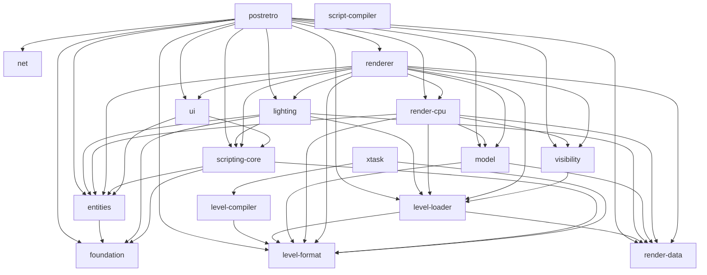

<!-- GENERATED by `cargo run -p xtask -- crate-graph --write`. Do not edit by hand. -->
<!-- Regenerate whenever a crate's internal (non-dev) dependencies change; `crate-graph --check` gates staleness in preflight. -->

# Crate graph

Internal workspace crates and their normal (non-dev, non-build) dependency
edges. External crates are omitted by design. A crate's layer is computed
from the graph: one above its deepest internal dependency. See the layering
invariants in `development_guide.md` §Workspace.

## Diagram

## Layers

- **Layer 0 (leaves):** foundation, level-format, net, render-data, script-compiler
- **Layer 1:** entities, level-compiler, level-loader, model
- **Layer 2:** scripting-core, visibility, xtask
- **Layer 3:** lighting, render-cpu, ui
- **Layer 4:** renderer
- **Layer 5:** postretro

## Dependents

Crates ranked by how many workspace crates depend on them directly —
the compile chokepoints. Changing a public type in a high-ranked crate
recompiles every dependent.

- **level-format** — 8 dependents (postretro, level-compiler, level-loader, model, render-cpu, renderer, scripting-core, xtask)
- **entities** — 6 dependents (postretro, lighting, render-cpu, renderer, scripting-core, ui)
- **render-data** — 6 dependents (postretro, level-loader, lighting, model, render-cpu, renderer)
- **level-loader** — 5 dependents (postretro, lighting, render-cpu, renderer, visibility)
- **foundation** — 4 dependents (postretro, entities, lighting, scripting-core)
- **scripting-core** — 4 dependents (postretro, lighting, renderer, ui)
- **model** — 3 dependents (postretro, render-cpu, renderer)
- **visibility** — 3 dependents (postretro, render-cpu, renderer)
- **lighting** — 2 dependents (postretro, renderer)
- **render-cpu** — 2 dependents (postretro, renderer)
- **ui** — 2 dependents (postretro, renderer)
- **level-compiler** — 1 dependent (xtask)
- **net** — 1 dependent (postretro)
- **renderer** — 1 dependent (postretro)
