# E10 — Enemy Aggro Model: research notes

Investigation behind `index.md`. Decisions live there; this is the evidence.

Seed: `context/research/enemy-aggro-model.md` (findings A/B/C from the
E10 behavior-state-graph review panel). Predecessor:
`context/plans/in-progress/E10--behavior-state-graph/index.md`.

All identifiers below were read from source, not memory. Line numbers are as of
this drafting session and rot — they are here to speed the implementer up, not
as contract.

---

## 1. The floor as it stands

| Surface | Where | Shape (verified) |
|---|---|---|
| Target candidacy | `crates/postretro/src/scripting/systems/ai/targeting.rs:27` | `target_candidate(registry, entity, from, visible)` — requires `PlayerMovementComponent` + `Transform`. Never reads `HealthComponent`. |
| Ranking | same file, `nearest_target_candidate:46` | `min_by` on XZ distance over `iter_with_kind(ComponentKind::PlayerMovement)`, with an `exclude` id. Calls `target_candidate` per pawn. |
| Selection | same file, `select_target:97` | `(registry, from, retained_target, retained_outside_leash, visible)`. Prefers the retained pawn unless another is `is_meaningfully_closer`. **No range limit anywhere.** |
| Aliveness | same file, `selected_target_alive:76` — **nine lines below `target_candidate`, same module** | `HealthComponent.current > 0.0 && is_finite()`; `false` when the component is absent. Called only at the attack gate. |
| Stride | `engine_floor.rs:35` | `think_stride_for_distance` — bands at 12 m / 30 m, divisors 1 / 4 / 12. |
| Hysteresis | `engine_floor.rs:26` | `TARGET_SWITCH_HYSTERESIS_DISTANCE = 1.0`. |
| Retention leash | `crates/entities/src/components/brain.rs:80` | `BrainComponent::leash_range: Option<f32>`. `Some` from legacy `ai` (`from_descriptor:125`), `None` from an authored graph (`from_graph:141`). |
| Leash application | `ai/mod.rs:444–468` | Applies to the **retained** candidate only; the replacement search on a leash-escape tick is filtered (`:462`), the ordinary fresh acquisition (`:437`, `:484`) is not. |
| Engagement test | `graph_eval.rs:99` `engages` | `steering_for(motion) == Chase \|\| action.is_some()`. Drives retention, facing, combat slots. |
| Engagement radius | `crates/foundation/src/data_descriptors/types/behavior.rs:266` | `engagement_radius()` → field → `attack.range` → `DEFAULT_ENGAGEMENT_RADIUS = 2.0` (`:256`). Sole consumer: `ai/mod.rs:943`, the `CombatQuery` spread radius. **Never read for acquisition, retention, or damage.** |
| Damage gate | `ai/mod.rs:607–621` | `distance <= attack.range` + action verb + cooldown + `selected_target_alive`. |
| Legacy validation | `crates/foundation/src/data_descriptors/types/combat.rs:301` | `AiDescriptor::validate` — each range field finite and `> 0`; `attackDamage` finite and `>= 0`. **No ordering constraint between any pair.** |
| Lowering | `crates/foundation/src/data_descriptors/types/behavior_lowering.rs:69` | Emits `engagement_radius: None` on purpose (`:161–165`) so the graph resolves through `attack.range`. |

`BehaviorGraphDescriptor::validate` (`behavior.rs:290`) is structural only:
names resolve, no duplicates, non-empty states, self-edge rejection, guard bind
via `bind_brain_guard`, numeric bounds. It never inspects guard *semantics*.

### The guard namespace is entirely self-facing

Every entry in `BRAIN_INPUTS` (`crates/foundation/src/brain.rs:69`) describes
the brain's OWN entity or its own timers — `hasTarget`, `targetDistance`,
`timeInStateMs`, `attackCooldownMs`, `acquisitionDue`, `health`, `maxHealth`.
`@brain.health`/`@brain.maxHealth` read the *evaluating enemy's*
`HealthComponent` (`brain_scope.rs:120–121`). `targetDistance` is the only fact
touching the target, and it is a relation, not a property of it. **There is no
target-side fact at all.** That is the actual hole Finding B falls into: an
author cannot express "stand down when my target is down" because the graph has
no vocabulary for the target's condition.

---

## 2. Finding A — reproduced against current source

Legacy tuning `detectionRange: 18`, `leashRange: 8`, single pawn at 10 m.
`ai_tests.rs:828` uses exactly this pair.

```mermaid
stateDiagram-v2
    [*] --> idle
    idle --> alert: tick N — not engaged, so no retained target;\nfresh acquire is UNFILTERED (mod.rs:437);\nlowered guard le(dist,18) fires
    alert --> idle: tick N+1 — engaged, retained at 10 > leash 8\n(mod.rs:447) → excluded; replacement filtered\nby leash → no target; !hasTarget interrupt fires
    idle --> alert: tick N+2 ≡ tick N
```

The asymmetry is exactly one line wide: retention consults `leash_range`,
acquisition does not. `set_destination`/`clear_destination` thrash on alternate
ticks; the animation latch (`BrainComponent::locomotion_moving`) flickers once
velocity accumulates. Nothing rejects or warns at parse.

Two candidate fixes were weighed:

1. **Validator ordering rule only.** Cheap, but tests and Rust call sites build
   `AiDescriptor` literally and bypass `validate`, so the floor would still
   oscillate on struct-constructed data. Necessary, not sufficient.
2. **Make the leash bound acquisition too.** With well-ordered tuning
   (`leash >= detection`) this is a provable no-op: the lowered detection guard
   `le(dist, detection_range)` is strictly stricter, so no target the floor
   would newly reject could have caused a state change. With inverted tuning it
   collapses the oscillation to "stays idle". Authored graphs carry
   `leash_range: None` and are untouched.

Pinned: both.

**Only observable change for well-ordered legacy tuning:** an `idle` brain no
longer sees a beyond-leash pawn's real distance in `@brain.targetDistance` — it
reads the `BRAIN_NO_TARGET_DISTANCE` sentinel instead. Every lowered `idle`
guard is `le`, which reads false either way, so no lowered edge changes.

### 2.1 The seed's open question, answered

`context/research/enemy-aggro-model.md` asks whether acquisition range belongs
to the engine floor or to authored guards, and defers the answer to this spec.
It is both, split by tier:

- **Legacy `components.ai`:** the floor's leash, now symmetric (`index.md`
  Task 3). Two authored scalars, an engine rule relating them, v0 behavior
  preserved.
- **Authored graphs:** the candidate filter. A distance clause over
  `@candidate.distance` *is* an acquisition radius — per graph, expressed in the
  same vocabulary as every other eligibility rule, with no precedence question
  against the guards because it runs before selection rather than after.

That is why the predecessor's rejection of a `components.behavior` range still
holds and is no longer a gap: the authored spelling exists, it just is not a
scalar field. The successor risk is a perception spec reading the pin as a wall
and proposing `detectionRange` on the behavior block, so the pin now says where
to look instead.

---

## 3. Finding B — reframed as a missing vocabulary, not a missing check

### 3.1 The mechanical defect, confirmed

`target_candidate` admits any `PlayerMovementComponent` + `Transform` entity.
Downed co-op pawns persist at `HealthComponent.current == 0.0` with
`death_handled` latched. Retention (`ai/mod.rs:430`) re-resolves the corpse
every tick; the 1.0-unit hysteresis means even an acquisition-due tick will not
switch to a live pawn standing within a metre of it. The attack gate blocks
damage, so the enemy is inert but locked on.

### 3.2 Why the obvious fix was rejected

The first draft of this spec pinned "make `target_candidate` call
`selected_target_alive`" — a nine-line same-file reuse, mechanically trivial.
The owner rejected it, and the reasoning holds: `current > 0.0 ⇒ worth
attacking` is a **policy**, and policy belongs in the scripting layer. Health is
already script-authored through `components.health`; hardcoding what a health
value *means for targeting* forecloses ordinary designs — downed-but-revivable
co-op pawns that enemies should keep guarding, reanimating enemies, targets
untargetable while invulnerable. Baking the rule in is cheap now and expensive
to unbake once content depends on it.

### 3.3 The split, and why the two halves have different shapes

- **Retention / disengagement** is a question asked about an *already-selected*
  target, once per tick, at exactly the point guards already run. It is a guard.
- **Acquisition candidacy** is a question asked about entities that are not the
  target yet, once per candidate. It **cannot** be a guard: guard evaluation
  presupposes a selected target (`BrainFacts.target_distance` is derived from
  the selection that already happened), so a guard cannot participate in
  choosing one. It needs its own predicate over its own facts.

Making candidacy **per-graph rather than per-state** is what keeps it out of the
state machine: no ordering question, no first-true-wins interaction, no "which
state was I in when I acquired". One expression, compiled once, asked of each
candidate.

### 3.3a Why the candidate scope carries `@state.*`

An earlier shape gave the filter engine facts only — health, max health, the
death latch, distance. It type-checks and it fixes the hostage bug, but it
reproduces the defect one level up: **the vocabulary would be engine-closed to
health**, so every target property a mod invents stays unreachable from
candidacy and each one arrives as a request to append another engine fact. The
three designs §3.2 uses to *justify* moving the rule out of the engine —
revivable downed pawns, reanimating enemies, targets untargetable while
invulnerable — are exactly that shape. Two of them are mod concepts with no
engine component to read.

`scripting.md` §11 already names the fix and calls it the composition seam
between adopters: *"an impact policy writes one, a behavior guard reads it, and
neither names the other."* Omitting the state half would sever that seam
precisely at acquisition, the one place this plan exists to open. Carrying it
costs the machinery that already exists (`intern_state_field`, §6) and no new
concept: the leaf spelling is unchanged, and the scope decides the entity.

### 3.4 No-target reading for target-side facts — the decision and its evidence

`BRAIN_NO_TARGET_DISTANCE = 1.0e9` (`crates/foundation/src/brain.rs:59`) is
documented in source as one-directional and is described there as having
**already shipped as a real defect** — the reference enemy took a two-tick
stand-down when its last target despawned, because `gt`/`ge` guards read true
with no target. Inventing a second such sentinel for target health would repeat
the mistake, whichever extreme were chosen: `1e9` makes `gt(targetHealth, n)`
fire untargeted; `0.0` makes `le(targetHealth, 0)` fire untargeted.

There is no reading safe in both directions, so the choice is between two traps.
The tie-breakers, all from source:

1. **Zero has three existing precedents in the same scope.** `@brain.health`
   and `@brain.maxHealth` read `0.0` when the enemy has no `HealthComponent`
   (`brain_scope.rs:120–121`). `@state.*` reads `0.0` for a field the entity
   never had (`brain_scope.rs:128`, matching `EntityStateComponent`'s
   emergent-field contract). `BrainValidationScope::read` answers with
   `IrType::zero()` (`brain.rs:146`). The huge sentinel has exactly one
   precedent and that one is documented as a defect.
2. **Zero's failure direction is already neutralized.** The trap `0.0` creates
   is `le(targetHealth, 0)` reading true on target loss — which routes to the
   same stand-down the mandatory `!hasTarget` interrupt already handles, and
   that interrupt is required to be declared **first** in interrupt order
   (predecessor invariant; the shipped reference enemy spends a paragraph of
   authoring notes on it). The wrong answer is outranked before it is read. The
   `1e9` direction has no such pre-existing discipline.
3. **A Bool death fact removes the need to ask the number at all** — §3.5.

Pinned: target-side facts read their type's zero with no target. No new sentinel
constant. `@brain.hasTarget` remains the sole authoritative presence test, and
the docs say so.

### 3.5 Which death signal to surface — `current > 0.0` or `death_handled`

Read: `HealthComponent` (`crates/entities/src/components/health.rs:315–329`)
and `sweep_deaths` (`crates/postretro/src/scripting/systems/health.rs:77–170`).

- `current` is instantaneous: "at zero HP right now". `sweep_deaths` selects on
  `current <= 0.0 || !current.is_finite()` (`:88`) — note the non-finite arm,
  which `selected_target_alive` mirrors but a naive authored `le(h, 0)` would
  not.
- `death_handled` is the engine's one-shot death latch. The sweep sets it for
  players (`:110–116`), brain-bearing enemies (`:127–145`), and plain
  non-players (`:150–167`), and the component doc pins that it stays set until
  "an authored removal or an absolute-health write stores positive HP and
  re-arms the entity". It also freezes kill credit. It is the engine's own
  answer to "has this thing died", and what every other death-adjacent system
  keys on.

Pinned: surface **both, as distinct facts**, because they answer different
questions and collapsing them costs authoring precision:

- a Number fact for the target's current health, for threshold policies (finish
  the wounded one, flee the healthy one) — the raw value, no interpretation;
- a Bool fact for the latch, which is *the* death signal;
- plus the target's max health, so a proportional policy is authorable without
  hardcoding an archetype's max in two places.

The decisive argument for the Bool being the death signal rather than letting
authors write `le(targetHealth, 0)`: under §3.4's zero reading that expression
is **ambiguous between "no target" and "dead target"**, and it silently misses
the non-finite case the sweep handles. The Bool is unambiguous — `false` with no
target is the Bool zero and is also the correct answer — and it carries the
sweep's full definition of death. Making authors re-derive death from a number
would reintroduce exactly the hardcoded rule this rework removes, only worse:
hardcoded in every mod instead of once in the engine.

### 3.6 Consequences that must be stated, not buried

- **Unauthored graphs and all legacy `components.ai` brains keep today's
  behavior** — including the hostage bug. That is the price of moving the rule
  to policy, and it is deliberate: the predecessor's legacy-parity invariant
  forbids the lowering from inventing edges v0 did not have. Finding B is
  resolved by making the fix *authorable* and adopting it in the reference
  enemy, not by changing what an unaltered mod does.
- **`ai_tests.rs:1283`
  (`selected_dead_target_suppresses_attack_even_when_other_pawn_is_alive`) does
  NOT flip**, contrary to the first draft. The floor still holds no aliveness
  policy, so the enemy still selects the nearest pawn (the dead one) and the
  attack gate still suppresses the swing. The test becomes the pinned regression
  proving the floor stayed policy-free, and its assertion message should say so.
- **The candidacy filter does not apply to the retained target.** It lives in
  the ranking scan (`nearest_target_candidate`), not in `target_candidate`,
  which is also the retained-target lookup. Filtering retention there would be
  the engine deciding disengagement again — the exact thing §3.3 splits apart.

### 3.7 Seed correction

`context/research/enemy-aggro-model.md` says the sim "already has an aliveness
notion for this — `alive_players` / `player_is_present_for_trigger_occupancy`".
It does not. `player_is_present_for_trigger_occupancy`
(`crates/postretro/src/sim/mod.rs:64`) is `registry.exists(player.pawn)` — pure
existence, no health read. The seed still carries the claim; the correction
lives here.

---

## 4. Separate finding — the `alive_players` misnomer is in the code

Out of scope for this spec's tasks; recorded so it is not lost.

`crates/postretro/src/sim/mod.rs:266` collects the result of
`player_is_present_for_trigger_occupancy` into a local literally named
`alive_players` and threads it into the trigger system under that name, reaching
`TriggerDispatchInputs { alive_players, .. }`. The predicate behind the name is
`registry.exists(player.pawn)`, so **a downed player at zero HP still counts as
an occupant** for trigger occupancy: pressure plates stay held, occupancy-gated
doors stay open, and a co-op wipe where the pawns persist looks to the trigger
system like a room full of live players.

Whether that is a bug depends on Epic 18's intended occupancy semantics, which
this spec does not touch. What is certainly wrong is the name: it asserts a
health property the predicate does not check, and it is why the seed research
note mistook it for a shared aliveness helper. Minimum action is a rename to
match the predicate; the semantic question belongs with the trigger work.

---

## 5. Finding C — the deferred case, and why it stays deferred

The predecessor pinned that an authored graph owns both engagement and
disengagement through its own guards; a `leashRange` on the behavior block was
considered and rejected as "a second spelling of disengagement that silently
outranks the guards." Nothing found here overturns that:

- The floor's leash is a `BrainComponent` field, not a descriptor field, seeded
  only by lowering. An authored spelling would give two disengagement mechanisms
  with undefined precedence.
- `engagement_radius` is spread-only and must stay so — `ai/mod.rs:939–943` is
  its single read, and the lowering's `None` is load-bearing for legacy parity.

So the gap is diagnostic. Both halves are computable from the descriptor alone:

- A graph with engaging states (`chaseTarget` motion, or any `action`) where no
  engaging state has an outgoing edge to a non-engaging state — a level-wide
  pursuer.
- A graph with engaging states and no interrupt reading `@brain.hasTarget` — the
  sentinel trap of §3.4, in its original `1e9` direction.

Warning, not error: an intentionally relentless pursuer (a boss, a turret that
never lets go) is a legitimate authored design.

---

## 6. Zero-alloc analysis for the candidacy filter

The hot path is enemy × candidate × acquisition tick. Grounded in
`brain_programs.rs` and `brain_scope.rs`:

- **Binding.** `BrainPrograms::sync` (`brain_programs.rs:122`) already
  reconciles per-entity bound programs against the registry every AI tick and is
  documented as allocating nothing in steady state — it binds only on spawn,
  despawn, or a graph re-seed, detected by `Arc` pointer identity. A per-graph
  candidacy program binds through the same hook, once, into the same entry. No
  new lifecycle seam.
- **Scope.** The filter needs its own `BindingScope`, because handles are
  scope-instance-relative and the brain scope names the *evaluating enemy*. A
  candidate scope is the `BrainScope` shape pointed at a different entity: the
  fixed-slot array written by index, plus the same interned `@state.*` snapshot.
  `BrainScope::refresh` is already documented and alloc-probe-tested as
  allocation-free (`brain_scope.rs:99–102`), and the interning that makes it so
  runs at bind alone (`intern_state_field`, `brain_scope.rs:137`) — refresh only
  writes `values[i]` from the current entity. Carrying the state half across
  costs the candidate refresh one extra component lookup and one pass over a
  snapshot whose length is the union of field names any bound filter mentions,
  typically one or two. No allocation either way.
- **Evaluation.** `eval_value(&program, &scope)` over a bound tree of scalar
  reads — the same call the per-tick guard window already makes.
- **Registry reads.** `get_component` yields references; no clone, no alloc.

Conclusion: **acceptable, and not hedged.** The filter adds no walk —
`nearest_target_candidate` already visits every pawn for every enemy on every
acquisition tick, so the filter is a constant factor on an existing traversal.
Candidate counts are co-op-scale, the traversal is already strided by
`think_stride_for_distance`, and an unauthored graph carries no filter and
evaluates nothing, so every existing mod pays exactly zero. The alloc-probe
assertion the predecessor established for guard evaluation extends to cover it.

One note for a future reader: if candidate counts ever leave co-op scale (horde
mode, AI-vs-AI targeting), the thing to fix is the *scan*, not the filter — the
filter rides whatever traversal exists.

---

## 7. Oversized-file watch

- `ai/mod.rs` — 1004 lines, past the ~800 smell. The plan puts the acquisition
  range rule and the candidacy evaluation in `targeting.rs` (125 lines, their
  natural home) so `mod.rs` only gains arguments at existing call sites.
- `behavior.rs` — 824 lines. The lints and the new descriptor validation go in
  sibling modules rather than extending it.
- `brain_scope.rs` — 561 lines including tests; the candidate scope is a new
  sibling module, not an extension.
- `ai_tests.rs` — very large, but tests; extended, not restructured.

---

## 8. Deliberately not pursued

Everything else on the seed's "candidate dimensions" menu — stimulus-based
detection, threat prioritization, pack aggro, aggression profiles, memory and
search. Each waits for a real consumer. The `visible` predicate on
`select_target` remains the untouched perception seam; the candidacy filter sits
*downstream* of it, so the engine keeps deciding what is perceivable and the mod
decides what is worth engaging. That split is about *conservatism*, not layers:
the floor may gate on a test no policy could disagree with, and anything past
that is taste and must be published as a fact rather than enforced.

How each would land on what this plan leaves behind, so a successor does not
re-derive it:

| Dimension | Lands at | Cost after this plan |
|---|---|---|
| Sight (LOS) | Split by conservatism: the Cell→Cell broad-phase gates the offer set through `visible`; the exact raycast publishes as `@candidate.visible` | New resolver. Nothing here moves. Raycasts are opt-in per graph — a bind-time scan of the filter's input names says whether any are needed. |
| Sound | Also the offer set — a heard target is one the enemy cannot see | New resolver, plus per-brain memory for "heard at X", which is episodic and does not fit a per-tick fact table. |
| Per-archetype aggression | Descriptor tuning read through a filter or guard clause | Additive. |
| Target properties (faction, disguise, wielded weapon class) | `@candidate.*` append if the engine owns the component, `@state.*` if the mod does | Additive either way — that is what the state half buys. |
| Threat / most-recently-damaged | `@candidate.*` — the candidate scope is refreshed per (enemy, candidate), so it *is* the per-pair context | Additive. The memory already exists: `HealthComponent`'s bounded contributor ledger records `last_attacker` and `accumulated_damage` on the victim, and an enemy is the victim when a player shoots it. Constrained by the ledger's fidelity, not by a missing seam. |

An enum-valued fact (weapon class, faction) has no precedent here: the IR carries
numbers and booleans only, so the first one to land must pick a numbering and
document it. Not a blocker, just unowned.
