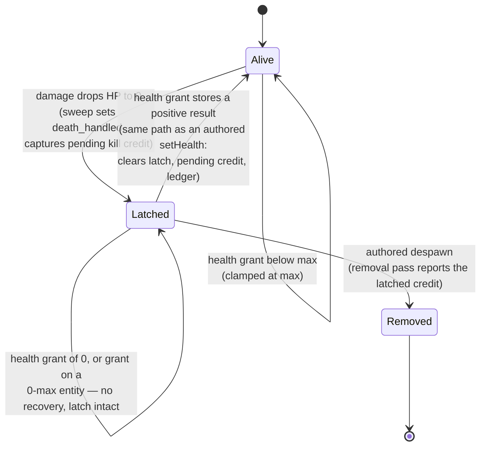

# Research — Resource Grant Chokepoint

Findings behind the spec's decisions. Not a second spec; nothing here is a task.

## Code grounding

| Claim | Source |
|---|---|
| The absolute health write clamps to `[0, max]` and, on a positive finite result, clears `death_handled`, `pending_kill_credit`, and the contributor ledger | `crates/entities/src/components/health.rs` — `set_health_absolute`, `set_current_absolute` |
| The reserve already exposes a saturating write; only `available` / `take` were named in the ammo spec, but `credit` shipped alongside them | `crates/entities/src/components/ammo_reserve.rs` |
| Every effect descriptor already carries an optional `target` string, and a single guard rejects anything but the impact target | `crates/postretro/src/impact_policy.rs` — `bind_effect`, `require_impact_target` |
| Command effects apply to one id threaded from the dispatch; the planned command carries no recipient of its own | `crates/postretro/src/impact_policy.rs` — `apply_planned`, and `apply_effect` in `impact_effects.rs` |
| The dispatch carries the damager as an optional id, so a source-addressed effect has a real value to resolve | `crates/entities/src/components/health.rs` — `ImpactDispatch` |
| `SourceHandle` is an empty branded interface — the charted seam, with no methods | `sdk/types/postretro.d.ts` |
| `applyDamage` is tag-targeted, warns and no-ops on negative/non-finite for the whole dispatch, and warns-and-skips per target on a missing component | `crates/postretro/src/health/reactions.rs` |
| The activators-or-tag dual already exists on a damage builder — the shape the grant builders copy | `sdk/lib/data_script.ts` — `damage` |
| Health and ammo reach the owning client as owner-private slots projected from host components, so a host-side grant replicates with no wire work | `crates/postretro/src/netcode/state_slots.rs` — `owner_private_source_value`, `descriptor_health_for_pawn`, `AmmoSlotProjection` |
| The combat demo map has no trigger volume today; `closet-reveal.map`, `spawner-test.map`, and `trap-pools.map` are the authoring precedents | `content/dev/maps/` |
| No armor exists in the engine — one hardcoded HUD test string is the only occurrence | `crates/ui/src/gameplay_ui_gate_test.rs` |

## Health-grant lifecycle

The one subtle interaction. A health grant is not a fresh mechanism — it is an
additive front end on the write that already owns the death latch, so routing
through it is what keeps a single lifecycle rather than two.

Consequences the spec pins as acceptance criteria: a grant that revives a downed
entity discards the credit for the down it recovered from (so a revive-kill loop
cannot inflate the kill count), and a grant that leaves it at zero preserves both
the latch and the pending credit.

## Why the reaction entry point is not optional

The IR is deliberately Turing-incomplete — no iteration (`scripting.md` §11). An
impact effect therefore addresses exactly one command-target token, so
"grant to every player" is not expressible on the impact arm at any level of
authoring effort. Tag and activators targeting resolve against a live set per
fire (`scripting.md` §12, fire-time-tag model), which is the only fan-out the
architecture offers. A grant surface without the reaction arm could never serve
a co-op heal station or a shared pickup.

## Rejected while drafting

- **Introducing the per-type carry cap here.** The ammo spec parks the cap on
  this chokepoint, so it was the obvious inclusion. Dropped: the cap needs a
  per-pawn per-type limit to read, and every candidate home is unbuilt — the
  weapon descriptor's ammo block is per-weapon, there is no declared-ammo-type
  registry, and the inventory that will own the reserve is a later spec. Banking
  the single-entry-point seam gets the same future flexibility without inventing
  an authoring surface the spec cannot ground.
- **Letting a grant target the impact target as well as the source.** Symmetric
  and cheap. Dropped: the same verb would mean "reward the killer" and "heal the
  victim" depending on one string, and the victim case is already served by an
  absolute `setHealth` with additive arithmetic.
- **Validating ammo pool keys against equipped weapons.** Would catch typos, but
  rejects the legitimate case of stocking a pool before its weapon exists.
