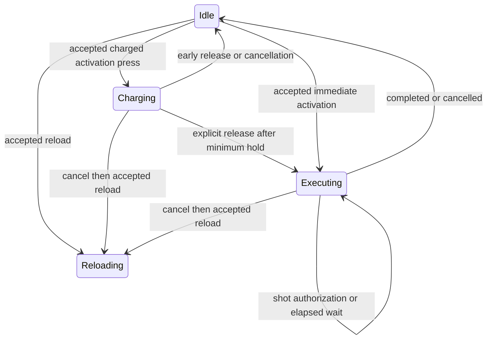

# Weapon activation research

Read at: `1527f5b26`.

## Current boundaries

- `crates/postretro/src/input/defaults.rs` binds `Action::AltFire` to right mouse. `build_sim_command` in `crates/postretro/src/main.rs` reads only primary fire.
- `SimCommand` in `crates/sim/src/sim/mod.rs` and `InputCommand` in `crates/net/src/wire.rs` carry one fire button. Conversion lives in `crates/netcode/src/wire_convert.rs`.
- `WeaponDescriptor` in `crates/foundation/src/data_descriptors/types/combat.rs` owns flat shot tuning. Primary and secondary blocks remain proposed in the weapon research document.
- `crates/sim/src/sim/weapon_stage/machine.rs` orders reload intent, timer expiry, then fire authorization. `state.rs` owns transitions. `fire.rs` owns the state-blind fire verdict and resource debit.
- `crates/sim/src/weapon/mod.rs` resolves local shots and connected-client presentation. `crates/sim/src/sim/weapon_stage/commands.rs` captures remote authorized shots.
- `ShotId` in `crates/combat-model/src/shot_authority.rs` combines pawn network identity and client tick. Two shots from one pawn on one tick would collide.
- Pending declarations in `crates/netcode/src/lib.rs` settle unopened shots when the movement cursor passes their tick. Scheduled future shots require activation/ordinal settlement instead.
- `crates/netcode/src/command_queue.rs` distinguishes real, held, and neutral commands. Frontier holds can repeat a client tick; backlog trimming can skip ticks. Missing input must never imply a charge release.
- Client post-loop fire in `crates/postretro/src/main.rs` resolves the first selected shot and declares later selected shots empty. Timed authored shots need individual resolution during render catch-up.
- `sdk/lib/data_script.ts` already exports `fire` for named reactions and `wait` for reaction sequences. Its `NumberRef` supplies fluent arithmetic. Activation builders need a distinct namespace.
- The reaction scheduler runs host-side at frame boundaries. It cannot supply predicted fixed-tick weapon execution.
- Reference content is `reference_plasma_bolt` in `content/dev/scripts/reference-projectiles.ts` and `reference_rifle` in `content/dev/scripts/reference-rifle.ts`. Preserve canonical names.

## Proposed lifecycle

Implement transitions through `weapon_stage/state.rs` and ordered entry through `weapon_stage/machine.rs`. Shared execution selection feeds both `weapon_stage/commands.rs` and connected-client resolution. The diagram describes new states; current code has neither Charging nor Executing.

## Extraction candidates

Source sizes include tests. Split by responsibility before extending, not by line count.

| Boundary | Existing lines | Extraction |
|---|---:|---|
| Foundation combat descriptors | 2039 | Weapon/activation descriptors and validation |
| Entity weapon component | 1276 | Reload feedback stream; keep component storage coherent |
| Sim weapon resolution | 3909 | Client prediction and its tests |
| Sim weapon commands | 1209 | Local and remote command consumers |
| Binary main | Over 10000 | Client weapon orchestration and its tests |
| SDK data script | 1053 | Activation builders in a dedicated module |

## Proof seams

- State, resource, and projectile behavior: `crates/sim/src/sim/weapon_stage.rs`.
- Client casts and prediction: `crates/sim/src/weapon/mod.rs`.
- Host authorization and hit declarations: `crates/netcode/src/ingest_hit_harness_test.rs`.
- Conditioned transport: `crates/netcode/src/predict_reconcile_harness_test_fixtures.rs` and `state_slot_loss_harness_test.rs`.
- Generated SDK parity: `crates/sim/src/scripting/typedef/tests/committed.rs`.
- CPU timing: existing per-stage diagnostics described in `context/lib/rendering_pipeline.md` §12.

## Scope

Remote detonation needs persistent instance-owned entity tracking and cleanup. It is a separate roadmap item. A shot/wait activation sequence owns only a bounded cursor and charge sample; it does not establish deployable ownership.

## Network choice

Keep movement playout and the no-rewind co-op model. Widen shot identity to activation plus ordinal, separate from host execution time. Advance committed waits on fixed ticks. Preserve explicit release edges through queue recovery. Charge uses bounded start/release timestamps so ordinary missing held samples do not weaken a full charge. The host clamps duration against its own elapsed time plus tolerance; severe backlog compression can reduce strength and must be reported to the owner client.

A stricter real-samples-only clock was considered. It undercharges during ordinary packet loss while the local HUD reads full, an unnecessary penalty for trusted PvE sessions.
