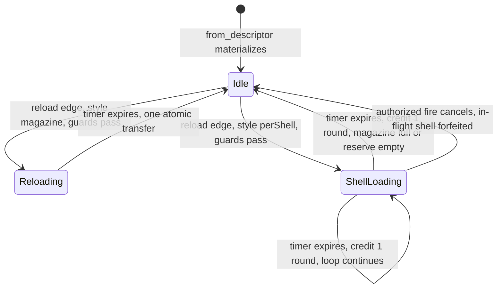

# Research — Weapon State Machine

Investigation notes behind `index.md`. Not the spec.

---

## 1. What "state" means today (grounded)

There is no wieldable- or weapon-state enum anywhere in the workspace (grep: `raising`,
`lowering`, `holster`, `WeaponState`, `WieldableState` — no production hits). State is
implied by which timer on `WeaponComponent` is nonzero:

| Implied state | Predicate | Read at |
|---|---|---|
| cooling | `cooldown_remaining_ms > 0.0` | `apply_weapon_fire_state` (`crates/postretro/src/weapon/mod.rs`) |
| reloading | `reload_remaining_ms > 0` | `apply_weapon_fire_state`, `reload::tick` (`crates/postretro/src/sim/reload.rs`), `WeaponComponent::reload_status` (`crates/entities/src/components/weapon.rs`) |
| idle | neither | fallthrough |

Two producers write those timers and neither can see the other's decision:

- `sim/reload.rs::tick` owns reload start/advance/complete and the pawn
  `AmmoReserve` transfer. It runs **first** in the tick.
- `weapon/mod.rs::apply_weapon_fire_state` owns cooldown decrement, `wants_fire`,
  and the magazine debit. It runs **second**, and receives the boolean
  `reload_started_this_tick` computed by the caller from the reload deliveries —
  the `deliveries.iter().any(...)` in `run_remote_weapon_commands` and the one in
  `run_local_weapon_command`.

That one-way boolean is the whole coupling. It is sufficient for
"reload blocks fire" and structurally insufficient for "fire cancels reload" —
the direction per-shell needs. **This is why the two must fuse into one tick,
and it is the load-bearing structural finding of this research.**

## 2. Lifecycle diagram (target machine, as shipped by this spec)

Read call sites the arrows require:

| Arrow | Read site |
|---|---|
| every `--> Idle` from a timer | the fused machine tick, called from `run_local_weapon_command` and `run_remote_weapon_commands` (`sim/mod.rs`) |
| `Idle --> Reloading/ShellLoading` | reload rising edge, derived from `SimCommand.reload` + `WeaponComponent::reload_press_consumed` (`sim/reload.rs::tick`) |
| `ShellLoading --> Idle` (fire) | the `wants_fire` + cooldown + magazine gate now inside the machine, today `apply_weapon_fire_state` (`weapon/mod.rs`) |

Cooldown is deliberately **not** a state. `reload::tick` never consults
`cooldown_remaining_ms`, so a reload can start while cooling today; making
`Cooling` a state would serialize the two and change shipped behavior. Cooldown
stays an orthogonal rate limiter that composes with `Idle`.

The equip lifecycle is **not** in this diagram. `Lowering` and `Stowed` have no
driver until weapon switching exists. `Raising` and its `raiseMs` were in an
earlier draft and came out on the owner's call: equip belongs to the spec that
owns equip, and shipping half the lifecycle here would pin equip legality from a
spec that never repoints `active_wieldable`. Its driver was manufactured rather
than found — `raiseMs` would have defaulted to `0` and every existing weapon
would have collapsed it away, leaving the dev shotgun this same spec authors as
its only live consumer. The switching spec owns all three. §9 records the
extension points that make adding them additive, and the one thing the cut costs.

## 3. Observers (vantage x lifecycle stage)

Four vantages exist on weapon state. Naming them was necessary because two of
them are *not* simulations at all.

| Vantage | Entry point | Owns a `WeaponComponent`? |
|---|---|---|
| **V1** single-player / listen-host local pawn | `run_local_weapon_command` (`sim/mod.rs`) | yes, plus a local hitscan ray |
| **V2** host-simulated remote pawn | `run_remote_weapon_commands` (`sim/mod.rs`) → `weapon::tick_state_only_component` | yes, no ray; `can_fire` is repurposed to mean "pawn has a NetworkId" at the `WeaponFireCommand` construction inside `run_remote_weapon_commands` |
| **V3** connected client, local prediction | `ClientWeaponState`, `resolve_client_fire` (`weapon/mod.rs`) | **no** — installed from the host-replicated tuning payload (`ClientWeaponState::sync_from_host_tuning` / `from_host_tuning` ← `netcode::DefaultWeaponFirePayload`, `crates/postretro/src/netcode/tuning_payload.rs`), driven from `sync_client_weapon_state` in `crates/postretro/src/main.rs`; the type's doc comment states clients must not consult their local registry for these values. `from_local_pawn_descriptor` survives as a `#[cfg(test)]` fixture builder with two test callers only. Models cooldown / fire mode / resolution / range only, no ammo, no reload |
| **V4** owner-private replication projection | `AmmoSlotProjection::for_pawn` (`crates/postretro/src/netcode/state_slots.rs`) | no — reads V1/V2's component through `WeaponOwners` |

| Stage | V1 | V2 | V3 | V4 |
|---|---|---|---|---|
| materialize | `from_descriptor` lands `Idle` at equip | same, at the net-slot equip site | unaware — no state modelled | `reloadActive=false` throughout |
| idle fire | full gate | same gate, no ray | predicts cooldown only | `player.ammo` follows magazine |
| reload start / advance | machine | machine | unaware; keeps predicting fire | `reloadActive=true`, step progress |
| per-shell step credit | machine credits 1 from `AmmoReserve` | same | unaware | `player.ammo` increments per shell |
| fire cancels shell loop | machine | machine | predicts the shot; host accepts | `reloadActive` drops to false |
| fire during reload | rejected silently | rejected silently | **predicts, then rolls back on `ShotVerdict`** | unchanged |
| hot reload | preserves live state | preserves live state | re-synced from the host tuning payload whenever the host re-sends it, or rebuilt on pawn change | reads whatever V1/V2 hold |

**Warrant, V1 == V2 for the machine.** Both call `reload::tick` with the same
signature and then a `weapon::tick_*_component` with the same
`reload_started_this_tick` flag; the only divergence is which of
`tick_resolved_component` / `tick_state_only_component` runs, and both delegate the
entire gate decision to the same private
`apply_weapon_fire_state` (`weapon/mod.rs`). Placing the machine in the weapon stage *above*
both — one call from `run_local_weapon_command`, one from `run_remote_weapon_commands` —
therefore serves both vantages with one implementation. That shared callee cannot host it:
`apply_weapon_fire_state` receives neither the registry nor the pawn id the `AmmoReserve`
transfer needs, and `tick_state_only_component` receives no registry at all. Placing the
machine inside `tick_resolved_component` instead would silently skip V2.

**Warrant, V3 needs no new work.** A host-side rejection during a `ShellLoading`
loop takes the identical path a reload rejection takes today:
`run_remote_weapon_commands` returns before `authorized.push`,
so no `AuthorizedShot` is minted, the client's `HitDeclaration` binds to nothing, and
`ClientPredictedShots::apply_verdict` (`weapon/mod.rs`) clears `muzzle_fx_visible` /
`hitmarker_visible` and restores
`cooldown_remaining_ms` from `cooldown_before_ms` — the last conditionally, only while
`state.cooldown_authority_generation` still equals the record's. `reconcile_cooldown` bumps
that generation on every fresh authoritative `player.weaponCooldownMs` sample, so a rejected
shot whose in-flight window saw a fresher host cooldown deliberately keeps the newer value
rather than rolling back to a stale one. The new state widens *when* that path fires, not
what it does.

**Warrant, V4 needs no new slot.** `AmmoSlotProjection::for_pawn` already calls
`WeaponComponent::reload_status()` and reads
`weapon.magazine`. Redefining `reload_status()` to report the current *step*
changes what the projection publishes without changing the projection.
Per-shell progress is separately observable because `player.ammo` republishes the
live magazine every frame, which increments once per credited shell.

## 4. Oversized-file watch

| File | Total | Production (pre-`mod tests`) | Verdict |
|---|---|---|---|
| `crates/postretro/src/sim/mod.rs` | 3453 | 1445 | **split before extend** — extract the weapon stage |
| `crates/postretro/src/weapon/mod.rs` | 2268 | 752 | under the line; extend in place |
| `crates/entities/src/components/weapon.rs` | 417 | 198 | fine |
| `crates/postretro/src/sim/reload.rs` | 212 | 191 | fine; becomes the machine's driver |
| `crates/foundation/src/data_descriptors/types/combat.rs` | 399 | 222 | fine |
| `crates/postretro/src/netcode/mod.rs` | 5072 | — | not extended by this plan |

The extractable seam in `sim/mod.rs` is contiguous and cohesive: `weapon_fire_command`,
`normalize_aim_direction`, `run_remote_weapon_commands`, `run_local_weapon_command`,
`apply_weapon_impact_damage`, `apply_authorized_weapon_impact_damage`,
`apply_weapon_impact_damage_with_source`, and the `#[cfg(test)]`
`deliver_reload_to_weapon`. ~290 lines. `run_death_sweep` sits inside
that address range but is the death stage, not the weapon stage — it stays.

## 5. Multi-pellet — why it stays out

`AuthorizedShot.pellet_count` exists (`crates/postretro/src/netcode/mod.rs`) and is
hardcoded `1` at every construction site — one in `run_remote_weapon_commands`
(`sim/mod.rs`), two in `netcode/lifecycle.rs`. It is already consumed generically:
hit-declaration acceptance clamps
records with `.take(pellet_count)` and rejects `pellet_count == 0` in `netcode/mod.rs`,
and a test there already drives `pellet_count = 2`. So the wire and
validation side is *already* pellet-count-general — raising it above 1 is an additive
change owned by the Resolution Modes milestone, not a prerequisite for reload style.

Shipping spread here would also drag a second authority question into a state-machine
spec — how many hit records a client may declare per shot, and whether spread must be
deterministic across the prediction seam. A spec answering two authority questions gets
neither reviewed properly.

## 6. Reload edge transport — why no new wire field

`SimCommand.reload` (`sim/mod.rs`) is a held level bit with a dedicated reliable
edge lane on the host (`pending_reload_presses` / `observe_reload_level` /
`preserve_due_reload_press`, `crates/postretro/src/netcode/command_queue.rs`),
documented in `networking.md` §Host input command queue. The lane exists because a
*rising edge* can be destroyed by stale-drop or catch-up trimming.

The only production interrupt this spec introduces is an authorized fire, which
already crosses on `FireButtonState` and is decided host-side by the same gate that
authorizes the shot. There is no separate cancel intent to transport, so the lane is
not extended and no wire field is added. A dropped fire command produces no shot and
therefore no cancel — the loop simply continues, which is the correct degradation.

## 7. Descriptor / SDK surface as it stands

- `AmmoResource` (`crates/foundation/src/data_descriptors/types/combat.rs`):
  `ammo_type` (wire `type`), `magazine`, `cost_per_shot` (`costPerShot`, default 1),
  `reserve`, `reload_ms` (`reloadMs`, default 1000). `WeaponDescriptor::validate` requires
  `magazine`, `costPerShot`, `reloadMs` all `>= 1`. `AmmoResource` derives `Eq` and has no
  `Default` impl, so exhaustive struct literals break on an added field.
- `WeaponDescriptor` has no `Default` impl either, so any field added to it breaks every
  struct literal in the workspace. This spec adds none — the only new authored field is
  `reloadStyle`, on the nested `AmmoResource`.
- Enum serde convention is `#[serde(rename_all = "camelCase")]` on the enum, so variant
  wire values are camelCase — `FireMode::Semi` → `"semi"` (`combat.rs`). This is
  why `PerShell` serializes `"perShell"`, **not** the `"per-shell"` kebab spelling
  sketched in `context/research/weapon-model.md` §3.
- SDK types are generated: `sdk/types/postretro.d.ts` and
  `sdk/types/postretro.d.luau` already carry `AmmoResource` and the
  `WeaponResource` union, from `register_type` / `register_tagged_union`
  (`crates/scripting-core/src/primitives_registry.rs`) driven from
  `crates/postretro/src/scripting/primitives/mod.rs`. That registration also owns the
  `reloadMs` doc line the typedefs carry, which reads "Reload duration in milliseconds".
- `docs/scripting-reference.md` `## components.weapon` documents the
  block and the `resource` row, and closes with a trailing paragraph stating the authored
  `reloadMs` is the base reload duration read through the effective-stat seam.

## 8. Hot-reload precedent

`refresh_from_descriptor` (`crates/entities/src/components/weapon.rs`)
deliberately preserves cooldown, input edges, magazine, and every reload timer value,
and its comment names them. It assigns unconditionally except for `credit_source`, which
is assigned only when the descriptor carries one so an absent value keeps the spawn-time
resolution. `reload::tick`'s completion path re-reads
`component.effective()` at completion so "a hot descriptor refresh during reload
redirects capacity and transfer to the refreshed ammo pool" (`sim/reload.rs`).
Those two precedents settle the new field's policy: **state and its timers are live
instance state (preserved); durations and style are authored tuning (refreshed, and
honored at the next decision point).**

## 9. Extension points — how the equip lifecycle and a switch interrupt land later

This spec ships three states. The switching spec adds at least three more —
`Raising`, `Lowering`, `Stowed` — plus a switch-driven interrupt and whatever
equip-timing field it decides to author. The mechanics below are what make that additive
rather than a restructure; `index.md` states the requirement, this section records why
each piece suffices and where the coverage stops.

| Extension | What absorbs it | Why no restructure |
|---|---|---|
| A new state variant | one `WieldableState` enum, one transition function keyed by (state, event) | new arms, not a new dispatch shape |
| A new *timed* state | the generalized timed-state triple (remaining / total / sub-ms carry) | the triple is state-agnostic — no per-state timer field exists to add |
| A new state's fire/reload legality | `WieldableState::allows_fire()` / `allows_reload()` / `is_reload_activity()`, exhaustive per-variant predicates | legality is one place, not scattered `state != Idle` tests; the meter reads the third rather than opening a fourth match site |
| A new preempting entry point (`begin_lower`, switch interrupt) | the transition function's (state, event) keying — an entry point legal from every source state is arms from every source state | structurally absorbed, but **untested here**: this spec ships no preempting entry point, so the switching spec is the first to exercise the path, not the second |
| Finding every site that must decide about a new state | no `_` wildcard arms over `WieldableState` in production | adding a variant is a compile error at each decision site |
| A new endpoint event pair | `ReloadOutcome` variants → `event_name` | the drain is name-driven; new variants need no new plumbing |

Three things deferral does *not* buy. First, `Stowed`'s "no weapon is live" semantics
interact with `active_wieldable` repointing, the switching spec's own hard problem; that
was never resolvable here, so deferring `Stowed` moves it to the spec that can answer it.
Second, the preempt row above is a shape guarantee, not a validated path. The rule the
switching spec will want — a preempting entry point forfeits the in-flight timed step and
keeps every credited round — follows from the cancel edge Task 4 does build, but nothing
in this spec calls a transition from *every* source state, so that generalization ships
argued rather than exercised. It is the one thing the `Raising` cut costs. Third, the
table is scoped to the *enum*. It does not cover the machine moving **layers** — off
`WeaponComponent` onto a wieldable component, per `weapon-model.md` §2. That is the one
extension this shape does not absorb; naming it `WieldableState` removes the rename but
not the move, and `index.md` §Direction states the residue as a divergence rather than
papering over it here.

## 10. Prior-commitment citation trail

Long form of `index.md` §Direction → *Prior commitments*.

- `context/research/weapon-model.md` §4 names per-shell reload "a cancellable state
  machine"; §3 puts `reloadStyle` on the resource, not on the weapon. Honored. It spells
  the value `"per-shell"`; the repo's enum serde convention (§7) makes that `"perShell"`.
  Stated divergence: two sibling classifiers in one milestone should not disagree on
  casing.
- `plans/done/E16--ammo-resource/` shipped reload as "timed, non-cancellable,
  single-transfer" and explicitly deferred "per-shell / incremental / cancellable reload
  and the `reloadStyle` classifier" to this spec. The atomic style keeps that contract
  exactly; per-shell is a sibling, not a replacement.
- That spec also made reload duration an **effective stat** read through `effective()`,
  never the raw field. Honored, and generalized: `reloadMs` is the duration of one reload
  step, so a reload-speed modifier scales per-shell cadence for free rather than needing a
  second augmentable number.
- `context/research/weapon-model.md` §7 invariant 7 — "Inventory, equip, and switch are
  named for wieldables, not weapons" — and §2's placement of identity, inventory, equip,
  switch, and augment on the wieldable layer. Naming honored literally: the state type is
  `WieldableState`, in its own module in the entities component barrel. Hosting diverges:
  the field sits on `WeaponComponent`, and §12 records the price. Naming was free, so the
  divergence narrows to hosting alone rather than covering both.
- `context/lib/networking.md` §Combat authority: fire-rate and ammo stay
  host-authoritative; client-side ammo and reload prediction stay out of scope. Honored —
  V3 is untouched.
- `plans/done/reload-feedback-ui/` promised that a later timed-reload spec would "point a
  real reload state machine at the already-defined slot… no UI rework." Task 5's
  re-meaning of `player.reloadProgress` is that promise being kept, not a new liberty
  taken with a shipped scripting slot.
- `plans/done/movement--state-machine/` is the structural precedent: extract the
  substrate intact, then introduce the state enum with a baseline state that is
  behavior-identical and gated by the existing regression suite, then add states. Tasks 1
  and 2 are that shape.
- **Divergence from `plans/done/E10--behavior-state-graph/`.** That epic replaced an
  engine-closed enemy FSM with an *authored* behavior graph. This spec builds an
  engine-closed enum with hardcoded transitions — the shape E10 retired for enemies. The
  divergence is deliberate: `weapon-model.md` §3 commits `reloadStyle` to a fixed
  classifier ("a trait, not a number"), and `movement--state-machine` settled the same
  question the other way for a hot-path engine-internal system. Weapons take the movement
  answer, not the enemy one, because the transitions here are timing and resource
  legality rather than authored behavior. Reversible at the cost E10 itself paid: keep
  the enum, lower it to a graph later.
- Roadmap: `switching + inventory` "replaces the `active_wieldable` chokepoint." This
  spec deliberately does not touch that chokepoint.

## 11. Alternatives explored

Long form of `index.md` §Direction → *Alternatives rejected*, plus the ones that did not
earn a line there.

- **Ship `Lowering` and `Stowed` alongside `Raising`** (an early draft's choice).
  Case for: the two halves of an equip transition are conceptually one thing, and pinning
  transition legality now means the switching spec does not re-open it. Rejected on the
  owner's call: neither has a production caller, both would ship as test-only states, and
  §9's extension points make adding them a matter of new arms rather than a reshape.
- **Ship `Raising` and a `raiseMs` without the other two** (a later draft's choice).
  Case for: `Raising` is timed, uninterruptible by fire, and legal-and-preempting from
  every source state, so it validates three machine properties an interruptible loop does
  not; a draw delay is wanted gameplay for this genre; and its call site already exists
  and is unambiguous (equip-at-spawn, two sites), where `begin_lower`'s does not exist in
  any form. Rejected on the owner's call, on two counts. The driver was manufactured:
  `raiseMs` defaults to `0` and every existing weapon collapses it away, so the only live
  consumer would have been the dev shotgun this same spec authors. And half a lifecycle
  is worse than none — shipping `Raising` alone pins equip legality, the forfeit rule, and
  an authored equip-timing field from a spec that never repoints `active_wieldable`, so
  the switching spec would inherit equip semantics it did not choose. The whole lifecycle
  moves to the spec that owns equip. What the cut costs is recorded in §9: the
  preempt-from-any-state path ships argued, not exercised.
- **Zero-duration `Raising`, given a duration later by the switching spec.** Keeps the
  state but never times it. Rejected on its own terms before the cut above subsumed it: a
  state machine whose timed transitions are never timed is an unvalidated abstraction.
- **Keep the two producers; add a second boolean (`fire_wants_cancel`) back into
  `reload::tick`.** The minimal diff, and it works for exactly this one interrupt.
  Rejected because it re-derives the implicit-state scheme one interrupt later: switching
  adds a third boolean, and the ordering constraints between the three become unwritable.
  The fusion is the whole point.
- **Multi-pellet shotgun spread in this spec.** See §5.
- **A rack / finish stage after a cancelled per-shell reload.** Classic shotguns play a
  close-bolt animation on cancel, and modelling it would give cancellation a real cost.
  Rejected for v1: with no weapon animation system it would be an invisible delay today,
  and it is purely additive later (one state, one duration field).
- **A dev-tools-only input binding to drive equip transitions manually.** Considered while
  equip was still in scope, as a way to demo raise and lower without switching. Rejected
  then and moot now: it adds an `Action` variant and binding-table churn for a demo, and
  the switching spec would remove it weeks later.

## 12. Foreclosures and one-way doors (long form)

- **Cooldown can never become a state without a behavior change.** A reload can start
  while cooling today and the machine keeps that true, so a future `Cooling` state would
  have to break it. Named so the switching spec does not treat it as free.
- **One state at a time.** A weapon cannot be in two activities at once — reloading and
  equipping, once equip lands. Dual-wield (roadmap, later) generalizes the *active
  reference* to a pair and each instance keeps its own machine, so the pair case is
  unaffected — but a single instance with two concurrent activities is now
  unrepresentable.
- **`reloadMs` stops being readable on its own.** It means "the whole reload" or "one
  shell" depending on the sibling `reloadStyle`, so every consumer — HUD, docs, a future
  augment tooltip, a modder — must read both. Accepted over a separate `shellReloadMs` so
  one reload-speed modifier scales both styles, but it is a real loss of local
  readability.
- **The `reloadStyle` discriminant is the one hard-to-reverse piece.** Same class of bet
  as the `WeaponResource` tag, on the same authored surface, so changing its spelling or
  shape after content exists costs a content migration. Everything else reverses cheaply:
  adding a state is additive, and the timer generalization is internal to two crates. No
  authored field is added to `WeaponDescriptor` at all, so the weapon block's shape is
  unchanged.
- **The switching spec inherits a hosting question, not a naming one.** Naming is settled
  here: `WieldableState` satisfies `weapon-model.md` §7 invariant 7 literally, at the cost
  of a type name and a module name, so nothing is left to rename. Hosting is not: the
  field sits on `WeaponComponent`, because weapon is the only wieldable kind and no
  wieldable component exists to host it. If switching needs the machine to serve a second
  kind, lifting it off `WeaponComponent` is the one reshape §9's table does not cover.
  Moving a correctly-named type between hosts is mechanical while weapons are the only
  kind; the price rises per wieldable kind added.
- **What this hands to the switching spec.** `ClientWeaponState`
  (`crates/postretro/src/weapon/mod.rs`) owns no `WeaponComponent` and carries cooldown,
  fire mode, resolution, and range only — no ammo, no reload — so a connected client
  cannot see any state this spec adds. Accepted here, because every divergence resolves
  through the shipped `ShotVerdict` rollback — but the dev-default flip makes it common
  rather than rare, and that is stated at decision altitude in `index.md` §Direction. Mid
  per-shell loop, whether a predicted shot is authorized turns on the host's magazine
  count: below `costPerShot` it is refused and rolled back, at or above it the loop cancels
  and the shot fires. The client models neither number. Against the reference pistol's 12
  rounds and one 500 ms atomic transfer (`content/dev/scripts/reference-pistol.ts`), a
  magazine of 8 refilled one shell at a time puts a co-op client in that window for
  seconds per reload instead of a fraction of a second. It stops being acceptable at
  equip: a raise lockout fires on every swap, so a per-swap mispredict-and-rollback would
  be visible on every weapon change rather than at the edges of an ammo count.

  The mechanism an equip-timing field would join is already shipped.
  `plans/done/E15--session-lifecycle/` §Decisions commits that "the host replicates
  the values a client predicts with," for the reason "a client predicting with its
  own numbers fights reconciliation instead of diverging cleanly," and the machinery
  exists: `netcode::DefaultWeaponFirePayload` carries exactly the four weapon fire fields a
  client reads through `default_weapon` — `range`, `cooldown_ms`, `fire_mode`,
  `resolution` — `TuningPayload` versions them behind `TUNING_PAYLOAD_EPOCH`, and the host
  re-sends whenever they change. So an equip-timing field is a fifth field on an existing
  payload, not a new mechanism. Cutting `raiseMs` means this spec authors no such field;
  whichever spec does inherits a concrete choice rather than an open argument — add the
  field, bump the epoch, teach `ClientWeaponState` the equip transition, or argue that a
  per-swap rollback beats the reconciliation fight.

  `reloadStyle` is deliberately **not** on that payload, and it is not the same question:
  the client predicts nothing that reads it. That also sharpens the accepted cost above —
  the dev-default mispredict is an unmodelled-state problem, which E15 does not address,
  rather than the divergent-numbers problem E15 solves.

## 13. Test-independence audit — does anything depend on `reference_pistol` being the dev default?

This spec flips `content/dev/scripts/player.ts`'s `defaultWeapon` from
`reference_pistol` to `reference_shotgun`. Audit result: **no existing test breaks.**

Grep for `reference_pistol` across `crates/` returns eleven files, all of which use it as a
free-standing string literal in a fixture the test itself constructs — none of them reads
dev content:

| Site | Use | Coupled to the dev default? |
|---|---|---|
| `crates/entities/src/components/weapon.rs` | `canonical_name` argument to `from_descriptor_with_canonical`, asserted back out as `credit_source` | no — the string is the test's own input |
| `crates/scripting-core/src/data_descriptors/tests/entity.rs` | inline JS/Luau descriptor source in the test body | no |
| `crates/net/src/wire.rs` | `active_weapon_archetype` payload value | no |
| `crates/net/src/replication.rs` | `active_weapon_archetype` payload value | no |
| `crates/postretro/src/main.rs` | synthetic `DescriptorProvenance` / viewmodel descriptor | no |
| `crates/postretro/src/netcode/client.rs` | `active_weapon_archetype` on self-built remote-slot fixtures | no |
| `crates/postretro/src/netcode/lifecycle.rs` | `player_with_default_weapon` / `weapon_descriptor` fixture arguments | no |
| `crates/postretro/src/netcode/mod.rs` | `canonical_name` on a self-built descriptor provenance fixture | no |
| `crates/postretro/src/netcode/remote_materialize.rs` | third-person weapon descriptor fixture name | no |
| `crates/postretro/src/scripting/builtins/data_archetype.rs` | `player_with_default_weapon` / `weapon_descriptor` fixture arguments | no |
| `crates/postretro/src/scripting/builtins/net_descriptor.rs` | `player_with_default_weapon` / `weapon_descriptor` fixture arguments | no |

No Rust test loads `content/dev/start-script.ts` or `content/dev/scripts/player.ts`. The
only tests that read dev-content files at all are in
`crates/postretro/src/scripting/entity_world_primitives.rs`, whose `dev_script_fixture`
helper is called with `trigger-fanout-fixture.{ts,luau}` and
`trigger-event-presser-fixture.{ts,luau}` only.
`crates/postretro/src/movement/mod.rs` mirrors `player.ts` — but its movement block,
not `defaultWeapon`.

So the requirement is forward-looking, not remedial: it constrains the tests **this spec
adds**. It is stated as an AC and an Invariants row rather than as task prose because the
coupling it forbids is cheap to introduce (`defaultWeapon` is the one weapon a dev-loop
integration test can reach without authoring a fixture) and invisible until someone
changes dev content.
