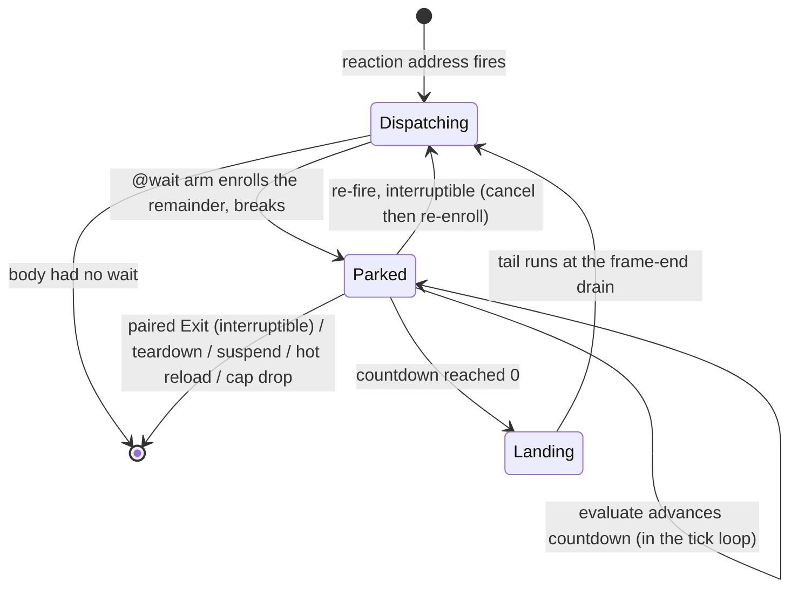

# E18 Timed Reaction Steps — Research Notes

Session-grounded facts and the lifecycle diagram. Not the spec — decisions live in `index.md`.

## Grounded source facts (confirmed this session)

### Descriptor + dispatch layer
- `SequenceStep { id: SequenceTarget, primitive: String, args: serde_json::Value }` and
  `enum SequenceTarget { Entity(EntityId), Activators, FiredTrigger }` — `crates/entities/src/data_descriptors/types/reactions.rs`.
- `enum ReactionDescriptor { Progress, Primitive, Sequence(Vec<SequenceStep>) }` — same file.
- `dispatch_sequence(steps, sequence_registry, script_ctx)` runs steps in array order, synchronously, one drain — `crates/scripting-core/src/reaction_dispatch.rs`. Non-`Entity` targets warn+skip; unknown primitive warns+skips; handler `Err` warns+continues.
- Sequence-primitive validation: `sequence_primitives_are_valid` / `validate_sequence_primitives` reject a `Sequence` reaction whose step names a primitive not in `SequencedPrimitiveRegistry` — same file. A `wait` pseudo-primitive must not be rejected here.
- JS deserialize: `sequence_steps_from_js` — `crates/scripting-core/src/data_descriptors/js/reactions.rs`. Sentinel ids: `"@activators"` → `Activators`, `"@trigger"` → `FiredTrigger`, else numeric `id` → `Entity`. Luau twin: `sequence_steps_from_lua` — `.../lua/reactions.rs`.

### Trigger fire + in-tick consequential execution
- `TriggerFireReport { fires: Vec<TriggerEvent> }`. `TriggerEvent { fire: TriggerEventFire, edge: TriggerEventEdge }`.
  `TriggerEventFire { trigger: EntityId, player: PlayerId, event_name: String }`. `TriggerEventEdge { Enter, Exit }`.
  `PlayerId { Local(EntityId), Remote(u64) }`. — `crates/postretro/src/trigger_system.rs`.
  In production the returned report is discarded (`_report`); the meaningful path is the per-edge `dispatch` closure
  inside `simulate_tick_with_presentation_aim` calling `TriggerBindingTable::execute(...)`. `enters()`/`exits()` are
  `#[cfg(test)]` filter methods, not fields — treat enter/exit as a filtered view over the ordered `fires` stream by `edge`.
- `fires` is ordered by `(trigger, player)`; a same-tick enter+exit for one trigger share that ordering.
- `TriggerTickContext<'a>` — `crates/postretro/src/sim/mod.rs`: `system, bridge, bindings: &TriggerBindingTable,
  slot_table: Rc<RefCell<SlotTable>>, script_ctx: Option<ScriptCtx>, auto_close_timers, use_edges`. Passed as
  `trigger_context: Option<TriggerTickContext>` into `simulate_tick` / `simulate_tick_with_presentation_aim`; built in
  the App tick loop in `main.rs`.
- `TickEvents.trigger_residuals: Vec<TriggerResidualHandle>` (opaque `usize` newtype into `TriggerBindingTable::residuals`).
  Drained **per frame** (across all fixed ticks in the frame), not per tick, in `main.rs`: resolve each via
  `trigger_bindings.residual(handle)` → `fire_prepartitioned_reactions_with_sequences(residual.steps(), ...)` →
  follow-ups via `dispatch_deferred_named_events_with_sequences`.
- `TriggerBindingTable` — `crates/postretro/src/trigger_bindings.rs`. Built by
  `build_with_script_ctx_and_diagnostics(...)`, invoked from `install_world_cpu`
  (`crates/postretro/src/startup/lifecycle_world_cpu.rs`), stored on `WorldInstallProducts.trigger_bindings`, held on `App`.
  `TriggerBinding { commands: Vec<BoundTriggerCommand>, residual: Option<TriggerResidualHandle> }`.
  `TriggerResidual { steps: Vec<PrepartitionedReactionStep> }`.
- `BoundTriggerCommand` (11 variants) — `crates/postretro/src/trigger_commands.rs`: `Mover`, `Damage`, `GrantHealth`,
  `GrantAmmo`, `Arm`, `Disarm`, `StoreSlot`, `AddOwnerSlot`, `AnimationState`, `UpdateEnemyState`, `Spawn`.
  `BoundTarget { Tag(String), Entity(EntityId), Activators, FiredTrigger }`.
- Effect-class classifier `classify(primitive) -> PrimitiveClass { Consequential, Lifecycle, Presentation }` —
  `crates/postretro/src/trigger_bindings.rs`. `CONSEQUENTIAL_PRIMITIVES` (15): moverStart, moverStop, moverReverse,
  moverGoToPathNode, moverSetSpinRate, applyDamage, grantHealth, grantAmmo, armTrigger, disarmTrigger, setState, addSlot,
  setAnimationState, updateEnemyState, spawnFromSpawner. `LIFECYCLE_PRIMITIVES` (3): loadLevel, restartLevel,
  returnToFrontend. Else Presentation.
  - NOTE: a second, divergent consequential list exists — `is_trigger_consequential_primitive` (13 names, omits
    grantHealth/grantAmmo) in `reaction_dispatch.rs`, used only in a `#[cfg(debug_assertions)]` residual assertion. The
    binder's `classify` is authoritative for partitioning.

### Tick, co-op, lifecycle, test harness
- Host tick loop: `main.rs` `WindowEvent::RedrawRequested`, `for tick_index in 0..ticks` (fixed-timestep accumulator
  from `frame_timing`). Host/single-player branch calls `simulate_tick_with_presentation_aim(...)` then
  `evaluate_slot_accumulators(&mut session.scripting.slot_accumulator_bindings, tick_dt)`. New scheduler eval goes beside it.
- `tick_dt = self.frame_timing.tick_dt()` → `f32` **seconds** ≈ 0.016667. `TICK_DURATION = Duration::from_micros(16_667)`
  (`frame_timing.rs`); netcode twin `DEFAULT_MICROS_PER_TICK = 16_667` (`crates/net/src/timesync.rs`), surfaced as
  `SERVER_TICK_MICROS` (`netcode/host.rs`).
- Co-op: **host-only sim.** Connected clients run only movement prediction and `continue`, skipping
  `simulate_tick_with_presentation_aim`. `evaluate_slot_accumulators` is host-only (doc: "connected clients must never
  invoke this"). Consequences reach clients via state-slot replication: `HostStateReplication` (`netcode/host.rs`
  `host_replicate`) → `RawSnapshotMessage.state_records` → `ClientStateApply::apply_snapshot_state` writes client
  `SlotTable`. Test `accumulated_shared_global_converges_without_client_side_evaluation` confirms host-only accumulate +
  replicated result. Mover state is host-authoritative and snapshotted (clients predict + reconcile).
- Level teardown: `App::unload_level` (`startup/lifecycle_net.rs`) → `clear_surface_lifetime_level_state` calls
  `slot_accumulator_bindings.clear()` beside `trigger_system.clear()`, `auto_close_timers.clear()`,
  `spawn_context.clear()`, etc.; `unload_level` also clears `progress_tracker`, `crossing_detector`,
  `data_registry` reactions/crossings. Install: `install_world_cpu` calls `rebuild_reaction_subscribers(...)` then
  `slot_accumulator_bindings.rebuild(script_ctx)` (self-clearing). App re-entry: `rebuild_active_reaction_subscribers`.
- **No pause gate on the fixed tick.** Pause menu sets `ui_captures_gameplay = true` → neutral input, but `ticks` is
  still non-zero, `simulate_tick` + `evaluate_slot_accumulators` still run every tick. So dt-driven game state (slot
  accumulators today) advances while paused. `renderer.freeze_time()` freezes only the animation sample clock, not the sim tick.
- Test harnesses that advance N fixed ticks seeding a fixed DT: `observability/driver.rs` `run_headless` /
  `run_headless_inner` (`const TICK_DT: f32 = 1.0/60.0`); `sim/determinism_tests.rs` `SimHarness` (`const DT = 1.0/60.0`);
  `slot_accumulators.rs` unit tests use `frame_timing::TICK_DURATION.as_secs_f32()`.

### Consumer fixture
- `content/dev/maps/closet-reveal.map` has: `trigger_volume` (name/`_tags` `closet_reveal_plate`), `kinematic_mover`
  (name/`_tags` `closet_door`, waypoints `closet_door_closed`→`closet_door_open`), two `reference_enemy` (`_tags`
  `closet_enemies`), one `light_spot` (**no `_tags`, no `dynamic` flag** → static; `LightAnimation.color` is accepted on
  authored static lights, so intensity or color both work — `validate_and_normalize`, `crates/lighting/src/script_primitives.rs`).
  The plate carries `"fire_mode" "once"`, which V2 rejects for an interruptible wait — Task 6 changes it.
- `content/dev/scripts/closet-reveal.ts` fires `closet.openDoor` (tag `moverStart`) + `closet.releaseCloset`
  (`enemies({tag}).update({aggro:true})`) from the plate `enter` edge, as two separate reactions.
- Authoring idiom: sequence steps come from handle builders returning `SequenceStep[]` (`light.pulse()`, `mover.start()`,
  `armTrigger()`), spliced into `sequence: [...]`. `wait()` follows the `armTrigger`/`disarmTrigger` precedent
  (`sdk/lib/data_script.ts`).

## Pending instance lifecycle

Enrollment happens at dispatch. `dispatch_sequence` is the sole funnel through which any reaction body is
walked, so its `@wait` arm enrolls `&steps[i + 1..]` with the scheduler and breaks. Nothing is written into
a body and nothing is keyed by position.

Ordering rules the diagram encodes:
- Enrollment is never inside the tick loop, but it is not always after one: `fire_focused_button_activation`
  dispatches from the `RedrawRequested` arm *ahead* of `for tick_index in 0..ticks`. The scheduler therefore
  stamps each instance with a monotonic frame counter advanced by `begin_frame()`, and `evaluate` skips any
  instance stamped with the current frame. Being outside the loop is not the same as being after it.
- Cancels are applied before countdown advance, so an Exit on the landing tick wins.
- A re-fire's same-key cancel is applied at enrollment, before the cap test, so re-enrollment never fails.
- A landing's tail is wrapped in `PrepartitionedReactionStep::Descriptor(ReactionDescriptor::Sequence(..))`
  and run through the `pub` `fire_prepartitioned_reactions_with_sequences` from a scheduler-owned queue
  drained just after the `pending_trigger_residuals` loop. The scheduler never mints a
  `TriggerResidualHandle` — that type is a bare index into `TriggerBindingTable::residuals`, so a scheduler
  entry would either fail to resolve or execute another binding's steps.
- A nested wait inside a resumed tail re-enters the same control arm, so multi-wait bodies need no separate
  path.

## Why the enemy release must be dispatched, not inlined

E18-C: "The reveal composes at the trigger fan-out ... **not** one reaction body (a body is a single
primitive; tag-targeted primitives ride the Primitive path, never a `sequence`)." Reinforced in source:
`BoundTriggerCommand::UpdateEnemyState` bails unless its target is `BoundTarget::Tag`, while
`bind_sequence_step` maps `SequenceTarget::Entity(id)` to `BoundTarget::Entity(id)`. And it must be
*delayed* rather than left on the enter edge because the aggro gate is the containment — releasing early
lets enemies aggro through a still-closed door. Hence the `fire` step, lowering to the shipped
`PrepartitionedReactionStep::DeferredEvent`.

## Corrections against earlier session assumptions

- `TRIGGER_VOLUMES_VERSION` is `2`, and `TriggerVolumesSection::from_bytes` accepts `1` (legacy) and `2` —
  it tolerates version skew rather than hard-checking.
- The static-light color gate does not exist: `validate_and_normalize` takes `_target_is_dynamic` unused and
  errors on color only when the array is empty.
- `TriggerFireReport` has one field, `fires: Vec<TriggerEvent>`; `enters()`/`exits()` are `#[cfg(test)]`
  filter methods, not fields.
- `world.query` component vocabulary uses `"kinematic_mover"`, not `"mover"`.
- `TICK_DURATION` is `Duration::from_micros(16_667)`, not `1000/60`. The integer rule is used because that
  constant is authoritative, **not** because a float rule disagrees: `ceil(ms / (1000/60))` and
  `max(1, ceil(ms * 1000 / 16_667))` agree at every duration from 1ms to 5000ms, in both `f32` and `f64`.
  An earlier note claiming the float form yields 49 for `durationMs = 800` was arithmetically wrong; both
  forms yield 48.
- `clear_surface_lifetime_level_state` lives in `startup/lifecycle_net.rs`; `install_world_cpu` reaches the
  binder via `build_trigger_bindings` in `startup/lifecycle.rs`.
- The quote "intentionally does not participate in snapshots, digests, or the connected-client simulation"
  is the `auto_close_timers` field doc on `ScriptingCore` in `session/mod.rs`, not in `auto_close.rs`.

## Oversized files the plan touches

`main.rs` 11161 · `startup/lifecycle.rs` 3945 · `sim/determinism_tests.rs` 3652 · `sim/mod.rs` 2872 ·
`trigger_bindings.rs` 2590 · `trigger_system.rs` 2379 · `reaction_dispatch.rs` 1917 ·
`data_script.luau` 1132 · `data_script.ts` 939. New code lands in new modules: the scheduler and the
segmentation pass each get their own file, and Task 7's tests are new files.

## Verification ledger

Claims checked against source this session. Cited by identifier and file; line numbers are deliberately
omitted (`context_style_guide.md` — a context reference must survive a refactor).

| Claim | Where | Result |
|---|---|---|
| `TRIGGER_VOLUMES_VERSION` value and reader tolerance | `crates/level-format/src/trigger_volumes.rs` | `= 2`; `from_bytes` accepts 1 (legacy) and 2 |
| Named dispatch reads bodies from the registry | `fire_named_event_with_sequences` → `dispatch_sequence`, `reaction_dispatch.rs` | iterates `data_registry.reactions`; a side table cannot intercept |
| Install ordering | `install_world_cpu`, `startup/lifecycle_world_cpu.rs` | `slot_accumulator_bindings.rebuild` precedes `build_trigger_bindings`, which precedes `install_manifest_events` |
| `bound_edges` has no empty-work inserter | `bind_event`, `trigger_bindings.rs` | returns early on `commands.is_empty() && steps.is_empty()`, before `append_binding` |
| Stall clamp arithmetic | `TICK_DURATION`, `MAX_ACCUMULATOR`, `frame_timing.rs` | 16_667µs and 250ms → ≤14 ticks per frame |
| Second seeded dispatch input | `APP_DRAIN_DISPATCH_INPUTS`, `scripting/systems/system_reactions.rs` | `[("@rising", IrType::Bool)]` |
| Dispatch-scope seeding site | `build_inner`, `trigger_bindings.rs` | seeds `RefCell<DispatchScope>` with `TRIGGER_EVENT_INPUTS`; not `build_with_script_ctx_and_diagnostics` |
| Bound-command apply signatures | `BoundTriggerCommand::execute` / `execute_with_script_ctx`, `trigger_commands.rs` | the script-ctx variant substitutes `ScriptCtx` for `SlotTable` and adds `&mut DispatchScope` |
| `fire_mode` spellings | `crates/level-compiler/src/trigger_volumes.rs` | `"once" \| "0" => 0`, `"multiple" \| "1" => 1`, else `bail!` |
| Runtime fire-mode type | `TriggerVolumeComponent.fire_mode`, `crates/entities/src/components/trigger_volume.rs` | `TriggerFireMode`, not the level-format `u8` |
| Scope-erasure type gate | `invalidScopeErasure`, `sdk/type-tests/e18-dispatch-params.ts` | shipped `@ts-expect-error`; the contravariant brand bites under `strict` |
| Determinism harness shape | `RecordedTick`, `SimHarness::record`, `sim/determinism_tests.rs` | projects the real `TickEvents`; no struct clone |
| Static-light colour gate | `validate_and_normalize`, `crates/lighting/src/script_primitives.rs` | `_target_is_dynamic` unused; colour errors only when empty |
| Co-op atmosphere channel | `plans/done/E18--trigger-event-fanout` | host in-tick `sharedGlobal` write → replication → client crossing → client-local presentation, late-join included |
| `WorldInstallHandles` construction sites | `startup/lifecycle.rs`, `observability/driver.rs` | **four**: three in `startup/lifecycle.rs` of which only the first is production — `mod tests` runs to end of file, so the other two are test-only — plus one in `run_headless_inner`, plus the destructure in `install_world_cpu` |

## Verification ledger — mechanism review

Checked against source during the mechanism rework. These are the facts the current design rests on.

| Claim | Where | Result |
|---|---|---|
| `DataRegistry.reactions` is a derived view rebuilt from retained originals | `recompose_active_sets`, `crates/entities/src/data_registry.rs` | confirmed — clones from `global_reactions` (filtered by level tag) then extends with `level_reactions`; any body mutation is erased and positions are re-derived |
| Recompose call sites | repo-wide | thirteen across four files: four in `data_registry.rs` (definition, one internal call, two tests), five in `startup/lifecycle.rs`, three in `scripting-core/src/runtime/core.rs`, and the staged hot-reload commit (`staged_manifest_lifecycle.rs`), five in `startup/lifecycle.rs`, and return-to-frontend |
| The deferred hop loop is closed to `postretro` | `dispatch_deferred_named_events_with_sequences_up_to`, `reaction_dispatch.rs` | confirmed — the `while let Some(event_name) = pending.pop_front()` loop calls `fire_named_event_with_sequences` internally and returns only a count, so no enrollment seam exists beside it |
| `MAX_BATCH_DISPATCH_HOPS` | same | `= 256` |
| `dispatch_sequence` skips non-`Entity` targets | same | confirmed — `let SequenceTarget::Entity(id) = step.id else { warn; continue }` precedes the handler lookup, so a control step needs an arm *ahead* of that guard |
| `dispatch_sequence` already guards despawned targets | same | `script_ctx.registry.borrow().exists(id)` warn-and-skip — covers O22 with no new work |
| Sequenced handlers can capture engine state | `SequencedPrimitiveFn`, `crates/scripting-core/src/sequence.rs` | `Box<dyn Fn(EntityId, &serde_json::Value) -> Result<(), SequenceError>>` — a closure, so it captures; but its signature cannot receive a tail, hence the parallel control-handler table |
| The scheduler's handle shape has a shipped precedent | `MoverAutoCloseTimers`, `crates/postretro/src/kinematic_mover/auto_close.rs` | `#[derive(Debug, Clone, Default)]` over `Rc<RefCell<AutoCloseTimerState>>`, doc'd "main-thread only, matching the existing command-diagnostics registration handles"; captured into handlers by `register_sequenced_mover_primitives` |
| The resume path is shipped and `pub` | `PrepartitionedReactionStep`, `fire_prepartitioned_reactions_with_sequences`, `reaction_dispatch.rs` | `Descriptor(ReactionDescriptor)` and `DeferredEvent(String)`; the `Descriptor(Sequence(..))` arm delegates to `dispatch_sequence`, and the function returns `chained` for the next hop |
| `setState` cannot be a sequence step | `bind_sequence_step`, `trigger_bindings.rs`; `register_sequenced_*` call sites | confirmed twice over — an explicit early return warns "setState is system-targeted and cannot carry an entity target; not binding", and only light, fog, mover, and trigger primitives are registered, so `sequence_primitives_are_valid` would drop the whole reaction at `setupLevel` |
| `levelLoad` fires at install, not in a frame-end drain | `install_world_cpu`, `startup/lifecycle_world_cpu.rs` | confirmed — fired near the tail of the function, after `install_manifest_events`, before it returns |
| Tick/float equivalence | arithmetic against `TICK_DURATION` | the integer and float rules agree at all 5000 durations tested; the spec's former counterexample was false |

## Derivation note — why enrollment sits in the dispatcher

Two earlier mechanisms were carried far enough to be reviewed, and both failed on the same property.

A **scheduler-owned side table** keyed by reaction was the first. It intercepts nothing:
`fire_named_event_with_sequences` resolves bodies out of `data_registry.reactions` and walks them whole, so
a table beside the registry never enters the dispatch path.

**Rewriting each body to segment 0 at install** was the second, and it fixes the interception. It fails on
durability and on reach. `DataRegistry.reactions` is regenerated by `recompose_active_sets` from retained
originals at thirteen sites across four files, so the rewrite is undone by every hot reload, level-tag change, and
return-to-frontend unless the pass re-runs at all of them; and any key derived from a position in that
vector retargets when the rebuild reorders it. Separately, it leaves enrollment unsolved for the hops
inside `dispatch_deferred_named_events_with_sequences`, whose loop `scripting-core` owns and which cannot
name a `postretro` type — so a `fire` step reaching a reaction that contains a wait would run the head and
silently drop the tail.

Siting the enrollment inside `dispatch_sequence` resolves all three at once, because that function is the
single funnel every body passes through. It also removes work rather than adding it: no install rewrite, no
segmentation table, no registry-index newtype, no duplicate-address validation row, and — because
`dispatch_sequence` is never reached from inside `simulate_tick` — and no three-way effect partition,
since a resumed tail runs where a trigger residual already runs. It does not remove the need for a skip
rule: a pre-tick-loop enrollment would otherwise advance in its own frame.

## Verification ledger — binder, assertion, and frame-phase review

Checked against source during the fourth revision. These four falsified claims the spec had asserted.

| Claim | Where | Result |
|---|---|---|
| Trigger-bound sequences bypass `dispatch_sequence` entirely | `partition_direct_reaction`, `trigger_bindings.rs` | confirmed — the `Sequence` arm binds every `classify(..) == Consequential` step to an in-tick command **regardless of position**, and its else-branch drops any step whose `id` is not `SequenceTarget::Entity(_)` with `"sentinel target on presentation sequence step … not binding"`. `classify` returns `Presentation` for `wait`/`fire`, so unamended it deletes both and hoists `moverStart` |
| The residual executor rejects consequential steps | `fire_prepartitioned_reactions_with_sequences`, `reaction_dispatch.rs` | confirmed — `#[cfg(debug_assertions)] debug_assert!(!is_trigger_consequential_primitive(..))` guards **both** the `Descriptor(Sequence(..))` and `Descriptor(Primitive(..))` arms, message "trigger residual contains a consequential sequence step; binding must execute it in the fixed tick". `moverStart` is in the 13-name list, so a resumed `[moverStart, …]` tail panics in debug builds |
| UI activation precedes the tick loop in the same redraw | `fire_focused_button_activation`, `main.rs` | confirmed — called from the `RedrawRequested` arm ahead of `for tick_index in 0..ticks`, so a pre-loop enrollment is advanced by that same frame's `evaluate` passes. "Outside the tick loop" does not imply "after it" |
| Production discard split | callers of `fire_named_event_with_sequences` | one bare statement (the `levelLoad` fire in `lifecycle_world_cpu.rs`) and five `let _ =` (`dispatch_state_crossings_with_sequences`; and in `main.rs` `drain_mover_sound_events_with_sequences`, the `pending_death_events` loop, `UiButtonAction::NamedReaction`, `commit_text_entry`). Two further sites are inside `mod tests` |
| `updateState` export path | `sdk/lib/ui/reactions.ts`, `typedef/templates/ui_sdk_module.d.ts` | declared under `declare module "postretro/ui"`; **not** re-exported by `sdk/lib/index.ts`, so a root `"postretro"` import does not resolve |

## Verification ledger — provenance-transport review

Fifth-round checks. Each falsified a claim the spec had asserted about where information is available.

| Claim | Where | Result |
|---|---|---|
| The frame-end residual drain knows `(trigger, player)` | `TickEvents`, `crates/postretro/src/sim/mod.rs`; the drain loop in `main.rs` | **false, and backwards** — `trigger_residuals: Vec<TriggerResidualHandle>` carries bare handles and the drain iterates opaque indices. The origin is in scope one layer up, in each per-edge dispatch closure, which pushes only `trigger_residuals.push(handle)` while cloning `event` beside it under `#[cfg(test)]`. The closure knows; the drain does not |
| A residual is one reaction's product | `bind_event`, `append_binding`, `TriggerResidual`, `trigger_bindings.rs` | false — `bind_event` partitions **all** matched reactions into one `commands`/`steps` pair before `append_binding`, which merges into any existing residual for the same `(trigger, edge)`. A single address field cannot describe it, so address and ordinal ride on the step |
| `MAX_BATCH_DISPATCH_HOPS` is shared across calls | `dispatch_deferred_named_events_with_sequences`, `reaction_dispatch.rs` | false — declared `const` inside the function body, so two calls get two independent budgets. Two batches therefore raise the per-frame ceiling to 512 |
| V4's dispatch-input predicate can run in Pass A | `BoundProgram`, `crates/foundation/src/ir/bind.rs`; `resolve_input`, `scripting-core/src/ir/scopes.rs` | false — no `BoundProgram` exists until `build_trigger_bindings`, which runs after Pass A. `resolve_input` maps a name to a handle at bind time and is not a query against a bound program; `BoundProgram` exposes only `root`, `root_type`, `output`. `EntityScope::resolve_input` also re-wraps `DispatchInputHandle::Dispatch` into `EntityInputHandle::Dispatch`, so a predicate naming only the former misses entity-targeted step programs |
| `paired_enters` is readable from a control handler | `TriggerSystem`, `trigger_system.rs` | false — private with no accessor; every use is internal. The check belongs at the drain, which holds the session |
| `defineStore` shape and slot key | `typedef/templates/sdk_lib.d.ts`; `content/dev/scripts/run-counter.ts` | flat `Record<string, StoreSlotSchema>` with a `(namespace, schema)` overload; the default-value key is `default`, not `initial`. `network: "shared"` is the correct authoring spelling |
| Hot reload can catch a queued tail in flight | `poll_staged_manifest_results` call site vs the drain, `main.rs` | no — the staged commit runs later in the same `RedrawRequested` arm than the landing drain, so a queued tail cannot outlive its body within a frame. Recorded so later rounds do not re-litigate it |

## Verification ledger — targeted gap review

Sixth-round checks over territory earlier rounds recorded as skipped, plus the fifth revision's own edits.

| Claim | Where | Result |
|---|---|---|
| A level manifest can register a store | `LevelManifest`, `typedef/templates/sdk_lib.d.ts` | **false** — the type has `reactions`, `events`, `crossings`, `triggerEvents`, `triggerPools`, `uiTrees` and no `stores`. Stores reach the engine only through `defineMod({ stores: [...] })`; the shipped path is `run-counter.ts` exporting a handle that `content/dev/start-script.ts` lists |
| `setState` can be a delayed consequential step | `register_sequenced_*` roster, `session/mod.rs`; `SystemReactionRegistry`, `system_reactions.rs` | **false, twice over** — only light, fog, mover, and trigger families are registered as sequenced; `setState` is registered on the system-reaction registry instead. A delayed state write must be a `fire` step naming a `Primitive` reaction |
| Task 2's Luau chain is complete at six links | `luau_prelude.rs`, `luau_require.rs` | **false** — `DATA_SCRIPT_FIELDS` and `POSTRETRO_ROOT_MODULE_EXPORTS` are guarded by tests asserting exact-set equality against the evaluated `.luau` surface, and `luau_require.rs` carries a third hand-written root list. Missing the first or third fails a test; missing the second leaves the global nil at runtime while the typedef declares it |
| The system binder can be queried by reaction name | `SystemSetStateBinding`, `system_reactions.rs` | **false** — the struct holds `slot`, `value`, `program`, `required_dispatch_inputs` and no identity, and `bindings` is private with no accessor. It also holds only system-targeted `setState` `Primitive` reactions, so a sequence step can never have a program there |
| `MoverAutoCloseTimers` gates by a per-call predicate | `set_enabled`, `auto_close.rs`; session constructor, `session/mod.rs` | it gates by a `set_enabled(bool)` latch written where `net_endpoint` resolves, beside two sibling latches. `is_connected_client` is an `App` method, so a session-owned scheduler cannot read it per call — the latch is the right shape, not a wrong turn |
| The staged commit block runs three calls | `poll_staged_manifest_results`, `staged_manifest_lifecycle.rs` | four — `recompose_active_sets`, then `rebuild_active_reaction_subscribers`, `rebuild_active_system_reaction_bindings`, `rebuild_active_trigger_bindings`. The third rebuilds the binder V4b's `fire`-target half reads |
| `SimHarness` is reachable by widening the struct | `mod determinism_tests`, `sim/mod.rs` | no — the module itself is `#[cfg(test)] mod determinism_tests;` with no `pub(crate)`. A second unrelated `SimHarness` also lives in `sim/divergence_spike_tests.rs`, and `tick` requires a per-tick `RecordedCommand` |
| A missing `args` deserializes to `{}` | `sequence_steps_from_js` / `_from_lua` | no — both default to `serde_json::Value::Null` |
| `paired_enters` survives trigger removal | `trigger_system.rs` | no — `paired_enters.retain(...)` drops pairs for triggers that leave `active_triggers`, so a removed trigger produces no Exit and would strand an interruptible instance |
| O26b's accumulator rebase | `evaluate_slot_accumulators`, `slot_accumulators.rs` | confirmed — a foreign `write_generation` rebases `precise_value` from the `f32` slot, discarding sub-`f32` state, and the generation bumps on every write including equal-valued ones |
| O45's spawn-sweep offset, and the frame phases generally | `RedrawRequested` arm, `main.rs` | confirmed — both sweeps sit inside the tick loop, the residual drain after it, `run_crossing_stage` after that, `poll_staged_manifest_results` last |
| V5's warrant | Exit arm, `trigger_system.rs` | confirmed — `paired_enters.remove` consumes the edge before the `on_exit.is_empty() && !bound_edges.contains(...)` `continue`, so the `bound_edges` insert is exactly what keeps the edge alive |
