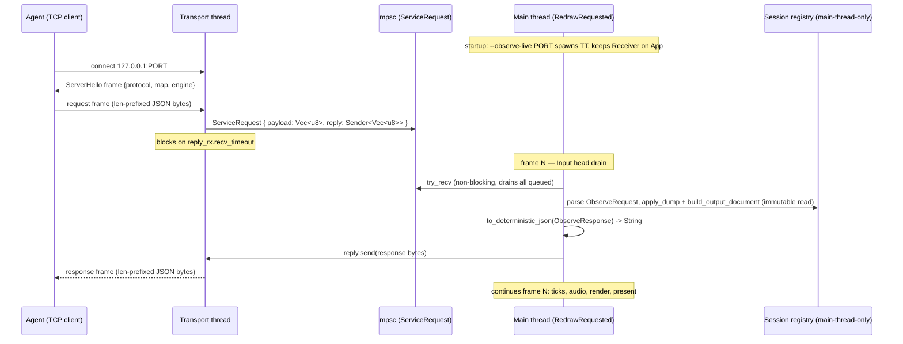

# Live socket channel — research note

**Status:** pre-draft grounding for the `index.md` spec. NOT a spec — facts, the
lifecycle diagram, and open-question resolutions. All identifiers below were read
against current source this session; line numbers go stale, prefer the symbol.

## Scope decision: read-only first

Roadmap (`roadmap.md` Epic 20, "Live socket channel" bullet): "the same runspec/output
vocabulary over a localhost transport thread plus mpsc plus frame drain, to
inspect and drive a *running windowed* session. The anchor capability. **Read-only
verbs first; live mutating verbs are gated on the host-authoritative sim — they
need care, not a bespoke path.**"

This spec builds the **inspect** half in full: the transport foundation (thread +
mpsc + frame-boundary drain + request/response protocol) proven end-to-end by a
read-only `dump` verb that samples a *running* windowed session. Drive verbs are a
committed follow-up — the drain seam is designed so they ride it (§Extension
point), but they are not built here.

Why not bundle a drive verb: a drive verb mutates the sim, so it is "gated on the
host-authoritative sim" (roadmap) — it must ride the existing authoritative
`SimCommand` ingress, not a new external-write path, and that gating is its own
design. The transport round-trip (thread → mpsc → frame-drain → service → reply)
is identical for read and write, so a read verb fully exercises the foundation;
only the sim-mutation is deferred.

## Authority reconciliation (why read-only is not arbitrary-caution)

Epic 20 non-goal: "External state writes that fight sim authority… it does not
accept arbitrary outside mutation" (`roadmap.md`). networking.md
§Game-logic-owned apply: "The net crate emits typed snapshots and **never mutates
the registry.** All registry-touching replication lives in `crate::netcode`."
Reads borrow the registry immutably (host serialize "Borrows the registry
**immutably**"). So a read verb is trivially legitimate. A drive verb, when built,
is legitimate only as a host-arbitrated command applied inside the fixed tick
(the shape triggers and FIRE already use), consequences replicating through
`crate::netcode` — never a direct registry write from the transport thread.

## Reused existing seams (grounded, stable)

**Shared dump vocabulary** — `crates/postretro/src/observability/`, all
`pub(crate)`, currently gated `#[cfg(feature = "observability")]` (`main.rs:55`):
- `DumpSpec` (`observability/runspec.rs`) — the read request payload: `component:
  Option<String>` (snake_case kind filter), `tag: Option<String>`, `entities:
  Option<Vec<u32>>`, `cap: usize` (default 1000), `events: bool`, `cell_visibility:
  bool`. `#[serde(default, deny_unknown_fields)]`.
- `apply_dump(registry, dump) -> DumpSelection` (`observability/document.rs`) —
  entity selection.
- `build_output_document(...) -> Result<OutputDocument, DumpError>`
  (`observability/document.rs`) — assembles `OutputDocument { map, ticks_run,
  entities, truncated, events, player, cell_visibility, out_of_frame }`.
- `to_deterministic_json<T: Serialize>(&T) -> Result<String, _>`
  (`observability/mod.rs`) — sorted-key serializer; the byte-identical guarantee.
- `build_player_summary` — currently in `observability/driver.rs` (headless
  driver); reads `Transform` + `HealthComponent` off
  `registry.local_player_movement_pawn()`. Must move to the shared vocabulary so
  both faces call it (Task 1).

**Windowed session ownership** (main-thread-only — CONFIRMED against source):
- `App.session: Option<session::Session>` (`main.rs:665`).
- Live world state is `EntityRegistry`, held `Rc<RefCell<EntityRegistry>>` in
  `ScriptCtx.registry` (`crates/entities/src/ctx.rs`). `ScriptCtx` is `!Send +
  !Sync` **by design** (`ctx.rs`). The transport thread cannot hold or touch it —
  compiler-enforced. It must marshal owned bytes; only the main thread reads.

**Frame boundary + drain point** (`main.rs`, the `WindowEvent::RedrawRequested`
match arm, ~lines 2192–4388):
- Frame ordering restated in source at `main.rs:3417` (Input → Game logic → Audio
  → Render → Present, dev_guide §4.3).
- Drain point: head of the Input stage — after `frame_timing.begin_frame` (~2200),
  before the gamepad poll (~2270) and `ui_dispatch.take_ready/advance_frame`
  (~2369). Precedents for an in-frame drain here: `drain_script_reload_requests()`
  (~2222) and `netcode::frame_order::run_snapshot_apply_stage` (~2586).
- Fixed-tick loop: `for tick_index in 0..ticks` (~2638–3038); a command drained at
  the Input head is visible to that same frame's ticks. Zero-tick frames still run
  the drain and still render.
- Timestep: windowed uses a fixed-timestep accumulator (`frame_timing.rs`,
  `TICK_DURATION = 16_667µs`); headless uses a fixed count. The drain runs every
  frame regardless of tick count.

**Frame-stage module precedent:** `crates/postretro/src/netcode/frame_order.rs`
(77 lines) owns one frame-stage seam as a small dedicated module, called from
`main.rs` with one line. The live drain follows this pattern — the `main.rs`
footprint is one stage call + one `App` field + one startup spawn site. `main.rs`
is 12994 lines; a full split is out of scope and unnecessary here because the
feature adds a stage call, not logic, to that file.

**Apply seam (drive-verb extension point, not built here):** windowed and
headless both apply through `sim::simulate_tick_with_presentation_aim(command:
&SimCommand, …)` (`sim/mod.rs:393`). Windowed builds the command via
`build_sim_command` (`main.rs:1184`); headless builds `SimCommand` from runspec
entries and calls the thin `simulate_tick` wrapper (`sim/mod.rs:341`). A future
drive verb builds a `SimCommand` from the runspec command vocabulary
(`CommandEntry`/`MovementCommand`/`AimCommand`) and injects it at the Input-head
drain so the same-frame tick loop applies it — the same seam, host-arbitrated.

**Distinct transport — do NOT conflate with `crates/net/`:** `postretro-net` is
UDP multiplayer, polled-synchronous, "no async runtime, no tokio, **no spawned
threads**" (networking.md). The live channel is a *separate* localhost TCP
transport with its own thread. Different subsystem, different socket.

## Feature/module gating (grounded)

`main.rs:55`: `#[cfg(feature = "observability")] mod observability;`. The
vocabulary is therefore absent from a windowed build. Task 1 re-gates: declare the
module under `any(feature = "observability", feature = "observe-live")` and gate
`driver` (and `run_headless`) internally to `observability` only. Behavior of the
headless build is unchanged — the driver stays `observability`-gated; only the
vocabulary submodules widen.

`Cargo.toml [features]`: `observability = []` and `capture = []` are dep-free
module gates. `observe-live = []` follows the same shape (no deps; `serde_json`
already used by the vocabulary; `std::net`/`std::thread` are std).

## Lifecycle

Key timing facts the diagram pins:
- The transport thread never enters the sim; it blocks on a reply channel.
- Servicing is one atomic point per frame (Input head) with exclusive main-thread
  access — no torn read across ticks.
- A request queued mid-frame is serviced at the next frame's Input head; the reply
  reflects the settled post-previous-tick state. One-frame latency, consistent.
- If the main thread runs no frames (suspended), `recv_timeout` fires and the
  thread closes the connection rather than hanging the agent. (Transport-level
  failures — oversized frame, reply timeout — close the connection; application-
  level failures — bad request JSON, dump error, no world — return a main-built
  `ObserveResponse` frame.)

## Open questions — resolved

- **Transport: TCP vs UDS vs UDP.** TCP on `127.0.0.1` — reliable/ordered for
  request/response, cross-platform (UDS is Unix-only), and trivially agent-openable.
  Not UDP (that is netcode's domain and needs no ordering guarantees the batch
  vocabulary wants). Not `crates/net/`.
- **Localhost enforcement.** Flag takes a `u16` PORT, binds `127.0.0.1:PORT` by
  construction — a bare port cannot be widened to `0.0.0.0` by input.
- **What crosses the channel.** Only `Vec<u8>` (request) and `Vec<u8>` (reply) —
  the transport thread is codec-only and parses no engine JSON. All serde
  (`ObserveRequest` parse, `OutputDocument` build, `to_deterministic_json`) runs on
  the main thread. Sidesteps every `Send` concern on engine types.
- **Live dump vs batch dump — the difference.** Per-tick `events` are a batch-
  driver accumulation across the N ticks it runs; the live sampler reads one frame
  boundary and runs no scripted tick loop, so the live dump's `events` is empty
  (recorded in `out_of_frame`, mirroring headless `absent_headless=["map_lights"]`).
  Entities, player summary, and baked `cell_visibility` are all live-available.
  `map_lights` (headless-absent) IS live-available but is a live-only enrichment
  deferred past this slice.
- **No world loaded (frontend/menu).** `App.session` may hold no world. A dump then
  returns a valid "no world" document (empty entities, null player), never a crash.
- **Protocol version.** `ServerHello.protocol: u32` sent unsolicited on accept; the
  client compares before trusting frames. Mirrors netcode's "gate before you
  interpret" posture without a multi-round handshake.
- **Single connection.** One connection at a time, serialized request/response.
  Concurrent clients are a non-goal for this slice.
- **Protocol-crate extraction.** Deferred (roadmap: gated on a second typed
  consumer). This slice reuses the `pub(crate)` vocabulary in-crate; it is the
  consumer that will later earn the extraction, but does not force it.

## Source-file size flags (split-before-extend)

| File | Lines | Plan's footprint |
|---|---|---|
| `main.rs` | 12994 | +1 stage call, +1 `App` field, +1 startup spawn. Logic lands in the new `observe_live` module (per `frame_order.rs` precedent). No split. |
| `sim/mod.rs` | 2995 | Untouched this slice (apply seam is the deferred drive verb). |
| `session/mod.rs` | 1060 | Untouched, or a receiver field if the channel state lives on `Session` rather than `App` — App is the chosen owner, so untouched. |
| `observability/driver.rs` | 773 | `build_player_summary` moves out to the vocabulary (Task 1); net smaller. |
| `observability/document.rs` | 662 | Gains `build_player_summary`; re-gated. |
