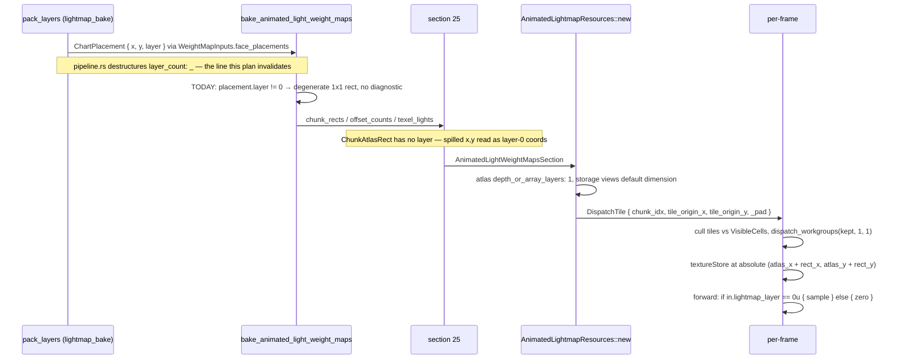

# Research — animated lightmap array atlas

Grounding for `index.md`. Anchors were read from source at draft time; treat line numbers as
starting points, not addresses.

**Re-anchored 2026-08-15** against `main` merged into this branch (`main` at `19d0bd3`). Every seam
was re-read. `level-format`'s section files and `render-cpu`'s validator are byte-identical to the
draft's base (`b1327fd`), so their behavioral claims hold unchanged. Files that moved —
`level-compiler`'s `pipeline.rs` and `lightmap_bake.rs` (delta-SH coarsening, seam-smoothing, entity
serialization), and `renderer`'s `lighting/lightmap.rs`, `shaders/forward.wgsl`, and
`render/tests/shader_tests.rs` (specular-shadowmask + nav work merged from `main`) — were each
re-verified: every animated-lightmap anchor survived, drifting in line number only. The load-bearing
`pipeline.rs` `layer_count: _` discard survives at `:699`; the forward layer-0 guard is now at
`:979`, `sample_lightmap_animated` at `:245`, `sample_lightmap_irradiance(uv, layer)` at `:240`, the
`SINGLE-LAYER LIMITATION` comment at `:218`; `lightmap.rs` still exposes a 7-entry group-4 BGL with
animated bindings 3/5 at `D2` and `bgl_entries_pin_sampler_split` still never asserts
`view_dimension`; the shadowmask literal-string test survives at `shader_tests.rs:344`. The delta-SH
probe coarsening touches only sections 27/41/45 and never enters section 25, so the "animated
indirect is layer-independent, out of scope" position stands. `STAGE_VERSION` is currently `5`. The
golden `--ignored` failure was characterized: its delta is stale-engine drift confined to
SH/nav/BVH/cache-key sections plus the new section 45, with sections 22/24/25 byte-identical — see
Open questions. Line-number drift elsewhere is cosmetic and left as first-approximation addresses per
the note above.

## Layer data flow across the four seams

Every arrow above has a read call site in the anchors below.

## Anchors by seam

### Packer → placements

| What | Anchor |
|---|---|
| `ChartPlacement { x, y, layer }` | `level-compiler/src/chart_raster.rs:27` |
| `pack_layers` — layer roll, `LayerOverflow` | `lightmap_bake.rs:781`, roll at `:821-860` |
| `choose_layer_dim` — square dim, grows until largest **BSP** leaf packs alone | `lightmap_bake.rs:892` |
| Leaf grouping by `Chart.leaf_index`, first-seen order | `lightmap_bake.rs:873` |
| Constants: `MIN_ATLAS_DIMENSION` 64, `MAX_ATLAS_DIMENSION` 8192, `MAX_ATLAS_LAYERS` 256 | `lightmap_bake.rs:30,35,41` |
| Determinism keyed on chart order + `max_dim`; tie-break on chart index | `lightmap_bake.rs:944` |
| `layer_count: _` discard, with the now-false comment | `pipeline.rs:699` (comment `:697-698`) |

Layer counter is **monotonic** — a small leaf after a large one opens a fresh layer rather than
backfilling. Relevant to slot density: occupied static layers can be sparse.

### Compiler weight-map stage

| What | Anchor |
|---|---|
| The layer gate and degenerate rect | `animated_light_weight_maps.rs:187-207` |
| Chunk concatenation (prefix-sum invariant holds for degenerate rects) | `:117-136` |
| Per-face-only overlap assert | `:479-523`, buckets at `:488` |
| Sole `info` line — folds degenerate rects into healthy-looking stats | `:161-169` |
| Duplicated encoder stride constants, log-only, not compiler-enforced | `:138-147` |
| `STAGE_VERSION` (cache key) | `:54` |
| Aggregate-warn + rate-limited-detail precedent to copy | `animated_light_chunks.rs:195-210`, `:276-284` |
| Namespace split — complementary on `animation.is_some()` | `light_namespaces.rs:59`, `:101` |
| Static bake receives `StaticBakedLights` only | `pipeline.rs:674` |

### Wire format

| What | Anchor |
|---|---|
| Section ids 24 / 25 | `level-format/src/lib.rs:139-146` |
| `ChunkAtlasRect` — no layer field | `level-format/src/animated_light_weight_maps.rs:25` |
| `TexelLightEntry` (offset/count pair) | `:38` |
| `TexelLight` (`light_index`, `weight`, `direction_oct: [u16; 2]`) | `:59` |
| Strides: header 16, rect 20, offset entry 8, texel light 12 | `:107-110` |
| Version constant — **2**, bumped for `direction_oct` | `:10-15` |
| Encode: LE, all counts in the fixed header, no per-array prefix | `:158-192` |
| Decode: version **exact equality**, hard error; single up-front `needed` size | `:194-278` |
| `is_consistent` — prefix sum + per-entry `(offset, count)` bounds into `texel_lights`; no coordinate or layer awareness | `:125-156` |
| Layout doc block still says `version (= 1)` | `:73` |

Graceful-version precedent: `level-format/src/trigger_volumes.rs` — const at `:5`, appended fields
with a do-not-move comment at `:12-29`, encoder unconditional, decoder resolving version to a
capability flag at `:59-64` and branching at `:121-128`. Two structural differences: `TriggerVolumes`
uses a `u16` version and is a self-describing length-prefixed stream, while section 25 uses `u32`
and computes total size from fixed strides — so the stride in that computation becomes
version-dependent.

### GPU

| What | Anchor |
|---|---|
| Both atlases created `depth_or_array_layers: 1` | `render/animated_lightmap.rs:227-243`, `:260-273` |
| Single 1×1 `Rgba16Float` dummy backing **both** fallback views | `:616-639`, called `:152`; views `:153-157` |
| Three early-out paths to the dummy | `:159-168`, `:170-187`, `:189-208` |
| `DispatchTile` with spare `_pad` | `:31-39` |
| `expand_dispatch_tiles` — skips only zero **area** | `:657-681` |
| `MAX_WORKGROUPS_PER_DIM = 65535`, hardcoded not from `device.limits()` | `:28`, guard `:213-222` |
| Guard checked **pre-cull** on the master list; hard `Err`, no 2D fallback | `:213-222` |
| Compose BGL — 9 entries, bindings 6 and 8 `StorageTexture … D2` | `:538-614` |
| Storage views use **default** dimension | `:249-252`, `:288-292` |
| VRAM `info` log — `w × h × (8+4)`, **no layer factor** | `:275-281` |
| `dispatch` — cull, write buffer, `dispatch_workgroups(kept, 1, 1)` | `:450-518` |
| Per-frame call site, before depth prepass | `renderer_shadow_passes.rs:1004-1017` |
| Compose shader bindings and three `textureStore` sites | `shaders/animated_lightmap_compose.wgsl:92-108`, `:172`, `:213`, `:228` |
| Rect-relative texel indexing; only the store coord is absolute | `:151-165` |
| Forward group-4 binding constants | `lighting/lightmap.rs:11-37` |
| Forward BGL — 7 entries; animated at 3 / 5 are `D2` | `lightmap.rs:263-272`, `:282-291` |
| Array views pinning `D2Array` explicitly — **the pattern to copy** | `lightmap.rs:157-172` |
| `usable_atlas_dimensions` — takes `max_texture_array_layers`, discards `layer_count` | `lightmap.rs:305-318` |
| Its two call sites | `renderer_full_init.rs:259`, `renderer_resources.rs:436` |
| `filter_usable_section` — log-and-drop degradation posture to mirror | `lightmap.rs:324-358` |
| `SINGLE-LAYER LIMITATION` comment | `shaders/forward.wgsl:216-233` |
| The layer-0 guard | `forward.wgsl:944-954` |
| `sample_lightmap_animated(uv)` — no layer param, unlike `sample_lightmap_irradiance(uv, layer)` | `forward.wgsl:243-245`, `sample_lightmap_irradiance` at `:238` |
| Adapter floors: `REQUIRED_MAX_TEXTURE_ARRAY_LAYERS = 256`, `array_layers_sufficient` | `renderer_init_resources.rs:14`, `:19-21` |
| `max_storage_textures_per_shader_stage >= 4` required; compose uses 2 | `renderer_init_resources.rs:181-188` |

### Runtime validation

`render-cpu/src/animated_lightmap.rs:69-140` — `validate_cross_section` checks rect count vs chunk
count, prefix sums, and `light_index` bounds. No atlas-bounds and no layer notion.

## Stale-bind bug on the failure path

`renderer_resources.rs:452-471`. On `Err` the install logs and **falls through** (no `return`)
**without reassigning** `full.lightmap_resources` or `full.animated_lightmap`; only the `Ok` arm
rebuilds them and the group-4 bind group. The new level's geometry (`bvh_leaves`, `cell_draw_index`,
`compute_cull`) then swaps in unconditionally after the match, so a level whose animated-lightmap
construction fails renders its *new* geometry lit by the *previous* level's atlas and culled against
stale `dispatch_state`, every frame. `renderer_full_init.rs:274` treats the same error as fatal
instead. This plan adds load-time failure modes to that constructor — the extended
`validate_cross_section` rejection and the byte-budget load drop (which fires only on a PRL a current
bake would have rejected, since the same budget hard-fails at bake) — so it widens the paths that
reach this.

## Tests that must change

**Break on stride or header change** — `level-format/src/animated_light_weight_maps.rs`:
`empty_section_round_trips` (`:426`, asserts `bytes.len() == HEADER_SIZE`), `byte_layout_matches_sizes`
(`:435`, asserts `HEADER + n·20 + m·8 + k·12`), `rejects_bad_version` (`:482` — sets version `999`,
so it still guards the "unsupported version rejected" AC after the bump; but nothing asserts the
current v2 payload *succeeds*, which is exactly the graceful-decode path v3 must add a test for),
plus the shared `sample_section()` fixture
(`:297-389`) and every rect literal in it.

**Break on rect growth** — `level-compiler/src/animated_light_weight_maps.rs`:
`byte_size_under_8_mib_budget` (`:1148`) carries no stride literal — it only asserts
`section.to_bytes().len() < 8 MiB`, so the 20→24 growth reaches it through the encoded length, not an
editable constant; it is the first budget test the larger rect can push. Direct `chunk_atlas_rect`
tests at `:1285`, `:1362`, `:1410` construct `ChartPlacement` literals and are the natural
insertion point for layer coverage. `render-cpu`'s `mk_rect` helper (`:175`) hardcodes
`atlas_x: 0, atlas_y: 0`.

**Would NOT catch a partial promotion** — `lightmap.rs:783` `bgl_entries_pin_sampler_split` asserts
`entries.len() == 7` and pins `sample_type` on bindings 0/1/3/5/6 but **never asserts
`view_dimension`**. Flipping 3/5 to `D2Array` while leaving views or shader inconsistent trips
nothing. `render/tests/shader_tests.rs:331` pins the shadowmask array declaration by literal string;
no test pins the animated bindings or the layer-0 guard.

**Brittle to rebinding** — `animated_lightmap.rs:861`
`compose_shader_emits_dominant_direction_atlas` asserts the literal `"@group(1) @binding(8)"`.
`:754` `compose_shader_parses_and_declares_debug_binding` runs `naga` on the compose + `curve_eval`
concat and must keep parsing. `:891` `animated_atlas_dimensions_track_static_lightmap` hardcodes
`layer_count: 1`.

**No test exists for** the layer gate (every `ChartPlacement` literal in the weight-map tests uses
`layer: 0`), or the 65535 dispatch guard. Removing the gate breaks nothing — the change is
unguarded in both directions, which is the largest test gap this plan closes.

**Golden** — `level-compiler/tests/animated_weight_maps_fixtures.rs:381`
`mixed_fixture_without_script_membership_matches_pre_feature_golden_prl` must be regenerated. It is
currently failing for an unrelated pre-existing reason; see `index.md` Open questions.

## Measurements

`switch-demo.map`, `--no-cache`, default density: `Lightmap: 512x512x2`. Density sweep via
`--lightmap-density`: `512×512×2` at 0.04, `256×256×3` at 0.06, `256×256×2` at 0.08 — the per-layer
dimension shrinks with the texel count, so coarsening never reaches one layer.

`test_animated_weight_maps_mixed` golden, parsed directly: `LightmapSection.layer_count = 1`,
512×512, density 0.04; section 25 payload version 2, 4 chunks, 79 870 offset-count entries,
19 109 texel lights, **zero 1×1 rects**. The other five `GATE_FIXTURES` entries cannot be
established without a bake; `.map` size is a poor proxy. Inference: none of `GATE_FIXTURES`
currently reaches layer ≥ 1 at production `max_dim = 8192`, so the degenerate-rect path is
untested by any *gate* fixture.

`content/dev/maps/animated-layer-spill.map` (Task 5), baked `--no-cache` at default density and
parsed directly: `LightmapSection.layer_count = 2`, per-layer 512×512; section 25 payload version 2,
24 chunk rects of which **12 are degenerate 1×1** (the two rooms that pack onto layer 1), 213 216
offset-count entries, 164 404 texel lights. Deterministic across two bakes (byte-identical), ~4 s
each. This is the first map-level reproduction of the degenerate-rect path; before it, the only
place layer ≥ 1 was reached was `lightmap_bake.rs` `pack_layers_opens_second_layer_keeping_each_leaf_cohesive`,
forcing `max_dim = 64` — the harness shape a real multi-layer weight-map *unit* test should reuse.
`kinematic-platform.map` at default density measures `512×512×**1**` — a single large hall does not
spill (it is well under the 8192² ceiling); it bakes in ~20 min, unlike the spill fixture's 4 s.

## Corrections to the initial framing

Recorded because each was wrong in the direction of making the work look smaller or safer.

1. **Section version is 2, not 1** — already bumped once for `direction_oct`.
2. **The decoder rejects all non-matching versions, including older ones.** Unlike `TriggerVolumes`,
   which was written to tolerate v1 from the start, there is no graceful path here to extend — the
   plan adds one.
3. **The degenerate rect does not "contribute nothing."** It survives tile expansion, gets a
   workgroup, and unconditionally stores black plus zero-coverage direction at layer-0 coordinates
   borrowed from another layer's placement. Two unordered `textureStore`s to one coordinate have an
   undefined winner. Unverified — constructing a colliding fixture needs a bake — but structurally
   possible, and invisible to the per-face overlap assert.
4. **"Dark before and after" overstates it.** Only the animated **direct** term is lost. Animated
   indirect rides delta-SH in world space, layer-independently, and the ambient floor still applies.
5. **`choose_layer_dim` groups by BSP leaf, not BVH leaf**, and returns a square dimension. Its
   lower bound is `max(ceil(sqrt(leaf_area)), largest_chart_side)` maxed over leaves.
6. **A layer cap cannot bound VRAM on its own** — cost scales with atlas dimension as hard as with
   layer count. Hence the spec guards on bytes (`width × height × slots × 12`), not a slot or layer
   count.
7. **Compose cost was already proportional to animated coverage**, since tiles come only from
   chunks with animated receivers and are culled against visible cells. The slot indirection buys
   VRAM, not compose time. The 65535 guard is the number that grows, and it is checked pre-cull.
