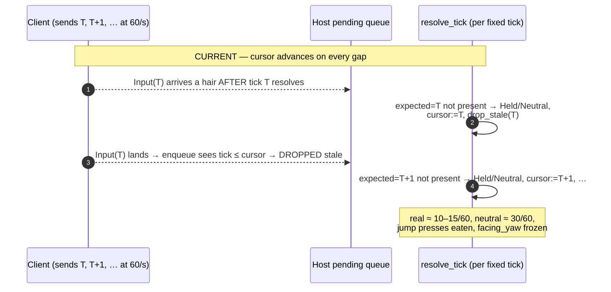

# Co-op Client Movement Feel — Research

Diagnosis notes and evidence behind `index.md`. Not a spec; decisions live in `index.md`.

## Symptom

In a two-process host+client co-op session on one machine (loopback, ~0 real packet loss), the **client** player's movement stutters, a jump requires holding the button ~0.2–0.5 s before it fires, and the **host** sees the client's rotation stepping at a low rate while the client's walk cycle and jumps look smooth at 60 fps. The host player's own movement is unaffected. Reported as a regression from previously-smooth co-op.

## What was ruled out (with evidence)

Successive investigations disproved every "obvious" cause:

- **Artificial packet-loss/latency simulation left enabled** — no. `PacketConditioner`/`LinkConfig` (`crates/net/src/harness.rs`) is gated `#![cfg(any(test, feature="dev-tools"))]` and has **zero live call sites** even under `dev-tools`; a normal launch does not compile it in.
- **Client input rate-limited on the wire** — no. Runtime `netdiag::send` shows a steady `input_sends ≈ 60/s`, one `ClientMessage::Input` per fixed tick.
- **Real packet loss** — no. Loopback, and 60/s sent all arrive.
- **The depth-keyed catch-up trim / cursor-races-ahead mechanism** (an earlier hypothesis) — no. Runtime `netdiag::queue` shows `trims = 0` and `cursor_lead ≈ 0` for the entire session.
- **OS/compositor background-window frame throttling** — no. A minimal-overlap window test changed nothing; a later measurement showed both processes at 3–4 ms/frame (~250–330 fps) — not perf-bound.

## The runtime data that cracked it

Diagnostic instrumentation (`crates/postretro/src/netcode/netdiag.rs`, `RUST_LOG=postretro::netdiag=debug`, one aggregated line per second) over a ~30 s vsync-on session on `content/dev/maps/movement-feel.prl`:

**Host `netdiag::queue`** (per second, ~60 resolutions): `real` was typically **8–15**, with `held + neutral ≈ 45`; `cursor_lead` stayed **0–2**; `trims` was **0** throughout. So the host applied the client's *actual* input on only ~15–25 % of ticks, coasting (Held) or zeroing (Neutral) the rest — while the cursor was *not* running ahead and no catch-up trim ever fired.

**Client `netdiag::send`**: a flat **60–61/s**, `fire_path_sends = 0`. The client sent every command; the host discarded most.

**Host `netdiag::jump`**: jump windows showed `max_hold ≈ 67–217 ms` with `dropped_neutral ≈ attempts` — roughly one jump press per attempt eaten by a Neutral fill before one landed. (The felt ~0.5 s is the compounded effect of several failed taps.)

**`distinct_yaw`** collapsed to ~1–5/sec during the choppy windows: fresh orientation reached the host only on the rare `Real` resolution, so the host's copy of the client's facing froze — the host-sees-choppy-rotation symptom.

## Root cause (source-confirmed)

`HostCommandQueues::resolve_tick` (`crates/postretro/src/netcode/command_queue.rs:397`) advances the resolve cursor **on every path**, including the gap path. On a missing expected tick it resolves Held or Neutral and then unconditionally runs:

```
state.resolved_cursor = Some(expected);   // command_queue.rs:490
state.drop_stale(expected);               // command_queue.rs:491
```

`drop_stale` retains only commands strictly newer than the cursor; `enqueue`'s `client_tick_le` stale check drops any later arrival at or below the cursor. Input is drained once per render frame (`net_poll_and_apply` → `host_handle_client_messages` → `ingest` at `netcode/mod.rs:1745`, reached via the snapshot-apply stage at `main.rs:2446`) and `resolve_tick` runs once per fixed tick (`main.rs:2492`/`:2722` → `host_resolve_remote_commands` at `command_queue.rs:541`/`:550`), so the two 60 Hz clocks are independent and run ~1 tick out of phase.

**Consequence:** the client sends command T a fraction of a tick *after* the host resolves tick T. The host Neutral/Held-fills T, advances the cursor past T, and `drop_stale`/`enqueue` then discard command T as stale the moment it lands. Repeat every tick → the client's real input is skipped on the majority of ticks → the host-authoritative pawn coasts/zeros → the client's reconcile snaps it back (stutter); jump presses that land on a skipped tick vanish (hold-to-jump); fresh `facing_yaw` rarely resolves (choppy rotation on the host). `INPUT_HOLD_TICKS = 3` was meant to be the jitter cushion, but because the Hold path *also* advances the cursor and drop-stales the awaited tick, it holds the pose while still discarding the real command — so it never recovers the late input.

The host has, in effect, **zero tolerance for the client's input arriving even a fraction of a tick late**, and a clean local link has exactly that much phase jitter.

## Lifecycle — current (buggy) vs. fixed



```mermaid
sequenceDiagram
    autonumber
    participant CL as Client (sends T, T+1, … at 60/s)
    participant Q as Host pending queue (playout depth ≈ target)
    participant R as resolve_tick (per fixed tick)
    Note over CL,R: FIXED — hold WITHOUT advancing; small playout delay
    CL-->>Q: Input(T) buffered (queue kept ~2 deep behind newest)
    R->>R: expected=T present → Real; cursor:=T
    CL-->>Q: Input(T+1) buffered
    R->>R: expected=T+1 present → Real; …
    Note over R: on a late arrival: Held WITHOUT advancing,<br/>so T still resolves Real when it lands (within grace)
    Note over R: real ≈ 60/60, neutral ≈ 0,<br/>jumps land, facing_yaw fresh each tick
```

## Why Fix A likely subsumes the rotation symptom

The host writes the client pawn's orientation verbatim each tick — `t.rotation = Quat::from_rotation_y(input.facing_yaw)` (`crates/postretro/src/sim/host_movement.rs:83`) — and renders it through the live registry with a single-tick slerp (`interpolated_transform`, `crates/entities/src/registry.rs:1374`, called at `crates/postretro/src/scripting/systems/mesh_render.rs:309`). The choppiness the host saw was dominated by `facing_yaw` arriving from **stale Held/Neutral** resolutions (`distinct_yaw ≈ 1–5`), not by the presentation path itself. Once Fix A resolves Real every tick, fresh `facing_yaw` reaches the host at ~60 Hz — the same rate and presentation path the host uses for its own pawn, which looks correct. So a residual host-side-presentation defect is plausible but unproven; the design for it (Fix B) is carried in `index.md` gated on re-measurement, not asserted as necessary.

## The structural asymmetry (Fix B territory, if needed)

Remote-pawn delay interpolation exists on the **client** only: `net_sample_remote_interpolation` early-returns unless the endpoint is `NetEndpoint::Client` (`crates/postretro/src/main.rs:6533`). The client smooths its view of remotes through `RemoteInterpolationBuffer` (`crates/postretro/src/netcode/interpolation.rs`): a 50–250 ms wall-clock-clocked playout (`render_server_tick`, `:157`) sampled per render frame (`client_sample_interpolation`, `netcode/mod.rs:1303`) with position lerp + rotation slerp (`lerp_transform`, `:639`). The **host has no equivalent buffer** for the client's authoritative pawn — it presents live. This asymmetry is real and source-confirmed; whether it is *visible* after Fix A is what the Fix-B gate measures.

## Orientation is render-rate by design (Fix C caveat)

`facing_yaw`/`aim_pitch` are sampled once per render frame (camera updated at `main.rs:2411`; captured in `build_sim_command` at `main.rs:1166`), per the documented contract in `context/lib/input.md` §3 "Render-rate look vs. tick-rate movement" (line 77): view rotation updates per rendered frame, movement integrates at tick rate. So if the sending client renders below 60 fps, consecutive ticks in a frame carry a duplicated yaw, and the host's orientation updates at the client's render rate even after Fix A. Changing that means diverging from a documented contract — hence Fix C is gated on measurement and must argue the divergence.

## Files over ~800 lines touched or adjacent (split-first watch)

`main.rs` (11 161), `netcode/mod.rs` (4 793), `sim/mod.rs` (2 872), `registry.rs` (2 106), `interpolation.rs` (1 428), `netcode/replication.rs` (979). `command_queue.rs` is 1 298 total but ~614 non-test. Fix A lives entirely in `command_queue.rs` (no split needed). Fix B/C must not bloat `main.rs` or `interpolation.rs` — new host-presentation logic belongs in a new `netcode` submodule with only thin wiring added to `main.rs`.
