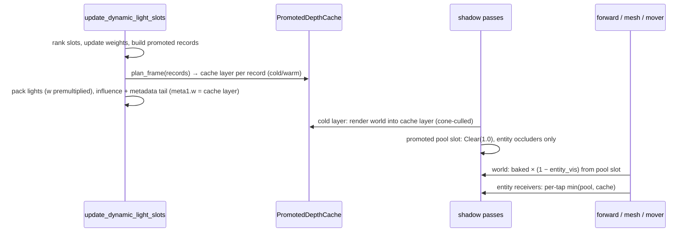

# Promoted-Shadow Entity-Only Depth — Research

Derivations and discarded branches behind `index.md`. Decisions live there.
Supersedes `context/plans/done/promoted-shadow-entity-scoping/research.md`,
whose striping and bandwidth measurements this file cites.

---

## Observation

Mode-5 capture (`SdfShadowMode::ShadowmaskUnion`) on `combat-demo`: regular
striping at the shadow-texel pitch on open world surfaces under a promoted
light, on the surfaces the light rakes. Root cause, verified against source:
the world-receiver union compares two estimates of static occlusion — the bake
(`baked_vis`) and a runtime depth compare against a pool map that contains the
world itself — and subtracts the rectified difference. The runtime estimate
self-compares at rake angles across a 5×5 kernel at ±4 texels
(`forward.wgsl` `SHADOWMASK_SPOT_KERNEL_RADIUS`/`_TEXELS`) with a two-texel,
angle-independent receiver offset (`WORLD_RECEIVER_BIAS_SCALE`,
`shadow_sample.wgsl`). Lit-tap condition for a tap `R` texels up-slope with
caster `slope_scale` 1.5 (`renderer_init_pipelines.rs`, Spot Shadow Depth
Pipeline) and Nearest texel snapping `ε ∈ [−0.5, 0.5]`:

    δ > (R + ε − 1.5) · t · sinθ

With δ = 2t and R = 4 the outer taps fail from θ ≈ 42°, 50% duty at 53°,
near-solid by 80°. `max(baked − pool, 0)` rectifies the failed taps into a
positive subtraction. The cube union (R = 1) and the dynamic-loop spot path
(R = 1) satisfy the inequality at every angle, which is why neither stripes.

A bias formula with `sinθ` and kernel-reach terms fixes the symptom. This
plan removes the class instead: the world is never in the map a world
receiver compares against, so there is nothing to self-compare.

## Composition algebra

Lightmap holds `Σ_L contribution_L · baked_vis_L`. A dynamic occluder can only
remove light L's share, and only where L reached the receiver in the bake:

    subtraction_L = direct_L · baked_vis_L · (1 − entity_vis_L) · w_L

| Case | baked | entity | subtraction | lightmap holds | result |
|---|---|---|---|---|---|
| lit, entity blocks | 1 | 0 | direct | direct | 0 |
| baked penumbra, entity blocks | 0.4 | 0 | 0.4·direct | 0.4·direct | 0 |
| baked shadow, entity blocks | 0 | 0 | 0 | 0 | 0 |
| no entity on the ray | any | 1 | 0 | unchanged | unchanged |

No threshold: the last row is zero by arithmetic, not by dead zone.

**Exactly-zero warrant.** An occupied promoted slot is cleared to 1.0 every
frame and receives only entity depth. `sample_spot_shadow` returns 1.0 for
`light_ndc.z > 1.0` and otherwise compares `z < stored` with
`CompareFunction::Less`; for stored = 1.0 every tap passes for `z < 1.0`. The
only fragment with `z == 1.0` sits at `dist == far == falloff_range.max(0.5)`
(`lighting/lib.rs` `light_space_matrix`), where `shadowmask_direct` has already
returned invalid: `dist > range` exits, and at `dist == range` linear
attenuation is 0 so `dot(direct, direct) <= eps` exits. Cube: the reference
is clamped to 1.0 at the far plane, same argument. So `entity_vis == 1.0`
exactly on every fragment that reaches the subtraction.

## Movers and skinned meshes — why the delta tiles do not serve

The entity crossfade is `(1 − w)·baked SH + w·runtime·pool_vis`. Today
`pool_vis` carries world occlusion because the promoted slot holds cached world
depth plus entity depth. With entity-only slots the runtime term would carry no
static occlusion and an entity standing in a static shadow would brighten as
`w → 1`.

Sampling the light's static visibility from the direct-SH delta tiles is not
available to the fragment shader: the per-light subtraction is a compute pass
(`direct_sh_compose.wgsl`, `selection_weights` at binding 26) and the skinned
and mover shaders bind only the composed atlas (`sh_direct_atlas`, group 4
binding 15). Reaching per-light tiles from the fragment stage means binding
the section-41 CSR payload into two more pipelines and evaluating an
octahedral tile per promoted light per fragment. Even then the result is 1 m
probe-resolution occlusion — the far-LOD blur promotion exists to replace
(`rendering_pipeline.md` §4 "the pool slot the near tier").

**Chosen:** two depth sources per promoted light. The promoted depth cache
(`promoted_depth_cache.rs`) already holds world-only static depth, rendered
once per assignment. Make it sampleable and let entity receivers combine it
with the entity-only pool slot per tap.

**Pixel-identical warrant.** The comparison sampler is Nearest
(`spot_shadow.rs`, "Spot Shadow Compare Sampler"), so each tap is 0 or 1 and
`min(cmp(pool), cmp(cache)) == cmp(min(pool, cache))`. Today's pool layer is
`copy(cache)` followed by entity draws under `CompareFunction::Less`, i.e.
`min(cache, entity)` per texel. Same resolutions (`SHADOW_MAP_RESOLUTION`,
`CUBE_FACE_RESOLUTION`), same slot matrix, same UV / lookup vector, same
reference: the per-tap AND reproduces today's merged compare exactly. The
thin slice (Task 1) lands this while the pool still holds merged depth, so
`min(merged, cache) == merged` and any visible change falsifies the warrant.

## Cache-layer routing

Entity shaders index promoted records as `lights[i]` for
`i >= dynamic_light_count`; the forward shadowmask metadata tail lives in the
same `influence_buffer` the entity paths bind at group-2 binding 1
(`renderer_resources.rs`, `renderer_full_init.rs`, `rebuild_light_bind_group`
callers), at `total_light_count + p · SHADOWMASK_META_VEC4S_PER_RECORD`. Its
`meta1.w` is written as `0.0` and read by nothing
(`pack_forward_shadowmask_metadata`, `shadowmask.rs`). It carries the record's
cache layer. `shadowmask-no-drop-atlas` (draft) re-purposes `meta1.z`; no
overlap.

Ordering hazard: metadata is packed inside `update_dynamic_light_slots`
(`renderer_light_slots.rs`), but `PromotedDepthCache::plan_frame` runs later
in `render_frame_indirect` (`renderer_render_frame.rs`). The plan must move
ahead of the pack. Records per pool are capped by `MAX_PROMOTED_SPOT` /
`MAX_PROMOTED_CUBE` (`promoted_cap` arguments to
`assign_shadow_pool_slots_with_promoted_static`), which equal the cache layer
counts (`cache_budget_matches_promoted_budget_not_pool_size`), so
`assign_layer` cannot return `None` for a record; the spec still pins the
defensive branch.

## Frame lifecycle (after this plan)

## Wide kernel retired

`static-light-shadowmask-world-receipt` Task 3 widened the union kernel to
5×5 at 2-texel spacing to "bias `shadow_map_vis` toward the baked ramp" — a
penumbra match against static occluders in the pool map. With no static
occluder in the map the warrant is gone, and the entity paths soften the same
entity's shadow with the shared 3×3 (`SPOT_SHADOW_PCF_RADIUS`). A 9-texel ramp
on the floor beside a 3-texel ramp on a mover at the same silhouette is a seam.
The union therefore calls the shared helpers. Softer entity shadows, if wanted
later, are one shared radius for every consumer.

## Bandwidth and VRAM

From `promoted-shadow-entity-scoping/research.md`: the copies were up to
32 MiB (spot) + 12 MiB (cube) per frame. They are deleted. The cache itself —
44 MiB VRAM — stays: it is the only world-only static depth the entity paths
can sample, and re-rendering world depth per frame is the cost
`perf-forward-light-cull` identified as the frame's bottleneck.

Per-fragment cost: world union 25 → 9 taps per promoted spot light; entity
receivers 9 → 18 taps per promoted light (spot and cube). No timing is
measurable on the owner's hardware; the counts are the metric.

## Alternatives not taken

- **Bias formula change** (`δ = t·(reach·sinθ + c)`): correct, four ALU, but
  keeps the copy, the 25-tap kernel, the dead zone, and a threshold-based
  double-count invariant.
- **Delete the cache; render world into a second layer per frame:** the
  shadow raster is the frame cost on the slow maps.
- **Product of two 9-tap averages** instead of per-tap min: differs where both
  maps partially cover the kernel; loses the pixel-identical warrant for a
  saving of nothing (same tap count).
- **Entity-scoping cone gate** (`promoted-shadow-entity-scoping`): does not
  remove the striping class; its copy-elision half is void because promotion
  requires an occluder in the influence, so the copy gate is true every frame
  a light is promoted. Its per-fragment gate remains an optional tap-count
  follow-on over this plan.
