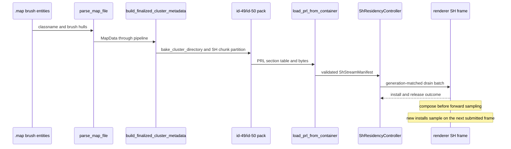

# SH Streaming Authored Hints — Grounding

## Existing lifecycle

Grounded reads: `crates/level-compiler/src/parse.rs` classifies brush entities;
`pipeline.rs` passes finalized inputs at its cluster-directory stage;
`pipeline/finalized_publication.rs` calls `cluster_directory_bake.rs`, then pack;
`crates/level-loader/src/prl_loader.rs` parses id 49 before it installs the
manifest; `crates/postretro/src/session/sh_residency.rs` prepares the drain;
`crates/postretro/src/main.rs` applies its outcome and marks compose submission.

## Constraints that shape the slice

- `crates/level-format/src/cluster_directory.rs` owns both the canonical greedy
  partition and semantic validation. Validation recomputes membership from
  cells, portals, BVH, and limits. A compiler-only seam cut would fail load.
- `crates/level-loader/src/prl_loader.rs` collapses portal adjacency to cluster
  neighbors. A seam needs preserved portal identity to warm the far side of a
  marked doorway, including when dynamic door occlusion hides its cells.
- `crates/postretro/src/sh_streaming/targeting.rs` forms Visible, two-hop
  Prefetch, and Hysteresis targets, then closes owner dependencies.
  `lifecycle.rs` suppresses cold prefetch under budget pressure and evicts
  dependents before owners. Renderer install/compose timing is already fixed.
- `sdk/TrenchBroom/postretro.fgd` defines `lightmap_scale_region` and
  `sh_protect_volume` as compiler-only solid classes. `parse.rs` peels them
  from world geometry. `trigger_volumes::resolve_brush_entity_aabb` is the
  existing hull-to-engine-AABB helper.
- `parse.rs` (~7,300 lines) and `cluster_directory.rs` (~2,850 lines) are
  oversized. Extract the relevant authoring and partition/wire seams before
  adding behavior. `map_data.rs` is ~850 lines and needs only small field
  additions.
- The current id-49 header is 40 bytes, little-endian, with two reserved
  `u32` words at offsets 32 and 36. Version is 1. Version 2 can use those
  words for hint-table counts and append tables after existing ranges.
- `ShStreamManifest::content_tag` hashes directory bytes. Versioned hint bytes
  therefore change level identity without an extra runtime identity scheme.

## Design boundary

A portal-associated seam can cut clustering and prefer far-side warm-up, but
cannot guarantee a zero-pop reveal when the door opens before asynchronous
loading completes. A guarantee requires a door/visibility gate across gameplay
and co-op authority. Slice 4 uses best-effort warm-up; the default miss path
remains ambient-floor SH until composition is complete.
