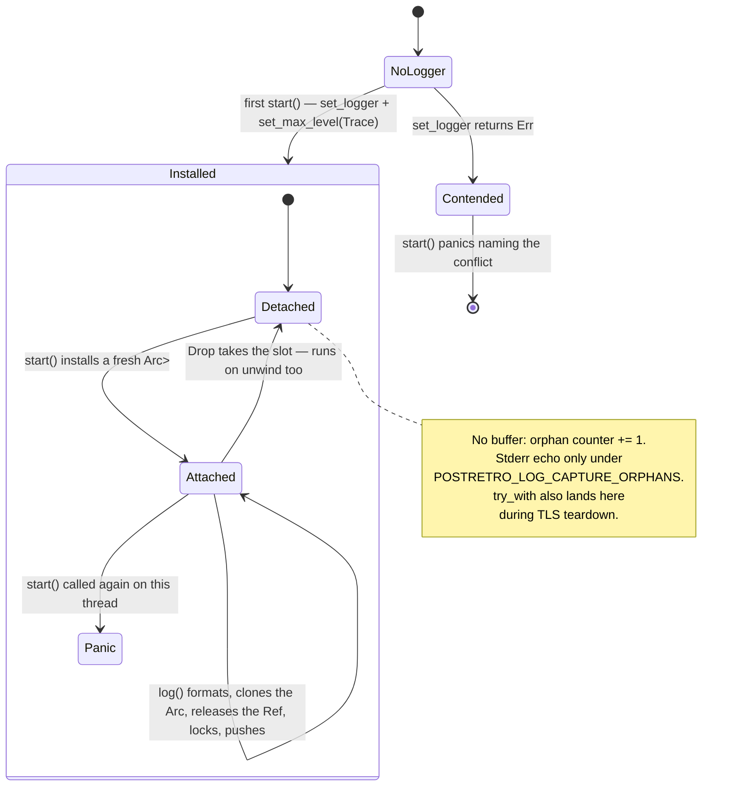

# Research — test log capture

Grounding for `index.md`. Decisions live in the spec; this is what produced them.

## Four ad-hoc loggers, not zero

Grep `set_logger|set_boxed_logger|env_logger::` — `set_logger` alone misses
`level-compiler`'s `set_boxed_logger`. Seven install sites, four of them test-only:

| File | Shape | Race handling |
|---|---|---|
| `ui/src/theme_gate_test.rs` | `CountingLogger` + `WARN_COUNT` + `WARN_TEST_LOCK` | Probe, then `eprintln!` and pass |
| `ui/src/tree/tests/local_state.rs` | Same shape, **own private** `WARN_COUNT` | Same |
| `postretro/src/scripting/reactions/log_capture.rs` | Thread-local `Vec<(Level, String)>`, `set_max_level(Trace)`, closure API | Swallows `Err`; `capture()` returns empty |
| `renderer/src/lighting/lightmap.rs` (`#[cfg(test)]`) | Thread-local, `OnceLock<bool>` recording the `set_logger` result | Returns `None`; caller `eprintln!`s and passes |

The three production installers stay: `env_logger::init` (`postretro/src/main.rs`),
`env_logger::try_init` (`postretro/src/bin/gen_script_types.rs`), and `set_boxed_logger`
in `level-compiler`'s `logger::install`, called only from its `main.rs`.

The `postretro` test logger is a single-crate prototype of this plan: thread-local buffer,
`Trace` max level, closure scoping. It drops `target` and is `pub(crate)`. The `renderer`
one already records the `set_logger` result in a `OnceLock<bool>` — the mechanism Task 1
describes as new.

## The live defect is one test, and it is not the one first suspected

`CARGO_PROFILE_TEST_SPLIT_DEBUGINFO=off cargo test -p postretro-ui --lib -- --nocapture`
— 237 pass, and one skip line prints on every run:

```
[local_state_tests] skipping warn-count assertion: another logger was installed before ours
```

`theme_gate_test`'s logger wins the race every run; `local_state`'s loses every run. They
are not interchangeable — each owns a private `WARN_COUNT` static, so the loser's probe
increments the winner's counter and its own stays zero.

So `local_bind_with_no_enclosing_scope_degrades_to_literal_and_warns_at_build` — a test
named for a warn — has **both** warn assertions dead: the exactly-one-warn check and the
hot-path-stays-log-free check. It reports `ok` on its fallback-text assertion alone.

The three `theme_gate_test` cases do assert today. Their skip arms are latent, and any
third logger in that binary — including this harness, mid-migration — turns them off.
That is why Task 2 converts both files or neither.

## Why `CapturedRecord` cannot be shared

`crates/level-compiler/src/lib.rs` exports `bc5` and `texture_mips` only; `logger` is
`pub mod logger;` in `main.rs`. Not library surface, so "it is a binary crate" is the
wrong reason — `xtask` takes a normal dependency on the lib. Layering is the second
reason and it holds: `crate-graph.md` puts `net` below `level-compiler`.

`development_guide.md` §Workspace's table types the crate as "binary", which is where the
wrong reason came from. Fix at promotion.

## Task 4's three sites

Each already has behavioral coverage. The log record is what is unasserted.

| Crate | Site | What the log adds |
|---|---|---|
| `net` | `process_control_messages` (`transport.rs`) — `info` accept, `warn` reject | `loopback_matching_version_is_accepted` and `loopback_diverged_app_version_is_rejected_with_typed_reason` assert the `HandshakeOutcome`; the operator-facing diagnostic never has been. `renet` is polled, not threaded, so both records land on the test thread |
| `scripting-core` | `write_script_store_slot`, `write_state_slot_json`, `apply_text_edit` (`store_bridge.rs`) | All three return `Ok(())`. The slot value discriminates refusal from a differing write; only the log says which of the three refused. `write_store_slot` labels errors `storeWrite` too but has no readonly guard — not a target |
| `postretro` | `materialize_net_mesh_presentation` (`scripting/builtins/net_descriptor.rs`) — `warn` unregistered class, `debug` meshless | Both return `false`; level and body are the only discriminator. `remote_enemy_presentation_unknown_class_leaves_transform_only` covers the first branch's return value. The meshless branch has no test at all |

Fixture feasibility, checked: `ScriptCtx::new()` (`crates/entities/src/ctx.rs`) is a plain
`Rc<RefCell<_>>` struct — no rquickjs or mlua runtime needed — and `SlotSchema` with
`readonly: true` is directly constructible. Each readonly guard runs before value
conversion, so no valid payload is required.

## `log` 0.4.29 semantics

Pinned in `Cargo.lock`; read from the registry source.

- Runtime max level defaults to `Off` (`AtomicUsize::new(0)`, and `LevelFilter::Off` is
  discriminant 0). Without `set_max_level` the macros short-circuit and capture nothing.
- `set_logger` is one-shot via `compare_exchange`; the loser gets `Err`. A `static`
  zero-sized impl satisfies the `&'static` bound with no `unsafe`.
- `set_max_level` is a relaxed store to a process-global — genuinely process-wide.
- `Level` and `LevelFilter` are distinct types with derived `PartialEq`, so exact-level
  matching is enforceable.
- `record.args()` returns `&Arguments`, so formatting before touching the thread-local is
  possible — the re-entrancy warrant holds.
- No `max_level_*` or `release_max_level_*` feature is enabled anywhere in the workspace,
  so `STATIC_MAX_LEVEL` is `Trace` under `cargo test` and `debug`/`trace` capture is
  reachable.

## Cross-thread logging

`run_worker`, called from the `thread::spawn` closure in `spawn_level_worker`
(`crates/postretro/src/startup/worker.rs`), emits `[Loader]` info and warn off-thread. A
thread-local buffer cannot see them — hence orphan counting, and the `Arc<Mutex<_>>` slot
that keeps a `Send` handle additive.

`crates/scripting-core/src/staged_manifest.rs` also spawns a worker but contains zero
`log::` calls; it returns `StagedManifestDiagnostic` over `mpsc`. Not a hazard for E15's
hot-reload criteria, whose commit-and-warn site runs on the polling thread.

libtest capture routing, which is why the stderr echo is opt-in
(`POSTRETRO_LOG_CAPTURE_ORPHANS`) rather than unconditional: output capture is per test
thread, so with the echo on, same-thread orphans are captured and attributed to whichever
test owns that thread, while cross-thread orphans bypass capture and always print. Neither
is useful by default in a binary like `postretro-ui`, where 237 tests run and several
emit `[UI]` warns deliberately. The counter is unconditional regardless.

## Workspace-member side effects

`crate_graph.rs` reduces `cargo metadata --no-deps` to normal (non-dev, non-build) edges
in `collect_graph`. A dev-only member adds a node with no edges:

- `layering_invariants_hold` asserts only on `postretro` dependents, `foundation`
  dependencies, and `entities` dependencies. Unaffected.
- `layers` ranks every entry of `graph.crates`, so a zero-edge member lands at rank 0 and
  `render_doc` emits it under `Layer 0 (leaves)`. `check_committed_doc` then returns 1.
  Regeneration is mandatory in the same commit.
- `dependents_ranking` omits crates with no dependents, so the chokepoint section is
  untouched.

## E15's log-keyed criteria

| AC | Demand |
|---|---|
| AC-GATE-5 | Version skew "appears in a host-side log and nowhere else" — `info`, both versions |
| AC-MANIFEST-2 | Staged reload changing mod id/version "warns and leaves the installed value unchanged" |
| AC-LEVEL-7 | Absent catalog id "logs a diagnostic naming the id" |
| AC-DIGEST-3 | Transform-only degradation, logged at the `net_descriptor` site above |

Plus the wire-decode failure path, the absent-half degradation, and the boot-load
early-return warning. `development_guide.md` §6.1 makes the `[Subsystem]` body prefix a
rule, which is why body substring is the primary key and target the secondary filter.

## `testing_logger`

crates.io: latest 0.1.1, published 2018-08-07, ~3.9M downloads,
`github.com/brucechapman/rust_testing_logger`. Same thread-local shape. No exactly-once
helper, and no signal when it loses the `set_logger` race. Not in `Cargo.lock`, so this
metadata came from crates.io rather than the repo.

## Guard lifecycle



`start()` clears by installing a fresh buffer; `Drop` clears by taking it. No drain call,
and identical behavior under a panicking test.
