# E10 — Enemy Aggro Model: research notes

Investigation behind `index.md`. Decisions live there; this is the evidence.

Seed: `context/research/enemy-aggro-model.md` (findings A/B/C from the
E10 behavior-state-graph review panel). Predecessor:
`context/plans/in-progress/E10--behavior-state-graph/index.md`.

All identifiers below were read from source, not memory. Line numbers are as of
this drafting session and rot — they are here to speed the implementer up, not
as contract.

---

## 1. The floor as it stands

| Surface | Where | Shape (verified) |
|---|---|---|
| Target candidacy | `crates/postretro/src/scripting/systems/ai/targeting.rs:27` | `target_candidate(registry, entity, from, visible)` — requires `PlayerMovementComponent` + `Transform`. Never reads `HealthComponent`. |
| Ranking | same file, `nearest_target_candidate:46` | `min_by` on XZ distance over `iter_with_kind(ComponentKind::PlayerMovement)`, with an `exclude` id. |
| Selection | same file, `select_target:97` | `(registry, from, retained_target, retained_outside_leash, visible)`. Prefers the retained pawn unless another is `is_meaningfully_closer`. **No range limit anywhere.** |
| Aliveness | same file, `selected_target_alive:76` | `HealthComponent.current > 0.0 && is_finite()`; `false` when the component is absent. Called only at the attack gate. |
| Stride | `engine_floor.rs:35` | `think_stride_for_distance` — bands at 12 m / 30 m, divisors 1 / 4 / 12. |
| Hysteresis | `engine_floor.rs:26` | `TARGET_SWITCH_HYSTERESIS_DISTANCE = 1.0`. |
| Retention leash | `crates/entities/src/components/brain.rs:80` | `BrainComponent::leash_range: Option<f32>`. `Some` from legacy `ai` (`from_descriptor:125`), `None` from an authored graph (`from_graph:141`). |
| Leash application | `ai/mod.rs:444–468` | Applies to the **retained** candidate only; the replacement search on a leash-escape tick is filtered (`:462`), the ordinary fresh acquisition (`:437`, `:484`) is not. |
| Engagement test | `graph_eval.rs:99` `engages` | `steering_for(motion) == Chase \|\| action.is_some()`. Drives retention, facing, combat slots. |
| Engagement radius | `crates/foundation/src/data_descriptors/types/behavior.rs:266` | `engagement_radius()` → field → `attack.range` → `DEFAULT_ENGAGEMENT_RADIUS = 2.0` (`:256`). Sole consumer: `ai/mod.rs:943`, the `CombatQuery` spread radius. **Never read for acquisition, retention, or damage.** |
| Damage gate | `ai/mod.rs:607–621` | `distance <= attack.range` + action verb + cooldown + `selected_target_alive`. |
| Legacy validation | `crates/foundation/src/data_descriptors/types/combat.rs:301` | `AiDescriptor::validate` — each of `detectionRange`, `attackRange`, `leashRange`, `attackCooldownMs`, `moveSpeed`, `deathDespawnMs` finite and `> 0`; `attackDamage` finite and `>= 0`. **No ordering constraint between any pair.** |
| Lowering | `crates/foundation/src/data_descriptors/types/behavior_lowering.rs:69` | Emits `engagement_radius: None` on purpose (`:161–165`) so the graph resolves through `attack.range`. |

`BehaviorGraphDescriptor::validate` (`behavior.rs:290`) is structural only:
names resolve, no duplicates, non-empty states, self-edge rejection, guard bind
via `bind_brain_guard`, numeric bounds. It never inspects guard *semantics*.

---

## 2. Finding A — reproduced against current source

Legacy tuning `detectionRange: 18`, `leashRange: 8`, single pawn at 10 m.
`ai_tests.rs:828` uses exactly this pair.

```mermaid
stateDiagram-v2
    [*] --> idle
    idle --> alert: tick N — not engaged, so no retained target;\nfresh acquire is UNFILTERED (mod.rs:437);\nlowered guard le(dist,18) fires
    alert --> idle: tick N+1 — engaged, retained at 10 > leash 8\n(mod.rs:447) → excluded; replacement filtered\nby leash → no target; !hasTarget interrupt fires
    idle --> alert: tick N+2 ≡ tick N
```

The asymmetry is exactly one line wide: retention consults `leash_range`,
acquisition does not. `set_destination`/`clear_destination` thrash on alternate
ticks; the animation latch (`BrainComponent::locomotion_moving`) flickers once
velocity accumulates. Nothing rejects or warns at parse.

Two candidate fixes were weighed:

1. **Validator ordering rule only.** Cheap, but tests and Rust call sites build
   `AiDescriptor` literally and bypass `validate`, so the floor would still
   oscillate on struct-constructed data. Necessary, not sufficient.
2. **Make the leash bound acquisition too.** With well-ordered tuning
   (`leash >= detection`) this is a provable no-op: the lowered detection guard
   `le(dist, detection_range)` is strictly stricter, so no target the floor
   would newly reject could have caused a state change. With inverted tuning it
   collapses the oscillation to "stays idle". Authored graphs carry
   `leash_range: None` and are untouched.

Pinned: both. See `index.md`.

**Only observable change for well-ordered legacy tuning:** an `idle` brain no
longer sees a beyond-leash pawn's real distance in `@brain.targetDistance` — it
reads the `BRAIN_NO_TARGET_DISTANCE` sentinel instead. Every lowered `idle`
guard is `le`, which reads false either way, so no lowered edge changes. It is
observable only to a hand-authored graph that both sets a leash (impossible —
authored graphs have none) and reads `gt` from a resting state.

---

## 3. Finding B — reproduced, with one correction to the seed

Confirmed: `target_candidate` admits any `PlayerMovementComponent` + `Transform`
entity. Downed co-op pawns persist (their `HealthComponent.current` is `0.0`,
`death_handled` latched — `crates/entities/src/components/health.rs:315`).
Retention (`ai/mod.rs:430`) re-resolves the corpse every tick; the 1.0-unit
hysteresis means even an acquisition-due tick will not switch to a live pawn
standing within a metre of it. The attack gate blocks damage, so the enemy is
inert but locked on.

**Seed correction.** The research doc says the sim "already has an aliveness
notion for this — `alive_players` / `player_is_present_for_trigger_occupancy`".
It does not. `player_is_present_for_trigger_occupancy`
(`crates/postretro/src/sim/mod.rs:64`) is `registry.exists(player.pawn)` — pure
existence, no health read. The only real aliveness predicate in the AI floor is
`selected_target_alive`. So the fix is to reuse *that*, not to share a sim
helper.

Sub-decision — a pawn with no `HealthComponent` at all: today it is a valid
target that can never be attacked (`selected_target_alive` returns `false` on a
missing component). Pinning candidacy to the same predicate makes it simply not
a target, which is the consistent answer.

Test that flips: `selected_dead_target_suppresses_attack_even_when_other_pawn_is_alive`
(`ai_tests.rs:1283`) — the enemy will now select and damage the live pawn. The
gate still needs coverage, so it re-points to a fixture whose only pawn is dead.

`is_downed_for_recovery` (`crates/postretro/src/impact_effects.rs:129`) is not
relevant here: it gates AI evaluation of zero-HP *enemies* awaiting a pending
`SetHealth`, and is applied to the brain-bearing entity in pass 1, never to
target candidates.

---

## 4. Finding C — the deferred case, and why it stays deferred

The predecessor pinned, in its out-of-scope list, that an authored graph owns
both engagement and disengagement through its own guards; a `leashRange` on the
behavior block was considered and rejected as "a second spelling of
disengagement that silently outranks the guards." Nothing found here overturns
that:

- The floor's leash is a `BrainComponent` field, not a descriptor field, and is
  seeded only by lowering. Introducing an authored spelling would give two
  disengagement mechanisms with an undefined precedence.
- `engagement_radius` is spread-only and must stay so — `ai/mod.rs:939–943` is
  its single read, and the lowering's `None` is load-bearing for legacy parity.

So the gap is diagnostic, not mechanical. Both halves are computable from the
descriptor alone, with no runtime data:

- A graph with engaging states (`chaseTarget` motion, or any `action`) where no
  engaging state has an outgoing edge to a non-engaging state — a level-wide
  pursuer.
- A graph with engaging states and no interrupt whose guard reads
  `@brain.hasTarget` — the sentinel trap. `BRAIN_NO_TARGET_DISTANCE = 1.0e9`
  (`crates/foundation/src/brain.rs:59`) makes every `gt`/`ge` distance guard
  read **true** with no target, so a graph whose only exits are range guards
  walks the wrong states on target loss. The shipped reference enemy already
  documents this at length (`sdk/behaviors/reference/entities.ts`, the
  "stand-down interrupt is declared first of all" note) — the lint just makes
  the discipline enforceable instead of tribal.

Warning, not error: an intentionally relentless pursuer (a boss, a turret that
never lets go) is a legitimate authored design. The engine states the
consequence; the author decides.

---

## 5. Oversized-file watch

- `ai/mod.rs` — 1004 lines, past the ~800 smell. The plan deliberately puts the
  acquisition-range rule in `targeting.rs` (125 lines, its natural home) so
  `mod.rs` only gains an argument at existing call sites. No split task.
- `behavior.rs` — 824 lines. The lints go in a new sibling module rather than
  extending it.
- `ai_tests.rs` — very large, but tests; extended, not restructured.

---

## 6. Deliberately not pursued

Everything on the seed's "candidate dimensions" menu — stimulus-based
detection, threat prioritization, pack aggro, aggression profiles, memory and
search. Each waits for a real consumer. The `visible` predicate on
`select_target` remains the untouched perception seam.
