# Research — Enemy Behavior Descriptor Syntax

Investigation notes behind `index.md`. Not the spec: grounding, the lifecycle
diagram, and the design derivations that produced the decisions.

## Verified ground truth (re-checked against source this session)

Descriptor (`crates/foundation/src/data_descriptors/types/behavior.rs`, 904 lines;
**production ends at line 453**, the `mod tests` at 454 is ~450 lines):

- `MotionVerb { ChaseTarget, Hold, Freeze }` (:22), `ActionVerb { Attack }` (:49),
  `AttackParams { damage, range, cooldown_ms }` (:64), `TransitionDescriptor { to, when: IrNode }` (:87),
  `BehaviorStateDescriptor { animation, motion, action, transitions, on_enter }` (:96),
  `BehaviorGraphDescriptor { initial, states, interrupts, candidate_filter, attack, engagement_radius, move_speed }` (:140).
- `MotionVerb::ALL` (:38) is hand-written and guarded by a successor-chain exhaustiveness
  test `motion_verb_all_is_exhaustive` (:473): a new variant fails the test until added to
  `ALL` and to the `next()` chain. `steering_for` (`graph_eval.rs:120`) is an exhaustive
  `match` over `MotionVerb` — a new variant is a compile error there until mapped.
- Validation `BehaviorGraphDescriptor::validate` (:297). `engagement_radius()` accessor (:271):
  field → `attack.range` → `DEFAULT_ENGAGEMENT_RADIUS` (2.0, :263). Attack action requires the
  `attack` block (:343). Self-targeting state-local transition rejected (:411); self-targeting
  interrupt accepted.

IR (`crates/foundation/src/ir/mod.rs`): 15 opcodes, no `and`/`or`/`not`; `IrType { Number, Bool }`
(:45). `IrValue` untagged (:59). Negation is `select(c, false, true)`.

Brain facts (`crates/foundation/src/brain.rs`): `BRAIN_INPUTS` (:82) is a **10-entry, append-only**
`[(&str, IrType); 10]`. `BRAIN_NO_TARGET_DISTANCE = 1.0e9` (:72) — the one target-side fact that
does not read its type-zero untargeted; its `gt`/`ge` asymmetry is load-bearing. `resolve_brain_input`
(:112) routes `@state.` → `BrainInputRef::State`, table names → `Fixed { index, ir_type }`.
`BrainValidationScope` (:134) resolves via the table, so a new `BRAIN_INPUTS` entry is picked up by
validation automatically. `@brain.targetHealth/targetMaxHealth/targetDied` are indices
7/8/9, so the table holds 10 entries (0-9); **new facts append at indices 10, 11, 12.**

Candidate facts (`crates/foundation/src/candidate.rs`): `CANDIDATE_INPUTS` (:22), 4 entries, no
`@state.*`. Left unchanged by this spec — the faction hook is engine-floor candidacy, not an
authored `@candidate.*` fact.

Runtime scope (`crates/postretro/src/scripting/systems/ai/brain_scope.rs`, ~198 prod lines):
`BrainScope.fixed: [IrValue; BRAIN_INPUTS.len()]` (:70) — **the array length is tied to the table
length**, so growing `BRAIN_INPUTS` grows this array, and `refresh` (:105) writes a 10-element array
literal (:119-134) that must gain the two new slots in the same edit or the crate will not compile.
`BrainFacts` (:32) is the plumbing struct the tick fills; new facts computed outside health/registry
(anchor distance, reachability) get new `BrainFacts` fields. `brain_scope_resolution_matches_the_validation_scope`
(:304) and `refresh_projects_engine_facts...` (:388, driven off `BRAIN_INPUTS` with a no-`_`-arm
`expected_fixed_value`) both fail until the new facts are wired end to end.

Engine floor (`crates/postretro/src/scripting/systems/ai/`):
- `targeting.rs:57` `nearest_target_candidate` iterates `ComponentKind::PlayerMovement`; `target_candidate`
  (:30) is the per-entity gate both the fresh scan and the retained lookup call (`select_target` :121
  calls it at :130 for the retained target and inside `nearest_target_candidate` for fresh). §7c
  evaluates candidacy only against fresh offered candidates, so the hostility filter belongs in
  `nearest_target_candidate` (the fresh scan), not in the shared `target_candidate` gate — placing it
  in `target_candidate` would re-gate the retained lookup too. `target_candidate` keeps its existing
  visibility/`PlayerMovement`/transform checks unchanged; retention drop is authored via
  `@brain.targetHostile` instead.
- `engine_floor.rs`: `SteeringIntent { Chase, Clear, Hold }` (:44) is Copy and data-less;
  `think_stride_for_distance` (:28); `is_meaningfully_closer` (:66). Position-goal motion needs a
  destination, so `SteeringIntent` gains a data-carrying `MoveTo(Vec3)` variant.
- `graph_eval.rs`: `steering_for(motion)` (:120) pure; `engages` (:99) = `steering_for == Chase || action.is_some()`;
  `is_locomotion_state` (:137) = `ChaseTarget && action.is_none()`; `locomotion_animation` (:156) picks
  the first locomotion state by `BTreeMap` order (documented v1 collapse for multi-locomotion graphs).
- `ai/mod.rs` (982 prod lines, tests external in `ai_tests.rs`): compute pass :418-628 (target selection
  :422-479, steering resolution :501-567, attack :589-603), apply pass :635-868 (steering :666-722,
  facing :744-770 gated on `outcome.engaged`), `resolve_combat_slots` :873-963. Facing/yaw helpers
  :137-206. Aggro gate :501-508.

Entities (`crates/entities/src/components/brain.rs`): `BrainComponent` (:34) is serde + `PartialEq`;
`from_graph` (:105) seeds it (no transform available there). New sim-state fields (`home_anchor`,
patrol cursor, `target_reachable`) go here with serde defaults. `EntityStateComponent` (`entity_state.rs`)
`get(&str)->f32` (absent→0.0) and `set`; `registry.entity_state_mut(id)` auto-exists at spawn
("spawn seeds entity state", brain_scope test :269). This is the E16 keystone the faction field rides.

Spawn site (`crates/postretro/src/scripting/builtins/data_archetype.rs:576-602`): `attach_brain_graph`
(:577) then a read-modify-write block (:582-590) already sets `aggro_armed` from the map KVP. The
`home_anchor` seed (from the entity `Transform`) and the enemy default-faction seed fold into that
same block — the plumbing already reads the brain and the registry there.

Nav (`crates/postretro/src/nav/`): `find_path(graph, start, goal) -> Option<NavPath>`
(`path.rs:89`, `pub(crate)`) is the reachability oracle; `None` when the goal region is unreachable
(`find_path_returns_none_when_goal_region_unreachable`, :951). `nav_graph` is already threaded into
`run_ai_tick_with_navigation_and_impact`. `region_at` (:193) exists but is a broad-phase footprint
test, not clearance-safe pathability — it would read "reachable" through a wall the funnel cannot
thread, so it is the wrong oracle for a barrier fact.

SDK (`sdk/lib/brain.ts`): frozen `brain` object of pre-wrapped `runtime.read("@brain.*")` leaves,
one per `BRAIN_INPUTS` entry, with a stated **SYNC OBLIGATION** to the table and a drift test in
`crates/scripting-core/src/data_descriptors/tests/behavior.rs`. `brain.luau` carries the same set.
Two new facts append two leaves in both files. Reference graph: `sdk/behaviors/reference/entities.ts`
`referenceEnemyEntity` (three-state idle/alert/attack + three stand-down interrupts + candidateFilter).

## Why the nav-draft dependency is real (targetReachable)

The barrier/unreachable behaviors read `@brain.targetReachable`, computed from `find_path(enemy,
target).is_some()`. `E10--pursuit-wraparound-blocked` documents that `find_path` returns a **false
`None`** for a genuinely-threadable wraparound around a freestanding wall (a repair-vocabulary
failure in `ensure_endpoint_clearance`, not an unreachable goal). If the reachability fact ships on
top of that bug, a target reachable by wrapping a wall reads *unreachable* every time the player
rounds it, and any authored "unreachable → retreat/hold" edge fires spuriously at every corner —
the fact becomes a bug generator. So expressing these behaviors *correctly* requires the nav floor
to stop returning false negatives first. `E10--mandatory-vertex-wedge-escapes` is the softer
sibling: it keeps a chase-to-nearest-reachable *hold* from jittering at the barrier vertex. Hence
Task 5 (and the reference reachability demo) sequence after the wraparound fix.

## Faction hook — the fresh-scan / retention split, why minimal, and the default seeding

The full relationship model (named alliances, neutrality, per-pair diplomacy, a declaration surface
for initial faction) is a research→spec pass of its own. The minimal hook keeps candidacy's iteration
set exactly as today (`ComponentKind::PlayerMovement`) and adds only an O(1) hostility test per fresh
candidate, so perf and default behavior are unchanged.

The mechanism splits along `entity_model.md` §7c: the candidacy predicate is evaluated once per
offered candidate on a ranking scan, never against the target already retained — dropping a retained
target is what guards are for. So hostility filters *acquisition* in `nearest_target_candidate` (the
fresh ranking scan) only; the retained lookup (`select_target`'s :130 `target_candidate` call) applies
no faction test. The fresh-scan filter is necessary under nearest-target selection — without it a
nearer friendly pawn masks a hostile one behind it. *Retention* drop is authored: `@brain.targetHostile`
(Bool, index 11) reports whether the selected target is hostile (`false` untargeted), and the reference
enemy stands down on `select(targetHostile, false, true)` — the exact analog of the shipped
`targetDied` stand-down interrupt, which already handles the "retained target went invalid" case as
graph policy rather than an engine re-gate.

Hostility rule: `faction(enemy) != faction(candidate)`, faction read from `@state.faction`
(absent → 0.0). Players read 0 (their `@state` has no `faction` key); enemies are seeded `1.0` at
spawn, so enemy(1)≠player(0) → hostile, preserving today exactly. Enemy-vs-enemy infighting
(broadening the targetable-kind set to include `Brain`) is the value the full model adds and is where
the O(N²) candidacy cost and its spatial broad-phase belong — deferred. Faction is mutated through the
**existing E16 `@state` write path** (`setState` / impact policy / `registry.entity_state_mut`); this
spec adds no new mutation surface — only the engine-floor *read* and the retention fact.

## Lifecycle — retreat/patrol/reachability across one tick

```mermaid
stateDiagram-v2
    [*] --> idle : spawn (home_anchor := transform.position, faction := 1)
    idle --> alert : le(targetDistance, detection) && acquisitionDue
    alert --> attack : le(targetDistance, attackRange)
    attack --> alert : gt(targetDistance, attackRange)
    alert --> retreat : gt(distanceFromAnchor, leash)
    attack --> retreat : gt(distanceFromAnchor, leash)
    retreat --> idle : le(distanceFromAnchor, arrivalEps)
    retreat --> alert : le(targetDistance, reengage)
    alert --> waiting : select(targetReachable, false, true)
    waiting --> alert : targetReachable
    idle --> patrol : select(hasTarget,false,true) && le(distanceFromAnchor, patrolRadius)
    patrol --> alert : le(targetDistance, detection) && acquisitionDue
    note right of retreat
      motion: moveToAnchor
      goal = home_anchor; arrived -> Clear
    end note
    note right of patrol
      motion: patrol
      goal = anchor + points[cursor];
      arrived -> advance cursor (loop / pingPong)
    end note
    note right of waiting
      motion: hold; enemy has already
      been steered to the nearest reachable
      point by chaseTarget's find_path degradation
    end note
    note right of idle
      any-state interrupts stand the enemy down:
      not hasTarget, targetDied, not targetHostile
      (targetHostile retention drop is authored,
      not an engine re-gate)
    end note
```



## Fact refresh + steering ordering across the tick passes

```mermaid
sequenceDiagram
    participant Sel as target selection
    participant Fact as BrainScope.refresh
    participant Eval as select_transition
    participant Steer as steering resolution
    participant Apply as apply pass
    Sel->>Sel: hostility-filtered fresh candidacy scan (faction @state); retained lookup ungated
    Sel->>Sel: targetHostile = faction(enemy) != faction(selected) (false untargeted)
    Sel->>Sel: reachability probe on acquisition-due tick -> cache brain.target_reachable
    Fact->>Fact: fixed[10]=distanceFromAnchor (every tick), fixed[11]=targetHostile, fixed[12]=targetReachable (cached)
    Eval->>Eval: interrupts then transitions, first-true-wins
    Steer->>Steer: motion -> SteeringIntent (MoveToAnchor/Patrol compute goal, advance cursor)
    Apply->>Apply: Chase->slot/target, MoveTo(goal)->set_destination, Clear/Hold as today
    Apply->>Apply: facing: engaged OR position-goal-moving -> face velocity/goal
```

## Design decisions not carried into the spec body

- **Anchor = spawn transform, no descriptor/map field.** A placement already *is* a position, so
  "author the home" is "place the entity." Forecloses a runtime-movable home (an enemy cannot
  re-home itself); accepted, noted in the spec's Open questions.
- **Patrol is deterministic ordered points, not wander.** Random-area wander needs the seeded-RNG
  story `E10--enemy-stagger` also defers; ordered anchor-relative points keep sim determinism and
  replay-exactness with no RNG. Points are anchor-relative so one descriptor patrols correctly
  wherever the archetype is mapped.
- **Reachability oracle = `find_path`, not region connectivity.** Connectivity reads "reachable"
  through an unthreadable clearance pinch; `find_path` is the clearance-safe truth and is what makes
  the nav-draft dependency real.
- **`attacks` map grammar is recommended, not shipped here.** Shipping the map would absorb
  `E10--enemy-multi-attack` Tasks 1-2. This spec surfaces the canonical spelling as a
  coordination recommendation for the owner to record in the multi-attack ship vehicle (or a
  shared context doc); it does not assert the grammar onto that draft from here. The reference
  enemy keeps its singular `attack` block until multi-attack lands the map.
</content>
</invoke>
