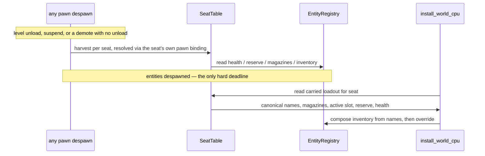

# Research — Seat, Session Identity, and Roster

Derivation notes for the spec. Decisions live in `index.md`; this file holds the investigation.

## Seat lifecycle

```mermaid
stateDiagram-v2
    [*] --> Unminted
    Unminted --> Bound: slot first admitted<br/>(stashed claim recorded, or anonymous)
    Bound --> Bound: level change — demote to Admitted then re-promote<br/>(harvest on unload, seed on install)
    Bound --> Held: connection drops<br/>(harvest, mark disconnected)
    Held --> Bound: later admission, claim matches exactly<br/>(rebind client id, restore state)
    Held --> Released: hold deadline passes<br/>(drop from roster; number never reissued)
    Released --> [*]
```

The `Bound → Bound` self-edge is the invariant the design turns on. A level change drives a slot out of `Participating` and back in, and `networking.md:98` clears every per-slot value on any such exit. The seat must sit outside that sweep — which is why every edge above is admission or connection, never participation.

Hold-start keys to the transport's `ClientDisconnected` edge, not to `SlotEvent::Closed`. `SlotTable::transition` emits `Closed` only from `Participating` (`slots.rs:83-92`; the shipped test asserts `close` returns `None` right after a demote), and a level change demotes everyone to `Admitted`. Keying to the slot event would mean a drop during a level load — the likeliest moment to drop — starts no hold at all.

## Level-transition carry

An early draft placed the harvest inside `unload_level`, ahead of `clear_net_level_parity`, and called that placement non-negotiable. Two facts undid it.

The pawn dies on paths that never touch `unload_level`. `host_handle_lifecycle` despawns on a single `Closed | Demoted` arm, and demotes fire without any unload — `set_mod_digest` into `reevaluate_parity` on a mod reload, or `reevaluate_parity(Some(client_id))` when a live client's parity declaration stops matching. `App::suspended` calls `clear_net_level_parity` directly, bypassing `unload_level` entirely. A hook keyed to level unload misses all three and seeds stale values over a live session.

And the constraint that forced the placement was self-inflicted. It existed only because the harvest resolved pawns through `SlotPawns`, which `clear_net_level_parity` replaces wholesale (`netcode/mod.rs:949`). Giving the seat its own `pawn` binding removes the dependency. Canonical names come off `DescriptorProvenance` on the entity rather than the data registry, so `data_registry.clear()` does not bound it either.

What remains: harvest before the entity dies. That is one rule — hang it on pawn despawn — and it holds on every path.

## Observers

The same carried value is seen from three positions. The cross-product is not uniform, which is why the carry is not one hook.

| Vantage | Health | Ammo reserve | Magazines | Inventory + active slot |
|---|---|---|---|---|
| Single-player / host pawn | Component, harvested and seeded | Component on pawn | Component per weapon entity | `Inventory` on pawn |
| Host-owned remote slot pawn | Same as above | Same | Same | Same |
| Connected client's own pawn | **No component at all** — replicated slot only | Local shadow copy, never displayed | Local shadow copy, never displayed | Composed from tuning payload's canonical names |

The client column looks like a gap and is not. Two independent paths already close it, which is why Task 8 verifies rather than builds.

Composition: `WieldableTuningPayload.canonical_name` (`tuning_payload.rs:22`) is built from the host pawn's live inventory, and the client composes through `compose_wieldable_inventory_from_slots` from exactly those names (`net_descriptor.rs:207-213`). Seeding the host pawn before tuning is sent propagates composition.

Magazine and reserve: `AmmoSlotProjection::for_pawn` (`crates/postretro/src/netcode/state_slots.rs`) projects both into owner-private slots for the active weapon's ammo type, re-resolving the active wieldable from live `Inventory` on every ingest, so it follows a weapon switch. `host_replicate` ingests once per snapshot batch at 30 Hz. The HUD binds `player.ammo` and `player.ammoReserve` (`content/dev/scripts/hud.ts`) against `App::build_ui_slot_snapshot`, and on a client those records arrive via `ClientStateApply::apply_snapshot_state`. The HUD never reads a component.

So the client's local `AmmoReserve` and `magazine` are write-mostly and never displayed — `weapon_hud_values` (`scripting/systems/ui_proxy.rs`) computes them and the connected-client branch drops all but the weapon `EntityId`. Only the equipped weapon is ever shown, so the non-active ammo types that have no wire representation also have no consumer. Adding them to the tuning payload would ship values nothing reads, behind a payload rebuilt only on participation entry and mod-content install.

## Why the carried set needs a structured record

`SlotType` is `Number | Boolean | String | Enum | Array` (`slot_table.rs:20-27`), and `SlotValue::Array` is **`Vec<f32>`** (`slot_table.rs:15`) — floats only, no string arrays and no maps.

| Value | Shape | Slot-expressible |
|---|---|---|
| Current health | `f32` | yes — `Number` |
| Active slot | index | yes — `Number` |
| Magazines | per-inventory-slot `u32`, 10 slots | yes — `Array` of `f32` |
| Ammo reserve | `HashMap<String, u32>` (`ammo_reserve.rs:10`) | no — string-keyed map |
| Inventory composition | 10 canonical name strings | no — `Array` holds floats |

Two of five resist, and composition is the load-bearing one: without it the seat cannot rebuild a loadout, which is the carry's purpose. A structured per-seat record is therefore required no matter how much else moves into slots.

The seat still serves as the shared key. A per-seat *scalar* axis and a per-seat *record* coexist on one key without duplicating a store, because they hold disjoint values.

## Where each identity type lives

`net` depends only on renet, renet_netcode, bitcode, and log — postretro-free by contract (`development_guide.md:28`). `entities` depends only on `foundation`, enforced by `layering_invariants_hold` (`crates/xtask/src/crate_graph.rs:496`). There is therefore **no crate from which both `net` and `entities` can name a shared type**.

| Type | Home | Why |
|---|---|---|
| `Seat` | `foundation` | Must be nameable from `entities` when per-seat storage reaches the floor slot table, and from the binary now. Wire carries a bare `u16` |
| `SessionId`, `PlayerClaimId` | `net` | Cross the wire; nothing below the binary names them |
| `SeatTable`, `SeatSessionState` | binary `netcode/` | Hold engine types; `entities` is a compile chokepoint with six dependents that domain logic stays out of (`development_guide.md:39-41`) |

`NetworkId` is the precedent: a wire type in `net` whose allocator lives in the binary. `Seat` inverts it because the *type* must reach the floor while the *table* must not.

## Identity inventory, before this spec

| Concept | Type | Lifetime | Assertable by the player |
|---|---|---|---|
| Connection | bare `u64`, client-minted from wall-clock nanos (`NetEndpoint::from_role`, `NetRole::Connect` arm, `netcode/mod.rs`) | one connection | no — `NetClient` does not even retain it |
| Pawn | `EntityId` (`registry.rs:37`) | one level | no |
| Network entity | `NetworkId` (`wire.rs:32`) | one level (allocator map reset, counter monotonic) | no |
| Within-level player | `PlayerId::{Local(EntityId), Remote(u64)}` (`trigger_system.rs:22`) | one level | no |
| Session | — | — | — |

Nothing durable, nothing assertable. The two arms of `PlayerId` do not even share a lifetime: the remote arm wraps a client id that survives a level change, the local arm wraps an entity id that does not.

## Why the connect token rather than a control message

Every existing feature carries data over `ClientControlMessage`. Choosing the transport field is a deliberate divergence.

- The claim is available on the `ClientConnected` edge, before any app-level message, so seat minting needs no deferred state.
- It is structurally immutable for the connection's life. A control message could be re-sent, so "fixed for this connection" would have to be enforced rather than inherited — and `networking.md:87` warns that putting a mutable value in the admission stage converts a recoverable difference into an unrecoverable disconnect.
- It costs nothing: the field is fixed-width 256 bytes and rides the connect token, not per-tick traffic.

Cost of the divergence: two edits instead of one (the client must populate `user_data`, the host must read it), and the host must read on the connect edge because renet_netcode drops the netcode entry at teardown.

Verified: `ClientAuthentication::Unsecure` carries `user_data: Option<[u8; NETCODE_USER_DATA_BYTES]>` with `NETCODE_USER_DATA_BYTES = 256`; `Unsecure` still transmits it (unsecure means a zero private key, not an absent token); `renet_netcode`'s server exposes `user_data(client_id)`, and discards the value when translating to `renet::ServerEvent::ClientConnected` — so it must be read off the transport, not the event. Confirmed against published crate sources for `renet_netcode` 2.0.0 / `renetcode` 2.0.0; no cargo registry exists in this environment, so Task 1 re-confirms the signature at the compiler.

Non-obvious consequence: renetcode fills an absent `user_data` with **random bytes**, not zeros (`token.rs:193-196`). Absence is therefore undetectable without a magic marker, which is why the envelope has one.

## Closed slots stay terminal

An early draft had reclaim relaxing closed-slot terminality. It does not need to, and the reasoning is worth keeping because the assumption is easy to re-derive wrongly.

`SlotState::Closed` is terminal via two independent mechanisms — an early return in `transition` for any slot already closed (`slots.rs:69-72`), and `entry().or_insert()` in `on_connect` (`slots.rs:59`) that refuses to reset a closed id to pending. `SlotTable` has no `remove`, `clear`, or `retain`, so the map grows for the endpoint's lifetime. `transition` also plants a permanent `Closed` tombstone for ids that were **never connected**, deliberately, so stale packets are refused (`slots.rs:79-82`).

None of it obstructs reclaim. Client ids are minted per connection from wall-clock nanos at exactly one site (`NetEndpoint::from_role`, `NetRole::Connect` arm), so a rejoining peer always arrives on an id `SlotTable` has never seen. `on_connect` inserts it as `Pending` by the ordinary path; the closed entry for the old id is never consulted; the tombstone population is never approached. Reclaim is entirely a binary-layer operation keyed by player id and seat.

Two consequences. The spec loses its only genuine one-way door. And `SlotTable`'s unbounded growth is a pre-existing condition this spec neither causes nor fixes — bounding it would mean evicting tombstones, which is precisely what reopens the stale-packet hole, so it belongs to whoever owns that map.

## Split-before-extend: production versus test lines

Raw line counts overstate the problem. Production halves:

| File | Total | Production | Extended here |
|---|---|---|---|
| `netcode/mod.rs` | 5,985 | 3,203 | yes — endpoint region |
| `startup/lifecycle.rs` | 4,407 | ~1,934 | yes — unload and install |
| `wire.rs` | 2,959 | 1,335 | yes — control region only |
| `data_archetype.rs` | 3,035 | **1,013** | yes — composition block only |
| `state_slots.rs` | 2,449 | ~1,000 | no |
| `transport.rs` | 1,801 | 1,021 | marginally — one arm |

`data_archetype.rs` carries 2,020 lines of tests on 1,013 of production. Splitting it wholesale would move tests, not reduce risk, so the spec extracts only the composition block. `state_slots.rs` and `transport.rs` are left alone: the spec's edits there are small and localized.

## Findings that did not drive decisions

- `collect_server_events` can call `transport.user_data(client_id)` inside its event loop without a borrow conflict. The body already calls `self.close_slot(...)`, which takes `&mut self`, proving the `while let` scrutinee holds no live borrow of `self.server`. No restructure needed.
- `SlotTable::is_accepted` and `accepted_clients` are `#[deprecated]` in favor of the participating spelling.
- On generation overflow, `despawn` retires a registry slot permanently rather than bumping it (`registry.rs:938-943`), so `EntityId` uniqueness holds either way. The conclusion that no entity id survives an unload is sound under both branches.
- `HealthComponent.pending_kill_credit` and `contributor_ledger` are already `#[serde(skip)]` and documented transient, which independently supports excluding them from the carry.
- `WeaponComponent` has no canonical-name field; durable weapon identity comes from `DescriptorProvenance.canonical_name` (`data_archetype.rs:705-713`), which the tuning payload already relies on.
- The shipped plan directories for this epic use two prefixes: `M15--p0…` through `M15--p35…`, then `E15--session-lifecycle`. This draft follows the newer `E15--` form.
