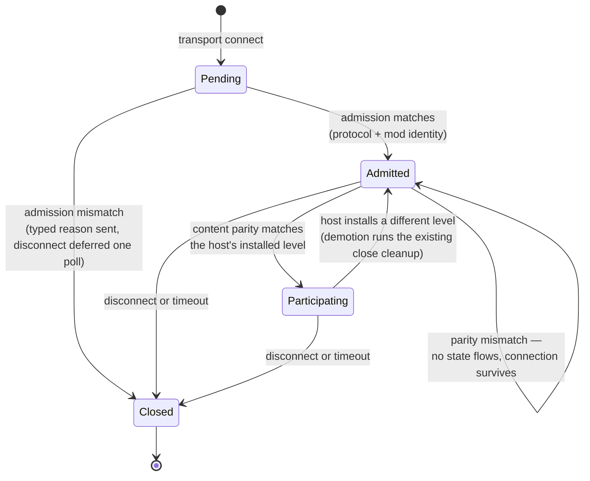

# Research — Session Admission

Findings behind the spec's decisions. Not a second spec; nothing here is a task.

## Code grounding

| Claim | Source |
|---|---|
| The app gate early-returns until a fingerprint is installed, so every handshake queues until a level installs — the ordering inversion this spec fixes | `crates/net/src/transport.rs` — `process_control_messages` |
| A fingerprint change closes every slot and retains the close for the next poll; the client half disconnects itself | `crates/net/src/transport.rs` — `NetServer::set_kinematic_static_fingerprint`, `NetClient::set_kinematic_static_fingerprint` |
| The client sends its handshake exactly once, gated on a fingerprint being present | `crates/net/src/transport.rs` — `NetClient::update`, `handshake_sent` |
| Slot states are `Pending`/`Accepted`/`Closed`; `Closed` is terminal and only an `Accepted → Closed` transition emits an event | `crates/net/src/slots.rs` — `SlotState`, `SlotTable::on_close` |
| Entity state is gated on accepted slots at the send call, not at the caller | `crates/net/src/transport.rs` — `send_snapshot`, `accepted_clients` |
| An app-level reject closes the slot as `Timeout` and disconnects in the same call, so no reliable message can reach the peer first | `crates/net/src/transport.rs` — `NetServer::reject` |
| The handshake carries exactly three fields and is `Copy` | `crates/net/src/wire.rs` — `ProtocolVersion` |
| Both protocol constants are hand-bumped and packed into the transport gate | `crates/net/src/transport.rs` — `PROTOCOL_ID`, `WIRE_VERSION`, `transport_protocol_id` |
| The fingerprint hashes the mover list, mover collision vertices/indices, and waypoints — nothing identifying the level | `crates/postretro/src/runtime_movers.rs` — `kinematic_static_fingerprint` |
| The level's own identity is resolved one line before the fingerprint is computed, on the same `&mut self` | `crates/postretro/src/startup/lifecycle.rs` — `retain_active_level_tags_for_install` sets `active_level_source`, then `install_level_payload` computes the fingerprint |
| The manifest requires `name` and carries no id or version; four parse sites read it (two runtimes × initial/staged) | `crates/scripting-core/src/runtime/mod_init_exec.rs`, `crates/scripting-core/src/staged_manifest.rs` |
| The net endpoint is built during `Session::build`, and mod init runs after — so mod identity cannot be a construction argument | `context/lib/boot_sequence.md` §1 |
| Persistence overlays declared defaults only on the first successful commit — the precedent for first-commit-wins identity | `context/lib/boot_sequence.md` §1 |
| The accept lane spawns the slot pawn; `lifecycle` carries closes only | `crates/postretro/src/main.rs` — the `HandshakeOutcome` match, `host_handle_lifecycle` |

## Slot lifecycle

The change in one picture. Today's `Accepted` splits into two states, and a level
change becomes a demotion rather than a close — which is what lets a connection
outlive the map it joined on.

Two properties fall out and become acceptance criteria: no entity state reaches a
slot below `Participating`, and a demotion runs the same per-slot cleanup a close
runs today — the pawn despawn plus replication, ownership, command, state-slot, and
combat clearing — because level unload invalidates every id those tables hold.

## Why the fingerprint's domain widens here

Per-level revalidation is the mechanism this spec ships, and it is worthless against
a hash that cannot discriminate. The fingerprint covers mover authoring and
collision only, so two maps with no movers hash identically: the gate passes, no
cleanup runs, and clients stay attached to a host where their pawns no longer exist.
Bound once per connection that was a latent bug; evaluated at every level install it
becomes the spec's central invariant failing silently.

The fix is the smallest one that discriminates: fold the level's own identity into
the hash domain. Hashing the `.prl` bytes instead was considered and rejected — it
would be strictly stronger, and it would also make a cross-platform bake difference
a hard connection failure, which is a bake-determinism question this spec has no
standing to answer.

## Rejected while drafting

- **Telling the client it was admitted.** A server→client "you are admitted, load
  map X" message is the obvious next thing and it is `E15 Phase 3.75` spec 2's
  relevel message. Adding a weaker version here would be redesigned immediately.
  Admission is observable as its consequence: the connection stays open.
- **Semver ranges on the mod version.** Invites a compatibility policy with no way
  to test it. Exact string match; the author bumps the version when the contract
  changes.
- **A content hash over the mod.** Breaks hot reload mid-session and buys tamper
  detection, an explicit non-goal (`index.md` §4).
- **Reusing `ProtocolVersion` with the mod fields appended.** It is `Copy` and the
  mod id is a string. More importantly the two stages fire at different times, so
  one message would re-create the ordering inversion the spec exists to remove.
