# Research — Session Lifecycle

Findings behind the spec's decisions, including why its scope changed once.

## Code grounding

| Claim | Source |
|---|---|
| The app gate early-returns until a fingerprint is installed, so every handshake queues until a level installs — the ordering inversion this spec fixes | `crates/net/src/transport.rs` — `process_control_messages` |
| A fingerprint change closes every slot and retains the close for the next poll; the client half disconnects itself | `crates/net/src/transport.rs` — `NetServer::set_kinematic_static_fingerprint`, `NetClient::set_kinematic_static_fingerprint` |
| The client sends its handshake exactly once, gated on a fingerprint being present, and never re-arms | `crates/net/src/transport.rs` — `NetClient::update`, `handshake_sent` |
| Slot states are `Pending`/`Accepted`/`Closed`; `Closed` is terminal and only an `Accepted → Closed` transition emits an event | `crates/net/src/slots.rs` — `SlotState`, `SlotTable::on_close` |
| Entity state is gated on accepted slots at the send call | `crates/net/src/transport.rs` — `send_snapshot`, `accepted_clients` |
| An app-level reject closes the slot and disconnects in the same call, so no reliable message can reach the peer first | `crates/net/src/transport.rs` — `NetServer::reject` |
| The handshake carries three fields and is `Copy` | `crates/net/src/wire.rs` — `ProtocolVersion` |
| Both protocol constants are hand-bumped and packed into the transport gate | `crates/net/src/transport.rs` — `PROTOCOL_ID`, `WIRE_VERSION`, `transport_protocol_id` |
| The server→client envelope carries time-sync and shot verdicts only — there is no relevel vocabulary | `crates/net/src/wire.rs` — `ServerMessage` |
| The fingerprint hashes the mover list, mover collision vertices/indices, and waypoints — nothing identifying the level | `crates/postretro/src/runtime_movers.rs` — `kinematic_static_fingerprint` |
| The level's own identity is resolved one line before the fingerprint is computed, on the same `&mut self` | `crates/postretro/src/startup/lifecycle.rs` — `retain_active_level_tags_for_install` sets `active_level_source`, then `install_level_payload` computes the fingerprint |
| A catalog load resolves against the engine-global map registry, which survives level unload — so one string is enough to name a map on both peers | `context/lib/boot_sequence.md` §4, §6 |
| The level-scoped client reset early-returns for the host role, so no host-side table is cleared on unload | `crates/postretro/src/netcode/mod.rs` — `reset_level_scoped_client_state` |
| The net endpoint is advanced only from the Running gameplay block; the loading frame polls the level worker and paints the splash | `crates/postretro/src/main.rs` (snapshot-apply stage), `crates/postretro/src/startup/lifecycle.rs` (loading frame) |
| The manifest requires `name` and carries no id or version; four parse sites read it (two runtimes × initial/staged) | `crates/scripting-core/src/runtime/mod_init_exec.rs`, `crates/scripting-core/src/staged_manifest.rs` |
| The net endpoint is built during `Session::build`, and mod init runs after — so mod identity cannot be a construction argument | `context/lib/boot_sequence.md` §1 |
| The accept lane spawns the slot pawn; `lifecycle` carries closes only | `crates/postretro/src/main.rs` — the `HandshakeOutcome` match, `host_handle_lifecycle` |
| The client's local static-collision trimesh is built from `LevelWorld` vertices and indices, and nothing hashes them — the second, larger fail-open | `crates/postretro/src/collision/mod.rs` — `CollisionWorld::populate_from_level` |
| Client movement prediction runs against that local collision source, and client-authoritative hit declaration casts against the world the client renders while the host validates against its own static geometry | `crates/postretro/src/netcode/prediction.rs` (`MovementCollisionSource`), `context/lib/networking.md` §Combat authority |
| Player movement tuning is descriptor-authored, so a manifest edit changes what the client predicts with | `crates/postretro/src/movement/mod.rs` — `PlayerMovementComponent::from_descriptor` |
| Clients suppress AI-enemy spawns entirely and attach mesh presentation only, which is why enemy placement and brain tuning cannot break compatibility | `context/lib/networking.md` §Phase boundaries |
| Only `entities` and `store_declarations` are re-committed on a staged reload — theme and fonts are not — so a non-atomic-replace manifest lane already ships | `context/plans/done/mod-map-catalog/index.md` |
| Scripts are 160K of the dev mod's 337M (textures 291M, models 43M, maps 3.0M), so script sync is cheap on bytes and still does not cover the breaking surface | measured under `content/dev/` |

## Slot lifecycle

The change in one picture. Today's `Accepted` splits into two states, and a level change
becomes a demotion rather than a close — which is what lets a connection outlive the map
it joined on.

```mermaid
stateDiagram-v2
    [*] --> Pending: transport connect
    Pending --> Admitted: admission matches<br/>(protocol constants + mod id)
    Pending --> Closed: admission mismatch<br/>(typed reason sent, disconnect deferred one poll)
    Admitted --> Participating: content parity matches<br/>(mod digest + level identity + level digest)
    Admitted --> Admitted: parity mismatch —<br/>no state flows, connection survives
    Participating --> Admitted: host replaces the parity triple<br/>(level install, or staged commit moving the mod digest;<br/>demotion runs the existing close cleanup)
    Admitted --> Closed: disconnect or timeout
    Participating --> Closed: disconnect or timeout
    Closed --> [*]
```

Three properties fall out and become acceptance criteria: no entity state reaches a slot
below `Participating`; a demotion runs the same per-slot cleanup a close runs, because
level unload invalidates every id those tables hold; and the slot survives the whole
transition, which is only true if the transport is polled across it.

**The self-loop is the load-bearing edge.** `Admitted → Admitted` on a parity mismatch —
rather than `Admitted → Closed` — is what makes the two gate stages structurally different
rather than merely sequential. Admission facts can never become true later, so a mismatch
there closes. Parity values are all designed to become true later, so closing on one is a
category error, and it would race the spec's own criteria: a client's parity for level A can
still be in flight when the host installs level B, and a host that closed on mismatch would
tear down a client it demoted one frame earlier. The first draft of the index carried the
content cause in the reject-and-close lane beside protocol and mod, contradicting this
diagram; direction review caught it, and the index now matches. Consequence worth noting:
the deferred-disconnect mechanism serves admission only, which shrinks the spec's own
"trimmable part."

**Which lane a value belongs in is decided by mutability, and the first draft got one
wrong.** The rule that survives is: admission carries a value only if a mismatch on it can
never become a match. That is true of the protocol constants, and true of the mod id because
identity is frozen at first commit. It was *not* true of the mod compatibility digest, which
the first draft nonetheless gated at admission — a staged reload re-commits `entities` and
`store_declarations`, the two lanes the digest hashes, so its value changes under a live
connection. The draft made its own premise true by declining to observe the change, freezing
the digest at first commit, which bought the premise at the price of gating live connections
on a stale value in exactly the builds where co-op is developed and playtested.

The trap was framing the choice as freeze-versus-rehash-and-close. Both options are bad, and
the spec's own new mechanism supplies a third: **rehash and demote**. That option only exists
because this spec invents a state to demote *to*, which is why the first draft could not see
it — it was reasoning with the vocabulary the shipped code had. Worth recording as a pattern:
when a spec adds a state, re-examine every decision it made before the state existed.

The dev-loop objection that killed a whole-mod content hash does not transfer to the
rehashing digest, and the distinction is worth keeping straight. That hash moved on every
byte of every script and its consequence was a **closed** connection; this one moves only
when a simulated lane changes and its consequence is a **hold** that resolves the moment the
peers agree again. Same mechanism, two orders of magnitude apart in both trigger frequency
and blast radius.

## Why this merged with the level-transition spec

Drafted first as admission alone, with server-authoritative level transitions as a
separate follow-on. Direction review returned *under-scoped*, and the evidence was
entirely self-generated:

- The admission draft pulled the fingerprint fail-open fix forward from the transition
  spec, on the argument that a deferred fix making its own invariant fail silently is not
  deferrable.
- It then left the unpolled unload→install window in the transition spec — the identical
  case, unapplied. Its two headline criteria ("the connection outlives the map", "a
  demoted client re-participates without reconnecting") are both claims about surviving
  that window.
- The transition spec was already described as likely to split, along a seam different
  from the one dividing it from admission.

Three signals that the work divides by *layer* — gate, wire, engine lifecycle — not by
*capability*. Merging removes the seam; the task breakdown supplies the structure the two
specs were providing.

## Why level identity is a field, not more hash

The fingerprint covers mover authoring and collision, so two maps with no movers hash
identically: the gate passes, no cleanup runs, and clients stay attached to a host where
their pawns no longer exist. Bound once per connection that is a latent bug; evaluated at
every level install it becomes this spec's central invariant failing silently.

The first draft widened the hash domain to include the level's identity. Rejected on
review, and the rejection is right: the fail-open is an **identity** failure ("different
maps"), not a **content parity** failure ("prediction inputs diverge"). Fixing the first
by making a content hash accidentally identity-sensitive mixes two questions into one
opaque value. Two questions, two fields:

- Carrying identity separately makes the common mismatch readable — "the host is on
  `city-03`, you are on `city-04`" rather than a 32-byte diff. The typed reject reason's
  whole point is an actionable expected-vs-received payload.
- The two answer different questions. Identity is "which map"; the digest is "is the
  content the same". Keeping them apart is what lets the digest's domain be widened later
  on its own merits — which this spec then does, adding static world collision — without
  that widening being confused for an identity fix.
- The relevel message names a catalog id. Once parity already carries the host's level
  identity, relevel is adding a *direction* to a value the protocol moves, not a new noun.

Hashing the `.prl` bytes was the other candidate and stays rejected under both shapes:
strictly stronger, and it makes a cross-platform bake difference a hard connection
failure — a bake-determinism question this spec has no standing to answer.

## What widening the fingerprint retired

Adding static world collision to the parity digest closed a hole, and it also weakened an
argument this spec had been leaning on. Recorded because the swap should be visible.

The merge was partly argued on catalog ids being mod-scoped: two mods can declare the same
map id over different `.prl` files, so two peers on different mods compare level identity
equal — and, if both maps were mover-less, compare fingerprints equal too. The second half
of that no longer holds. Differing brushwork now diverges on content regardless of whether
the mods match.

What replaces it is stronger, not weaker. The two digests are halves of one policy computed
at the two moments the spec already installs values, and neither covers for the other: a mod
fork that changes only scripts ships identical map bytes and is caught at admission, never at
parity; a map edit is caught at parity, never at admission. That is a structural reason they
belong in one spec, where the earlier argument was a contingent one about a specific hole.

## Which corroborating documents are independent, and which are not

Direction review flagged this and it belongs on the record, because the next reviewer will
otherwise read agreement where there is only restatement.

Three documents now state that co-op compatibility is decided by content rather than by a
declared version: this spec, `research/coop-content-compatibility.md`, and
`research/coop-session-lobby.md` §4. The third is **not** independent support. Before commit
`f9a8973` it said the opposite — "the manifest declares an id and a version; the client sends
them at admission; the host compares" — and it was rewritten in the same commit that made the
decision. The roadmap's Phase 3.75 sub-bullet (line ~201) was rewritten in that commit too.

So the honest inventory is: one argument (in `coop-content-compatibility.md`), stated in three
places. It is a good argument and it survives review on its merits, but a reader must not
count it three times. Two corollaries for anyone validating this spec later:

- The roadmap's **Phase 3.75 paragraph** and the three-spec decomposition are owner-set and
  are legitimate external referents. The **sub-bullet for this spec** is not — it is drafter
  output and tracks the draft.
- The genuinely independent evidence for the policy is in the code, not the prose: the
  suppression list in `networking.md` §Phase boundaries (which is what makes Tier 2 large)
  and `CollisionWorld::populate_from_level` (which is what makes Tier 3 item 1 real).

## Rejected while drafting

- **Telling the client only that it was admitted.** Superseded by the merge: the relevel
  message is the useful form, and a bare admitted-acknowledgement would have been
  redesigned into it immediately.
- **Semver ranges on the mod version.** Invites a compatibility policy with no way to
  test it. Exact string match; the author bumps the version when the contract changes.
- **A content hash over the *whole* mod.** Breaks hot reload mid-session, makes legitimate
  client-side differences fatal, and buys tamper detection, an explicit non-goal
  (`index.md` §4). Superseded rather than simply rejected: the spec now hashes a *scoped*
  surface — `entities` and `store_declarations`, the lanes a client simulates against —
  which keeps the compatibility property and drops the breakage. Note the two independent
  reasons the breakage is gone, since collapsing them invites a bad inference: the domain
  shrank from every byte to two lanes, *and* the consequence softened from close to demote.
  Either alone would leave a usable dev loop; neither is a reason to widen the domain back. `E16--impact-policy-substrate`'s
  rule (explicit author-assigned ids, not content-derived ones) still governs **identity**;
  it never governed parity, which has been content-derived since the fingerprint shipped.
- **Exact mod-version equality as the admission gate.** The first draft's rule, dropped
  after the tiering analysis in `research/coop-content-compatibility.md`. It refuses on a
  value that does not track the breaking surface: an author who edits a light bumps it and
  blocks a friend, and an author who retunes player movement may not bump it at all. The
  version is still required and still crosses the wire — for display, never for comparison.
- **Reusing `ProtocolVersion` with the mod fields appended.** It is `Copy` and the mod id
  is a string. More importantly the two stages fire at different times, so one message
  re-creates the ordering inversion the spec exists to remove.
- **Making the relevel message carry a path rather than a catalog id.** A path is
  machine-local and resolves against a filesystem the peer does not share. The catalog is
  the only namespace in which one string resolves on both peers. The catalog's *mod-scoped*
  half of that argument — two mods may declare the same map id over different `.prl` files,
  so level identity does not discriminate until admission has proven the mods match — moved
  into the index's Decisions, beside level identity, because it is the argument that carries
  the merge rather than a note about message payloads.
