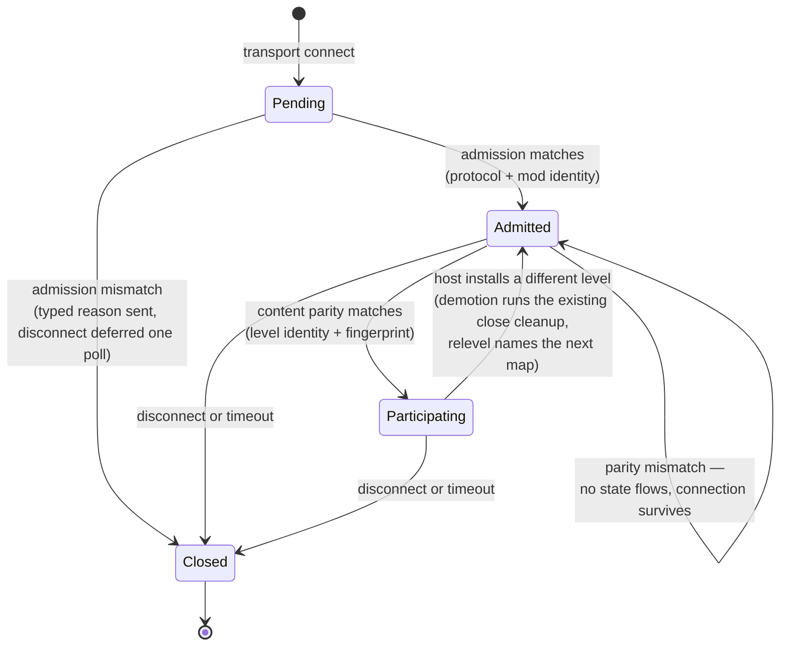

# Research — Session Lifecycle

Findings behind the spec's decisions, including why its scope changed once.

## Code grounding

| Claim | Source |
|---|---|
| The app gate early-returns until a fingerprint is installed, so every handshake queues until a level installs — the ordering inversion this spec fixes | `crates/net/src/transport.rs` — `process_control_messages` |
| A fingerprint change closes every slot and retains the close for the next poll; the client half disconnects itself | `crates/net/src/transport.rs` — `NetServer::set_kinematic_static_fingerprint`, `NetClient::set_kinematic_static_fingerprint` |
| The client sends its handshake exactly once, gated on a fingerprint being present, and never re-arms | `crates/net/src/transport.rs` — `NetClient::update`, `handshake_sent` |
| Slot states are `Pending`/`Accepted`/`Closed`; `Closed` is terminal and only an `Accepted → Closed` transition emits an event | `crates/net/src/slots.rs` — `SlotState`, `SlotTable::on_close` |
| Entity state is gated on accepted slots at the send call | `crates/net/src/transport.rs` — `send_snapshot`, `accepted_clients` |
| An app-level reject closes the slot and disconnects in the same call, so no reliable message can reach the peer first | `crates/net/src/transport.rs` — `NetServer::reject` |
| The handshake carries three fields and is `Copy` | `crates/net/src/wire.rs` — `ProtocolVersion` |
| Both protocol constants are hand-bumped and packed into the transport gate | `crates/net/src/transport.rs` — `PROTOCOL_ID`, `WIRE_VERSION`, `transport_protocol_id` |
| The server→client envelope carries time-sync and shot verdicts only — there is no relevel vocabulary | `crates/net/src/wire.rs` — `ServerMessage` |
| The fingerprint hashes the mover list, mover collision vertices/indices, and waypoints — nothing identifying the level | `crates/postretro/src/runtime_movers.rs` — `kinematic_static_fingerprint` |
| The level's own identity is resolved one line before the fingerprint is computed, on the same `&mut self` | `crates/postretro/src/startup/lifecycle.rs` — `retain_active_level_tags_for_install` sets `active_level_source`, then `install_level_payload` computes the fingerprint |
| A catalog load resolves against the engine-global map registry, which survives level unload — so one string is enough to name a map on both peers | `context/lib/boot_sequence.md` §4, §6 |
| The level-scoped client reset early-returns for the host role, so no host-side table is cleared on unload | `crates/postretro/src/netcode/mod.rs` — `reset_level_scoped_client_state` |
| The net endpoint is advanced only from the Running gameplay block; the loading frame polls the level worker and paints the splash | `crates/postretro/src/main.rs` (snapshot-apply stage), `crates/postretro/src/startup/lifecycle.rs` (loading frame) |
| The manifest requires `name` and carries no id or version; four parse sites read it (two runtimes × initial/staged) | `crates/scripting-core/src/runtime/mod_init_exec.rs`, `crates/scripting-core/src/staged_manifest.rs` |
| The net endpoint is built during `Session::build`, and mod init runs after — so mod identity cannot be a construction argument | `context/lib/boot_sequence.md` §1 |
| The accept lane spawns the slot pawn; `lifecycle` carries closes only | `crates/postretro/src/main.rs` — the `HandshakeOutcome` match, `host_handle_lifecycle` |

## Slot lifecycle

The change in one picture. Today's `Accepted` splits into two states, and a level change
becomes a demotion rather than a close — which is what lets a connection outlive the map
it joined on.

Three properties fall out and become acceptance criteria: no entity state reaches a slot
below `Participating`; a demotion runs the same per-slot cleanup a close runs, because
level unload invalidates every id those tables hold; and the slot survives the whole
transition, which is only true if the transport is polled across it.

**The self-loop is the load-bearing edge.** `Admitted → Admitted` on a parity mismatch —
rather than `Admitted → Closed` — is what makes the two gate stages structurally different
rather than merely sequential. Admission facts are connection-scoped and can never become
true later, so a mismatch there closes. Parity is level-scoped and is designed to become
true one install later, so closing on it is a category error, and it would race the spec's
own criteria: a client's parity for level A can still be in flight when the host installs
level B, and a host that closed on mismatch would tear down a client it demoted one frame
earlier. The first draft of the index carried the content cause in the reject-and-close lane
beside protocol and mod, contradicting this diagram; direction review caught it, and the
index now matches. Consequence worth noting: the deferred-disconnect mechanism serves
admission only, which shrinks the spec's own "trimmable part."

## Why this merged with the level-transition spec

Drafted first as admission alone, with server-authoritative level transitions as a
separate follow-on. Direction review returned *under-scoped*, and the evidence was
entirely self-generated:

- The admission draft pulled the fingerprint fail-open fix forward from the transition
  spec, on the argument that a deferred fix making its own invariant fail silently is not
  deferrable.
- It then left the unpolled unload→install window in the transition spec — the identical
  case, unapplied. Its two headline criteria ("the connection outlives the map", "a
  demoted client re-participates without reconnecting") are both claims about surviving
  that window.
- The transition spec was already described as likely to split, along a seam different
  from the one dividing it from admission.

Three signals that the work divides by *layer* — gate, wire, engine lifecycle — not by
*capability*. Merging removes the seam; the task breakdown supplies the structure the two
specs were providing.

## Why level identity is a field, not more hash

The fingerprint covers mover authoring and collision, so two maps with no movers hash
identically: the gate passes, no cleanup runs, and clients stay attached to a host where
their pawns no longer exist. Bound once per connection that is a latent bug; evaluated at
every level install it becomes this spec's central invariant failing silently.

The first draft widened the hash domain to include the level's identity. Rejected on
review, and the rejection is right: the fail-open is an **identity** failure ("different
maps"), not a **content parity** failure ("prediction inputs diverge"). Fixing the first
by making a content hash accidentally identity-sensitive mixes two questions into one
opaque value. Two questions, two fields:

- Carrying identity separately makes the common mismatch readable — "the host is on
  `city-03`, you are on `city-04`" rather than a 32-byte diff. The typed reject reason's
  whole point is an actionable expected-vs-received payload.
- The fingerprint keeps its documented domain, so no rename, no epoch bump, and no
  `networking.md` rewrite.
- The relevel message names a catalog id. Once parity already carries the host's level
  identity, relevel is adding a *direction* to a value the protocol moves, not a new noun.

Hashing the `.prl` bytes was the other candidate and stays rejected under both shapes:
strictly stronger, and it makes a cross-platform bake difference a hard connection
failure — a bake-determinism question this spec has no standing to answer.

## Rejected while drafting

- **Telling the client only that it was admitted.** Superseded by the merge: the relevel
  message is the useful form, and a bare admitted-acknowledgement would have been
  redesigned into it immediately.
- **Semver ranges on the mod version.** Invites a compatibility policy with no way to
  test it. Exact string match; the author bumps the version when the contract changes.
- **A content hash over the mod.** Breaks hot reload mid-session and buys tamper
  detection, an explicit non-goal (`index.md` §4). `E16--impact-policy-substrate` already
  settled the general rule: explicit author-assigned ids, not content-derived ones.
- **Reusing `ProtocolVersion` with the mod fields appended.** It is `Copy` and the mod id
  is a string. More importantly the two stages fire at different times, so one message
  re-creates the ordering inversion the spec exists to remove.
- **Making the relevel message carry a path rather than a catalog id.** A path is
  machine-local and resolves against a filesystem the peer does not share. The catalog is
  the only namespace in which one string resolves on both peers. The catalog's *mod-scoped*
  half of that argument — two mods may declare the same map id over different `.prl` files,
  so level identity does not discriminate until admission has proven the mods match — moved
  into the index's Decisions, beside level identity, because it is the argument that carries
  the merge rather than a note about message payloads.
