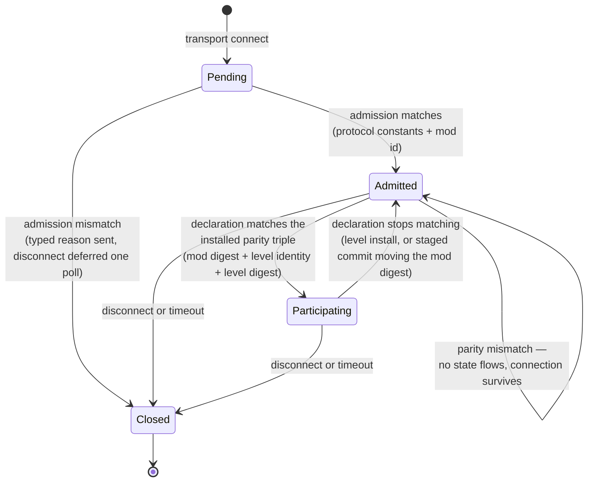

# Research — Session Lifecycle

Findings behind the spec's decisions, including why its scope changed once.

## Code grounding

| Claim | Source |
|---|---|
| The app gate early-returns until a fingerprint is installed, so every handshake queues until a level installs — the ordering inversion this spec fixes | `crates/net/src/transport.rs` — `process_control_messages` |
| A fingerprint change closes every slot and retains the close for the next poll; the client half disconnects itself | `crates/net/src/transport.rs` — `NetServer::set_kinematic_static_fingerprint`, `NetClient::set_kinematic_static_fingerprint` |
| The client sends its handshake exactly once, gated on a fingerprint being present, and never re-arms | `crates/net/src/transport.rs` — `NetClient::update`, `handshake_sent` |
| Slot states are `Pending`/`Accepted`/`Closed`; `Closed` is terminal and only an `Accepted → Closed` transition emits an event | `crates/net/src/slots.rs` — `SlotState`, `SlotTable::on_close` |
| Both mutating primitives decide their event **inside the method**, and both are once-only edges: `on_accept` returns `None` when the slot is already `Accepted`, `on_close` returns an event only from `Accepted`. Nothing computes an event from the (old, new) state pair | `crates/net/src/slots.rs` — `SlotTable::on_accept`, `SlotTable::on_close` |
| **Client prediction arming is derived from the snapshot stream, not latched.** `maybe_arm_local_pawn` runs on every applied record — the `FullBaseline` arm and the `Delta` arm both call it — and surfaces `ApplyOutcome::armed_local_pawn`, which the caller hands to `ClientPrediction::arm`. That method is documented "arm (or re-arm)", is a no-op for the same pawn, and clears history for a different one. So a promotion needs no client-side signal: the next `local_player` record re-arms | `crates/postretro/src/netcode/client.rs` — `maybe_arm_local_pawn`, `apply_snapshot`; `crates/postretro/src/netcode/prediction.rs` — `ClientPrediction::arm`; `crates/postretro/src/netcode/mod.rs` — the `armed_local_pawn` → `prediction.arm` hand-off |
| The client-side reset a demotion needs already ships as one function: it clears the `NetworkId → EntityId` map, queues a `BaselineRefresh` per known id, and sets `armed` to `None` | `crates/postretro/src/netcode/mod.rs` — `reset_level_scoped_client_state`; `ClientReplication::reset_for_level_unload`; `ClientPrediction::reset_for_level_unload` |
| The repo already has a doc string for exactly this id rule — "Must be non-empty ASCII, at most 64 bytes, and use only [A-Za-z0-9_.:-]." — on the ammo `type` and weapon `creditSource` ids | `crates/postretro/src/scripting/primitives/mod.rs` — `register_sdk_type` |
| The impact-event id rule validates a charset and a length but frames the namespace as an example — "must be a namespaced ASCII string (for example \"salvage:crate-break\")" — so a namespaced form is documented rather than a namespace prescribed | `crates/scripting-core/src/data_descriptors/validate/runtime.rs` |
| The map catalog `id` has **no charset validation**: it is registered as "Stable logical map handle … Required; exact string match" and nothing checks its characters or length. So the mod id is the first catalog-adjacent id with an enforced charset | `crates/postretro/src/scripting/primitives/mod.rs` — `register_type("ModMapEntry")` |
| The one shipped manifest imports its catalog rather than inlining it: `maps: mapCatalog`, imported from `./scripts/frontend-menu`. No shipped manifest calls `defineMapCatalog([...])` at the `defineMod` site | `content/dev/start-script.ts`; `content/dev/scripts/frontend-menu.ts` |
| Entity state is gated on accepted slots at the send call | `crates/net/src/transport.rs` — `send_snapshot`, `accepted_clients` |
| An app-level reject closes the slot and disconnects in the same call, so no reliable message can reach the peer first | `crates/net/src/transport.rs` — `NetServer::reject` |
| The handshake carries three fields and is `Copy` | `crates/net/src/wire.rs` — `ProtocolVersion` |
| Both protocol constants are hand-bumped and packed into the transport gate | `crates/net/src/transport.rs` — `PROTOCOL_ID`, `WIRE_VERSION`, `transport_protocol_id` |
| The server→client envelope carries time-sync and shot verdicts only — there is no relevel vocabulary | `crates/net/src/wire.rs` — `ServerMessage` |
| The fingerprint hashes the mover list, mover collision vertices/indices, and waypoints — nothing identifying the level. Signature is `kinematic_static_fingerprint(geometry: &KinematicGeometry) -> [u8; 32]`, `pub(crate)`, and its `FINGERPRINT_EPOCH` is a **function-local** `const` = 1, not a shared one | `crates/postretro/src/runtime_movers.rs` — `kinematic_static_fingerprint` |
| Its hash helpers — `hash_len`, `hash_str`, `hash_vec3`, `hash_f32` — are **private free functions** in that same file. A sibling recipe module cannot call them without a visibility change | `crates/postretro/src/runtime_movers.rs` |
| The level's own identity is resolved one line before the fingerprint is computed, on the same `&mut self` | `crates/postretro/src/startup/lifecycle.rs` — `retain_active_level_tags_for_install` sets `active_level_source`, then `install_level_payload` computes the fingerprint |
| A catalog load resolves against the engine-global map registry, which survives level unload — so one string is enough to name a map on both peers | `context/lib/boot_sequence.md` §4, §6 |
| The level-scoped client reset early-returns for the host role, so no host-side table is cleared on unload | `crates/postretro/src/netcode/mod.rs` — `reset_level_scoped_client_state` |
| The net endpoint is advanced only from the Running gameplay block; the loading frame polls the level worker and paints the splash | `crates/postretro/src/main.rs` (snapshot-apply stage), `crates/postretro/src/startup/lifecycle.rs` (loading frame) |
| The manifest requires `name` and carries no id or version; four parse sites read it (two runtimes × initial/staged) | `crates/scripting-core/src/runtime/mod_init_exec.rs`, `crates/scripting-core/src/staged_manifest.rs` |
| The net endpoint is built during `Session::build`, and mod init runs after — so mod identity cannot be a construction argument | `context/lib/boot_sequence.md` §1 |
| The accept lane spawns the slot pawn; `lifecycle` carries closes only | `crates/postretro/src/main.rs` — the `HandshakeOutcome` match, `host_handle_lifecycle` |
| The client's local static-collision trimesh is built from `LevelWorld` vertices and indices, and nothing hashes them — the second, larger fail-open | `crates/postretro/src/collision/mod.rs` — `CollisionWorld::populate_from_level` |
| Client movement prediction runs against that local collision source, and client-authoritative hit declaration casts against the world the client renders while the host validates against its own static geometry | `MovementCollisionSource` is defined `pub(crate) trait` in `crates/postretro/src/movement/mod.rs`; `crates/postretro/src/netcode/prediction.rs` consumes it as `&impl MovementCollisionSource`, `context/lib/networking.md` §Combat authority |
| Player movement tuning is descriptor-authored, so a manifest edit changes what the client predicts with | `crates/postretro/src/movement/mod.rs` — `PlayerMovementComponent::from_descriptor` |
| The client resolves its own local movement tuning today: `entity_class` → `canonical_name` → `descriptor.movement` → `PlayerMovementComponent::from_descriptor`. This is one of the two sites replication redirects | `crates/postretro/src/scripting/builtins/net_descriptor.rs` — `materialize_net_local_movement_component` |
| The client also resolves its own weapon fire values today — pawn class, then `default_weapon`, then `range`/`cooldown_ms`/`fire_mode`/`resolution` into client fire prediction. Four fields the digest's disposition table filed as host-authoritative. The second redirected site | `crates/postretro/src/weapon/mod.rs` — `ClientWeaponState::from_local_pawn_descriptor` |
| Shipped code already degrades an unknown entity class rather than refusing — logs "leaving remote entity transform-only (will not render)" and returns `false`; the remote-enemy helper documents the same rule. This is why hashing `canonical_name` bought nothing | `crates/postretro/src/scripting/builtins/net_descriptor.rs` — `materialize_net_mesh_presentation`; `crates/postretro/src/netcode/remote_materialize.rs` — `materialize_armed_remote_enemy` |
| `crates/net` depends on renet, renet_netcode, bitcode, and log — no `foundation`, no `entities`. Every opaque value on its wire today is a fixed-size `[u8; 32]`, so a variable-length engine-serialized payload is a new pattern there | `crates/net/Cargo.toml`; `crates/net/src/wire.rs` |
| `PlayerMovementDescriptor` and every struct beneath it derive `Serialize`/`Deserialize`, as do `NumberOrIr`/`BoolOrIr` (both `#[serde(untagged)]`) and `IrNode` — so the replicated payload needs no new codec, and `serde_json` is already a `postretro` dependency | `crates/foundation/src/data_descriptors/types/movement.rs`; `crates/postretro/Cargo.toml` |
| World gravity is mutated mid-level by the `worldSetGravity` primitive, not fixed at level load — so it is not a participation-transition value and cannot ride the tuning payload | `crates/entities/src/ctx.rs` — the gravity cell and its `worldSetGravity` mutation |
| Clients suppress AI-enemy spawns entirely and attach mesh presentation only, which is why enemy placement and brain tuning cannot break compatibility | `context/lib/networking.md` §Phase boundaries |
| A staged reload re-commits nearly every manifest lane — `entities`, `store_declarations`, `maps`, `reactions`, `crossings`, `trigger_events`, `trigger_pools`, `events`, the `render` profile, `ui_trees`, `theme`, `frontend`. `fonts` is the only lane never re-committed; it is absent from `StagedManifest`. So a non-atomic-replace manifest lane already ships, and it is exactly one | `crates/scripting-core/src/staged_manifest/transfer.rs`; `commit_staged_manifest_result` in `crates/scripting-core/src/runtime/core.rs`; `App::poll_staged_manifest_results` in `crates/postretro/src/startup/staged_manifest_lifecycle.rs`; `App::commit_staged_ui_manifest` in `crates/postretro/src/main.rs` |
| Most of `EntityTypeDescriptor` is host-authoritative (`health`, `behavior`) or presentation (`light`, `emitter`, `mesh`). `movement` feeds client simulation, and so do four fields reached through `default_weapon` — which an earlier draft of this spec filed host-authoritative. Those are the values the host replicates | `crates/entities/src/data_descriptors/types/entity.rs` — `EntityTypeDescriptor` |
| `EntityTypeDescriptor` has **9** fields, not the 10 an earlier draft enumerated: `ai` was retired by `E10--retire-legacy-ai`, landing on main after this spec's digest table was written. `behavior` (`BehaviorGraphDescriptor`) is the surviving host-authoritative AI mechanism | `crates/entities/src/data_descriptors/types/entity.rs` |
| State-slot parity already ships: both peers compare a schema fingerprint derived from the replicated slot declarations | `crates/postretro/src/netcode/state_slots.rs` — `ReplicatedSlotSchema` |
| Scripts are 160K of the dev mod's 337M (textures 291M, models 43M, maps 3.0M), so script sync is cheap on bytes and still does not cover the breaking surface | measured under `content/dev/` |
| `PlayerMovementDescriptor`'s replicated fields are structs, not scalars: `CapsuleParams`, `GroundParams` (which nests `SpeedParams`), `AirParams`, `FallParams`, `DashParams`, `ForgivenessParams`, `CrouchParams`. `view_feel: Option<ViewFeelParams>` is the render-only one and stays local | `crates/foundation/src/data_descriptors/types/movement.rs` |
| `DashParams` carries five `NumberOrIr` (`boost_speed`, `momentum_retention`, `steer_control`, `dash_drag`, `cooldown_ms`), one `BoolOrIr` (`preserve_vertical`), and `air_dashes: u32` — so the replicated payload carries IR, and used to be why the digest did | same file |
| `NumberOrIr` / `BoolOrIr` are `enum { Literal(..), Ir(IrNode) }`. Their doc comments scope them to dash *today*, and they sit in the shared typedef surface | same file; `crates/scripting-core/src/typedef/common.rs` |
| `IrNode` has **15** variants (`Const`, `Input`, `Add`, `Sub`, `Mul`, `Div`, `Clamp`, `Lerp`, `Lt`, `Le`, `Gt`, `Ge`, `Eq`, `Ne`, `Select`) and is tree-recursive through `Box<IrNode>`; `IrValue` is `Bool(bool)` / `Number(f32)`. The module doc names movement as **"the first adopter"** of the substrate | `crates/foundation/src/ir/mod.rs` |
| `HealthDescriptor::zone_multipliers` is a `std::collections::HashMap<String, f32>`, but it hangs off `EntityTypeDescriptor::health`, which no digest domain has ever reached — so **no map-valued field is reachable in the hashed domain**, under either the entity-closure shape or the three-lane one that replaced it | `crates/foundation/src/data_descriptors/types/combat.rs` |
| `serde_json`'s `preserve_order` feature is **not** enabled in this workspace, so `serde_json::Map` is a `BTreeMap` and iterates key-sorted deterministically | workspace `Cargo.toml` |
| `EntityId` is a newtype over `u32` — a runtime allocation handle, not content | `crates/entities/src/registry.rs` |
| `TriggerEventDescriptor { tag, event, fire, levels }` is `String`/`Vec<String>` throughout and already derives `Hash`; `TriggerPoolDescriptor { tag, arm, levels }`, with `TriggerPoolArm::{Count(u32), Percentage(f64)}` | `crates/entities/src/data_descriptors/types/reactions.rs` |
| `CrossingDescriptor { slot: Option<String>, condition, max: f32, edge: Option<String>, fire: Vec<String> }`, with `CrossingCondition::{Below { threshold }, Above { threshold }, Ir(IrNode)}` — the same `IrNode` `movement` reaches | same file |
| `PrimitiveDescriptor { primitive: String, target, tag, on_complete, args: serde_json::Value }`; `SequenceStep { id: SequenceTarget, primitive: String, args: serde_json::Value }`; `SequenceTarget::{Entity(EntityId), Activators, FiredTrigger}` | same file |
| `DataRegistry` keeps per-level `reactions`/`crossings`/`trigger_events`/`trigger_pools`, committed by `setupLevel()`, separate from mod-global `global_reactions`/`global_crossings`/`global_trigger_events`/`global_trigger_pools`, committed from the manifest | `crates/entities/src/data_registry.rs` |
| The control decode skips clients already accepted — `if self.slots.is_accepted(client_id)` — under a comment reading "A client already accepted may send later control traffic" | `crates/net/src/transport.rs` — `NetServer::process_control_messages` |
| The `defineMod` declaration and its doc comment are **hand-written templates**, not registry-generated | `crates/scripting-core/src/typedef/templates/sdk_lib.d.ts`, `sdk_lib.luau` |

## Slot lifecycle

The change in one picture. Today's `Accepted` splits into two states, and a level change
becomes a demotion rather than a close — which is what lets a connection outlive the map
it joined on.

The two middle edges are **not two features**. Both are readings of one predicate — a slot
participates iff its retained declaration matches the installed triple — re-evaluated after
every parity source install. Drawing them as independent transitions is what let an earlier
draft specify the downward one alone; see "Why the slot machine was reshaped" below.

Three properties fall out and become acceptance criteria: no entity state reaches a slot
below `Participating`; the per-slot cleanup runs on any exit from `Participating`, whichever
the destination; and the slot survives the whole transition, which is only true if the
transport is polled across it.

**The self-loop is the load-bearing edge.** `Admitted → Admitted` on a parity mismatch —
rather than `Admitted → Closed` — is what makes the two gate stages structurally different
rather than merely sequential. Admission facts can never become true later, so a mismatch
there closes. Parity values are all designed to become true later, so closing on one is a
category error, and it would race the spec's own criteria: a client's parity for level A can
still be in flight when the host installs level B, and a host that closed on mismatch would
tear down a client it demoted one frame earlier. The first draft of the index carried the
content cause in the reject-and-close lane beside protocol and mod, contradicting this
diagram; direction review caught it, and the index now matches. Consequence worth noting:
the deferred-disconnect mechanism serves admission only, which shrinks the spec's own
"trimmable part."

**Which lane a value belongs in is decided by mutability, and the first draft got one
wrong.** The rule that survives is: admission carries a value only if a mismatch on it can
never become a match. That is true of the protocol constants, and true of the mod id because
identity is frozen at first commit. It was *not* true of the mod compatibility digest, which
the first draft nonetheless gated at admission — a staged reload re-commits the trigger and
crossing lanes the digest reads, so its value changes under a live connection. The draft made its own premise true by declining to observe the change, freezing
the digest at first commit, which bought the premise at the price of gating live connections
on a stale value in exactly the builds where co-op is developed and playtested.

The trap was framing the choice as freeze-versus-rehash-and-close. Both options are bad, and
the spec's own new mechanism supplies a third: **rehash and demote**. That option only exists
because this spec invents a state to demote *to*, which is why the first draft could not see
it — it was reasoning with the vocabulary the shipped code had. Worth recording as a pattern:
when a spec adds a state, re-examine every decision it made before the state existed.

The dev-loop objection that killed a whole-mod content hash does not transfer to the
rehashing digest, and the distinction is worth keeping straight. That hash moved on every
byte of every script and its consequence was a **closed** connection; this one moves only
when a hashed field changes and its consequence is a **hold** that resolves the moment the
peers agree again. Same mechanism, two orders of magnitude apart in both trigger frequency
and blast radius.

## Why the slot machine was reshaped

The spec's first shape kept the shipped `SlotTable` and added edges to it: a demotion
transition, a demotion event, and prose rules covering the cases the additions broke. Review
found the same drafting error in three places, and the third is what made it a mechanism
rather than three bugs.

**The three instances.** Each reasons from one transition and generalizes wrong.

- **Demotion was specified without promotion.** The spec said installing a different parity
  triple demotes non-matching `Participating` slots. Nothing re-compared a *retained*
  declaration against a *newly-installed* triple to promote an `Admitted` slot back up. The
  level path recovers by accident — the host relevels, the client installs, the client re-arms
  its parity flag and re-sends — so the omission is invisible there. The mod-digest path cannot:
  the host's digest moves and the client's does not, so the client never re-sends, and a slot
  demoted by a host staged commit could never re-participate even after the host reverted the
  edit. That falsified the spec's own "a hold that resolves the moment the peers agree again"
  and the recovery half of two acceptance criteria.
- **The promotion event needed a "must re-emit" rider.** `SlotTable::on_accept` returns `None`
  when the slot is already accepted — once-only per `ClientId`, which is right until a slot can
  leave and re-enter participation. The draft handled it with a prose rule telling the
  implementer to re-emit, which is a rule that exists only because the primitive was written as
  an edge.
- **The close event needed a hand-written exception.** "`on_close` continues to emit only from
  `Participating`; `Admitted → Closed` is silent" was written to stop the cleanup double-running
  after a demotion had already run it. Same shape: a rule compensating for a method that decides
  its own event.

**What the three have in common.** Each was reasoned from the transition the author had in
front of them — level change, first admission, close — and stated as a rule about that
transition. A fourth instance predates them and is recorded elsewhere in this file: the
demotion cleanup was justified from "level unload invalidates every id the per-slot tables
hold," which is true of the level trigger and false of the mod-digest one, where the level
stays loaded and the cleanup runs anyway.

**The fix is to state the invariant and derive the transitions.** Two statements replace every
rule above:

- **A slot participates if and only if its retained declaration matches the installed parity
  triple.** Re-evaluated after every parity source install, in one function every install setter
  calls. Demotion and promotion become two readings of one comparison. A fourth parity source
  cannot implement half of it, because it does not implement any of it.
- **Events are computed from the (old, new) state pair.** Cleanup fires on any exit from
  `Participating`; the pawn spawn fires on any entry. The Invariants table's "a demotion clears
  exactly what a close clears" stops being an assertion two sites must both honor and becomes a
  shared trigger. `Admitted → Closed` is silent because no exit from `Participating` occurred —
  unreachable rather than guarded.

**And it is verified as a property, not a case list.** After any install, for every slot,
participating iff matching. The case list is the same enumeration that missed promotion once;
running it again catches the cases someone already thought of. Recorded as a pattern, because
it generalizes past this spec: *when a spec adds a state, restate the rules that referenced the
old states as invariants over the new ones, and check both directions of every edge it adds.*
That is the companion to the pattern already recorded above — when a spec adds a state,
re-examine every decision it made before the state existed.

**One thing the reshape did not cost: a client-side promotion signal.** Host-side promotion
re-spawns the pawn and snapshots resume, but prediction arming is client-local state, so the
obvious next worry is a latch nothing clears. Checked rather than assumed:
`maybe_arm_local_pawn` runs on every applied record and `ClientPrediction::arm` is documented
"arm (or re-arm)", so arming is derived from the snapshot stream. The first `local_player`
record after promotion re-arms the client. Had it been latched, the predicate would have owed
the wire a promotion message.

## Why this merged with the level-transition spec

Drafted first as admission alone, with server-authoritative level transitions as a
separate follow-on. Direction review returned *under-scoped*, and the evidence was
entirely self-generated:

- The admission draft pulled the fingerprint fail-open fix forward from the transition
  spec, on the argument that a deferred fix making its own invariant fail silently is not
  deferrable.
- It then left the unpolled unload→install window in the transition spec — the identical
  case, unapplied. Its two headline criteria ("the connection outlives the map", "a
  demoted client re-participates without reconnecting") are both claims about surviving
  that window.
- The transition spec was already described as likely to split, along a seam different
  from the one dividing it from admission.

Three signals that the work divides by *layer* — gate, wire, engine lifecycle — not by
*capability*. Merging removes the seam; the task breakdown supplies the structure the two
specs were providing.

## Why level identity is a field, not more hash

The fingerprint covers mover authoring and collision, so two maps with no movers hash
identically: the gate passes, no cleanup runs, and clients stay attached to a host where
their pawns no longer exist. Bound once per connection that is a latent bug; evaluated at
every level install it becomes this spec's central invariant failing silently.

The first draft widened the hash domain to include the level's identity. Rejected on
review, and the rejection is right: the fail-open is an **identity** failure ("different
maps"), not a **content parity** failure ("prediction inputs diverge"). Fixing the first
by making a content hash accidentally identity-sensitive mixes two questions into one
opaque value. Two questions, two fields:

- Carrying identity separately makes the common mismatch readable — "the host is on
  `city-03`, you are on `city-04`" rather than a 32-byte diff. The typed reject reason's
  whole point is an actionable expected-vs-received payload.
- The two answer different questions. Identity is "which map"; the digest is "is the
  content the same". Keeping them apart is what lets the digest's domain be widened later
  on its own merits — which this spec then does, adding static world collision — without
  that widening being confused for an identity fix.
- The relevel message names a catalog id. Once parity already carries the host's level
  identity, relevel is adding a *direction* to a value the protocol moves, not a new noun.

Hashing the `.prl` bytes was the other candidate and stays rejected under both shapes:
strictly stronger, and it makes a cross-platform bake difference a hard connection
failure — a bake-determinism question this spec has no standing to answer.

## What widening the fingerprint retired

Adding static world collision to the parity digest closed a hole, and it also weakened an
argument this spec had been leaning on. Recorded because the swap should be visible.

The merge was partly argued on catalog ids being mod-scoped: two mods can declare the same
map id over different `.prl` files, so two peers on different mods compare level identity
equal — and, if both maps were mover-less, compare fingerprints equal too. The second half
of that no longer holds. Differing brushwork now diverges on content regardless of whether
the mods match.

What replaces it is stronger, not weaker. The two digests are halves of one policy computed
at the two moments the spec already installs values, and neither covers for the other: a mod
fork that retunes a mod-global crossing ships identical map bytes and moves only the mod digest;
differing brushwork moves only the level digest. That is a structural reason they belong in
one spec, where the earlier argument was a contingent one about a specific hole. (The example
used to be "retunes player movement." Movement is replicated now, so it moves neither digest —
the structural point stands, the illustration had to change with the domain.)

## What shrinking the mod digest retired

Detail review cut the mod digest's domain from two whole manifest lanes to, per entity type,
the `canonical_name` and the `PlayerMovementDescriptor` under `movement`, minus that
descriptor's render-only `view_feel` field. Unnamed descriptors were excluded. That shape was
itself later retired — see the next section — but the argument against hashing a lane wholesale
survives both revisions and still governs `reactions`.

Hashing `entities` wholesale contradicted the spec's own tiering. Most of
`EntityTypeDescriptor` is host-authoritative — `health`, `weapon`, `default_weapon`,
`behavior` — and clients suppress AI-enemy spawns entirely, so those fields are Tier 2 in
`context/research/coop-content-compatibility.md`. The rest — `light`, `emitter`, `mesh` — is
presentation. Hashing the lane would have demoted every peer on an enemy retune or a light
tweak: the same failure mode the spec rejects a declared mod version for, reintroduced by
the mechanism meant to replace it.

State-slot parity left the digest in the same pass. It is owned by the shipped
`ReplicatedSlotSchema` fingerprint, which both peers already compare, so hashing
`store_declarations` would have duplicated a live gate with a coarser diagnostic.

## Why hashing the entity closure was tried, and what dropped it

The shape above — a per-field disposition over `EntityTypeDescriptor`, plus a recursive hash of
everything beneath the fields it kept — was the spec's design for two review rounds. It is
recorded in full here because it is a plausible design that fails for a reason worth knowing,
and a future reader reaching for a digest over descriptor fields should read this first.

**The domain it defined.** Per registered entity type, the `canonical_name` a client
materializes by and the `PlayerMovementDescriptor` it predicts with, minus render-only
`view_feel`. Because seven of `PlayerMovementDescriptor`'s nine remaining fields are structs,
the hashed set was a recursive closure: `CapsuleParams`, `GroundParams`, `SpeedParams`,
`AirParams`, `FallParams`, `DashParams`, `ForgivenessParams`, `CrouchParams`, and the
`IrNode`/`IrValue` tree beneath `DashParams`. Scoping the exhaustive-destructure rule to the two
outer types alone was a defect caught on review: `AirParams::air_control` would have compiled
clean and defaulted to unhashed, one level below where the guarantee was looking.

**The disposition table it needed.** Every field of `EntityTypeDescriptor` was classified into
one of three categories, and the third was itself a correction — an earlier draft had only
"hashed" and "presentation," which would have hashed the host-authoritative fields:

| Field of `EntityTypeDescriptor` | Disposition |
|---|---|
| `canonical_name` | hashed — the wire's entity class |
| `movement` (`PlayerMovementDescriptor`) | hashed, minus `view_feel` |
| `default_weapon`, `weapon`, `health`, `behavior` | skipped — host-authoritative |
| `light`, `emitter`, `mesh` | skipped — presentation |

**The two misclassifications, which are the evidence.** The table is wrong in two independent
places, and both were written by authors who had the tiering argument in front of them.

- `weapon` and `default_weapon` are filed host-authoritative. They are not, entirely:
  `ClientWeaponState::from_local_pawn_descriptor` (`crates/postretro/src/weapon/mod.rs`) resolves
  the pawn's `default_weapon` and copies `range`, `cooldown_ms`, `fire_mode`, and `resolution`
  into client-side fire prediction. Four fields a client simulates against, filed as fields it
  never sees. A fail-open, in the row that was supposed to prevent them.
- `canonical_name` is hashed. It should not be: shipped code already degrades an unknown entity
  class rather than refusing. `materialize_net_mesh_presentation` logs "leaving remote entity
  transform-only (will not render)" and returns `false`; `materialize_armed_remote_enemy`
  documents the same rule. Hashing it bought no safety and cost a demotion of every peer on
  every entity type a mod adds. A false refusal, in a table whose stated purpose was to prevent
  false refusals.

One error in each direction, in a four-row table, written by people trying hard. That is
evidence about the mechanism. Any design whose safety depends on a human correctly classifying
each field of a growing struct will be wrong at the rate a human is wrong, and the wrongness is
silent in both directions — a fail-open never fires, and a false refusal looks like a
compatibility mismatch rather than a bug.

**What replaced it, and why the replacement makes the failures unreachable.** The spec already
contained the answer, applied to exactly one case. Its Tier 3 item 5 note argued that world
gravity should be replicated rather than hashed, because "replication makes peers agree, where a
digest only lets them refuse each other when they disagree." Generalized: hash only what cannot
be replicated. The host sends its authoritative movement descriptor and the four weapon fire
fields; the client installs them and stops reading its own registry for those values. Neither
misclassification has anywhere left to live — there is no table, so `weapon` cannot be filed
wrong, and `canonical_name` is not compared at all. The distinction is between guarding a
judgement and deleting the step that needed one.

**What the digest kept.** Three mod-global registry lanes — `global_trigger_events`,
`global_trigger_pools`, `global_crossings` — hashed wholesale, no categories. Crossings are the
reason the digest survives at all: both peers *evaluate* crossings over the same replicated slot
values, and `context/lib/networking.md`'s snapshot-apply ordering has clients evaluate them over
same-frame local slot writes. The divergence is in a computation each peer runs, not in a value
the host could send, so replication has nothing to offer and a hash is the only instrument left.

**The cost the replacement carries, recorded so it is not rediscovered as a surprise.**
`crates/net` depends on renet, bitcode, and log — not `foundation`, not `entities` — and every
opaque value on its wire today is a fixed-size `[u8; 32]`. Replicated descriptor values cross as
an engine-serialized variable-length payload the crate forwards without interpreting. A typed
wire mirror was the alternative and was rejected: it would make the net crate learn the
descriptor vocabulary, which breaks the registry-blind commitment, and would put a second
definition of every tuning field one refactor away from drifting.

**The behavior semantic it introduces.** The host owns tuning. A modder testing a movement
change in co-op sees the host's values, not their own.

## What generalizing the IR hasher bought, and what stopped justifying it

The spec's original framing treated `DashParams`'s IR-valued fields as an obstacle: the
movement descriptor was assumed to be scalars, and it is not. Building a general
`IrNode`/`IrValue` walker rather than a dash-shaped one was justified on adoption trajectory —
the IR module's doc calls movement "the first adopter", `E18--ir-valued-reactions` shipped, and
`E10--enemy-stagger` is a planned adopter currently deferred on `CombatScope`, shipping plain
descriptor scalars upgradeable additively to `NumberOrIr` per the dash precedent. A recipe
shaped around dash specifically would be correct for exactly one adoption step and would then
fail open on the next, silently, on a field added by someone who never read the recipe.

**That argument is now unnecessary, and it is recorded rather than deleted because it was the
stated reason for a design choice that survived.** `movement` left the digest's domain with the
rest of the entity closure, and `DashParams`' `NumberOrIr`/`BoolOrIr` fields left with it. The
walker stays load-bearing on its own terms: `global_crossings` carries
`CrossingCondition::Ir(IrNode)`, which is in the remaining domain, so the walk is required
rather than anticipatory. The spec no longer has to argue that a general capability is worth
over-building, which is a smaller claim to defend.

**The design rule that fell out: hash the IR structurally, not by serializing it.**
Serializing is the tempting shortcut. `IrNode`'s serde format is pinned and byte-matched, so a
hash over the serialized form would be stable *and* would auto-cover every variant added
later. That auto-coverage is the defect. A new variant the walker does not handle is a compile
error; a new variant a serializer handles is nothing at all. The compile error is the entire
mechanism, and serializing trades it away.

The rule has a clean boundary now that replication exists beside it. The tuning payload *does*
serialize IR, deliberately: a new `IrNode` variant should replicate without anyone editing the
codec. Auto-coverage is a defect for a digest and a feature for a payload, and the two rules are
about different instruments rather than in tension.

## What the digests do not cover

An earlier draft named five knowingly-uncovered manifest lanes: `reactions`, `crossings`,
`events`, `trigger_events`, and `trigger_pools`. Scoping brought three inside the mod digest.
`global_trigger_events` and `global_trigger_pools` are `String`/`Vec<String>` plus one small
enum; `global_crossings` came with the IR walker. Two remain: **`reactions` and `events`**.

The reason previously recorded for deferring them — that reactions carry "their own
IR-encoding question" — is wrong. They do carry IR, and it is the question the walker already
answers. The two real blockers are different:

- **`SequenceTarget::Entity(EntityId)` is a runtime handle**, a newtype over `u32` the registry
  hands out, not content. Two peers on byte-identical mods can hold different values there.
- **Prediction relevance is keyed by `PrimitiveDescriptor::primitive`, an open string
  namespace** rather than a struct shape. This is the decisive one. Every other digest domain
  is decided by exhaustive destructuring, which turns an unclassified addition into a compile
  error. A string key admits no such error: a primitive added later is just a string the recipe
  has never seen.

Both ways out are mechanisms this spec already rejected. Hashing all reactions wholesale
reintroduces the Tier 2 false refusal — every peer demoted when a `playSound` argument changes.
Hashing an allowlist of prediction-relevant primitives is the allowlist mechanism that produced
the static-collision fail-open. The `serde_json::Value` payloads are **not** the blocker:
`preserve_order` is off in this workspace, so `serde_json::Map` is a `BTreeMap` and iterates
key-sorted.

The denylist mechanism the digest keeps has a scope limit worth restating, because it survived
every domain change. Exhaustive destructuring makes a *field* added later fail the build rather
than default to unhashed. It buys nothing about *lanes* nobody named. A new client-simulated
lane is still a manual widening, caught by the rule in
`context/research/coop-content-compatibility.md` §6 rather than by the compiler.

**A gap nobody had recorded: level-local reactions and crossings.** Scripts declare reactions
and crossings from `setupLevel()`, and `DataRegistry` keeps those per-level lanes separate from
the mod-global ones the manifest commits. Neither digest reaches them. The mod digest reads the
`global_*` lanes; the level digest hashes `.prl` geometry and mover data, which is not where
script-declared content lives. So two peers running the same map under mods whose level scripts
differ agree on both digests and diverge on locally-simulated behavior. Named here on the same
rule that makes the uncovered lane set explicit at all.

**Tier 3 item 5 changed disposition: replicate, not hash — and this is where the spec's
governing principle came from.** World gravity set from a reaction was cited as the concrete
cost of the uncovered reaction lanes. Hashing is the wrong instrument for it. Gravity is world
state the server owns, so it is absorbed by server authority — Tier 2 under the project's own
model — and replication makes peers *agree*, where a digest only makes them refuse when they do
not. That sentence was written about one value and never generalized; generalizing it is what
retired the entity-closure digest. Gravity itself still does not ship in E15, and the reason is
now mechanical rather than one of scope: `worldSetGravity` mutates it mid-level, so it is not a
participation-transition value and needs a continuous replication lane instead.

## Which corroborating documents are independent, and which are not

Direction review flagged this and it belongs on the record, because the next reviewer will
otherwise read agreement where there is only restatement.

Three documents now state that co-op compatibility is decided by content rather than by a
declared version: this spec, `context/research/coop-content-compatibility.md`, and
`context/research/coop-session-lobby.md` §4. The third is **not** independent support. Before commit
`f9a8973` it said the opposite — "the manifest declares an id and a version; the client sends
them at admission; the host compares" — and it was rewritten in the same commit that made the
decision. The roadmap's Phase 3.75 sub-bullet (line ~201) was rewritten in that commit too.

So the honest inventory is: one argument (in `context/research/coop-content-compatibility.md`), stated in three
places. It is a good argument and it survives review on its merits, but a reader must not
count it three times. Two corollaries for anyone validating this spec later:

- The roadmap's **Phase 3.75 paragraph** and the three-spec decomposition are owner-set and
  are legitimate external referents. The **sub-bullet for this spec** is not — it is drafter
  output and tracks the draft.
- The genuinely independent evidence for the policy is in the code, not the prose: the
  suppression list in `networking.md` §Phase boundaries (which is what makes Tier 2 large)
  and `CollisionWorld::populate_from_level` (which is what makes Tier 3 item 1 real).

## Drafting errors, and the pattern behind each

Three from this review round. The correction is cheap; the pattern is the part worth keeping.

- **The spec claimed its chosen digest domain avoided the IR enum.** It did not. `movement`
  reached `dash`, and `DashParams` reached the same `IrNode` the spec cites elsewhere as a
  reason to leave state-slot parity to `ReplicatedSlotSchema`. The pattern: *a rationale for
  choosing between two designs was written without opening the types the chosen one reaches.*
  This is the third consecutive review in which Task 6 failed on an unopened type — and the
  fourth found `weapon`/`default_weapon` misfiled for the same reason, which is what finally
  retired the design rather than patching it.
- **The cross-process determinism criterion, and the invariant supporting it, were anchored to
  `zone_multipliers`** — a field the spec's own disposition table excluded, since it is
  reachable only through host-authoritative `health`. The pattern: *an example survived a
  domain change that removed it from the domain.*
- **The exhaustive-destructure guarantee was stated over `EntityTypeDescriptor` and
  `PlayerMovementDescriptor`**, when the values it protected lived one and two levels below
  them. The pattern: *a guarantee was scoped to the types the recipe names rather than the
  types it reaches.* Overtaken rather than fixed — both types left the domain — but the pattern
  is the durable part and it binds on any future recursive recipe.

## Rejected while drafting

- **Telling the client only that it was admitted.** Superseded by the merge: the relevel
  message is the useful form, and a bare admitted-acknowledgement would have been
  redesigned into it immediately.
- **Semver ranges on the mod version.** Invites a compatibility policy with no way to
  test it. Exact string match; the author bumps the version when the contract changes.
- **A content hash over the *whole* mod.** Breaks hot reload mid-session, makes legitimate
  client-side differences fatal, and buys tamper detection, an explicit non-goal
  (`index.md` §4). Superseded rather than simply rejected: the spec now hashes a *scoped*
  surface — three mod-global registry lanes — which keeps the compatibility property and drops
  the breakage. Note the two independent reasons the breakage is gone, since collapsing them
  invites a bad inference: the domain shrank from every byte to three lanes, *and* the
  consequence softened from close to demote.
  Either alone would leave a usable dev loop; neither is a reason to widen the domain back. `E16--impact-policy-substrate`'s
  rule (explicit author-assigned ids, not content-derived ones) still governs **identity**;
  it never governed parity, which has been content-derived since the fingerprint shipped.
- **Exact mod-version equality as the admission gate.** The first draft's rule, dropped
  after the tiering analysis in `context/research/coop-content-compatibility.md`. It refuses on a
  value that does not track the breaking surface: an author who edits a light bumps it and
  blocks a friend, and an author who retunes player movement may not bump it at all. The
  version is still required and still crosses the wire — for display, never for comparison.
- **Reusing `ProtocolVersion` with the mod fields appended.** It is `Copy` and the mod id
  is a string. More importantly the two stages fire at different times, so one message
  re-creates the ordering inversion the spec exists to remove.
- **Making the relevel message carry a path rather than a catalog id.** A path is
  machine-local and resolves against a filesystem the peer does not share. The catalog is
  the only namespace in which one string resolves on both peers. The catalog's *mod-scoped*
  half of that argument — two mods may declare the same map id over different `.prl` files,
  so level identity does not discriminate until admission has proven the mods match — moved
  into the index's Decisions, beside level identity, because it is the argument that carries
  the merge rather than a note about message payloads.
