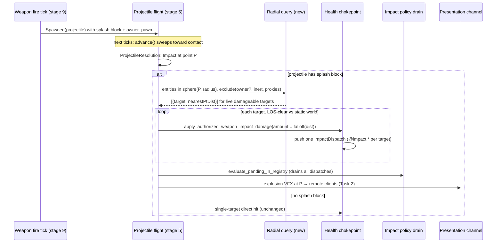

# AoE / Splash — Research Notes

Grounding, decisions, and derivation for the spec. Not consumed by task agents.

## Roadmap placement

Epic 16 › Resolution Modes › **AoE / splash**: "a radial volume query emitting a
damage payload per target with distance falloff (the rocket-launcher case)."
`E16--projectile-resolution` explicitly deferred "AoE radial overlap — find all
entities within R of a point, one payload each (one-to-many)" to this spec and
named it "the foundation the rocket launcher (projectile + AoE, a later spec)
builds on." Design intent: `weapon-model.md` §10 (AoE = radial volume query
emitting a payload per target; falloff on the payload), `combat-events.md` §4
(`combat.wasSplash` / `combat.distance` are named per-impact facts).

## Grounded source map (verified this session)

### Damage application
- `DamagePayload { amount: f32 }` — `crates/foundation/src/foundation_pods.rs:7`.
  Flat, amount-only. Re-exported `weapon::DamagePayload` (`weapon/damage.rs:7`).
  Spatial info rides *beside* the payload, never inside it.
- Chokepoint `apply_damage_with_context(registry, id, &payload, DamageContext)`
  — `crates/entities/src/components/health.rs:424`. `DamageContext { source_id,
  attacker, weapon, zone, producer: DamageProducer }` (`health.rs:58`).
- Per-target weapon entry `apply_authorized_weapon_impact_damage(registry,
  weapon_id, attacker, impact: &WeaponImpact, credit_source: String,
  damage_amount: f32)` — `crates/postretro/src/sim/weapon_stage/impact.rs:44`,
  re-exported `sim::apply_authorized_weapon_impact_damage` (`sim/mod.rs:1503`).
  Wraps `apply_weapon_impact_damage_with_source` (`impact.rs:62`): zone
  multiplier, credit fallback `weapon.unknown`, `DamageProducer::InTick`. Takes
  the amount as a snapshot `f32` — a splash caller passes a pre-scaled per-target
  amount; the flat payload is untouched.
- Contributor ledger: `ContributorLedger` cap 8 (`health.rs:223`,
  `CONTRIBUTOR_LEDGER_CAPACITY = 8`), stamped only when target was live.
- Impact facts: each successful chokepoint call pushes one `ImpactDispatch`
  (`health.rs:118`) via `registry.push_impact_dispatch` (`registry.rs:1100`).
  `@impact.*` leaves = `amount/healthBefore/healthAfter/maxHealth`; `@impact.target`
  / `@impact.source` are command-target tokens. Drained by
  `ImpactPolicyRuntime::evaluate_pending_in_registry` (`impact_policy.rs:395`),
  which keeps `DamageProducer::InTick`. One chokepoint call ⇒ one dispatch, so
  per-target splash yields one `@impact.*` dispatch per target for free.
- Credit: `WeaponDescriptor.credit_source` (`creditSource`) → `resolve_credit_source`
  (`weapon.rs:568`) → `effective().credit_source: &str` (`weapon.rs:382`).

### Weapon / projectile / resolution
- `ActivationOutcome { Hit(DamagePayload), Effect, Spawned(EntityId) }`
  — `crates/postretro/src/weapon/mod.rs:42`. Rides in `WeaponImpact { point,
  normal, target: Option<EntityId>, zone: Option<String>, outcome }`
  (`weapon/mod.rs:244`).
- `ResolutionMode { Hitscan, Projectile }` —
  `crates/foundation/src/data_descriptors/types/combat.rs:21`. (Pellet-spread
  generalized *hitscan* via `pellet_count`; it is not an enum sibling. Projectile
  is the sibling-adding precedent.)
- `WeaponDescriptor { damage: f32, resolution, projectile: Option<ProjectileDescriptor>,
  credit_source: Option<String>, ... }` — `combat.rs:329`.
  `ProjectileDescriptor { speed, radius, lifetime_ms, visual }` — `combat.rs:33`.
- Runtime: `WeaponComponent` (`crates/entities/src/components/weapon.rs`), built via
  `from…`/`refresh_from_descriptor` (`:437`); `effective()` (`:382`) exposes the
  read-side stats every fire path uses.
- Host projectile impact site: the `on_resolution` closure inside
  `projectile_stage::advance` — `crates/postretro/src/sim/projectile_stage.rs:92`.
  On `ProjectileResolution::Impact`: `spawn_impact_effect_at` (`:105`), liveness
  gate `health::is_damage_target_eligible` (`:111`), then
  `apply_authorized_weapon_impact_damage` (`:117`) and `on_impact(registry)`
  (`:125`). `impact.point`/`normal`/`target` in scope. `advance` is authoritative
  (`|_| true` matcher, `:91`); `advance_predicted` (`:158`) is client-only and only
  *declares* the hit (no local Health mutation).
- Stage call: `projectile_stage::advance` from `simulate_tick_with_presentation_aim`
  (`sim/mod.rs:684`), frame stage 5 (entity_model §5: "Authoritative projectile
  flight … Impacts route through the Health chokepoint").
- Owner: `ProjectileComponent { owner_pawn, owner_weapon, credit_source }`
  (`projectile.rs:26`), set in `spawn_projectile` (`commands.rs:598`).
- Owner exclusion seam: `projectile_collision_excludes(registry, projectile_id,
  owner_pawn, candidate)` (`projectile_stage.rs:438`), passed as the `ignored`
  closure to the entity query.

### Spatial queries (the net-new piece)
- **No radial/sphere entity query exists.** Entity-facing queries are ray/segment:
  `nearest_entity_hit` / `nearest_entity_hit_ignoring(…, ignored: Fn(EntityId)->bool)`
  — `hit_zones.rs:698`/`:720`, returning a single nearest `EntityRayHit`.
- Candidate enumeration: `for_each_hittable_candidate(registry, visit)`
  — `hit_zones.rs:851`, linear scan over `registry.iter_with_kind(ComponentKind::Health)`
  then `Mesh`. No entity broad-phase (BVH is static-world only). `nearest_entity_hit_ignoring`
  already skips `DeferredEffect.inert` entities (`hit_zones.rs:760`).
- Damageable volumes: `Hitbox { half_extents: Vec3, offset: Vec3 }` world-aligned
  AABB inside `HealthComponent` (`health.rs:25`; rotation ignored). The player is
  targetable because `E16--enemy-ranged-projectile` authored a `health.hitbox`
  (`spawner.rs:209`). Zone-bearing skinned models carry a model-local `derived_bound:
  Option<Aabb>` broad-phase box on `ModelHitZones` (`hit_zones.rs:57`), posed to
  world via `model_matrix(transform, origin_offset)`.
- Point-radius math already present: `sphere_capsule_distance_squared` /
  `sphere_overlaps_capsule` — `crates/postretro/src/sim/touch.rs:481`/`:497`
  (wired only into pickup/touch today).
- Static-world occlusion: `line_of_sight(eye, aim, world) -> bool` —
  `crates/postretro/src/collision/mod.rs:310`. Casts over the exact segment;
  dynamic movers do not participate (static geometry only).

### Networking
- Host resolves the host-owned rocket's impact in the `advance` closure above; a
  host-owned projectile mints no client shot, so splash never rides the
  client-hit validation seam `ingest_hit_declaration` (`netcode/mod.rs:2027`).
- `Channel { Control, Snapshot, Input, Presentation }` (`net/src/transport.rs:27`),
  `Presentation` is `Unreliable`. `ServerPresentationMessage { payload:
  ServerPresentationPayload }` (`net/src/wire.rs:65`), host push via
  `send_message(client_id, Channel::Presentation, …)` (`transport.rs:718`), client
  drain `drain_presentation` (`transport.rs:1044`). Host build in
  `netcode/presentation.rs`.
- Replicable set closed to 4 kinds: `ComponentPayload { Transform,
  PlayerMovementState, MeshAnimationState, KinematicMoverState }`
  (`net/src/wire.rs:513`). `HealthComponent` is not a wire component — HP changes
  reach clients as state-slot results (E15 Phase 3.5). Splash must add no fifth
  kind.

### Oversized files (split-before-extend watch)
`weapon_stage.rs` 4826 · `impact_policy.rs` 3289 · `sim/mod.rs` 3129 ·
`weapon/mod.rs` 2905 · `touch.rs` 2522 · `registry.rs` 2199 ·
`combat.rs` 1765 · `projectile_stage.rs` 1340 · `health.rs` 1189 ·
`weapon.rs` 1207 · `hit_zones.rs` 3722. The chokepoint wrapper file
`sim/weapon_stage/impact.rs` is 113 lines; `collision/mod.rs` is 428.
Convention (per `projectile-resolution` / `enemy-ranged-projectile`): new sim
logic lands in a **new module**; oversized files gain only a call site. The
radial query + splash emitter go in a new module reusing the helpers above; no
existing oversized file is heavily extended, so no split is forced. Exposing
`for_each_hittable_candidate` and the volume/distance helpers at crate visibility
is the only plumbing into those files.

## Decisions (with warrants)

1. **Splash is an impact-triggered radial effect composed onto a resolution, not a
   fourth `ActivationOutcome` variant.** The rocket launcher's *fire* activation
   already resolves to `Spawned(projectile)`; the explosion is a property of that
   projectile's *impact*, resolved host-side in the `advance` closure, not a value
   returned from `weapon_fire_tick`. Routing per-target splash through a
   single-`Hit` return would misplace it (the chokepoint entry hard-requires one
   `Some(target)`). So the projectile-impact closure branches on the presence of a
   `splash` block and calls a radial emitter directly. `ActivationOutcome` is
   untouched. This diverges from the roadmap's loose "sibling under
   `ActivationOutcome`" framing — argued in the spec's Direction.

2. **A `ResolutionMode::Aoe` sibling is rejected.** The rocket launcher must travel;
   its `resolution` is `Projectile`. A top-level Aoe mode cannot travel, so it
   cannot *be* the rocket launcher. Splash-as-impact-effect composes with
   projectile (and later hitscan) instead of competing with it. `weapon-model.md`
   §10 models the rocket as projectile + AoE-on-impact, not one or the other.

3. **A projectile carrying `splash` resolves its impact entirely through the radial
   query; it does not additionally apply the single-target direct hit.** The struck
   entity sits at the blast center (nearest point ≈ 0) and takes full-scale splash,
   so a separate direct hit would double-count. A projectile *without* `splash`
   keeps today's single-target direct hit unchanged. The closure branches on
   `splash` presence.

4. **`DamagePayload` stays amount-only.** Falloff is computed before the chokepoint
   and passed as the per-target `damage_amount` snapshot. No payload/type change —
   warrant: `apply_authorized_weapon_impact_damage` already takes the amount as an
   `f32` argument, and the payload doc states spatial info rides beside it.

5. **Splash uses each target's broad-phase damageable volume, not per-joint
   capsules.** Splash delivers one payload per entity — there is no per-limb splash
   consumer — so sub-entity zone precision buys nothing. The query reuses the same
   candidate broad-phase volumes the entity-raycast facility uses (`Hitbox` AABB;
   zone-bearing model `derived_bound`), avoiding per-candidate skeleton posing.

6. **One reference point per target: the nearest point of its world AABB to the
   blast center.** Falloff distance is measured to it (a large enemy standing on
   the blast takes full damage — nearest point ≈ 0 — not the under-damage its far
   origin would give), and the occlusion `line_of_sight` segment ends at it (a
   target whose body pokes past a corner is hit). A target whose AABB contains the
   center → distance 0, zero-length LOS segment (trivially clear).

7. **Falloff is linear with a floor.** `amount(d) = damage · lerp(1, minFraction,
   clamp(d / radius, 0, 1))`, `d` = nearest-point distance, `damage` =
   `effective().damage`, `minFraction` default 0. `d > radius` → target excluded.
   Reuses the existing `damage` stat as the blast-center value (composes with
   `effective()` so future augments scale it). A configurable curve / IR-expressible
   falloff is out of scope.

8. **Static world occludes; entities and movers do not.** Per-target
   `line_of_sight` against the static-world collider only (reuses the shipped
   segment test). Entity/mover occlusion is out of scope: it adds a cost and
   self-shadowing questions with no boomer-shooter warrant.

9. **`splashSelfDamage` (default true) governs the owner.** When true the owner
   pawn, if live and in radius, takes falloff-scaled splash (boomer-authentic
   self-damage; also the seam a future rocket-jump knockback rides). When false the
   owner is excluded via the same predicate projectile travel uses
   (`projectile_collision_excludes` / owner id). The travel exclusion (so the rocket
   does not collide with the shooter at the muzzle) is unrelated and unchanged.

10. **Splash params are archetype-level, read from each end's locally-loaded
    descriptor.** Host and client load the same mod content, so a connected client
    already holds the `splash` block; no tuning-payload replication is added.
    (Instance-rolled splash radius, if augments ever want it, rides the existing
    `effective()` → tuning-payload seam — future.)

11. **Out of scope, with reasons:** knockback / rocket-jump impulse (Damage &
    Defenses "knockback" spec — DamagePayload gains no impulse field here); the
    `combat.wasSplash` / method impact fact (not in the shipped `IMPACT_DISPATCH_INPUTS`
    vocabulary — a combat-events follow-on; splash hits are @impact-indistinguishable
    from direct hits in v1); elemental/damage-type splash; friendly-fire/faction
    filtering (faction model unbuilt — splash hits every damageable entity in
    radius); the melee shape-sweep sibling (this spec builds the radial member and
    leaves the sweep to the melee spec); direct-fire (hitscan→splash-at-point) and
    remote-detonation (secondary-activation) consumers — the emitter is built
    point-based and consumer-agnostic so they compose later, but only the
    projectile-impact consumer is wired now.

## Lifecycle — rocket detonation → splash (host-authoritative)

No arrow crosses to `advance_predicted` (client): the client's predicted rocket
declares its impact but performs no splash — splash HP changes reach the client
as replicated Health results, and the explosion VFX as a presentation event.
