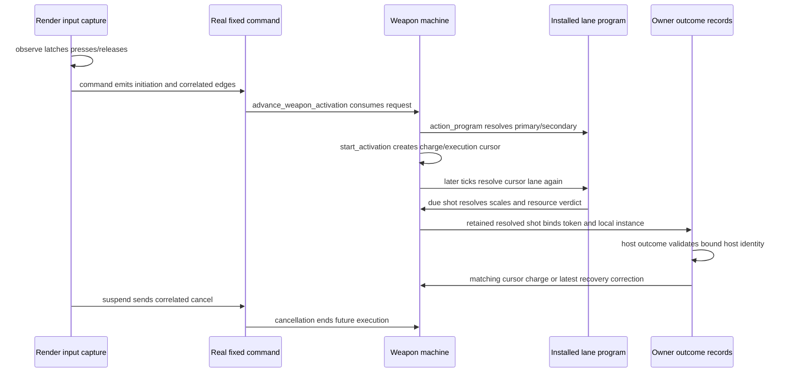

# Persistent firing modes — grounding

Read at `a6074007e`, `codex/weapon-activations`. Facts below describe the unmerged prerequisite [PR #549](https://github.com/majtom2grndctrl/postretro/pull/549), not current main. Mode selection in `index.md` is proposed work.

## Existing seams

| Seam | Read source and observed contract |
|---|---|
| Authoring | `crates/foundation/src/data_descriptors/types/combat.rs`: `WeaponDescriptor` has required `primary` and optional `secondary`. `types/activation.rs`: `WeaponActivationDescriptor` carries trigger, recovery, steps, optional charge, sounds, and aliases. `ShotScaleDescriptor` has the existing multiplier axes. |
| Instance | `crates/entities/src/components/weapon.rs`: `WeaponComponent` owns shared resource/recovery and primary/secondary descriptors plus installed programs. `cancel_activation` resets only transient execution. `refresh_from_descriptor` cancels before installing replacement programs. No selected-mode state exists. |
| Restore | `crates/entities/src/registry.rs`: `Component for WeaponComponent::into_value` and `EntityRegistry::set_component_value` call `ensure_activation_programs`, rebuilding serde-skipped caches. Ordinary set/clone paths also cross these boundaries; do not cancel live clones by mistake. |
| Input | `crates/postretro/src/input/activation.rs`: `ActivationInputCapture::observe`, `command`, and `suspend` preserve render-rate edges, favor secondary, correlate release/cancel, and clear suspended input. The current token names tick and lane; it is not itself a stable mode ID. |
| Execution | `crates/sim/src/weapon/execution.rs`: `controller_activation_request` chooses a lane. `advance_weapon_activation_with_shell_preemption` gates fresh requests, then resolves `action_program` again from the cursor's lane while advancing. Merely changing primary's current program would retarget a live execution; the proposed capture must fix that seam. |
| Reload priority | `crates/sim/src/sim/weapon_stage/machine.rs`: `tick_weapon_machine_phases` consumes fresh reload and cancels activation before the fire path. Keep that ordering for selectors. |
| Prediction | `crates/sim/src/weapon/activation_prediction.rs`: `advance_predicted_weapon_tick` uses the shared execution path and fresh reload cancellation. `execution.rs`: `WeaponActivationCheckpoint::capture` / `restore` retains timing, input consumption, resources, recovery, and bloom; a selector must join this checkpoint. |
| Edge intake | `crates/netcode/src/activation_edges.rs`: `ActivationEdges::observe`, `admit`, and `deliver` retain/deduplicate correlated terminal edges with finite bounds. This is a precedent to investigate, not proof that a selector needs the same representation. |
| Correction | `crates/postretro/src/client_weapon/reconcile.rs`: `ActivationRecords` binds local weapon identity to host identity, retains per-token shots, ignores mismatched host IDs, and limits recovery correction to the latest request for that instance. Selection needs equivalent protection across ownership/content/session changes. |
| Host tuning | `crates/combat-model/src/carried_loadout.rs`: `WieldableTuningPayload` carries host primary/secondary programs; `TuningPayload::new` strips their owner-local sounds. Mode gameplay/presentation must preserve this separation. |
| Drop | `crates/sim/src/sim/touch.rs`: `drop_wieldables` releases the existing entity only after a successful physical drop. It cancels activation and clears edges/reload feedback while retaining resource/recovery. Preserve selection on this same instance. |
| Level carry | `crates/combat-model/src/carried_loadout.rs`: `CarriedState` carries health, reserve, canonical weapon names, magazines, and active slot. `crates/sim/src/scripting/builtins/wieldable_inventory.rs` restores carried weapons and magazines. Mode IDs need explicit carry; none exists today. `crates/netcode/src/seat.rs` exhaustively inventories carried fields. |
| Presentation | `context/lib/scripting.md` §5 documents generated readonly local weapon/charge HUD facts. §11 documents per-action fire/impact sounds and aliases. `context/lib/networking.md` §Combat authority documents predicted owner feedback and frozen observer cues. New selector facts/cues must be authored and correlated, not inferred from changing descriptors. |

## Existing lifecycle

This diagram shows read call sites, before the proposed selector. It identifies where one mode ID must remain bound; it does not claim the new behavior exists.

Arrow grounding: input capture's `observe` / `command` / `suspend`; shared execution's `advance_weapon_activation`, `action_program`, `start_activation`, and shot resolution; outcome record's `retain_shot` and `outcome`. Each was read in the files above. Cancellation/resource policy also appears in `context/lib/entity_model.md` §Weapon activations and `networking.md` §Combat authority.

## Proposed invariants

| Invariant | Seams to preserve | Proof |
|---|---|---|
| Selection belongs to one instance and owner lifetime | Component, drop, inventory carry, host request binding, correction | AC5–6 |
| Captured activation identity stays fixed | Start, charge release, due-shot lookup, prediction/correction, delayed impacts | AC4, AC6–7 |
| Selection cannot create resource/recovery state | Selector gate, reload priority, primary gate, cancellation | AC2–3 |
| Every accepted selector press applies at most once | Render latch, fixed intake, host admission, deduplication, correction | AC2, AC6, AC8 |
| Feedback describes that same selection | HUD publication, owner cue, host acknowledgement, observer cue | AC7 |

## Build-time size flags

Affected seams may lead into large files: `entities/src/components/weapon.rs` (1425 lines), `foundation/src/data_descriptors/types/combat.rs` (1578), and `netcode/src/client.rs` (5554). Split the responsibility actually extended before adding behavior. Do not turn this brief into a general decomposition project. Existing focused execution/correction modules are substantially smaller.

General entity save/load is listed under non-goals in `context/lib/entity_model.md`. Component serde and the in-memory carried-loadout mechanism exist; neither establishes a disk save-game feature.
