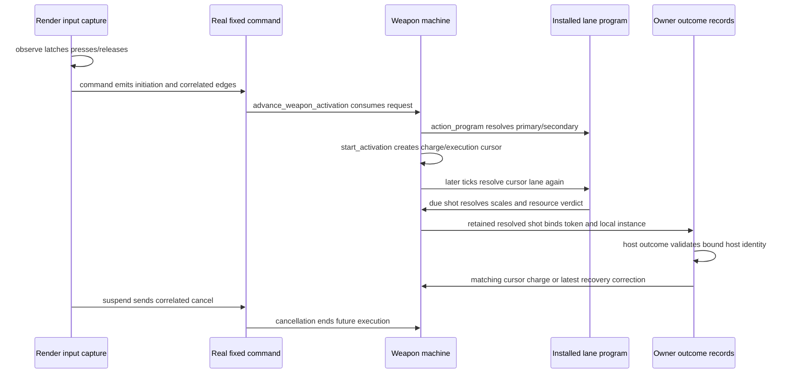

# Persistent firing modes — grounding

Read at `ecc6adc` (main), after weapon activations, activation start-lane/cadence, and switch-lane work landed. Mode selection in `index.md` is proposed work.

## Existing seams

| Seam | Read source and observed contract |
|---|---|
| Authoring | `crates/foundation/src/data_descriptors/types/combat.rs`: `WeaponDescriptor` has required `primary` and optional `secondary`. `types/activation.rs`: `WeaponActivationDescriptor` carries trigger (`press`/`hold`), recovery, steps (shot/wait), optional charge, sounds, and `emits` cue aliases. `ShotScaleDescriptor` axes: damage, range, projectile speed/radius/size, knockback speed, resource cost. An unused `FireMode { Semi, Auto }` enum in `combat.rs` survives only in `#[cfg(test)]` helpers; it is not a descriptor field. |
| Expression scope | `crates/foundation/src/weapon_activation/compiled.rs`: `ActivationScope` resolves only the readonly `charge` input; no state-store reads or writes. Expressions produce scale axes only; they cannot pick steps, trigger, or lane. No authorable selector exists today short of placing two fixed actions on primary and secondary. |
| Program bounds | `crates/foundation/src/weapon_activation.rs`: `MAX_ACTIVATION_STEPS`, `MAX_ACTIVATION_SHOTS`, `MAX_ACTIVATION_WAIT_TICKS`. `compiled.rs`: `MAX_ACTIVATION_IR_DEPTH`, `MAX_ACTIVATION_IR_NODES`. These apply per program, so per mode. |
| Instance | `crates/entities/src/components/weapon.rs`: `WeaponComponent` owns shared resource/recovery, primary/secondary descriptors, serde-skipped `WeaponActivationPrograms`, and press latches. `cancel_activation` resets only the cursor. `refresh_from_descriptor` cancels before installing replacement programs. No selected-mode state exists. |
| Restore | `crates/entities/src/registry.rs`: `Component for WeaponComponent::into_value` and `EntityRegistry::set_component_value` call `ensure_activation_programs`, which installs only when caches are absent. It does not refresh installed caches. `WeaponActivationPrograms` compares equal unconditionally. |
| Execution | `crates/foundation/src/weapon_activation.rs`: `ActivationCursor` stores token (start tick + lane), step, ordinal, phase, due tick, charge. It holds no program or action identity. `crates/sim/src/weapon/execution.rs`: `advance_weapon_activation_with_shell_preemption` re-resolves `action_program` and `action_descriptor` from the cursor's lane every tick. Swapping primary's program mid-execution would retarget the live cursor; the proposed capture must fix that seam. |
| Reload priority | `crates/sim/src/sim/weapon_stage/machine.rs`: `tick_weapon_machine_phases` consumes fresh reload and cancels activation before the fire path. `tick_weapon_machine` hardcodes secondary unpressed; only `tick_weapon_machine_activation` passes real secondary input. |
| Prediction | `crates/sim/src/weapon/activation_prediction.rs`: `advance_predicted_weapon_tick` runs the shared execution path forward with fresh reload cancellation. Client weapon prediction has no rewind or replay; host outcomes correct recovery only. `WeaponActivationCheckpoint::capture`/`restore` (`execution.rs`) is used only by `crates/ai/src/weapon_controller.rs` to roll back a failed effect materialization. |
| Input | `crates/postretro/src/input/activation.rs`: `ActivationInputCapture` latches render-rate edges, favors secondary on simultaneous fresh starts, correlates release/cancel to the active token, and turns `suspend` into a pending cancel. |
| Relevance | `context/lib/input.md` §2: alt-fire is relevant only from a secondary activation, derived by exhaustive match. A selector-role secondary is not an activation; relevance must count it or alt-fire is unbound. |
| Edge intake | `crates/netcode/src/activation_edges.rs`: `ActivationEdges` retains starts (`observe_start`, `due_start`, `LaneRefusal`) and release/cancel edges under `MAX_RETAINED_ACTIVATION_EDGES` and `RETENTION_TICKS`. Built around execution tokens and cadence (`command_queue/activation_cadence.rs`). |
| Press lane | `context/lib/networking.md` §Host input command queue: reload, use and drop ride in-band rising-edge lanes observed before stale-drop and trim, delivered once, in client-tick order with activation starts (`PressEdges`, `PressGate` in `crates/netcode/`). §Switches keep the client's order records the Control lane's gap: a switch arriving after input stamped later cannot reorder it. |
| Switch lane | `crates/net/src/wire/control.rs`: `ClientSwitchDeclaration { declaration_id, slot, client_tick }` on reliable Control. Client predicts the equip and keeps a `PendingSwitchDeclaration` rollback chain (`crates/netcode/src/endpoint.rs`). Host retains in `command_queue/switch_lane.rs`, applies in client-tick order behind `PressGate` / `switch_gate`, and answers `SwitchAccepted` / `SwitchRefused`. `resolve_switch_outcome` (`crates/netcode/src/lib.rs`) accepts only the front declaration. Closest precedent for a discrete, acknowledged, predicted weapon-state change. |
| Correction | `crates/postretro/src/client_weapon/reconcile.rs`: `ActivationRecords` binds local weapon identity to host identity on initiation acceptance, ignores mismatched host IDs, retains per-token shots, and limits recovery correction to the latest request per local instance. |
| Host tuning | `crates/combat-model/src/carried_loadout.rs`: `WieldableTuningPayload` carries host primary/secondary programs; `TuningPayload::new` strips owner-local sounds. Payload carries no active slot or magazine. `TUNING_PAYLOAD_EPOCH` versions it. |
| Owner state | `crates/netcode/src/state_slots.rs`: magazine, heat, cell, reload, cooldown reach the owner as owner-private snapshot slots keyed by host wieldable (`WeaponSlotProjection`), repaired by baseline refresh. No reliable per-weapon state acknowledgement exists. Admission sends no authoritative active slot; the client defaults to the first occupied slot. |
| Drop | `crates/sim/src/sim/touch.rs`: `drop_wieldables` moves the same entity after a successful physical drop, cancels activation, clears latches and reload feedback, retains resources/recovery. `acquire_wieldable` reuses that entity id. On a connected client, `materialize_net_local_wieldable_inventory_from_tuning` (`crates/sim/src/scripting/builtins/net_descriptor.rs`) spawns a fresh local instance when a slot's canonical name changes, so per-instance state reaches the client only through tuning or owner-private slots. |
| Level carry | `CarriedState` carries health, reserve, canonical weapon names, magazines, active slot. `crates/sim/src/scripting/builtins/wieldable_inventory.rs` spawns fresh instances and restores magazines. `crates/netcode/src/seat.rs` `carried_fields` destructures `CarriedState` exhaustively, so a new field fails to compile until the ledger handles it. `entity_model.md` §Weapon resources states the loadout keeps magazines only. |
| Lifecycle | Death: `sweep_deaths` → `cancel_owned_weapon_activations` cancels every owned wieldable. Disconnect: `on_slot_closed_with_fallback` despawns inventory wieldables after `harvest_pawn`. Hot reload: `plan_weapon_replace` (`crates/scripting-core/src/refresh_plan.rs`) calls `refresh_from_descriptor`; host tuning (`apply_net_wieldable_tuning`) and the AI controller also call it. |
| HUD facts | `crates/sim/src/scripting_systems/ui_proxy.rs`: `publish_local_weapon_state` writes local `player.weapon.*`, spread, charge, and resource facts on every role (`ReplicationScope::None`). Resource and reload facts are owner-private replicated on a connected client. |
| Sounds | `crates/postretro/src/sound_events/descriptors.rs`: `weapon_emission_sound` resolves frozen shot sounds, then action sounds, then the canonical-name table. Emitter is the pawn (`entity_emitter`), not the weapon. Observer cues ride reliable Input-channel `WeaponCuesMessage`; `WeaponCueKind` is `{ Activate, Impact }` only. No non-shot weapon cue reaches observers today; a selection cue needs a new kind and a wire bump. |
| Condition algebra | `crates/foundation/src/ir/mod.rs`: `IrType` and `IrValue` are number and bool only; `ir/scope.rs` gives String/Enum slots no IR projection, by design (`plans/done/M14--behavior-ir-substrate`, `plans/done/E18--ir-valued-reactions`). SDK `read()` overloads accept number and boolean refs only. HUD branches on enum/string slots through UI-only `stateEquals` (`sdk/lib/ui/state.ts`; `content/dev/scripts/hud.ts` on `player.weaponResource`). |
| AI | Enemies drive primary only (`crates/ai/src/weapon_controller.rs`). No rule picks a mode for an AI-wielded modal weapon. |
| Versions | `WIRE_VERSION` (`crates/net/src/handshake.rs`), `SNAPSHOT_VERSION` (`crates/net/src/wire.rs`), `TUNING_PAYLOAD_EPOCH`, `StateSchema::fingerprint`. History: `networking.md` §Version gates. |

## Existing lifecycle

This diagram shows read call sites, before the proposed selector. It identifies where one mode ID must remain bound; it does not claim the new behavior exists.

Cancellation/resource policy: `context/lib/entity_model.md` §Weapon activations, `networking.md` §Combat authority.

## Proposed invariants

| Invariant | Seams to preserve | Proof |
|---|---|---|
| Selection belongs to one instance and owner lifetime | Component, drop, client re-materialization, inventory carry, host request binding, correction | AC5–6 |
| Captured activation identity stays fixed | Start, charge release, due-shot lookup, prediction/correction, delayed impacts | AC4, AC6–7 |
| Selection cannot create resource/recovery state | Selector gate, reload priority, primary gate, cancellation | AC2–3 |
| A pending target is transient and never fires | Busy detection, idle-tick apply before the start gate, discard on switch/drop/death/suspension/disconnect/restore | AC3, AC5 |
| Every accepted selector press applies at most once | Render latch, fixed intake, host admission, deduplication, correction | AC2, AC6, AC8 |
| Feedback describes that same selection | HUD publication, owner cue, host acknowledgement, observer cue | AC7 |

## Build-time size flags

Affected seams lead into large files: `entities/src/components/weapon.rs`, `foundation/src/data_descriptors/types/combat.rs`, and `netcode/src/client.rs`. Split the responsibility actually extended before adding behavior. Do not turn this brief into a general decomposition project.

General entity save/load is a non-goal in `context/lib/entity_model.md`. Component serde and the in-memory carried-loadout mechanism exist; neither establishes a disk save-game feature.
