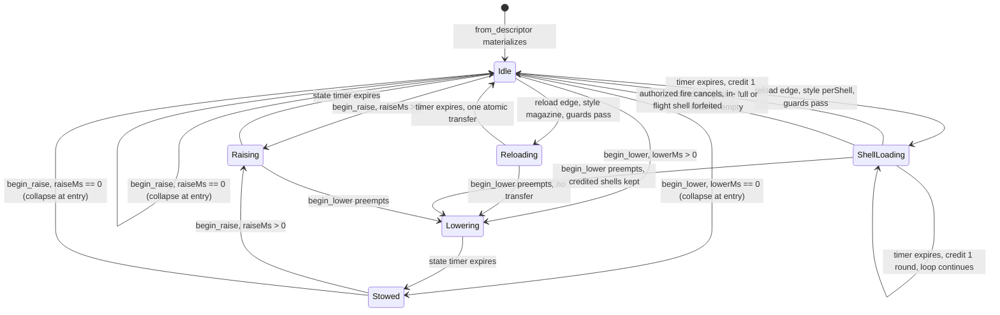

# Research — Weapon State Machine

Investigation notes behind `index.md`. Not the spec.

---

## 1. What "state" means today (grounded)

There is no `WeaponState` enum anywhere in the workspace (grep: `raising`,
`lowering`, `holster`, `WeaponState` — no production hits). State is implied by
which timer on `WeaponComponent` is nonzero:

| Implied state | Predicate | Read at |
|---|---|---|
| cooling | `cooldown_remaining_ms > 0.0` | `apply_weapon_fire_state` (`crates/postretro/src/weapon/mod.rs:461`) |
| reloading | `reload_remaining_ms > 0` | `apply_weapon_fire_state` (`:467`), `reload::tick` (`crates/postretro/src/sim/reload.rs:41`), `WeaponComponent::reload_status` (`crates/entities/src/components/weapon.rs:146`) |
| idle | neither | fallthrough |

Two producers write those timers and neither can see the other's decision:

- `sim/reload.rs::tick` owns reload start/advance/complete and the pawn
  `AmmoReserve` transfer. It runs **first** in the tick.
- `weapon/mod.rs::apply_weapon_fire_state` owns cooldown decrement, `wants_fire`,
  and the magazine debit. It runs **second**, and receives the boolean
  `reload_started_this_tick` computed by the caller from the reload deliveries
  (`sim/mod.rs:1201-1203` remote, `:1287-1289` local).

That one-way boolean is the whole coupling. It is sufficient for
"reload blocks fire" and structurally insufficient for "fire cancels reload" —
the direction per-shell needs. **This is why the two must fuse into one tick,
and it is the load-bearing structural finding of this research.**

## 2. Lifecycle diagram (target machine)

Read call sites the arrows require:

| Arrow | Read site |
|---|---|
| every `--> Idle` from a timer | the fused machine tick, called from `run_local_weapon_command` and `run_remote_weapon_commands` |
| `Idle --> Reloading/ShellLoading` | reload rising edge, derived from `SimCommand.reload` + `WeaponComponent::reload_press_consumed` (`sim/reload.rs:42-43`) |
| `ShellLoading --> Idle` (fire) | the `wants_fire` + cooldown + magazine gate now inside the machine, today `apply_weapon_fire_state` (`weapon/mod.rs:451-477`) |
| `Idle/Stowed --> Raising` | equip-at-spawn — `spawn_from_player_starts` (`crates/postretro/src/scripting/builtins/data_archetype.rs:879-927`) and the net-slot path in `net_descriptor.rs` |
| `* --> Lowering` | `begin_lower` seam; **no production caller in this spec** (switching spec owns it) |

Cooldown is deliberately **not** a state. `reload::tick` never consults
`cooldown_remaining_ms`, so a reload can start while cooling today; making
`Cooling` a state would serialize the two and change shipped behavior. Cooldown
stays an orthogonal rate limiter that composes with `Idle`.

## 3. Observers (vantage x lifecycle stage)

Four vantages exist on weapon state. Naming them was necessary because two of
them are *not* simulations at all.

| Vantage | Entry point | Owns a `WeaponComponent`? |
|---|---|---|
| **V1** single-player / listen-host local pawn | `run_local_weapon_command` (`sim/mod.rs:1255`) | yes, plus a local hitscan ray |
| **V2** host-simulated remote pawn | `run_remote_weapon_commands` (`sim/mod.rs:1171`) → `weapon::tick_state_only_component` (`weapon/mod.rs:418`) | yes, no ray; `can_fire` is repurposed to mean "pawn has a NetworkId" (`sim/mod.rs:1210-1212`) |
| **V3** connected client, local prediction | `ClientWeaponState` (`weapon/mod.rs:58`), `resolve_client_fire` (`:530`) | **no** — rebuilt from the pawn descriptor's `defaultWeapon` (`from_local_pawn_descriptor`, `:70`); models cooldown/fire-mode/range only, no ammo, no reload |
| **V4** owner-private replication projection | `AmmoSlotProjection::for_pawn` (`crates/postretro/src/netcode/state_slots.rs:499`) | no — reads V1/V2's component through `WeaponOwners` |

| Stage | V1 | V2 | V3 | V4 |
|---|---|---|---|---|
| materialize + raise | enters `Raising` at equip (collapses at `raiseMs == 0`) | same, at the net-slot equip site | unaware — no state modelled | `reloadActive=false` throughout |
| idle fire | full gate | same gate, no ray | predicts cooldown only | `player.ammo` follows magazine |
| reload start / advance | machine | machine | unaware; keeps predicting fire | `reloadActive=true`, step progress |
| per-shell step credit | machine credits 1 from `AmmoReserve` | same | unaware | `player.ammo` increments per shell |
| fire cancels shell loop | machine | machine | predicts the shot; host accepts | `reloadActive` drops to false |
| fire during raise/lower/reload | rejected silently | rejected silently | **predicts, then rolls back on `ShotVerdict`** | unchanged |
| hot reload | preserves live state | preserves live state | rebuilt from descriptor on pawn respawn only | reads whatever V1/V2 hold |

**Warrant, V1 == V2 for the machine.** Both call `reload::tick` with the same
signature and then a `weapon::tick_*_component` with the same
`reload_started_this_tick` flag; the only divergence is which of
`tick_resolved_component` / `tick_state_only_component` runs, and both delegate the
entire gate decision to the same private `apply_weapon_fire_state`
(`weapon/mod.rs:368-376` and `:428-436`). Placing the machine inside that shared
callee therefore serves both vantages with one implementation. If the machine were
placed in `tick_resolved_component` instead, V2 would silently skip it.

**Warrant, V3 needs no new work.** A host-side rejection during `Raising`,
`Lowering`, or a reload takes the identical path a reload rejection takes today:
`run_remote_weapon_commands` returns before `authorized.push` (`sim/mod.rs:1225-1232`),
so no `AuthorizedShot` is minted, the client's `HitDeclaration` binds to nothing, and
`ClientPredictedShots::apply_verdict` (`weapon/mod.rs:191-216`) restores
`cooldown_remaining_ms` from `cooldown_before_ms` and clears `muzzle_fx_visible` /
`hitmarker_visible`. The new states widen *when* that path fires, not what it does.

**Warrant, V4 needs no new slot.** `AmmoSlotProjection::for_pawn` already calls
`WeaponComponent::reload_status()` and reads `weapon.magazine`
(`state_slots.rs:503-515`). Redefining `reload_status()` to report the current
*step* changes what the projection publishes without changing the projection.
Per-shell progress is separately observable because `player.ammo` republishes the
live magazine every frame, which increments once per credited shell.

## 4. Oversized-file watch

| File | Total | Production (pre-`mod tests`) | Verdict |
|---|---|---|---|
| `crates/postretro/src/sim/mod.rs` | 3453 | 1446 | **split before extend** — extract the weapon stage |
| `crates/postretro/src/weapon/mod.rs` | 2201 | 706 | under the line; extend in place |
| `crates/entities/src/components/weapon.rs` | 417 | 198 | fine |
| `crates/postretro/src/sim/reload.rs` | 213 | 191 | fine; becomes the machine's driver |
| `crates/foundation/src/data_descriptors/types/combat.rs` | 399 | 222 | fine |
| `crates/postretro/src/netcode/mod.rs` | 4334 | — | not extended by this plan |

The extractable seam in `sim/mod.rs` is contiguous and cohesive: `normalize_aim_direction`
(`:1160`), `run_remote_weapon_commands` (`:1171`), `run_local_weapon_command` (`:1255`),
`apply_weapon_impact_damage` (`:1310`), `apply_authorized_weapon_impact_damage` (`:1339`),
`apply_weapon_impact_damage_with_source` (`:1357`), `deliver_reload_to_weapon` (`:1423`),
plus `weapon_fire_command` (`:1134`). ~290 lines.

## 5. Multi-pellet — why it stays out

`AuthorizedShot.pellet_count` exists (`crates/postretro/src/netcode/mod.rs:660`) and is
hardcoded `1` at both construction sites (`sim/mod.rs:1244`, `netcode/lifecycle.rs:767`
and `:943`). It is already consumed generically: hit-declaration acceptance clamps
records with `.take(pellet_count)` (`netcode/mod.rs:2232`) and rejects `pellet_count == 0`
(`:2224`), and a test already drives `pellet_count = 2` (`:3056`). So the wire and
validation side is *already* pellet-count-general — raising it above 1 is an additive
change owned by the Resolution Modes milestone, not a prerequisite for reload style.

## 6. Reload edge transport — why no new wire field

`SimCommand.reload` (`sim/mod.rs:27`) is a held level bit with a dedicated reliable
edge lane on the host (`pending_reload_presses` / `observe_reload_level` /
`preserve_due_reload_press`, `crates/postretro/src/netcode/command_queue.rs:187-231`),
documented in `networking.md` §Host input command queue. The lane exists because a
*rising edge* can be destroyed by stale-drop or catch-up trimming.

The only production interrupt this spec introduces is an authorized fire, which
already crosses on `FireButtonState` and is decided host-side by the same gate that
authorizes the shot. There is no separate cancel intent to transport, so the lane is
not extended and no wire field is added. A dropped fire command produces no shot and
therefore no cancel — the loop simply continues, which is the correct degradation.
`begin_lower` has no wire driver at all in this spec.

## 7. Descriptor / SDK surface as it stands

- `AmmoResource` (`crates/foundation/src/data_descriptors/types/combat.rs:33`):
  `ammo_type` (wire `type`), `magazine`, `cost_per_shot` (`costPerShot`, default 1),
  `reserve`, `reload_ms` (`reloadMs`, default 1000). Validation at `:121-136` requires
  `magazine`, `costPerShot`, `reloadMs` all `>= 1`.
- Enum serde convention is `#[serde(rename_all = "camelCase")]` on the enum, so variant
  wire values are camelCase — `FireMode::Semi` → `"semi"` (`combat.rs:12-17`). This is
  why `PerShell` serializes `"perShell"`, **not** the `"per-shell"` kebab spelling
  sketched in `context/research/weapon-model.md:131`.
- SDK types are generated: `sdk/types/postretro.d.ts:238-255` and
  `sdk/types/postretro.d.luau:237-254` already carry `AmmoResource` and the
  `WeaponResource` union, from `register_type` / `register_tagged_union` in
  `crates/postretro/src/scripting/primitives/mod.rs`.
- `docs/scripting-reference.md` `## components.weapon` (from line ~190) documents the
  block and the `resource` row, and already states reload duration is read through the
  effective-stat seam.

## 8. Hot-reload precedent

`refresh_from_descriptor` (`crates/entities/src/components/weapon.rs:128-144`)
deliberately preserves cooldown, input edges, magazine, and every reload timer value,
and its comment names them. `reload::tick`'s completion path re-reads
`component.effective()` at completion so "a hot descriptor refresh during reload
redirects capacity and transfer to the refreshed ammo pool" (`sim/reload.rs:97-102`).
Those two precedents settle the new field's policy: **state and its timers are live
instance state (preserved); durations and style are authored tuning (refreshed, and
honored at the next decision point).**
