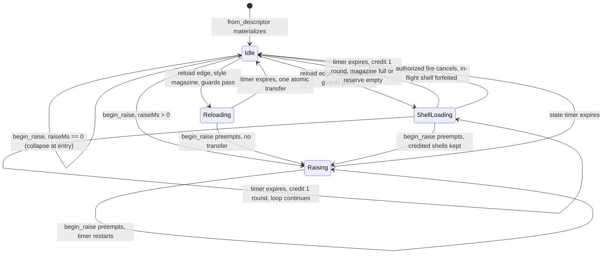

# Research — Weapon State Machine

Investigation notes behind `index.md`. Not the spec.

---

## 1. What "state" means today (grounded)

There is no `WeaponState` enum anywhere in the workspace (grep: `raising`,
`lowering`, `holster`, `WeaponState` — no production hits). State is implied by
which timer on `WeaponComponent` is nonzero:

| Implied state | Predicate | Read at |
|---|---|---|
| cooling | `cooldown_remaining_ms > 0.0` | `apply_weapon_fire_state` (`crates/postretro/src/weapon/mod.rs:439`) |
| reloading | `reload_remaining_ms > 0` | `apply_weapon_fire_state`, `reload::tick` (`crates/postretro/src/sim/reload.rs:41`), `WeaponComponent::reload_status` (`crates/entities/src/components/weapon.rs:146`) |
| idle | neither | fallthrough |

Two producers write those timers and neither can see the other's decision:

- `sim/reload.rs::tick` owns reload start/advance/complete and the pawn
  `AmmoReserve` transfer. It runs **first** in the tick.
- `weapon/mod.rs::apply_weapon_fire_state` owns cooldown decrement, `wants_fire`,
  and the magazine debit. It runs **second**, and receives the boolean
  `reload_started_this_tick` computed by the caller from the reload deliveries
  (`sim/mod.rs:1201-1203` remote, `:1287-1289` local).

That one-way boolean is the whole coupling. It is sufficient for
"reload blocks fire" and structurally insufficient for "fire cancels reload" —
the direction per-shell needs. **This is why the two must fuse into one tick,
and it is the load-bearing structural finding of this research.**

## 2. Lifecycle diagram (target machine, as shipped by this spec)

Read call sites the arrows require:

| Arrow | Read site |
|---|---|
| every `--> Idle` from a timer | the fused machine tick, called from `run_local_weapon_command` (`sim/mod.rs:1255`) and `run_remote_weapon_commands` (`:1171`) |
| `Idle --> Reloading/ShellLoading` | reload rising edge, derived from `SimCommand.reload` + `WeaponComponent::reload_press_consumed` (`sim/reload.rs:41-43`) |
| `ShellLoading --> Idle` (fire) | the `wants_fire` + cooldown + magazine gate now inside the machine, today `apply_weapon_fire_state` (`weapon/mod.rs:439-477`) |
| `* --> Raising` | `begin_raise`; equip-at-spawn — `spawn_from_player_starts` (`crates/postretro/src/scripting/builtins/data_archetype.rs:823`, the arm that resolves `weapon_id` and calls `seed_weapon_reserve`) and `spawn_net_slot_pawn` (`crates/postretro/src/scripting/builtins/net_descriptor.rs:40`) |

Cooldown is deliberately **not** a state. `reload::tick` never consults
`cooldown_remaining_ms`, so a reload can start while cooling today; making
`Cooling` a state would serialize the two and change shipped behavior. Cooldown
stays an orthogonal rate limiter that composes with `Idle`.

`Lowering` and `Stowed` are **not** in this diagram. They have no driver until
weapon switching exists, and the switching spec owns them. §9 records the
extension points that make adding them additive.

## 3. Observers (vantage x lifecycle stage)

Four vantages exist on weapon state. Naming them was necessary because two of
them are *not* simulations at all.

| Vantage | Entry point | Owns a `WeaponComponent`? |
|---|---|---|
| **V1** single-player / listen-host local pawn | `run_local_weapon_command` (`sim/mod.rs:1255`) | yes, plus a local hitscan ray |
| **V2** host-simulated remote pawn | `run_remote_weapon_commands` (`sim/mod.rs:1171`) → `weapon::tick_state_only_component` (`weapon/mod.rs:418`) | yes, no ray; `can_fire` is repurposed to mean "pawn has a NetworkId" (`sim/mod.rs:1210-1212`) |
| **V3** connected client, local prediction | `ClientWeaponState` (`weapon/mod.rs:58`), `resolve_client_fire` (`:530`) | **no** — rebuilt from the pawn descriptor's `defaultWeapon` (`from_local_pawn_descriptor`, `:70`); models cooldown/fire-mode/range only, no ammo, no reload |
| **V4** owner-private replication projection | `AmmoSlotProjection::for_pawn` (`crates/postretro/src/netcode/state_slots.rs:498`) | no — reads V1/V2's component through `WeaponOwners` |

| Stage | V1 | V2 | V3 | V4 |
|---|---|---|---|---|
| materialize + raise | enters `Raising` at equip (collapses at `raiseMs == 0`) | same, at the net-slot equip site | unaware — no state modelled | `reloadActive=false` throughout |
| idle fire | full gate | same gate, no ray | predicts cooldown only | `player.ammo` follows magazine |
| reload start / advance | machine | machine | unaware; keeps predicting fire | `reloadActive=true`, step progress |
| per-shell step credit | machine credits 1 from `AmmoReserve` | same | unaware | `player.ammo` increments per shell |
| fire cancels shell loop | machine | machine | predicts the shot; host accepts | `reloadActive` drops to false |
| fire during raise/reload | rejected silently | rejected silently | **predicts, then rolls back on `ShotVerdict`** | unchanged |
| hot reload | preserves live state | preserves live state | rebuilt from descriptor on pawn respawn only | reads whatever V1/V2 hold |

**Warrant, V1 == V2 for the machine.** Both call `reload::tick` with the same
signature and then a `weapon::tick_*_component` with the same
`reload_started_this_tick` flag; the only divergence is which of
`tick_resolved_component` (`weapon/mod.rs:351`) / `tick_state_only_component`
(`:418`) runs, and both delegate the entire gate decision to the same private
`apply_weapon_fire_state` (`:439`). Placing the machine inside that shared
callee therefore serves both vantages with one implementation. If the machine were
placed in `tick_resolved_component` instead, V2 would silently skip it.

**Warrant, V3 needs no new work.** A host-side rejection during `Raising` or a
reload takes the identical path a reload rejection takes today:
`run_remote_weapon_commands` returns before `authorized.push` (`sim/mod.rs:1225-1232`),
so no `AuthorizedShot` is minted, the client's `HitDeclaration` binds to nothing, and
`ClientPredictedShots::apply_verdict` (`weapon/mod.rs:191`) restores
`cooldown_remaining_ms` from `cooldown_before_ms` and clears `muzzle_fx_visible` /
`hitmarker_visible`. The new states widen *when* that path fires, not what it does.

**Warrant, V4 needs no new slot.** `AmmoSlotProjection::for_pawn` already calls
`WeaponComponent::reload_status()` (`state_slots.rs:503`) and reads
`weapon.magazine`. Redefining `reload_status()` to report the current *step*
changes what the projection publishes without changing the projection.
Per-shell progress is separately observable because `player.ammo` republishes the
live magazine every frame, which increments once per credited shell.

## 4. Oversized-file watch

| File | Total | Production (pre-`mod tests`) | Verdict |
|---|---|---|---|
| `crates/postretro/src/sim/mod.rs` | 3453 | 1446 | **split before extend** — extract the weapon stage |
| `crates/postretro/src/weapon/mod.rs` | 2201 | 706 | under the line; extend in place |
| `crates/entities/src/components/weapon.rs` | 417 | 198 | fine |
| `crates/postretro/src/sim/reload.rs` | 212 | 191 | fine; becomes the machine's driver |
| `crates/foundation/src/data_descriptors/types/combat.rs` | 399 | 222 | fine |
| `crates/postretro/src/netcode/mod.rs` | 4334 | — | not extended by this plan |

The extractable seam in `sim/mod.rs` is contiguous and cohesive: `normalize_aim_direction`
(`:1160`), `run_remote_weapon_commands` (`:1171`), `run_local_weapon_command` (`:1255`),
`apply_weapon_impact_damage` (`:1310`), `apply_authorized_weapon_impact_damage` (`:1339`),
`apply_weapon_impact_damage_with_source` (`:1357`), `deliver_reload_to_weapon` (`:1424`),
plus `weapon_fire_command` (`:1134`). ~290 lines. `run_death_sweep` (`:1410`) sits inside
that address range but is the death stage, not the weapon stage — it stays.

## 5. Multi-pellet — why it stays out

`AuthorizedShot.pellet_count` exists (`crates/postretro/src/netcode/mod.rs:660`) and is
hardcoded `1` at both construction sites (`sim/mod.rs:1244`, `netcode/lifecycle.rs:767`
and `:943`). It is already consumed generically: hit-declaration acceptance clamps
records with `.take(pellet_count)` (`netcode/mod.rs:2232`) and rejects `pellet_count == 0`
(`:2224`), and a test already drives `pellet_count = 2` (`:3056`). So the wire and
validation side is *already* pellet-count-general — raising it above 1 is an additive
change owned by the Resolution Modes milestone, not a prerequisite for reload style.

Shipping spread here would also drag a second authority question into a state-machine
spec — how many hit records a client may declare per shot, and whether spread must be
deterministic across the prediction seam. A spec answering two authority questions gets
neither reviewed properly.

## 6. Reload edge transport — why no new wire field

`SimCommand.reload` (`sim/mod.rs:27`) is a held level bit with a dedicated reliable
edge lane on the host (`pending_reload_presses` / `observe_reload_level` /
`preserve_due_reload_press`, `crates/postretro/src/netcode/command_queue.rs:187-231`),
documented in `networking.md` §Host input command queue. The lane exists because a
*rising edge* can be destroyed by stale-drop or catch-up trimming.

The only production interrupt this spec introduces is an authorized fire, which
already crosses on `FireButtonState` and is decided host-side by the same gate that
authorizes the shot. There is no separate cancel intent to transport, so the lane is
not extended and no wire field is added. A dropped fire command produces no shot and
therefore no cancel — the loop simply continues, which is the correct degradation.
`begin_raise` is host-internal: it runs at spawn, not off a command.

## 7. Descriptor / SDK surface as it stands

- `AmmoResource` (`crates/foundation/src/data_descriptors/types/combat.rs:33`):
  `ammo_type` (wire `type`), `magazine`, `cost_per_shot` (`costPerShot`, default 1),
  `reserve`, `reload_ms` (`reloadMs`, default 1000). Validation at `:119-133` requires
  `magazine`, `costPerShot`, `reloadMs` all `>= 1`.
- `WeaponDescriptor` (`:56`) has no `Default` impl and already carries
  `third_person_model` / `viewmodel` (shipped by `plans/done/E21--coop-avatar-weapon-presentation/`).
  Adding a field therefore breaks every struct literal in the workspace — the compiler
  enumerates them, and no other in-flight plan is enumerating at the same time
  (`plans/in-progress/` holds only `E15--session-lifecycle` and `emissive-surfaces-bloom`).
- Enum serde convention is `#[serde(rename_all = "camelCase")]` on the enum, so variant
  wire values are camelCase — `FireMode::Semi` → `"semi"` (`combat.rs:12-17`). This is
  why `PerShell` serializes `"perShell"`, **not** the `"per-shell"` kebab spelling
  sketched in `context/research/weapon-model.md:131`.
- SDK types are generated: `sdk/types/postretro.d.ts:238-255` and
  `sdk/types/postretro.d.luau:237-254` already carry `AmmoResource` and the
  `WeaponResource` union, from `register_type` / `register_tagged_union`
  (`crates/scripting-core/src/primitives_registry.rs:231`, `:252`) driven from
  `crates/postretro/src/scripting/primitives/mod.rs`.
- `docs/scripting-reference.md` `## components.weapon` (line 193) documents the
  block and the `resource` row, and already states reload duration is read through the
  effective-stat seam.

## 8. Hot-reload precedent

`refresh_from_descriptor` (`crates/entities/src/components/weapon.rs:128-137`)
deliberately preserves cooldown, input edges, magazine, and every reload timer value,
and its comment names them. `reload::tick`'s completion path re-reads
`component.effective()` at completion so "a hot descriptor refresh during reload
redirects capacity and transfer to the refreshed ammo pool" (`sim/reload.rs:97-102`).
Those two precedents settle the new field's policy: **state and its timers are live
instance state (preserved); durations and style are authored tuning (refreshed, and
honored at the next decision point).**

## 9. Extension points — how `Lowering`, `Stowed`, and a switch interrupt land later

This spec ships four states. The switching spec adds at least two more plus a
switch-driven interrupt. The mechanics below are what make that additive rather than a
restructure; `index.md` states the requirement, this section records why each piece
suffices.

| Extension | What absorbs it | Why no restructure |
|---|---|---|
| A new state variant | one `WeaponState` enum, one transition function keyed by (state, event) | new arms, not a new dispatch shape |
| A new *timed* state | the generalized timed-state triple (remaining / total / sub-ms carry) | the triple is state-agnostic — no per-state timer field exists to add |
| A new state's fire/reload legality | `WeaponState::allows_fire()` / `allows_reload()`, exhaustive per-variant predicates | legality is one place, not scattered `state != Idle` tests |
| A new preempting entry point (`begin_lower`, switch interrupt) | `begin_raise`'s shape: legal from every state, forfeits the in-flight timed step, keeps credited rounds | the preempt-from-anywhere path is implemented and tested by this spec, not invented by the next one |
| Finding every site that must decide about a new state | no `_` wildcard arms over `WeaponState` in production | adding a variant is a compile error at each decision site |
| A new endpoint event pair | `ReloadOutcome` variants → `event_name` | the drain is name-driven; new variants need no new plumbing |

Two things deferral does *not* buy. First, `Stowed`'s "no weapon is live" semantics
interact with `active_wieldable` repointing, the switching spec's own hard problem; that
was never resolvable here, so deferring `Stowed` moves it to the spec that can answer it.
Second, the table above is scoped to the *enum*. It does not cover the machine moving
**layers** — off `WeaponComponent` onto a wieldable component, per `weapon-model.md` §2.
That is the one extension this shape does not absorb, and it is stated as a divergence in
`index.md` §Direction rather than papered over here.

## 10. Prior-commitment citation trail

Long form of `index.md` §Direction → *Prior commitments*.

- `context/research/weapon-model.md` §3 names per-shell reload "a cancellable state
  machine" and puts `reloadStyle` on the resource, not on the weapon. Honored. It spells
  the value `"per-shell"`; the repo's enum serde convention (§7) makes that `"perShell"`.
  Stated divergence: two sibling classifiers in one milestone should not disagree on
  casing.
- `plans/done/E16--ammo-resource/` shipped reload as "timed, non-cancellable,
  single-transfer" and explicitly deferred "per-shell / incremental / cancellable reload
  and the `reloadStyle` classifier" to this spec. The atomic style keeps that contract
  exactly; per-shell is a sibling, not a replacement.
- That spec also made reload duration an **effective stat** read through `effective()`,
  never the raw field. Honored, and generalized: `reloadMs` is the duration of one reload
  step, so a reload-speed modifier scales per-shell cadence for free rather than needing a
  second augmentable number.
- `context/lib/networking.md` §Combat authority: fire-rate and ammo stay
  host-authoritative; client-side ammo and reload prediction stay out of scope. Honored —
  V3 is untouched.
- `plans/done/reload-feedback-ui/` promised that a later timed-reload spec would "point a
  real reload state machine at the already-defined slot… no UI rework." Task 6's
  re-meaning of `player.reloadProgress` is that promise being kept, not a new liberty
  taken with a shipped scripting slot.
- `plans/done/movement--state-machine/` is the structural precedent: extract the
  substrate intact, then introduce the state enum with a baseline state that is
  behavior-identical and gated by the existing regression suite, then add states. Tasks 1
  and 2 are that shape.
- **Divergence from `plans/done/E10--behavior-state-graph/`.** That epic replaced an
  engine-closed enemy FSM with an *authored* behavior graph. This spec builds an
  engine-closed enum with hardcoded transitions — the shape E10 retired for enemies. The
  divergence is deliberate: `weapon-model.md` §3 commits `reloadStyle` to a fixed
  classifier ("a trait, not a number"), and `movement--state-machine` settled the same
  question the other way for a hot-path engine-internal system. Weapons take the movement
  answer, not the enemy one, because the transitions here are timing and resource
  legality rather than authored behavior. Reversible at the cost E10 itself paid: keep
  the enum, lower it to a graph later.
- Roadmap: `switching + inventory` "replaces the `active_wieldable` chokepoint." This
  spec deliberately does not touch that chokepoint.

## 11. Alternatives explored

Long form of `index.md` §Direction → *Alternatives rejected*, plus the ones that did not
earn a line there.

- **Ship `Lowering` and `Stowed` alongside `Raising`** (the previous draft's choice).
  Case for: the two halves of an equip transition are conceptually one thing, and pinning
  transition legality now means the switching spec does not re-open it. Rejected on the
  owner's call: neither has a production caller, both would ship as test-only states, and
  §9's extension points make adding them a matter of new arms rather than a reshape. The
  argument they were carrying — that an uninterruptible timed state is a genuinely
  different shape from an interruptible loop, and that the preempt-from-any-state path
  needs a live implementation — is carried by `Raising` alone, which is timed, is
  uninterruptible by fire, and is legal-and-preempting from every source state.
- **Drop `Raising` too; ship `Idle` / `Reloading` / `ShellLoading` only.** Rejected: two
  of the machine's rules — zero-duration collapse and preempt-from-any-source — would
  then be exercised by nothing, and `Raising` has a real driver today (equip-at-spawn) in
  a way `Lowering` does not.
- **Zero-duration `Raising`, given a duration later by the switching spec.** Keeps the
  state but never times it. Rejected: a state machine whose timed transitions are never
  timed is an unvalidated abstraction. A real duration with a `0` default gets both — the
  timed path is exercised by the dev shotgun and by tests, every existing weapon is
  bit-identical to today.
- **Keep the two producers; add a second boolean (`fire_wants_cancel`) back into
  `reload::tick`.** The minimal diff, and it works for exactly this one interrupt.
  Rejected because it re-derives the implicit-state scheme one interrupt later: switching
  adds a third boolean, and the ordering constraints between the three become unwritable.
  The fusion is the whole point.
- **Multi-pellet shotgun spread in this spec.** See §5.
- **A rack / finish stage after a cancelled per-shell reload.** Classic shotguns play a
  close-bolt animation on cancel, and modelling it would give cancellation a real cost.
  Rejected for v1: it is a third uninterruptible-timed-stage shape and `Raising` already
  validates that shape. Purely additive later (one state, one duration field), and with
  no weapon animation system it would be an invisible delay today.
- **A dev-tools-only input binding to drive equip transitions manually.** Rejected: it
  adds an `Action` variant and binding-table churn for a demo, and the switching spec
  removes it weeks later.

## 12. Foreclosures and one-way doors (long form)

- **Cooldown can never become a state without a behavior change.** A reload can start
  while cooling today and the machine keeps that true, so a future `Cooling` state would
  have to break it. Named so the switching spec does not treat it as free.
- **One state at a time.** A weapon cannot be simultaneously equipping and reloading.
  Dual-wield (roadmap, later) generalizes the *active reference* to a pair and each
  instance keeps its own machine, so the pair case is unaffected — but a single instance
  with two concurrent activities is now unrepresentable.
- **`reloadMs` stops being readable on its own.** It means "the whole reload" or "one
  shell" depending on the sibling `reloadStyle`, so every consumer — HUD, docs, a future
  augment tooltip, a modder — must read both. Accepted over a separate `shellReloadMs` so
  one reload-speed modifier scales both styles, but it is a real loss of local
  readability.
- **The `reloadStyle` discriminant is the one hard-to-reverse piece.** Same class of bet
  as the `WeaponResource` tag, on the same authored surface, so changing its spelling or
  shape after content exists costs a content migration. Everything else reverses cheaply:
  adding a state is additive, `raiseMs` defaults to `0` (removing it restores today's
  behavior exactly), and the timer generalization is internal to two crates.
- **The switching spec inherits a naming question, not just two states.** `weapon-model.md`
  §2 puts equip on the *wieldable* layer and says to name the machinery for wieldables.
  `Raising` / `raiseMs` land on `WeaponComponent` / `WeaponDescriptor` instead, because
  weapon is the only wieldable kind and no wieldable component exists to host them. If
  switching needs the machine to serve a second kind, lifting it off `WeaponComponent` is
  the one reshape §9's extension table does not cover. Renaming while weapons are the only
  kind is mechanical; the price rises per wieldable kind added.
- **What this hands to the switching spec.** `ClientWeaponState` owns no
  `WeaponComponent` and models cooldown, fire mode, and range only, so a connected client
  cannot see any state this spec adds. Acceptable here — a shot predicted during a
  host-side raise or reload rolls back through the shipped `ShotVerdict` path, and
  reloads are rare and player-initiated. One case is *not* player-initiated and is worth
  naming: with the dev default's non-zero `raiseMs`, a co-op client that fires immediately
  on spawn mispredicts exactly one shot and rolls it back. Tolerable at one shot per
  spawn; it becomes one per swap under switching, which is the point below. It will
  *not* be acceptable for switching, where
  a raise lockout fires on every swap and a per-swap mispredict-and-rollback would be
  visible. The switching spec inherits that choice: accept the per-swap rollback, or
  teach the client's prediction state about equip transitions.

## 13. Test-independence audit — does anything depend on `reference_pistol` being the dev default?

This spec flips `content/dev/scripts/player.ts`'s `defaultWeapon` from
`reference_pistol` to `reference_shotgun`. Audit result: **no existing test breaks.**

Grep for `reference_pistol` across `crates/` returns six files, all of which use it as a
free-standing string literal in a fixture the test itself constructs — none of them reads
dev content:

| Site | Use | Coupled to the dev default? |
|---|---|---|
| `crates/entities/src/components/weapon.rs:359, 371, 390, 408` | `canonical_name` argument to `from_descriptor_with_canonical`, asserted back out as `credit_source` | no — the string is the test's own input |
| `crates/scripting-core/src/data_descriptors/tests/entity.rs:134, 147, 163, 552, 630, 643, 658, 678` | inline JS/Luau descriptor source in the test body | no |
| `crates/net/src/wire.rs:2071, 2092, 2222, 2251, 2265` | `active_weapon_archetype` payload value | no |
| `crates/net/src/replication.rs:1568, 1580` | `active_weapon_archetype` payload value | no |
| `crates/postretro/src/main.rs:6504, 6514, 6536, 6551, 6560, 6564` | synthetic `DescriptorProvenance` / viewmodel descriptor | no |

No Rust test loads `content/dev/start-script.ts` or `content/dev/scripts/player.ts`. The
only tests that read dev-content files at all are in
`crates/postretro/src/scripting/entity_world_primitives.rs`, whose `dev_script_fixture`
helper (`:508`) is called with `trigger-fanout-fixture.{ts,luau}` and
`trigger-event-presser-fixture.{ts,luau}` only (`:794`, `:795`, `:835`, `:836`).
`crates/postretro/src/movement/mod.rs:254` mirrors `player.ts` — but its movement block,
not `defaultWeapon`.

So the requirement is forward-looking, not remedial: it constrains the tests **this spec
adds**. It is stated as an AC and an Invariants row rather than as task prose because the
coupling it forbids is cheap to introduce (`defaultWeapon` is the one weapon a dev-loop
integration test can reach without authoring a fixture) and invisible until someone
changes dev content.
