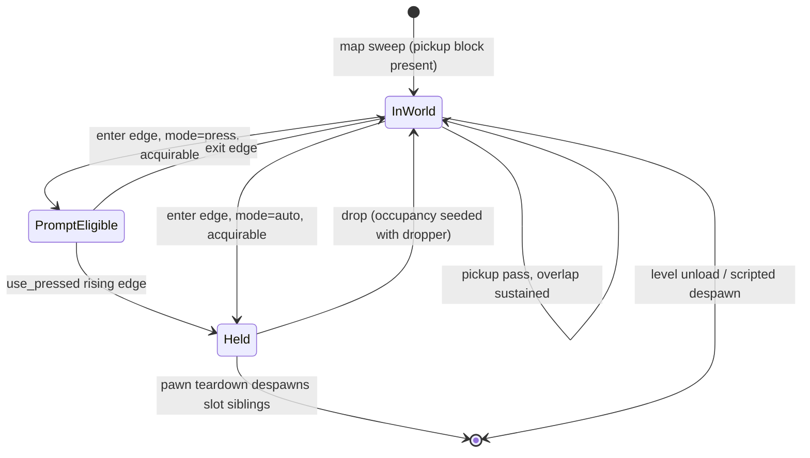

# Research — wieldable pickup and drop

Derivation notes. The spec is `index.md`.

## Why a `pickup` block rather than widening `weapon`

`is_directly_map_placeable` (`scripting/builtins/data_archetype.rs`) excludes `weapon`, pinned by
`map_sweep_skips_weapon_only_descriptors` and
`map_sweep_skips_weapon_component_on_otherwise_placeable_descriptor`. Both tests place a descriptor
that authors no pickup, so keying placement on a new `components.pickup` block leaves both passing
unchanged. Widening the `weapon` arm instead would delete a shipped guarantee — equip targets would
become map-placeable — to buy the same outcome.

## Why acquisition rides the trigger stage's inputs

`TriggerTickInputs` already carries `players: &[AuthoritativePlayer]` and
`use_pressed: &HashMap<PlayerId, bool>`, populated for the local pawn (`main.rs`, the
`Action::Use` rising edge) and for every remote pawn (`main.rs`, `remote.command.use_pressed`).
`canonical_player_capsules` resolves each player's `Transform` + capsule in the same stage. Press-mode
pickup needs exactly these three values and nothing else, so it needs no new input plumbing.

## Why a world item is inert without an explicit rule

Both weapon-stage entry points reach weapons only through the owner: `run_local_weapon_command`
resolves `Inventory::active_wieldable`, and `run_remote_weapon_commands` reads `RemotePawnCommand.weapon`.
No production code calls `iter_with_kind(ComponentKind::Weapon)`. An unowned world weapon therefore
never ticks — no cooldown decay, no state machine, no reload timer — without a dormancy rule.
The spec pins this rather than assuming it, because it is a property of two call sites that a future
scan-based stage would silently break.

## Why the AI-enemy replication discipline, not the mover discipline

Two shapes exist. Movers: both peers load the entity from PRL and the host binds by `mover_id`.
AI enemies: the client suppresses its map-sweep spawn (`descriptor_materializes_ai_enemy` filters the
client sweep) and the host baseline materializes it, so a host despawn carries a tombstone.

A dropped item has no PRL record, so the mover discipline cannot represent it at all. The enemy
discipline covers map-placed and dropped items with one path.

Held weapons are not replicated in production — the only `replicable.register(weapon)` calls are in
`netcode/lifecycle.rs` test fixtures. A client learns the active weapon from `active_weapon_archetype`
on the pawn record and from the tuning payload. So a world item is a genuinely new replicated
category, not an existing one being reused.

## Why acquisition is an enter edge

Sustained-overlap acquisition makes drop unimplementable: the dropping player stands inside the item's
radius and re-acquires on the next tick. Seeding the item's occupancy with the dropping player at drop
time, and firing only on the enter transition, resolves it with the structure `TriggerSystem.occupants`
already uses.

## Lifecycle

`acquirable` = descriptor resolves, the pawn owns no wieldable of the same canonical name, and the
inventory has a free slot. A refused item stays `InWorld` and is not prompt-eligible.

## Frame placement

The pickup pass runs inside `simulate_tick_with_presentation_aim`, immediately after the trigger stage
and before the AI tick. `entity_model.md` §7 places entity-entity overlap "after all entity updates";
the weaker placement is sufficient here and is chosen deliberately: the only entities whose motion can
open or close a pickup overlap are player pawns (movement stages) and items (which do not move). AI
entities do not acquire items in this spec. Running before AI keeps the acquisition edge in the same
tick as the movement that produced it.

## What pickup inherits free from E15 seats

`CarriedState.wieldables` stores canonical descriptor names harvested from each slot's
`DescriptorProvenance.canonical_name`, and `clear_pawn_bindings_for_level_unload` deliberately does not
clear `carried`. A picked-up weapon carries across a level transition with no new carry code, provided
it is in the inventory when `harvest_bound_pawns` runs during `unload_level`. The instance does not
survive — it respawns from the name through `compose_wieldable_inventory_slots`, with the magazine
restored from the parallel `CarriedState.magazines` array.
