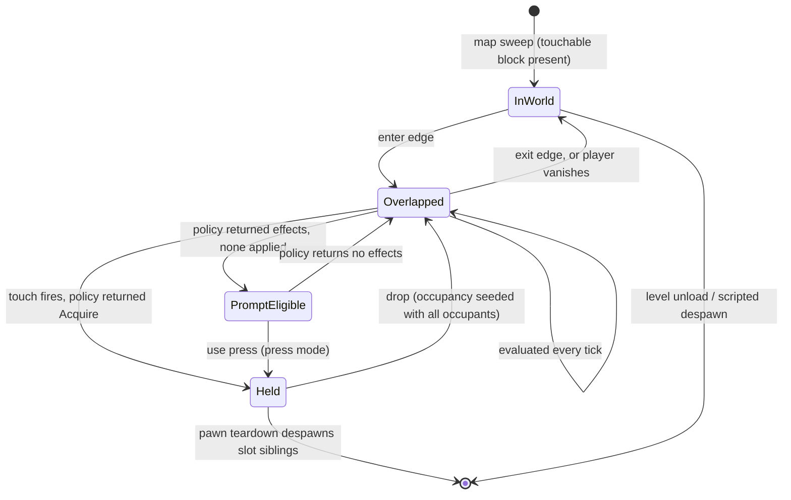

# Research — wieldable pickup and drop

Derivation notes. The spec is `index.md`.

## Why a `touchable` block rather than widening `weapon`

`is_directly_map_placeable` (`scripting/builtins/data_archetype.rs`) excludes `weapon`, pinned by
`map_sweep_skips_weapon_only_descriptors` and
`map_sweep_skips_weapon_component_on_otherwise_placeable_descriptor`. Both tests place a descriptor
that authors no touchable block, so keying placement on `components.touchable` leaves both passing
unchanged. Widening the `weapon` arm instead would delete a shipped guarantee — equip targets would
become map-placeable — to buy the same outcome.

The block is named for the affordance, not the outcome. An entity that dispatches a touch may later be
dismantled, swapped, or inspected rather than picked up, and the descriptor key is the surface that is
most expensive to rename after mods ship.

## Why the facts are a dispatch scope, not store slots

The state store carries seven engine-owned player slots — `player.ammo`, `player.ammoReserve`,
`player.health`, `player.maxHealth`, `player.reloadActive`, `player.reloadProgress`,
`player.weaponCooldownMs` — all readonly to scripts, all projected per-pawn through
`active_wieldable_for_pawn`, all replicated `OwnerPrivatePlayer`. Three properties rule them out as a
home for touch facts:

- Every one describes the **active** weapon. There is no per-slot addressing, so `ownedCount` is not
  derivable from the store even indirectly.
- The one identity signal, `player.weapon.current`, is a `SlotValue::String` written by `ui_proxy.rs` for
  the HUD. The IR carries number and bool, so a policy cannot read it.
- A slot holds one value. Two players touching two different items on one tick need two different
  `ownedCount` values resolved before either acts.

`@impact.healthBefore` is a dispatch fact even though `player.health` is a store slot, for the same
reason: `scripting.md` §12 gives params only the values that exist *because* this source fired.

## Why `reserve` and not `reserveHeadroom`

`AmmoReserve` exposes `available`, `credit`, `set_exact`, `take`, and `balances`. `credit` saturates at
`u32::MAX`; there is no per-type cap anywhere. Remaining capacity is therefore not a value the engine can
compute, so the fact is the current balance.

## Why acquisition rides the trigger stage's inputs

`TriggerTickInputs` already carries `players: &[AuthoritativePlayer]` and
`use_pressed: &HashMap<PlayerId, bool>`, populated for the local pawn (`main.rs`, the
`Action::Use` rising edge) and for every remote pawn (`main.rs`, `remote.command.use_pressed`).
`canonical_player_capsules` resolves each player's `Transform` + capsule in the same stage. Press-mode
touch needs exactly these three values and nothing else, so it needs no new input plumbing.

## Why a world item is inert without an explicit rule

Both weapon-stage entry points reach weapons only through the owner: `run_local_weapon_command`
resolves `Inventory::active_wieldable`, and `run_remote_weapon_commands` reads `RemotePawnCommand.weapon`.
No production code calls `iter_with_kind(ComponentKind::Weapon)`. An unowned world weapon therefore
never ticks — no cooldown decay, no state machine, no reload timer — without a dormancy rule.
The spec pins this rather than assuming it, because it is a property of two call sites that a future
scan-based stage would silently break.

## Why the AI-enemy replication discipline, not the mover discipline

Two shapes exist. Movers: both peers load the entity from PRL and the host binds by `mover_id`.
AI enemies: the client suppresses its map-sweep spawn (`descriptor_materializes_ai_enemy` filters the
client sweep) and the host baseline materializes it, so a host despawn carries a tombstone.

A dropped item has no PRL record, so the mover discipline cannot represent it at all. The enemy
discipline covers map-placed and dropped items with one path.

Held weapons are not replicated in production — the only `replicable.register(weapon)` calls are in
`netcode/lifecycle.rs` test fixtures. A client learns the active weapon from `active_weapon_archetype`
on the pawn record and from the tuning payload. So a world item is a genuinely new replicated
category, not an existing one being reused.

## Why a touch fires on an edge, and evaluation does not

Sustained-overlap dispatch makes drop unimplementable: the dropping player stands inside the item's
radius and re-acquires on the next tick. Seeding the item's occupancy at drop time, and firing only on
the enter transition, resolves it with the structure `TriggerSystem.occupants` already uses.

Prompt-eligibility cannot ride the same edge. A `press` item reports eligibility on every overlapping
tick, but its touch fires only on a press — so eligibility computed from a touch would never appear.
Evaluation therefore runs every tick per overlapping pair and drives eligibility; effects apply only on
a touch. The `pressed` fact carries the player's live state at each evaluation rather than a synthesized
value, so a policy gating on it reports eligibility exactly on the ticks a press would produce something.

The drop seed covers every player overlapping the drop point, not only the dropper. Seeding the dropper
alone leaves a second player already standing there free to take the item on the drop tick, and lets two
adjacent players dropping on one tick swap weapons on the next.

## Sphere-vs-capsule uses the point-vs-range helper

`capsule_overlaps_aabb` decomposes into `range_distance` (point vs range) on X and Z and
`segment_range_distance` (segment vs range) on Y, because both shapes have extent. A pickup sphere is a
point plus a radius, so its vertical term is point-vs-range against the capsule's Y extent —
`range_distance`, not `segment_range_distance`.

## Why `drop_pressed` is cleared on a gap-hold

`held_gap_sim_command` clears `use_pressed` and the fire button while carrying movement and `reload`
forward; `neutral_sim_command` synthesizes both false. The split is deliberate and documented at the
function: `reload` is a level bit that weapon-owned `reload_press_consumed` deduplicates, while fire
authorizes consumption on every resolution and must not re-authorize. `drop_pressed` is an edge in the
fire class, not the reload class — held across a 3-tick gap it would drop four weapons from one press,
each from a freshly repointed active slot.

## Policies the fact set covers

Each reads the same facts; only the effect list differs.

| Game | Gate | Effects |
|---|---|---|
| Quake | `ownedCount == 0 && freeSlots > 0` | `Acquire` |
| Doom | `ownedCount > 0` | `GrantAmmo`, `Despawn` |
| Halo | `freeSlots == 0` | `Drop(active)`, `Acquire` |
| Dismantle | `ownedCount > 0` | `SlotAdd(materials)`, `Despawn` |

`Despawn` and `slot.add` already ship as impact effects (`impact_effects.rs`, `impact_policy.rs`), and
`grant_ammo` is public in `crates/entities/src/components/grant.rs`. Only `Acquire` is new.

Not covered: replacing the lowest-stat wieldable drawing an ammo type. That ranks a collection, which the
IR forbids, and no fact about a single item can express it. It needs a pre-reducing fact family or an
engine-owned ranking word.

Per-player crafting materials need more than an effect arm. `slot.add` writes a global store slot, and
mods cannot declare `network: "ownerPrivate"` — `store_bridge.rs` rejects it with a named error. The
`OwnerPrivatePlayer` replication scope itself ships and engine slots use it, so the gap is the mod-facing
declaration and the per-seat storage, which `drafts/E16--per-player-currency` owns.

## Lifecycle

A touch fires on the `Overlapped → Held` transition in `auto` (the enter edge itself) and on the
`PromptEligible → Held` transition in `press`. Evaluation runs on every tick spent in `Overlapped` or
`PromptEligible`.

## Frame placement

The touch pass runs inside `simulate_tick_with_presentation_aim`, immediately after the trigger stage
and before the AI tick. `entity_model.md` §7 places entity-entity overlap "after all entity updates";
the weaker placement is sufficient here and is chosen deliberately: the only entities whose motion can
open or close an overlap are player pawns (movement stages) and items (which do not move). AI entities
generate no touches in this spec. Running before AI keeps the touch in the tick that produced it.

## What pickup inherits free from E15 seats

`CarriedState.wieldables` stores canonical descriptor names harvested from each slot's
`DescriptorProvenance.canonical_name`, and `clear_pawn_bindings_for_level_unload` deliberately does not
clear `carried`. A picked-up weapon carries across a level transition with no new carry code, provided
it is in the inventory when `harvest_bound_pawns` runs during `unload_level`. The instance does not
survive — it respawns from the name through `compose_wieldable_inventory_slots`, with the magazine
restored from the parallel `CarriedState.magazines` array.
