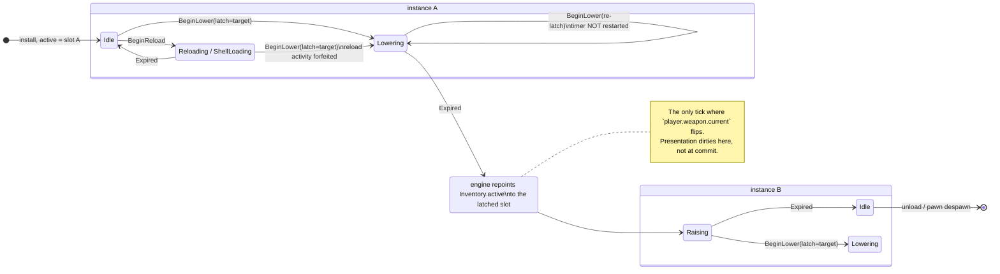

# Research — wieldable switching + inventory

Investigation notes behind `index.md`. Not a spec.

---

## 1. The three active-weapon holders, as found

| Holder | Declared | Shape | Role |
|---|---|---|---|
| `App.active_wieldable` | `crates/postretro/src/main.rs:683` | `Option<EntityId>` + sibling `active_wieldable_descriptor: Option<String>` | single-player **and listen-host local pawn** |
| `WeaponOwners` | `crates/postretro/src/netcode/command_queue.rs:78` | `HashMap<EntityId, EntityId>` pawn→weapon + `HashSet<EntityId>` attachment dirty set | host-only, all pawns |
| `ClientWeaponState` | `crates/postretro/src/weapon/mod.rs:58` | eight scalars, no `EntityId` | connected client only |

They are not three parallel systems. `App.active_wieldable` is written in exactly four places, all install/teardown (`startup/session.rs:254`, `startup/lifecycle.rs:809`, `:1019`, `:214`), and reaches `WeaponOwners` through one bridge — `host_register_own_pawn` (`netcode/mod.rs:2147`), called from `host_register_own_pawn_after_install` (`main.rs:5673`). Removing the global therefore removes the bridge, not just a field.

`active_wieldable_descriptor` is **write-only**: no read site exists in the tree despite the doc comment at `main.rs:680` claiming it feeds hot reload. Hot reload actually refreshes weapons through `DescriptorProvenance` (`crates/scripting-core/src/refresh_plan.rs:457`, `:478` → `WeaponComponent::refresh_from_descriptor`, `crates/entities/src/components/weapon.rs:334`). The field is dead and is deleted rather than migrated.

A connected client owns **no weapon entity**. `ClientWeaponState::from_local_pawn_descriptor` (`weapon/mod.rs:115`) is `#[cfg(test)]`-only, with a comment at `:71` stating a connected client must never consult its local registry for weapon tuning.

## 2. Why the tuning payload is the natural carrier for switch policy

`TuningPayload` (`crates/postretro/src/netcode/tuning_payload.rs:29`) is canonical JSON on `Channel::Control`, epoch-stamped, change-detected against `last_sent_tuning` (`netcode/mod.rs:412`), sent from two call sites (`main.rs:4978` on slot accept, `startup/lifecycle.rs:157` after level install).

It already carries a full `PlayerMovementDescriptor` — and that descriptor's fields are `NumberOrIr` / `BoolOrIr` (imports at `tuning_payload.rs:98`), so authored IR already crosses this payload. That finding is what made the rejected guard design affordable; with the guard dropped, the payload carries only per-slot fire values, equip durations, and one resolved boolean, which is strictly less than it already carries for movement. The "replicate rather than hash" property holds either way.

`tuning_payload_for_pawn` (`netcode/mod.rs:2283`) resolves tuning from the pawn class descriptor's `default_weapon` — never from `WeaponOwners`, never from the live `WeaponComponent`. That is why it survives today: exactly one weapon per pawn, fixed at install.

## 3. Why no timing primitive is needed at all

The spec first proposed an authored IR guard over a `@wieldable.*` namespace and then dropped it (see `index.md` Direction). Both halves of that investigation are kept here: the first subsection explains why a *general* timing vocabulary was never available, the second why the *scoped* one it would have justified is unnecessary once the dwell moves to the input layer.

### 3a. No general timing vocabulary exists

No mod-authorable timing vocabulary exists:

- `SequenceStep` has three fields and no delay (`crates/entities/src/data_descriptors/types/reactions.rs:42`).
- `onComplete` chains inside one `VecDeque` drain bounded at `MAX_BATCH_DISPATCH_HOPS = 256` (`crates/scripting-core/src/reaction_dispatch.rs:271`) — a same-frame hop, never a later tick.
- `IrNode` is closed at 15 opcodes with no time opcode (`crates/foundation/src/ir/mod.rs:111`).

Time enters IR only as a **named input leaf seeded by a scope**. `@brain.timeInStateMs` (`crates/foundation/src/brain.rs:34`, accumulated `scripting/systems/ai/mod.rs:485`, reset `:609`) is the shipped instance, and `ai/mod.rs:318` frames commitment windows as *"an authored `@brain.timeInStateMs` guard rather than an engine mechanism."* A `@wieldable.*` namespace would have been the same construction — which is what made it look justified, and §3b is why it is not.

Shipped `dt` slot accumulators (`scripting/systems/slot_accumulators.rs:13`) were considered and rejected: they can express *"condition C has held for N ms"* via a self-zeroing `select`, but not *"value unchanged for N ms"* — no scope exposes a previous value, and an accumulator's output is pinned to its own slot (`:56`). The engine owns the cursor, so the engine is the only thing that can publish the dwell.

The IR has no boolean `and`/`or`/`not`. `select` supplies them: `or(a, b)` is `select(a, true, b)` (`crates/foundation/src/brain.rs`, `BRAIN_NO_TARGET_DISTANCE` doc comment).

### 3b. Why the scoped namespace was dropped

Two independent challenges landed on the same finding: the direction review's Q6, and the owner's placement objection. The review's evidence was that both reference policies the spec shipped were expressible in three scalars, so the guard's justification was asserted rather than demonstrated. The owner's was stronger and different in kind — a guard on the player entity descriptor means every character class in a game re-declares an identical rule, and switch behavior is uniform across characters in every comparable title. What varies per-thing is equip *duration*, already per-weapon.

The resolution came from the player-options question rather than from either challenge. Once the dwell is recognized as an **input-layer interpretation preference** — the same category as `PlayerOptions.crouch_mode`, whose resolution `crates/postretro/src/movement/mod.rs:51` records as never reaching the movement intent — it stops being simulation policy entirely. The simulation never sees a dwell, so it needs no vocabulary to express one, and the only rule left crossing into the tick (may a switch interrupt a reload) is a boolean.

This also dissolves what the direction review flagged as the sharper half of the guard's open question: `@wieldable.selectionDwellMs` and `@wieldable.switchInFlight` would have been peer-local accumulations feeding a replicated guard, so an identical expression over divergent local inputs could commit at different moments on the two peers. With the dwell in the input layer, there is nothing to diverge — each peer decides when *it* wants to switch and sends an intent.

## 4. Typed cross-references between script-declared things

`defineWeapon` **does not exist**. `plans/done/M10--weapon-primitives/index.md:101` records the decision: a `weapon` block on `defineEntity`, "not a standalone `defineWeapon`." The `defineWeapon`/`defineAugment` forms in `context/research/weapon-model.md` are proposals, not surface.

Every shipped `define*` is pure and returns its value; none registers by side effect. `defineEntity` (`sdk/lib/data_script.ts:643`) is an identity builder. `context/lib/scripting.md:49` states the durable rule — entity types, stores, UI trees, themes, map catalogs, and frontend declarations all arrive as manifest data — and `registerEntity` was deliberately removed (`crates/postretro/src/scripting/primitives/mod.rs:645`). `plans/done/game-state-sdk-surface/` migrated `defineStore` from import-time FFI to a returned declaration for staged-init and rollback reasons (`index.md:404-419`).

Phantom brands are an established pattern — state-ref value and write capability (`sdk/lib/ui/widgets.ts:40`), reaction scope (`data_script.ts:160`), impact-policy node types (`:170-174`), theme token category (`sdk/lib/ui/theme.ts:10`). `defineStore<const S>` and `defineUiTree<const Name>` capture author literals with `const` type parameters, purely TS-side.

Three constraints on any handle scheme:

1. **No `tsc` in CI.** `content/dev/scripts/typed-handles-fixture.ts:1-10` says so in its own header, and there is no typecheck job. Handles buy editor-time and rename safety, never an enforced gate.
2. **Value equality only, never identity.** Luau's `require` performs no module caching (`crates/scripting-core/src/luau_require.rs:62`), so requiring a file twice yields distinct objects; and the mod-init bundle and each level data script are separate bundles run in separate VMs. `game-state-sdk-surface/index.md:139-155` documents the same constraint for state refs, which work because `{ slot }` is value-equal.
3. **Cross-file imports are already used.** `content/dev/scripts/arena-lights.ts:16` imports another script. The compiler resolves relative specifiers only (`crates/script-compiler/src/lib.rs:291`), and bare SDK imports must be unaliased named imports (`:370`).

`context/lib/scripting.md:448` gives the rule this decides against: *"An explicit string name is load-bearing only when a referrer cannot hold a reference."* `player.ts` and `reference-shotgun.ts` sit in one bundle, so the referrer can.

Today's failure modes for the string form, both at level install and both warn-and-degrade: an unregistered name gives "defaultWeapon `X` not registered; player spawned unarmed" (`scripting/builtins/data_archetype.rs:879-885`), and a name resolving to a descriptor with no weapon component gives the sibling warning at `:889-895`. The strictest precedent in the tree is the opposite — behavior-graph `to:` targets are rejected at descriptor parse with the whole descriptor refused (`crates/foundation/src/data_descriptors/types/behavior.rs:388`). The worst is reaction dispatch, which silently no-ops on an unknown name (`crates/scripting-core/src/reaction_dispatch.rs:110`, pinned by a test at `:833`).

Codegen cannot help: `crates/postretro/src/bin/gen_script_types.rs` loads no mod and reads no content root, emitting one committed artifact shared by every mod. A union over mod-authored weapon names is impossible through that path.

## 5. Player options precedent

`PlayerOptions` (`crates/postretro/src/options/mod.rs:42`) is TOML at the platform config directory, snake_case, every field `serde(default)`, atomic write, corruption falls back to in-memory defaults. `crouch_mode` (`:63`) is the exact shape the dwell override wants: an input-layer interpretation preference, engine-internal, explicitly no SDK or scripting surface (`player_options.md` §6). `player_options.md` §4 splits the store from the E13 settings menu as distinct deliverables, and §3 records that no save-on-change happens until that menu is wired — so shipping a field with no UI is the established pattern, not a gap.

## 6. Why the wheel is discrete, not analog

`PhysicalInput` has six variants, none of them scroll (`crates/postretro/src/input/types.rs:100`). There is **no `WindowEvent::MouseWheel` arm anywhere in the tree** — the `WindowEvent` match in `main.rs` handles resize, close, keyboard, mouse button, cursor moved/left, focus, and redraw only. Scroll reaches `egui_winit` (`main.rs:1442`) but its `consumed` flag is honored only outside `InputFocus::Gameplay` (`:1443`) and the whole block is `#[cfg(feature = "dev-tools")]`, non-default. Scroll is unclaimed in gameplay.

The analog path (`resolve_mouse_axes`, `input/mod.rs:387` → `AxisValue`/`AxisSource`, `types.rs:74`) exists but terminates at the camera for look, and only `wish_dir` reaches `MovementInput`. Routing an analog scroll delta to the sim would mean a new analog field on `MovementInput`, `WireMovementInput`, prediction replay, and `sanitize_input_command` — plus `MouseScrollDelta`'s `LineDelta`/`PixelDelta` unit fork, which has no normalization precedent in the tree, and a per-frame clear (`input/mod.rs:381` currently zeroes only look axes and comments that non-look mouse-axis entries are left alone).

Treating a scroll notch as a momentary button sidesteps all of it: `MouseWheelUp`/`MouseWheelDown` bind like any other button, and the sim receives a bounded signed step count. This is also how the genre behaves — wheel-switching is notch-quantised everywhere.

## 7. Presentation is already plumbed

`E21--coop-avatar-weapon-presentation` states at `index.md:33`: *"Weapon-switch input path — no equip/swap mechanic exists. This plan renders whatever weapon the host assigns."*

- Wire: `active_weapon_archetype` on the entity record (`crates/net/src/wire.rs:338`, `:428`, `:442`), valid only on records carrying `PlayerMovementState` (`wire.rs:849`), archetype change dirties a movement baseline (`crates/net/src/replication.rs:294`).
- Host fill reads `WeaponOwners::weapon_of(pawn)` fresh per snapshot (`netcode/replication.rs:246`) — so it follows the holder automatically.
- Socket rewrite: `update_active_weapon_attachment` (`netcode/remote_materialize.rs:82`) at `ACTIVE_WEAPON_SOCKET = "hand_r"` (`:13`), filtered through `hit_zone_store.get_by_name()` (`:100`) so an unloaded model clears rather than leaving a stale prop; callers re-run `resolve_mesh_entity_bindings_for_entities` (`main.rs:299`).
- Client caches separately in `ClientReplication.active_weapon_archetypes` (`netcode/client.rs:196`), applied via `maybe_surface_active_weapon_attachment` (`:1047`), cleared on unload (`:502`) and demotion (`:542`).
- Viewmodel resolves per frame on both roles (`main.rs:3052`), host through `WeaponOwners`, client through `local_active_weapon_archetype` (`netcode/client.rs:593`).
- Models preloaded at install so a switch never triggers a runtime load (`scripting/builtins/data_archetype.rs:427`).

## 8. Session boundary, as found

`networking.md:149` — the session-state ledger has **one entry: the connection**. Nothing weapon-related crosses a level change: the weapon entity is despawned by `registry.clear_for_level_unload()` (`crates/entities/src/registry.rs:1015`), `AmmoReserve` is a component on the despawned pawn re-seeded by `seed_weapon_reserve` (`scripting/builtins/data_archetype.rs:53`, called `:913`), and every holder is nulled (`startup/lifecycle.rs:214`, `netcode/mod.rs:1141`).

One nuance: the `SlotTable` itself survives unload with no re-default (`startup/lifecycle.rs:227`, pinned by `unload_level_preserves_slot_table_and_entity_type_registry` at `:2826`), so weapon slot values persist as stale numbers until the first publish tick after install.

## 9. Lifecycle — the cross-instance switch handoff

The wieldable machine is hosted on `WeaponComponent` (`crates/entities/src/components/weapon.rs:265`), i.e. per instance. A switch therefore starts its timed step on one component and finishes on another. This is the plan's one genuinely new lifecycle shape.

Both `Lowering` and `Raising` deny fire and reload (`WieldableState::allows_fire` / `allows_reload`, `crates/entities/src/components/wieldable_state.rs:20`, `:28`) and are **not** reload activity (`is_reload_activity`, `:36`) — a switch must not read as a reload to `player.reloadActive`.

The existing `Cancel` rows are untouched. `(WieldableState::Reloading, Cancel)` returns `StateTransition::Noop` (`sim/weapon_stage.rs:306`) — atomic reload stays uncancellable *by cancel*. Preemption for a switch is a new `BeginLower` event with its own rows, so shipped reload behavior does not change.

## 10. Observers of active-weapon state

| Vantage | Reads today | After |
|---|---|---|
| single-player | `App.active_wieldable` | `Inventory` on the local pawn |
| listen-host, own pawn | `App.active_wieldable` via `host_register_own_pawn` bridge | `Inventory`, same as any pawn |
| host, remote pawn | `WeaponOwners::weapon_of` | `Inventory` on that pawn |
| connected client, own pawn | `ClientWeaponState` (4 replicated floats) | `Inventory` mirror + per-slot tuning set |
| connected client, remote pawn | `ClientReplication.active_weapon_archetypes` (presentation only) | unchanged |
| headless runner | `App.active_wieldable` (`observability/driver.rs:190`, `:267`) | `Inventory` |

The last row matters: the headless driver is a real read site and its rewire is not covered by any gameplay AC.

## 11. Oversized files this plan touches

| File | Lines | Plan's edit |
|---|---|---|
| `crates/postretro/src/main.rs` | 9,440 | call-site rewires + one `WindowEvent` arm |
| `crates/postretro/src/netcode/mod.rs` | 5,290 | tuning build/send, holder removal |
| `crates/postretro/src/startup/lifecycle.rs` | 4,417 | install/teardown rewires |
| `crates/postretro/src/sim/weapon_stage.rs` | 3,452 | **new states, new event, new rows — new logic mass** |
| `crates/postretro/src/netcode/state_slots.rs` | 2,321 | projection re-source |
| `crates/entities/src/components/weapon.rs` | 892 | unchanged shape |

Only `weapon_stage.rs` receives genuinely new logic; the rest are rewires that shrink or hold their line count. Split-before-extend applies to `weapon_stage.rs` alone. Splitting `main.rs` is Epic 19's charter and is not pulled forward here.
