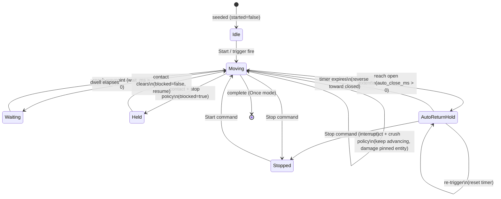
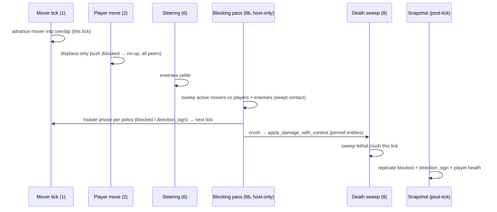

# E17-E Doors and Blocking Movers — research

Investigation grounding for the spec. Line numbers are point-in-time; the spec
references contracts, this file records where they live today.

## The seam E replaces

`crates/postretro/src/movement/mover_carry.rs`:

- `displace_from_movers` (:56) resolves player-vs-mover overlap each tick by
  calling `unblocked_mover_displacement` (:108).
- `unblocked_mover_displacement` casts the capsule against **static** world
  geometry along the push normal. On a hit (the push would jam the player into a
  wall) it logs `mover {} push was blocked by static geometry; pinch/crush
  resolution is deferred` (:126-131, `#[cfg(debug_assertions)]`) and returns
  `None`; the caller returns the un-displaced `position`. Player is neither
  pushed nor damaged — a no-op.

This runs in the **player movement tick** (entity_model §5 order 2), which is
client-predicted. It stays as-is: the displace-only push remains the safe,
peer-identical local resolution of overlap. E adds the **reaction** (reverse /
stop / crush) as a separate host-only pass, off the prediction path.

## Prior commitment E overturns

`movement.md` §6 "Moving bases": *"Movers are unstoppable kinematics in this
slice: they displace the player out of overlap, but do not stop or yield.
Crush/pinch policy is deferred; dev maps must avoid pinch points."* E17-A
foundation deferred a `blocked` state (`plans/done/E17--kinematic-platform-foundation/index.md`).
E builds it. `movement.md` §6 and the roadmap E17-E line must be updated at
promotion.

## Command vocabulary (E17-C / E17-D substrate)

`MoverCommand` — `crates/entities/src/components/kinematic_mover.rs:19`,
`#[serde(rename_all="snake_case")]`. Five variants: `Start`, `Stop`, `Reverse`,
`GoToPathNode(String)`, `SetSpinRate(f32)`. Applied by `apply_mover_command`
(`crates/postretro/src/kinematic_mover/commands.rs:49`) — dependency-free,
deterministic across peers.

`SetSpinRate(f32)` (kinematic_mover.rs:24, applied commands.rs:112-131) is the
exact precedent for a new `SetBlockPolicy` scripting setter. The seven sites a
setter touches:

1. Enum variant (kinematic_mover.rs:19) + applier arm (commands.rs:112).
2. Reaction-primitive registration `register_mover_reaction_primitives`
   (commands.rs:180-232), args struct pattern `MoverSetSpinRateArgs`
   (commands.rs:314-317).
3. Sequenced-primitive registration `register_sequenced_mover_primitives`
   (commands.rs:237-293).
4. Dispatch allowlist `is_trigger_consequential_primitive`
   (`crates/scripting-core/src/reaction_dispatch.rs:331-347`).
5. SDK type templates (`crates/scripting-core/src/typedef/templates/sdk_lib.luau`
   — step type ~:299, handle method ~:80, `SequenceStep` union ~:319) +
   `sdk_lib.d.ts` + regenerate fixtures `expected.d.luau` / `expected.d.ts`.
6. Runtime SDK Luau/TS (`sdk/lib/entities/movers.luau`/`.ts` ~:38-40).
7. Registration wrapper + closed-vocab test
   (`crates/postretro/src/scripting/reactions/registry.rs:34-39,64-76`).

Reaction, sequence, and KVP routes converge on
`apply_mover_command_to_targets` → `apply_mover_command`. Parity test
`set_spin_rate_reaction_and_sequence_routes_match_shared_kvp_command_path`
(commands.rs:615-709) asserts identical resulting phase across routes; a new
setter needs its twin.

**Two distinct KVP surfaces — do not conflate:**
- The **trigger-volume `command` KVP** (`trigger_volume_bridge.rs:85-91`) maps
  indices 0-3 to Start/Stop/Reverse/GoToPathNode — what a trigger *fires at* a
  mover. `SetSpinRate` is absent here (script-only). A runtime block-policy
  *command* would extend this table; the user's ask does not require it.
- The mover's own **seeded `block_policy` KVP** — a property of the
  `kinematic_mover` entity (its default block reaction), authored where
  `mode`/`speed`/`wait` are seeded, carried on PRL `KinematicGeometry`. This is
  the surface E adds for authoring.

## Damage / crush seam (E16)

Chokepoint `apply_damage_with_context(registry, id, &DamagePayload, DamageContext)`
— `crates/entities/src/components/health.rs:424`. No-ops on a non-`Health`
entity (:430). `DamagePayload { amount: f32 }`
(`foundation/src/foundation_pods.rs`). `DamageContext { source_id, attacker,
weapon, zone, producer }` (health.rs:59); `DamageProducer::{InTick, AppDrain}`
(:86). Crush call: `source_id = "mover.crush"`, `attacker: None`,
`weapon: None`, `producer: InTick` — mirrors `"script.applyDamage"`
(`health/reactions.rs`) and `"enemy.attack"` (`ai/mod.rs`).

No new wire for damage: player HP replicates via the `player.health`
owner-private slot (`netcode/state_slots.rs`); enemy crush replicates as
host-side despawn + impact animation (remote enemies carry no client `Health` —
`remote_materialize.rs`, networking §"Connected-client AI-enemy spawn
suppression"). Damage is host-authoritative; clients skip combat simulation.

No generic DoT exists. A continuous crush cadence mirrors
`BrainComponent.attack_cooldown_remaining_ms`.

**Mover-vs-enemy collision does not exist.** Movers collide only with the player
today (`mover_carry.rs`, `collision::moving`). Detecting a mover crushing/
blocking an enemy is net-new collision work; the damage side above is free.

## Replicated phase and the new `blocked` field

`KinematicMoverComponent` phase (kinematic_mover.rs:33-71): `segment_index`,
`direction_sign`, `segment_elapsed_ms`, `wait_remaining_ms`,
`current_linear_velocity`, `started`, `completed`, `target_segment`, spin
phase. **No `blocked` flag** — foundation deferred it. `carry_yaw` (:47) is a
component field held **locally, not replicated** — the precedent for a
host-only field.

Wire: `KinematicMoverState` payload carries phase only (networking §"Snapshot
apply ordering"). Current `SNAPSHOT_VERSION = 12` (`crates/net/src/wire.rs:78`),
`WIRE_VERSION = 15` (`crates/net/src/handshake.rs:11`). Rotating-mover replay
provenance was the last mover phase addition and bumped both. Adding the
replicated `blocked` flag advances `SNAPSHOT_VERSION → 13` and `WIRE_VERSION →
16`; the level content digest already covers static mover geometry.

## Mod descriptor (auto-close default)

No static `mod.toml`/`mod.ron`. The descriptor is the script-authored
`ModManifest` → Rust `ModManifestResult`
(`crates/scripting-core/src/runtime/types.rs:60-114`). The mod-wide-default
precedent is the `render` field → `ModRenderProfile { bloom: ModBloomProfile
{ resolution, pixelated } }` (types.rs:41-58) — *"static renderer preferences
declared once for the entire mod"*, parsed in the js/lua manifest parsers
(`data_descriptors/js/manifest.rs`, `.../lua/manifest.rs`), drained at boot by
`run_deferred_mod_init` (`crates/postretro/src/startup/splash_lifecycle.rs:233`),
applied via `apply_mod_bloom_render_profile`
(`crates/postretro/src/startup/render_profile.rs:38`). Live example:
`content/dev/start-script.ts:29-34` (`render: { bloom: {...} }`).

The auto-close default is a new `ModManifest` field of the same shape. It seeds
a runtime default value; it does not drive a per-frame system like bloom.

## Fixed-tick order (entity_model §5)

| Order | Stage |
|---|---|
| 1 | Kinematic mover tick — advances transforms + tick deltas |
| 2 | Player movement tick — consumes mover collision/carry (`displace_from_movers`) |
| 3 | Trigger tick — host; commands mutate mover phase for the **next** mover tick |
| 4 | AI brain tick |
| 6 | Agent steering tick — enemies finish moving |
| 7 | Weapon fire tick — damage applied |
| 8 | Death sweep — processes zero-HP entities |

The mover **blocking/crush pass** E adds is host-only and needs final entity
positions, so it runs after agent steering (6). Its mover-phase mutations feed
the next tick's mover tick (1), exactly as trigger commands (3) do. Its crush
damage lands before the death sweep (8), so a lethal crush is swept the same
tick.

## Mover lifecycle with blocking + auto-return

`blocked` is the only new **replicated** state (stop policy's hold). The
auto-return timer is **host-only**: on expiry the host issues the reverse, and
only the resulting `direction_sign` change replicates (Model: host decides,
effect replicates — same shape as the block decision). Reverse and crush need no
new replicated field: reverse rides `direction_sign`, crush rides
`player.health` / host despawn.

## Host blocking/crush pass — cross-seam flow

## Observers (vantage × state)

| State | Host | Predicting client (own pawn) | Remote (other pawns / enemies) |
|---|---|---|---|
| Mover motion | Authoritative driver | Re-runs driver from replicated phase, reconciles | Same, from replicated phase |
| `blocked` (stop hold) | Sets/clears on contact | Reads replicated flag; driver holds, no snap-back | Reads replicated flag |
| Reverse-on-contact | Flips `direction_sign` | Reconciles the flip | Reconciles the flip |
| Crush damage (player) | Applies via chokepoint | Reconciles own HP via `player.health` slot | n/a (owner-private) |
| Crush damage (enemy) | Applies + despawn/anim | Sees host despawn/anim snapshot | Sees host despawn/anim snapshot |
| `block_policy` value | Reads it (host-only decision) | Never reads it (not replicated) | Never reads it |
| Auto-return timer | Counts down, issues reverse | Never reads it; reconciles the reverse | Reconciles the reverse |

The block decision depends on entity positions, so it cannot be a pure function
of phase (breaks A's prediction model). Hence host-authoritative + reconciled.
`block_policy` and the auto-return timer are host-only state and stay off the
wire — clients never evaluate the policy or the timer, only observe the
replicated effects (`blocked`, `direction_sign`, HP, despawn).

## Resolutions from review (validate-plan + review-draft-spec)

Settled decisions the spec encodes, kept here so the two docs do not drift:

- **Reverse is a directional intent, not `reanchor_direction`'s blind flip.**
  A blind flip cancels with a same-tick auto-close reverse and buzzes a slow
  reverse door. Reversals set direction *away from contact* / *toward closed*,
  idempotent, edge-gated to approach; block-decision resolves last.
- **Crush cadence is per victim** (host-only side-table, damage on first pinned
  tick then every `crush_interval_ms`), not one per-mover countdown — a single
  countdown starves a staggered second victim. Mutating per-tick timers live in
  the side-table, never on the replicated component (no wire delta).
- **`blocked` is host-derived each tick:** forced false on no-contact, cleared
  on completion and restart commands, checked before the `completed`
  early-return, and freezes spin as well as linear advance.
- **`moverSetBlockPolicy` is host-only, not consequential.** It writes an
  off-wire field; the one applier arm that breaks the "phase-only" contract is
  documented; it is trigger-bindable (`trigger_bindings.rs`) but absent from
  both consequential allowlists.
- **Mover audio is host-local this slice.** No world sound is networked today
  and doing it well is gated on deferred spatialization; peer audibility is a
  new roadmap item (Epic 12). The `blocked` wire field is for reconciliation,
  not audio — no replicated crush edge is added.
- **Detection is one tick stale by construction** (mover moves at order 1, pass
  decides at 6b, driver honors next tick). Swept-face inflation ≥ one tick of
  travel keeps the detection-tick over-penetration sub-capsule.
- Enemy sweep uses the Agent **capsule** (reuses `deepest_mover_push_penetration`,
  no new AABB query). New KVPs seed onto `LoadedKinematicMover` /
  `KinematicMoverRecord`, not `KinematicGeometry`.
