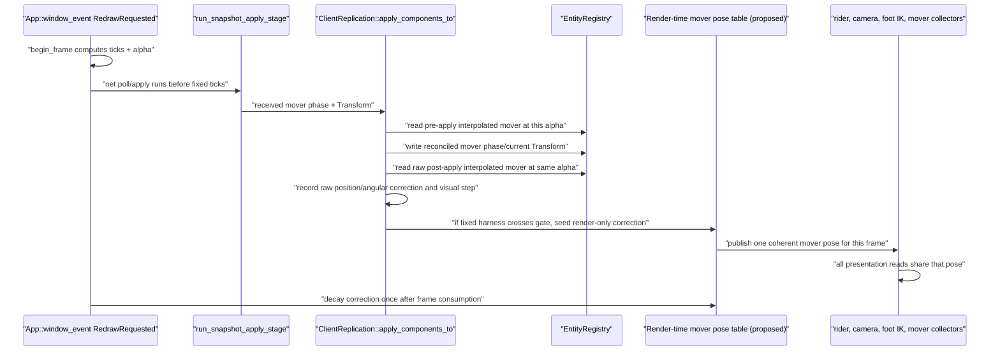

# Mover-Relative Rider Presentation — Research

## Current ownership

| Data | Current owner | Current consumer |
|---|---|---|
| Remote transform samples | `ClientReplication.interp` (`RemoteInterpolationBuffer`) | `ClientReplication::sample_into_registry` |
| Remote ground reference | `WirePlayerMovementState.ground` | Local movement apply; remote presentation discards it after validation |
| Authoritative mover history | `ClientReplication.mover_history` (`MoverHistoryBuffer`) | Prediction/replay through `MoverPoseSource` |
| Current fixed-tick mover pose | `App.kinematic_mover_tick_states` (`MoverTickStateTable`) | Movement collision, carry, connected-client foot probes |
| Local camera interpolation endpoints | `FrameTiming.previous_state/current_state` (`InterpolableState`) | `FrameTiming::interpolated_state` |
| Mesh world transform | `EntityRegistry` current + previous transform columns | `MeshRenderCollector::collect_inner` via `interpolated_transform` |
| Mover beauty/shadow transform | `EntityRegistry` current + previous transform columns | `KinematicMoverRenderCollector::collect` |
| Foot contacts | `sim::update_foot_ground_probes` | `PoseInputs::feet` consumed by mesh pose sampling |

`WireGroundRef::Mover` already carries the compile-time mover id. The static-kinematic
handshake already proves mover path, collision, spin, and `carry_yaw` parity. This plan
adds no wire field or version bump.

## Remote rider lifecycle

```mermaid
sequenceDiagram
    participant Host as "Host fixed tick"
    participant Wire as "SnapshotMessage"
    participant Apply as "ClientReplication::apply_components_to"
    participant Actor as "RemoteInterpolationBuffer::presented_pose"
    participant History as "MoverHistoryBuffer"
    participant Visual as "Render-time mover pose table (proposed)"
    participant Pose as "sim::update_presentation_pose_inputs"
    participant Mesh as "MeshRenderCollector::collect_inner"

    Host->>Wire: "collect_payloads reads Transform + PlayerMovementState.ground"
    Wire->>Apply: "client_receive_and_apply validates and applies snapshot"
    Apply->>Actor: "record TransformSample at server_tick"
    Apply->>History: "record MoverHistorySample at server_tick"
    Actor->>Actor: "presented_pose samples delayed render_server_tick"
    Actor->>History: "read historical mover transform at the same fractional tick"
    History-->>Actor: "historical mover frame"
    Visual->>Actor: "read current frame's visual mover frame"
    Actor->>Actor: "historical world -> mover local -> current visual world"
    Actor->>Apply: "set_presentation_transform writes rebased remote pose"
    Apply->>Pose: "update_client_presentation_pose_inputs reads displayed transform"
    Visual->>Pose: "foot probes read the same visual mover frame"
    Pose->>Mesh: "pose inputs + rebased transform"
    Mesh->>Mesh: "collect displayed rider instance"
```

The current break is between `presented_pose` and mover rendering: the actor samples
`estimated_server_tick - interpolation_delay`, while
`client_predict_loaded_movers_tick` advances the mover to estimated current time and
`KinematicMoverRenderCollector::collect` draws that current predicted mover.

### Rebase contract

- Rebase only a remote player whose sampled ground reference is stably
  `Mover(mover_id)` across the interpolation interval.
- Compute the rider's local position in the historical mover frame sampled at the
  same fractional server tick as the rider.
- Compose that local position onto the current render-time mover frame.
- Preserve player scale.
- Preserve replicated player rotation when `carry_yaw` is false.
- When `carry_yaw` is true, apply only the world-up yaw between historical and current
  mover frames. The historical player rotation already contains yaw carry up to the
  historical tick; applying the frame delta once advances it to presentation time.
  Never compose the full mover rotation into player orientation.
- An interval that lands on or detaches from a mover uses ordinary world interpolation.
  The first interval whose two endpoints name the same mover may attach. The first
  interval whose endpoints differ must detach. This prevents an old mover from
  dragging an airborne rider.
- Missing actor ground history, missing mover history, a missing current mover, or a
  non-invertible/non-finite frame falls back to the sampled world pose.

## Local rider lifecycle

```mermaid
sequenceDiagram
    participant Tick as "Fixed tick"
    participant Mover as "run_kinematic_mover_tick"
    participant Move as "movement + follow_camera_to_local_pawn"
    participant Timing as "FrameTiming::push_state"
    participant Visual as "Render-time mover pose table (proposed)"
    participant Camera as "RenderCamera::new"
    participant Mesh as "MeshRenderCollector::collect_inner"

    Tick->>Mover: "snapshot_transform then advance mover"
    Mover->>Move: "MoverTickStateTable supplies carry/collision pose"
    Move->>Move: "pawn settles; camera follows pawn eye"
    Move->>Timing: "capture world endpoints + mover-local pawn point when grounded"
    Timing->>Timing: "retain previous/current attachment samples"
    Visual->>Timing: "read mover transform at frame alpha"
    Timing->>Timing: "interpolate pawn-local point, then compose through mover"
    Timing->>Camera: "add world-up eye height + world-space reconcile offset"
    Timing->>Mesh: "supply local pawn position override"
    Camera->>Camera: "build view from mover-arc eye"
    Mesh->>Mesh: "draw pawn at mover-arc position"
```

`InterpolableState::lerp` currently linearly blends world positions. On a rotating base,
that is a chord. The mover draw uses quaternion interpolation, so an attached point on
the mover follows an arc. The two paths disagree at every mid-tick alpha.

The local attachment sample must keep three terms separate:

1. Pawn capsule-center position in mover-local space. This rotates/translates with the
   mover.
2. Eye height in world-up. This never tilts with mover pitch/roll.
3. Client reconciliation presentation offset in world space. It stays on the existing
   correction path and is never rotated by the mover.

Arc interpolation applies only when both tick endpoints name the same mover. Landing,
detach, mover change, fly-camera, and missing-pawn frames retain world-space lerp.

## Mover reconciliation lifecycle



Current apply writes the mover's current `Transform` before the catch-up tick loop. Its
previous transform may still describe the predicted pre-snapshot path. The render
accessor can therefore blend an unmatched pair on a zero-tick frame.

The measurement gate is fixed:

- Run the existing rotating-platform fixed-seed conditioned-link profile and a
  synthetic zero-tick correction at several alphas.
- Measure the same-frame pre/post visual step, not only the simulation correction.
- A worst raw step above 0.002 m or 0.1 degrees requires render-only smoothing.
- If neither threshold is crossed, ship diagnostics and the harness without a
  correction store.
- If crossed, preserve the pre-apply visual pose exactly on the correction frame,
  decay toward the reconciled pose at render rate, and prove the immediate
  discontinuity is at most `1e-4` m / `1e-4` rad. Simulation transforms, mover phase,
  collision, and wire state never read the correction.

The gate decides whether smoothing exists. It does not leave an algorithm choice open.

## Oversized-source seams

| Source | Production size / concern | Split before extension |
|---|---|---|
| `netcode/client.rs` | ~2,200 production lines; apply, interpolation presentation, animation playback, and mover history | Extract remote presentation state and mover history |
| `main.rs` | ~6,000 production lines; event loop plus camera helpers | Extract player-camera follow/yaw/attachment helpers |
| `sim/mod.rs` | Foot-probe subsystem is a distinct ~230-line responsibility inside a large sim module | Extract foot-ground probing |
| `netcode/interpolation.rs` | ~675 production lines; remainder is tests | No split; additions stay in its interpolation responsibility |
| `scripting/systems/mesh_render.rs` | ~580 production lines; remainder is tests | No split; add only the local-pawn position override at the collector boundary |
| `runtime_movers.rs` | ~500 production lines; remainder is tests | No split; consume the shared presentation pose at its collector boundary |
