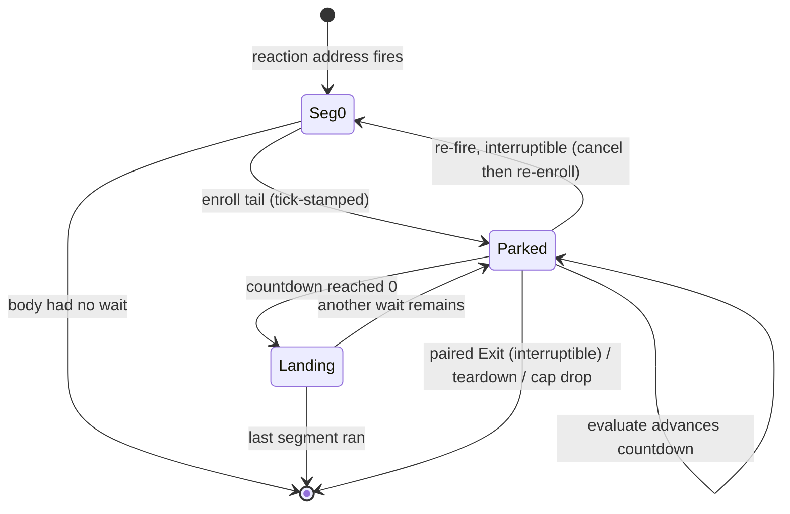

# E18 Timed Reaction Steps — Research Notes

Session-grounded facts and the lifecycle diagram. Not the spec — decisions live in `index.md`.

## Grounded source facts (confirmed this session)

### Descriptor + dispatch layer
- `SequenceStep { id: SequenceTarget, primitive: String, args: serde_json::Value }` and
  `enum SequenceTarget { Entity(EntityId), Activators, FiredTrigger }` — `crates/entities/src/data_descriptors/types/reactions.rs`.
- `enum ReactionDescriptor { Progress, Primitive, Sequence(Vec<SequenceStep>) }` — same file.
- `dispatch_sequence(steps, sequence_registry, script_ctx)` runs steps in array order, synchronously, one drain — `crates/scripting-core/src/reaction_dispatch.rs`. Non-`Entity` targets warn+skip; unknown primitive warns+skips; handler `Err` warns+continues.
- Sequence-primitive validation: `sequence_primitives_are_valid` / `validate_sequence_primitives` reject a `Sequence` reaction whose step names a primitive not in `SequencedPrimitiveRegistry` — same file. A `wait` pseudo-primitive must not be rejected here.
- JS deserialize: `sequence_steps_from_js` — `crates/scripting-core/src/data_descriptors/js/reactions.rs`. Sentinel ids: `"@activators"` → `Activators`, `"@trigger"` → `FiredTrigger`, else numeric `id` → `Entity`. Luau twin: `sequence_steps_from_lua` — `.../lua/reactions.rs`.

### Trigger fire + in-tick consequential execution
- `TriggerFireReport { fires: Vec<TriggerEvent> }`. `TriggerEvent { fire: TriggerEventFire, edge: TriggerEventEdge }`.
  `TriggerEventFire { trigger: EntityId, player: PlayerId, event_name: String }`. `TriggerEventEdge { Enter, Exit }`.
  `PlayerId { Local(EntityId), Remote(u64) }`. — `crates/postretro/src/trigger_system.rs`.
  In production the returned report is discarded (`_report`); the meaningful path is the per-edge `dispatch` closure
  inside `simulate_tick_with_presentation_aim` calling `TriggerBindingTable::execute(...)`. `enters()`/`exits()` are
  `#[cfg(test)]` filter methods, not fields — treat enter/exit as a filtered view over the ordered `fires` stream by `edge`.
- `fires` is ordered by `(trigger, player)`; a same-tick enter+exit for one trigger share that ordering.
- `TriggerTickContext<'a>` — `crates/postretro/src/sim/mod.rs`: `system, bridge, bindings: &TriggerBindingTable,
  slot_table: Rc<RefCell<SlotTable>>, script_ctx: Option<ScriptCtx>, auto_close_timers, use_edges`. Passed as
  `trigger_context: Option<TriggerTickContext>` into `simulate_tick` / `simulate_tick_with_presentation_aim`; built in
  the App tick loop in `main.rs`.
- `TickEvents.trigger_residuals: Vec<TriggerResidualHandle>` (opaque `usize` newtype into `TriggerBindingTable::residuals`).
  Drained **per frame** (across all fixed ticks in the frame), not per tick, in `main.rs`: resolve each via
  `trigger_bindings.residual(handle)` → `fire_prepartitioned_reactions_with_sequences(residual.steps(), ...)` →
  follow-ups via `dispatch_deferred_named_events_with_sequences`.
- `TriggerBindingTable` — `crates/postretro/src/trigger_bindings.rs`. Built by
  `build_with_script_ctx_and_diagnostics(...)`, invoked from `install_world_cpu`
  (`crates/postretro/src/startup/lifecycle_world_cpu.rs`), stored on `WorldInstallProducts.trigger_bindings`, held on `App`.
  `TriggerBinding { commands: Vec<BoundTriggerCommand>, residual: Option<TriggerResidualHandle> }`.
  `TriggerResidual { steps: Vec<PrepartitionedReactionStep> }`.
- `BoundTriggerCommand` (11 variants) — `crates/postretro/src/trigger_commands.rs`: `Mover`, `Damage`, `GrantHealth`,
  `GrantAmmo`, `Arm`, `Disarm`, `StoreSlot`, `AddOwnerSlot`, `AnimationState`, `UpdateEnemyState`, `Spawn`.
  `BoundTarget { Tag(String), Entity(EntityId), Activators, FiredTrigger }`.
- Effect-class classifier `classify(primitive) -> PrimitiveClass { Consequential, Lifecycle, Presentation }` —
  `crates/postretro/src/trigger_bindings.rs`. `CONSEQUENTIAL_PRIMITIVES` (15): moverStart, moverStop, moverReverse,
  moverGoToPathNode, moverSetSpinRate, applyDamage, grantHealth, grantAmmo, armTrigger, disarmTrigger, setState, addSlot,
  setAnimationState, updateEnemyState, spawnFromSpawner. `LIFECYCLE_PRIMITIVES` (3): loadLevel, restartLevel,
  returnToFrontend. Else Presentation.
  - NOTE: a second, divergent consequential list exists — `is_trigger_consequential_primitive` (13 names, omits
    grantHealth/grantAmmo) in `reaction_dispatch.rs`, used only in a `#[cfg(debug_assertions)]` residual assertion. The
    binder's `classify` is authoritative for partitioning.

### Tick, co-op, lifecycle, test harness
- Host tick loop: `main.rs` `WindowEvent::RedrawRequested`, `for tick_index in 0..ticks` (fixed-timestep accumulator
  from `frame_timing`). Host/single-player branch calls `simulate_tick_with_presentation_aim(...)` then
  `evaluate_slot_accumulators(&mut session.scripting.slot_accumulator_bindings, tick_dt)`. New scheduler eval goes beside it.
- `tick_dt = self.frame_timing.tick_dt()` → `f32` **seconds** ≈ 0.016667. `TICK_DURATION = Duration::from_micros(16_667)`
  (`frame_timing.rs`); netcode twin `DEFAULT_MICROS_PER_TICK = 16_667` (`crates/net/src/timesync.rs`), surfaced as
  `SERVER_TICK_MICROS` (`netcode/host.rs`).
- Co-op: **host-only sim.** Connected clients run only movement prediction and `continue`, skipping
  `simulate_tick_with_presentation_aim`. `evaluate_slot_accumulators` is host-only (doc: "connected clients must never
  invoke this"). Consequences reach clients via state-slot replication: `HostStateReplication` (`netcode/host.rs`
  `host_replicate`) → `RawSnapshotMessage.state_records` → `ClientStateApply::apply_snapshot_state` writes client
  `SlotTable`. Test `accumulated_shared_global_converges_without_client_side_evaluation` confirms host-only accumulate +
  replicated result. Mover state is host-authoritative and snapshotted (clients predict + reconcile).
- Level teardown: `App::unload_level` (`startup/lifecycle_net.rs`) → `clear_surface_lifetime_level_state` calls
  `slot_accumulator_bindings.clear()` beside `trigger_system.clear()`, `auto_close_timers.clear()`,
  `spawn_context.clear()`, etc.; `unload_level` also clears `progress_tracker`, `crossing_detector`,
  `data_registry` reactions/crossings. Install: `install_world_cpu` calls `rebuild_reaction_subscribers(...)` then
  `slot_accumulator_bindings.rebuild(script_ctx)` (self-clearing). App re-entry: `rebuild_active_reaction_subscribers`.
- **No pause gate on the fixed tick.** Pause menu sets `ui_captures_gameplay = true` → neutral input, but `ticks` is
  still non-zero, `simulate_tick` + `evaluate_slot_accumulators` still run every tick. So dt-driven game state (slot
  accumulators today) advances while paused. `renderer.freeze_time()` freezes only the animation sample clock, not the sim tick.
- Test harnesses that advance N fixed ticks seeding a fixed DT: `observability/driver.rs` `run_headless` /
  `run_headless_inner` (`const TICK_DT: f32 = 1.0/60.0`); `sim/determinism_tests.rs` `SimHarness` (`const DT = 1.0/60.0`);
  `slot_accumulators.rs` unit tests use `frame_timing::TICK_DURATION.as_secs_f32()`.

### Consumer fixture
- `content/dev/maps/closet-reveal.map` has: `trigger_volume` (name/`_tags` `closet_reveal_plate`), `kinematic_mover`
  (name/`_tags` `closet_door`, waypoints `closet_door_closed`→`closet_door_open`), two `reference_enemy` (`_tags`
  `closet_enemies`), one `light_spot` (**no `_tags`, no `dynamic` flag** → static; `LightAnimation.color` is accepted on
  authored static lights, so intensity or color both work — `validate_and_normalize`, `crates/lighting/src/script_primitives.rs`).
  The plate carries `"fire_mode" "once"`, which V2 rejects for an interruptible wait — Task 6 changes it.
- `content/dev/scripts/closet-reveal.ts` fires `closet.openDoor` (tag `moverStart`) + `closet.releaseCloset`
  (`enemies({tag}).update({aggro:true})`) from the plate `enter` edge, as two separate reactions.
- Authoring idiom: sequence steps come from handle builders returning `SequenceStep[]` (`light.pulse()`, `mover.start()`,
  `armTrigger()`), spliced into `sequence: [...]`. `wait()` follows the `armTrigger`/`disarmTrigger` precedent
  (`sdk/lib/data_script.ts`).

## Pending instance lifecycle

Segmentation happens at install: a body becomes `[seg0, wait0, seg1, wait1, ...]` with whole-tick counts.
No emitted segment contains a wait, so no runtime dispatch path is wait-aware.

Ordering rules the diagram encodes:
- `evaluate` skips instances stamped with the current tick — enrollment happens earlier in the same tick
  iteration (inside `simulate_tick_with_presentation_aim`), so without the stamp a 1-tick wait would land
  on its own fire tick.
- Cancels are applied before countdown advance, so an Exit on the landing tick wins.
- A re-fire's same-key cancel is applied at enrollment, before the cap test, so re-enrollment never fails.
- A landing's consequential commands apply host-only post-tick; its presentation residual is appended to
  the frame's `pending_trigger_residuals` so it drains after earlier same-frame residuals.

## Why the enemy release must be dispatched, not inlined

E18-C: "The reveal composes at the trigger fan-out ... **not** one reaction body (a body is a single
primitive; tag-targeted primitives ride the Primitive path, never a `sequence`)." Reinforced in source:
`BoundTriggerCommand::UpdateEnemyState` bails unless its target is `BoundTarget::Tag`, while
`bind_sequence_step` maps `SequenceTarget::Entity(id)` to `BoundTarget::Entity(id)`. And it must be
*delayed* rather than left on the enter edge because the aggro gate is the containment — releasing early
lets enemies aggro through a still-closed door. Hence the `fire` step, lowering to the shipped
`PrepartitionedReactionStep::DeferredEvent`.

## Corrections against earlier session assumptions

- `TRIGGER_VOLUMES_VERSION` is `2`, and `TriggerVolumesSection::from_bytes` accepts `1` (legacy) and `2` —
  it tolerates version skew rather than hard-checking.
- The static-light color gate does not exist: `validate_and_normalize` takes `_target_is_dynamic` unused and
  errors on color only when the array is empty.
- `TriggerFireReport` has one field, `fires: Vec<TriggerEvent>`; `enters()`/`exits()` are `#[cfg(test)]`
  filter methods, not fields.
- `world.query` component vocabulary uses `"kinematic_mover"`, not `"mover"`.
- `TICK_DURATION` is `Duration::from_micros(16_667)`, not `1000/60`; the float form yields 49 ticks where the
  integer rule yields 48 for `durationMs = 800`.
- `clear_surface_lifetime_level_state` lives in `startup/lifecycle_net.rs`; `install_world_cpu` reaches the
  binder via `build_trigger_bindings` in `startup/lifecycle.rs`.
- The quote "intentionally does not participate in snapshots, digests, or the connected-client simulation"
  is the `auto_close_timers` field doc on `ScriptingCore` in `session/mod.rs`, not in `auto_close.rs`.

## Oversized files the plan touches

`main.rs` 11161 · `startup/lifecycle.rs` 3945 · `sim/determinism_tests.rs` 3652 · `sim/mod.rs` 2872 ·
`trigger_bindings.rs` 2590 · `trigger_system.rs` 2379 · `reaction_dispatch.rs` 1917 ·
`data_script.luau` 1132 · `data_script.ts` 939. New code lands in new modules: the scheduler and the
segmentation pass each get their own file, and Task 7's tests are new files.

## Verification ledger

Claims checked against source this session. Cited by identifier and file; line numbers are deliberately
omitted (`context_style_guide.md` — a context reference must survive a refactor).

| Claim | Where | Result |
|---|---|---|
| `TRIGGER_VOLUMES_VERSION` value and reader tolerance | `crates/level-format/src/trigger_volumes.rs` | `= 2`; `from_bytes` accepts 1 (legacy) and 2 |
| Named dispatch reads bodies from the registry | `fire_named_event_with_sequences` → `dispatch_sequence`, `reaction_dispatch.rs` | iterates `data_registry.reactions`; a side table cannot intercept |
| Install ordering | `install_world_cpu`, `startup/lifecycle_world_cpu.rs` | `slot_accumulator_bindings.rebuild` precedes `build_trigger_bindings`, which precedes `install_manifest_events` |
| `bound_edges` has no empty-work inserter | `bind_event`, `trigger_bindings.rs` | returns early on `commands.is_empty() && steps.is_empty()`, before `append_binding` |
| Stall clamp arithmetic | `TICK_DURATION`, `MAX_ACCUMULATOR`, `frame_timing.rs` | 16_667µs and 250ms → ≤14 ticks per frame |
| Second seeded dispatch input | `APP_DRAIN_DISPATCH_INPUTS`, `scripting/systems/system_reactions.rs` | `[("@rising", IrType::Bool)]` |
| Dispatch-scope seeding site | `build_inner`, `trigger_bindings.rs` | seeds `RefCell<DispatchScope>` with `TRIGGER_EVENT_INPUTS`; not `build_with_script_ctx_and_diagnostics` |
| Bound-command apply signatures | `BoundTriggerCommand::execute` / `execute_with_script_ctx`, `trigger_commands.rs` | the script-ctx variant substitutes `ScriptCtx` for `SlotTable` and adds `&mut DispatchScope` |
| `fire_mode` spellings | `crates/level-compiler/src/trigger_volumes.rs` | `"once" \| "0" => 0`, `"multiple" \| "1" => 1`, else `bail!` |
| Runtime fire-mode type | `TriggerVolumeComponent.fire_mode`, `crates/entities/src/components/trigger_volume.rs` | `TriggerFireMode`, not the level-format `u8` |
| Scope-erasure type gate | `invalidScopeErasure`, `sdk/type-tests/e18-dispatch-params.ts` | shipped `@ts-expect-error`; the contravariant brand bites under `strict` |
| Determinism harness shape | `RecordedTick`, `SimHarness::record`, `sim/determinism_tests.rs` | projects the real `TickEvents`; no struct clone |
| Static-light colour gate | `validate_and_normalize`, `crates/lighting/src/script_primitives.rs` | `_target_is_dynamic` unused; colour errors only when empty |
| Co-op atmosphere channel | `plans/done/E18--trigger-event-fanout` | host in-tick `sharedGlobal` write → replication → client crossing → client-local presentation, late-join included |
| `WorldInstallHandles` construction sites | `startup/lifecycle.rs` | **three**, plus the destructure in `install_world_cpu` (an earlier review report said four) |
