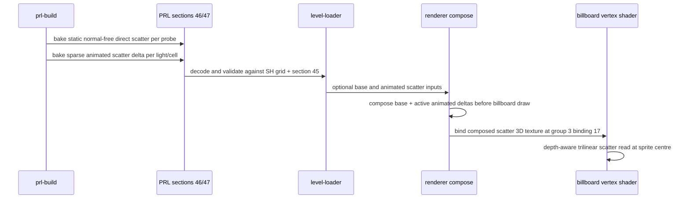

# Billboard Volumetric Direct Lighting — Research

## Observed path

`ParticleRenderCollector::collect` packs each particle's world position into the
`SpriteInstance` consumed by `SmokePass`. `billboard.wgsl::vs_main` expands a
camera-facing quad, then sets `N = V`, where `V` points from sprite centre to
camera. That normal drives `sample_sh_direct`, the static-specular loop, and
the dynamic-direct Lambert term.

For a red `light_spot`, moving the camera to the light-facing side of the
sprite makes `dot(N, L)` approach zero. Baked direct SH then reconstructs a
near-zero cosine lobe; the white ambient floor and indirect term dominate.
The source light and particle position did not change.

`DirectShVolumeSection` cannot supply a camera-independent value by changing
the lookup direction: it stores cosine-convolved irradiance, not normal-free
incident radiance. A fixed normal would merely move the failure to another
light direction. Sampling many directions at draw time would multiply the
already per-vertex eight-probe work. The bake has the normal-free value before
the cosine lobe is applied (`incident_radiance_at_point` plus
`soft_visibility`), so that is the correct source for an isotropic smoke
proxy.

## Lifecycle

## Fixed contracts

- Existing section IDs 34, 35, and 45 remain unchanged. New sections use IDs
  46 and 47; their payloads are optional.
- Existing shared SH bindings 0, 1, 2, 10, 11, 12, 14, and 15 stay at their
  current numbers. The scatter texture is appended at binding 17. Mesh binding
  16 remains its dynamic-direct uniform.
- `AnimatedBillboardDirectScatterDeltaVolumes` keys its descriptor indices and
  CSR light indices to the same `AnimatedBakedLights` namespace as section 45.
- Static promotion does not subtract billboard scatter. Billboards are not
  promotion receivers, so they retain their baked contribution while meshes
  crossfade to a shadow-pool record.
- The smoke pass remains a vertex-lit, camera-facing billboard pass. The new
  direct-scatter read must not add a vertex-visible storage buffer or a
  per-particle allocation.

## Alternatives rejected

| Alternative | Reason rejected |
|---|---|
| Use world-up or another fixed normal | Still drops horizontal or overhead lights; only hides the camera dependency. |
| Average/max several direct-SH directions at runtime | Expands the eight-probe direct lookup several times per billboard vertex and is not normal-free transport. |
| Use the static `spec_lights` list as unshadowed direct scatter | Loses baked occlusion and leaks light through walls. |
| Keep `N = V` and raise ambient/red tint | Masks the symptom, over-lights unlit smoke, and disconnects color from light reach. |

## Scope note

This plan changes direct response only. Indirect SH remains the existing
view-facing ambient approximation. It is softer fill, not the source of the
red-light disappearance. Static SDF direct and shadow-map policy are unchanged
except that static-light-map sources no longer enter the isotropic-model
billboard's surface-like specular loop once their scatter term replaces them; the
specular loop is retained for specular-shimmer materials, owned downstream.
