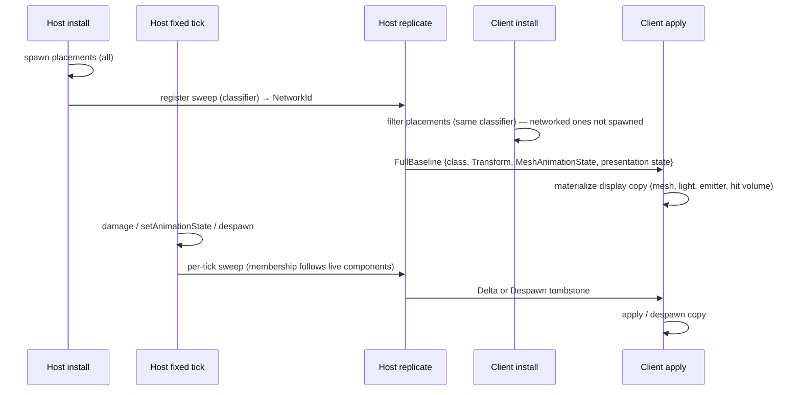
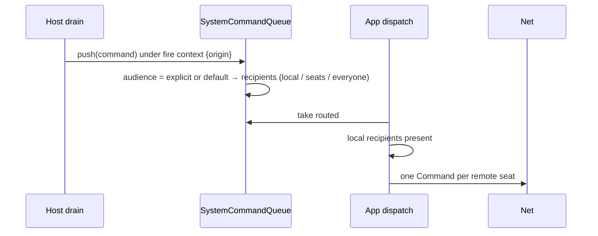

# coop--networked-by-default — research

Read at `221fdaf4a` (branch `coop/networked-by-default`, cut from landed E16). Findings from seven read-only research passes plus spot checks. The spec carries decisions; this file carries the evidence and the derivations.

## Origin

First Mac↔Windows playtest (E16 manual check M1, 2026-10-10), `content/dev/maps/splash-damage-demo.map`:
- A connected client's pistol shots never damage `target_dummy`. Client impact bursts appear only on world geometry behind the dummy.
- A dummy the host kills despawns on the host and stays visible on the client.

## Entity replication today

- Allow-list. Host sweeps register three classes: `host_register_map_enemies` (`is_networked_ai_enemy`: `DescriptorSpawnPath::{MapPlacement, RuntimeSpawn}` plus live `Brain` + `Agent`), `host_register_world_items` (live `ComponentKind::Touchable`), `host_register_loaded_movers` (live `KinematicMover`, install only). Each: `allocator.stamp`, `replicable.register`, tracked set on `NetEndpoint::Host` (`map_enemies`, `world_items`, `loaded_movers`). Pawns and projectile presentation copies register on their own paths.
- Call sites: `App::host_register_map_enemies_after_install` / `_after_fixed_sim_tick`, `App::host_register_world_items_after_install` / `_after_fixed_sim_tick` (main.rs); install callers in `startup/lifecycle.rs` ("Register host-authoritative map entities and PRL-loaded movers"); per-tick callers in `frame_loop/mod.rs` ("Unconditional per-tick registration sweeps").
- `descriptor_entity_class` (netcode `descriptor_class.rs`) returns a class for movement pawns, projectile presentation, `is_networked_ai_enemy`, or live Touchable. Anything else snapshots class-less.
- E10 (`plans/done/E10--networked-enemy-authority-baseline`) deferred non-AI props explicitly: "Networking movers, pickups, projectiles, combat props, or other non-enemy descriptor remotes. Those get their own specs when they become gameplay requirements." Its AC: "non-AI static descriptor props remain unregistered unless an existing net path registers them." A deferral, not a reasoned policy.
- `networking.md` §Current contract: "Replicable-set policy is gameplay-authoritative first."

### Client suppression and materialization

- Connected client filters map placements before dispatch: `filter_out_client_host_replicated_placements(entities, descriptors)` drops a placement when `descriptor_materializes_ai_enemy` (`behavior.is_some()`) or `descriptor_materializes_world_item` (`touchable.is_some()`). `suppressed_client_host_replicated_mesh_models` repeats the predicate so suppressed models still upload. Both called in `install_world_cpu` (`startup/lifecycle_world_cpu.rs`) under `suppress_ai_enemies`, a flag that now also gates boot-pawn suppression, the trigger-pool report, and `progress_already_met`.
- `target_dummy` (mesh + health) matches neither predicate. The client spawns a local copy with `HealthComponent` the host never updates.
- Snapshot apply: `client_receive_and_apply` (netcode `lib.rs`) loops `outcome.remote_entities`; projectile class → `materialize_armed_remote_projectile`; descriptor with `movement` → `materialize_armed_remote_player`; else → `remote_materialize::materialize_armed_remote_enemy` → `materialize_net_mesh_presentation` (sim `net_descriptor.rs`). Attaches only `MeshComponent`. No mesh → transform-only (debug log). No Light, no Emitter, no hit volume.
- Precedent for a new class: world items (`plans/done/E16--wieldable-pickup-drop` Task 5) — component-keyed predicate, registration sweep, client filter, mesh-model suppression list.

### Classification inputs

- `DescriptorComponentKind` (entities `provenance.rs`): `Weapon, Movement, Light, Emitter, Mesh, Health, Touchable`. No AI kind; Brain/Agent attach from `behavior` and never enter `owned_components`.
- `DescriptorSpawnPath`: `MapPlacement, RuntimeSpawn, PlayerSpawn, DefaultWeapon, NetworkSlot, ProjectilePresentation`.
- `DescriptorProvenance` attaches only when `canonical_name` is set.
- `is_directly_map_placeable`: `light || emitter || movement || mesh || health || touchable`.
- `RuntimeSpawn` has one producer: the spawner (`spawner.rs`), which install restricts to AI archetypes (`descriptor_materializes_ai_enemy` gate in lifecycle's spawner resolver, warning `non_ai_archetype`). Connected clients gate it off with `SpawnContext::set_runtime_spawn_authority(false)`.
- World-item membership is live: acquisition strips `Touchable` (and mesh); the next sweep unregisters; a drop restores and re-registers with a fresh `NetworkId`. A held wieldable carries `Weapon` only.

## Combat path

- Client hit query: `for_each_hittable_candidate` visits every `Health` entity, then every `Mesh` entity without Health. No network-id filter.
- `nearest_entity_hit_ignoring` takes the AABB fallback hitbox from exactly `HealthComponent.hitbox`. Zoned entities (model in `HitZoneStore` with `derived_bound`) resolve by capsules; `Resolved(None)` is an authoritative miss; `Unavailable` falls back to hitbox AABB or derived bound. Unzoned with no hitbox: untargetable.
- `HealthComponent.hitbox` consumers: hit query, `damageable_volume` (splash), impact-policy anchor, AI perception (`enemy_eye`, `target_aim`), spawn attach origin shift, `from_descriptor` / `refresh_from_descriptor`. `client_overlay_hitbox` reads the descriptor, not the component — precedent for a client using `health.hitbox` without Health.
- Descriptor `health.hitbox`: `{ halfExtents: [f32;3], offset?: [f32;3] }`, world-aligned AABB centered at `transform.position + offset`. `ai_capsule_center_from_feet_offset` is `Vec3::ZERO` for any descriptor without `behavior`.
- Client wire: `local_hits_to_wire_records` names the target by `network_id_for_entity`; hitscan drops an unnamed entity hit ("Hitscan drops an entity hit it cannot name on the wire", wire.rs). Projectile declarations fall back to the world-contact sentinel.
- Host: `apply_valid_hit_record` needs `entity_for_network_id`, live non-terminal target, `HealthComponent`, LOS, range. No AI check. Splash resolves host-side (`emit_splash_damage`), no NetworkId needed — client rockets already hurt dummies.
- Credit: `apply_weapon_impact_damage_with_source` → `ImpactDispatch.source` = the client's host-side pawn; `byPlayer(impact.source)` resolves through the pawn's seat.
- Overlay facts key on `replicable.contains` (`HostOverlayFactTracker::collect_changed`); damage numbers route by `presentation_recipient`. Neither is AI-gated.

### The impact-burst observation (unresolved)

Entity and world contacts spawn the same burst (`spawn_impact_effects_for_contacts`), so "bursts only on the wall" means the client ray missed its local dummy. From source: hit zones install on clients (`install_world_cpu` → `install_hit_zones`), the dummy glTF tags joints (`extras.hitZone`, `hitZoneRadius`), the idle pose is trustworthy. Candidates: genuine capsule miss with no hitbox fallback (broad-phase reject from a transform/offset/pose mismatch), a `HitZoneStore` handle miss, an inert flag, a projectile shot (empty `hits` by design), or an aim-ray mismatch. Every client resolution test passes `HitZoneStore::new()`; the client path has never run against real capsules. Building blocks: `resolve_test_client_shot`, `HitZoneStore::insert_from_load`, `hit_zones_load_equivalence_tests::dev_models`.

## Host-only reactions

- Trigger edges evaluate only in the authoritative tick. Consequential steps run in-tick (`BoundTriggerCommand`); everything else becomes a residual `(TriggerResidualHandle, EntityId, PlayerId)` drained at frame end by `residual_drain::drain_frame_residuals`. Steps after `wait` land through the scheduler, host-only; its instance key carries `(trigger, PlayerId)`. Group verbs apply host/single-player only. Member steps from levelLoad, crossings, and named events run on every machine (`scripting.md` §12 role check).
- Divergent on clients today: trigger-fired `setLightAnimation`, `setFog{Density,Glow,EdgeSoftness,Falloff,Params,Animation}`, `setEmitterRate`, `setSpinRate`; `setAnimationState` and despawn on unregistered mesh entities; trigger-fired `playSound`, `rumble`, `flashScreen`, `screenShake`, `vignette`; trigger-fired UI-stack and text verbs.
- Not divergent: movers (phase), pawns, AI enemies, world items, projectile presentation, spawner output, trigger armed state (host-only by design), store slots declared `network:`.
- `switch` is compile-time sugar (worldspawn geometry + use-forced trigger volume); no runtime visual state.

## Presentation state

### Identity on both peers

| Kind | Stable identity | Source |
|---|---|---|
| PRL light (`light`, `light_spot`, `light_dynamic*`) | authored map-light index | `LightBridge::populate_from_level_with_influences` enumerates `MapLight`s; `LightBridge::entity_for_map_index` (currently `#[allow(dead_code)]`); script-compiler `light_membership.rs` already resolves `setLightAnimation` targets by it |
| Fog volume | PRL fog record index | `FogVolumeBridge::populate_from_level`; `entity_ids` "Map-volume index → EntityId. Fixed at level load" |
| Map-placed emitter, light-only / emitter-only descriptor placement | none today | `MapEntity` has `classname, origin, angles, key_values, tags` only; the PRL map-entity list order is shared |
| Descriptor-carried light/emitter on a networked entity | the entity's `NetworkId` | rides that record |

None of these is in `level_content_digest` (`runtime_movers.rs`; presentation is excluded by rule). Spawn failure paths (`try_spawn` exhaustion) can shift later indices on one peer.

### What the primitives write

- `setLightAnimation` → `LightComponent.animation` only (`apply_light_animation_inner`). `LightAnimation { period_ms, phase, play_count, start_active, brightness, color, direction, radius }`.
- Fog reactions → `density`, `glow`, `edge_softness`, `falloff`, `tint`, `saturation`, `min_brightness`, `light_range`; `setFogAnimation` → `animation` (`FogAnimation { period_ms, phase, play_count, density, saturation, min_brightness, light_range }`).
- `setEmitterRate` → `rate`; `setSpinRate` → `spin_rate` (clearing `spin_animation`) or `spin_animation`.
- Fog and emitter primitives are tag-targeted reaction primitives (`dispatch_tagged`); light animation is a sequenced, id-targeted primitive.

### Timing

- All three sample `App.script_time` (seconds since this peer's level install). Not shared across peers.
- Looping light: GPU evaluates `time / period + phase` against `script_time`; two peers with equal components run out of phase.
- Finite light: `LightBridge::update` stamps `animation_start_time` at first sight; `check_play_count_completion` writes settled intensity/color/direction and clears `animation`.
- Fog: `FogVolumeBridge::tick` stamps start lazily and **writes sampled values back into the component every frame**, settling on completion. Replicating the live component would ship samples.
- Emitter spin: `EmitterBridgeState.spin_elapsed` resets on a changed `spin_animation`.
- Time sync: `ClientTimeSync::estimated_server_tick`; the snapshot's server tick is already in the client apply path.

### Upload

Writing the component on a client is picked up: lights by `LightBridge::update`'s per-frame component compare, fog by unconditional per-frame upload, emitters by per-tick read. A static map light with no animated compose slot logs and does not animate its baked contribution (`warned_slotless_animation_indices`) — unchanged by this work.

## Wire

- `ComponentPayload` = `{Transform, PlayerMovementState, MeshAnimationState, KinematicMoverState}`; on the wire `RawComponentPayload` is one `component_kind: u16` plus an `Option` slot per kind. `COMPONENT_KIND_*` equal engine `ComponentKind as u16`, pinned by `component_kind_pinned_to_engine_discriminants`.
- `EntityRecord::{FullBaseline, Delta, Despawn}`; baseline and delta carry `entity_class`, `active_weapon_archetype`, `components`, `projectile_presentation`. `entity_class` valid only with a finite Transform.
- Dirtiness is wire-mirror value equality over the whole entity (`ServerReplication::ingest_tick`); any change resends every component.
- Versions: `PROTOCOL_ID` PRLB, `WIRE_VERSION` 26, `SNAPSHOT_VERSION` 17. A new `RawComponentPayload` slot or record field changes every shipped record's layout → bump `WIRE_VERSION` and `SNAPSHOT_VERSION` (Slide precedent), not `PROTOCOL_ID`. E16's byte-identity guard (`appending_presentation_commands_keeps_existing_payload_bytes`) does not apply.
- No snapshot byte budget, fragmentation, or per-snapshot cap on entity records. `encode_for_client_with_sequence` emits a `FullBaseline` for every un-acked entity in one message, re-emitted each cadence until acked. Transport: `available_bytes_per_tick: 60_000`, unreliable snapshot channel (renet).
- No interest management: every replicable entity goes to every participating client.
- No snapshot byte telemetry; `wire::encode(&raw)` in `host_replicate` is the measurement seam.

### Scale

| Map | Lights | Emitters | Fog | Descriptor placements |
|---|---|---|---|---|
| stress-env-volumes-baseline | 1278 | 40 | 6 | 68 (64 enemies, 4 prop_mesh) |
| stress-env-volumes | 1278 | 40 | — | 64 |
| stress-warren-hallway-inspection | 763 | — | — | 16 |

Networking every light eagerly would make lights dominate. Registering only host-mutated presentation entities keeps the default join cost at the descriptor placements; a "blackout" trigger is the worst authored case.

## Audience routing (E16 lane)

- `SystemCommandFireContext { source, values, emitter, presentation_seat: Option<Seat> }`. `SystemCommandQueue::push` holds a `Presentation`-class command for `presentation_seat` in `routed`; else local. Single seat only; no broadcast.
- `route_player_presentation` (netcode `presentation_commands.rs`), first step of `App::dispatch_system_commands`: remote bound seat → `ServerPresentationPayload::Command`; host seat / single player → local; remote unbound (held) → drop.
- Only the player-event loop in `drain_frame_residuals` sets the seat. Trigger residuals fire under the default context; the activator `PlayerId` is in the residual tuple but never reaches the fire context.
- `PlayerId::Local(pawn)` → `EntityRegistry::seat_for_pawn`; `PlayerId::Remote(client_id)` → `SeatTable::seat_for_client` (netcode; sim has no SeatTable).
- `TriggerSystem` keeps private `occupants: BTreeMap<EntityId, BTreeSet<PlayerId>>`; only a count is public.
- Partition rejects presentation primitives carrying a sentinel target; subject-token and group verbs are consequential only. No presentation verb exists on any address.
- `SystemReactionClass::{Presentation, MachineLocal, HostConsequence, SlotWrite}` with exhaustive `SystemReactionKind::class` / `SystemReactionCommand::class`. Enforced only by player-event install validation (`machine_local_effect`, `route_violation` in `player_events/validate.rs`).
- Builders: `playSound(sound, { bus?, at? })`, `rumble(strong, durationMs, weak?)`, `flashScreen(color, durationMs)`, `vignette(strength, durationMs, color?)`, `screenShake(amplitude, durationMs, frequency?)` in `sdk/lib/ui/reactions.{ts,luau}`. Wire `PresentationCommand` drops `playSound.at`; a trigger has no emitter, so trigger sounds are unpositioned today.

## Absorbed draft

`coop-trigger-screen-effects` (seed brief): trigger-fired screen effects never reach a client. Its open questions — whose screen, transport, other host-only sources, the host's own screen — are answered by this spec's audience decision, E16's lane, the source table, and the activator default. Removed from `drafts/` in the commit that adds this spec.

## Lifecycles

### Networked descriptor entity



### Host-only presentation override

```mermaid
sequenceDiagram
    participant T as Host tick (trigger edge)
    participant D as Host frame-end drain
    participant O as Override table
    participant R as Host replicate
    participant C as Client apply
    T->>D: residual (trigger, activator)
    D->>D: fire context origin = host-only
    D->>O: primitive writes component; chokepoint captures post-write state + host clock
    O->>R: register binding entity on first override
    R->>C: baseline {binding, state, start}
    C->>C: resolve local entity by binding, check origin, rebase clock, write component
```

### Audience



## Review round 1 (`/validate-plan`: Reshape)

Owner kept one spec; adopted the rest.
- **Drain origins.** "Named events run on every machine" was wrong. `frame_loop/mod.rs`: the connected-client branch fills only `pending_movement_events` (own prediction) and its own weapon events; `pending_ai_events`, `pending_death_events` (tick and `host_run_remote_hit_death_sweep`), `pending_mover_events`, and the host's remote-impact weapon events fill only in the authoritative tick block. `scripting.md` §12's role check says map *members* resolve on every machine — not which machines fire the source. Origin is now set per drain call site.
- **E18 atmosphere channel** (`plans/done/E18--trigger-event-fanout`, `E18--timed-reaction-steps`, `content/dev/scripts/closet-reveal.ts`) named under Prior commitments and Alternatives rejected.
- **Token-valued `audience`** (owner): reuses scope typing; audience tokens survive `wait`.
- **Exhaustive classifier**: `ReplicationRole` per `DescriptorComponentKind`, no wildcard.
- **Player-event `audience: "everyone"`** (owner): justified by a host-decided team announcement (a "rampage" callout).
- Host-only drains with no subject default screen effects and rumble to host-local (status quo; e.g. `playerDied` carries no subject) and sounds to everyone; authors opt into `"everyone"`.

## Review ledger

| Round | Lenses | Blocker | Complicates | Nit | Applied | Rejected / deferred | Blockers from prior round's fixes |
|---|---|---|---|---|---|---|---|
| validate-plan | direction | — | — | — | reshape fixes; owner kept one spec | split into two specs (owner) | — |
| r1 | broad, anchor, temporal | 12 | 22 | 5 | 76 blocks after merges (merge plan in session scratch) | B12 (owner chose to carry position), T1 (landings take no subject), B13/A9/A10 (duplicates), B17 phase formula (superseded by T3) | — (first detail round) |
| r1 delta | delta pass | 1 | 7 | 3 | all 11, D8 extended with a late-joiner note | — | 1 (D1, from the orchestrator's `prop_mesh` fold-in) |

Owner decisions in r1: positioned host-only sounds carry their position on the wire; host-only despawn of client-local presentation entities deferred to the `coop--bound-presentation-despawn` brief; no presentation follows a `wait`.
Orchestrator additions in r1 (from the despawn brief's findings): `prop_mesh` bound by `MapEntity` ordinal with captured animation state; Task 10's bound-tombstone rule; fog and emitter primitives have no typed builder.
| r1 follow-up | orchestrator self-review | — | — | — | Task 8 split into Task 8 (fire origin and recipients) and Task 9 (audience authoring and install checks); later tasks renumbered 10–12 | — | — |
| r2 | broad, anchor, temporal | 5 | 27 | 11 | 63 blocks after merges | `prop_mesh` binding dropped (no animation states, no health: A1, B4); A7, T12 moot | 4 (A1/B4 from the orchestrator's `prop_mesh` fold-in; T1 from r1's no-payload-without-override rule; T2 from r1's producer drop) |
| r2 delta | delta pass | 0 | 4 | 8 | all 12 (3 pairs hand-applied after the applier dropped them) | — | 0 |
| r3 | broad, anchor, temporal | 1 | 17 | 1 | 14 pairs after merges (A1+B1, T3+B6; T2a/T2b/T5 over B3a/B3b; A2 over B2) | B2, B3a, B3b (superseded) | 1 (T1: r2's any-origin capture met levelLoad's stale clock) |
| r3 delta | delta pass | 0 | 6 | 7 | all 13 | — | 0 |
| r4 | broad, anchor, temporal | 1 | 10 | 4 | all but A2 (superseded by B2) and A3's mark-clear block (merged with B8) | A2 | 1 (T1: r3's deferral rule left release ordering unpinned) |

Tooling note: `apply_findings.py` applied only the first `FIX` block of a finding that carried several (D3–D8 second blocks were dropped while it reported success). The self-review re-applied them; verify full REPLACE text after any multi-block apply. It also drops later pairs under a single `FIX:` label, so the trigger is several pairs per finding, not the repeated label.

r2 orchestrator call: a networked entity's light or emitter records under any origin (T1), under the owner's "host owns it, it reaches clients" principle; a host-player-only crossing then changes a networked lit prop for every client.

Stop rule met after r4: rounds 3 and 4 each found one blocker (owner rule: stop at zero blockers or two consecutive one-blocker rounds).
