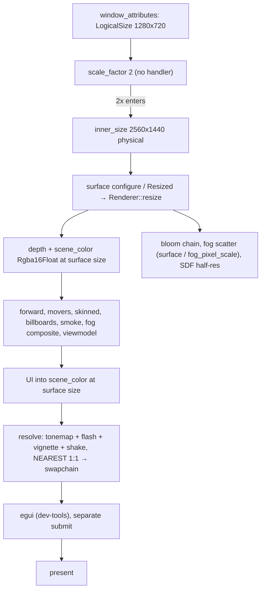
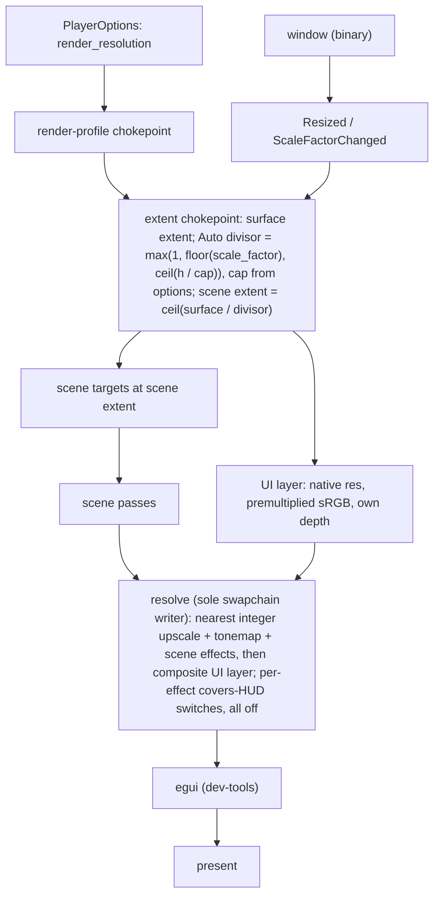

# hidpi-render-scale — research

Read at c0def0e9e. Findings that inform the brief but do not decide it.

## Measurements (2026-09-30, MacBook Pro 16" 2019, Radeon Pro 5300M 4 GB, Metal, Retina 2×)

| Build / variant | Map | Result |
|---|---|---|
| Release, 1280×720 logical window (2560×1440 physical) | campaign-test, stress-warren-hallway-inspection | ~30 ms/frame on both maps (owner) |
| Debug + dev-tools, baseline | campaign-test | forward pass 9.3 ms; postretro GPU 35.5 ms; CPU total 37 ms; wait_acquire 16.6 ms |
| Same, forward FS returns base colour early | campaign-test | forward pass 0.37 ms; GPU 21.3 ms; wait_acquire 5.9 ms |
| Same, window 640×360 logical | campaign-test | CPU total 21.5 ms; wait_acquire 2.9 ms (GPU trace failed) |
| Forward depth compare Equal → Always / LessEqual | campaign-test | +1.1 / −0.6 ms: early-Z is not a factor |
| Dummy scene-depth binding in forward | campaign-test | within noise |

Frame cost does not track scene complexity, which fits a fill-bound cost. A Retina window has 4× the pixels of the same logical window at 1×, and a 3072×1920 fullscreen panel has 6.4× the pixels of 1280×720.

A separate intermittent regime, 150–260 ms/frame in dev builds with ~48 ms/frame of GPU paging inside the forward pass, is unexplained and outside this brief's scope.

## Resolution lifecycle today

## Planned lifecycle

## Size-dependent consumers

These follow the scene extent: depth texture, `screen_effects` scene colour, the resolve bind group, `bloom.resize`, `fog.resize` (scatter dims and its depth tap ratio), `sdf_shadow_pass.resize`, `spot_shadow_pool.rebuild_bind_group` (it samples scene depth), capture/readback, and camera aspect, which `main.rs` sets beside the resize call.

These stay at the surface extent: swapchain, resolve output, UI layer and viewport, splash, egui.

Several passes read `surface_config` directly instead of the value passed to resize. Grep every read when splitting.

## winit 0.30.13 platform notes (read in the registry source; mostly for the window-modes follow-up)

- `Fullscreen::{Borderless(Option<MonitorHandle>), Exclusive(VideoModeHandle)}`. `MonitorHandle::video_modes()` yields size, bit depth and refresh rate in millihertz.
- macOS exclusive: a real display-mode change. Spaces and task switching are disabled and the dock and menu bar are hidden. winit recommends borderless for UX.
- macOS borderless: a native fullscreen Space.
- `WindowExtMacOS::set_simple_fullscreen` avoids Spaces, but fails if the window is already in native fullscreen.
- macOS transitions are queued while one is in flight. The green button changes state without any engine call.
- Windows: exclusive is supported, and the screen saver is suppressed in fullscreen. Wayland no-ops exclusive.
- Moving between displays sends `ScaleFactorChanged`, normally followed by `Resized`. Game UI scale self-corrects, because `device_scale` is computed from the physical size each frame. The egui scale factor is set once at construction.

## UI pass move — details

- `UiPass` is built with `SCENE_COLOR_FORMAT` and records into scene colour with Load, before the resolve. The swapchain format is the first sRGB format the surface offers.
- The UI blend is standard alpha, which suits the swapchain. The UI pass owns a private depth target sized to its viewport (`ui.md` §5), independent of scene depth, so it moves with the pass.
- The text atlas is commented as built for an sRGB surface. Today it draws into an HDR target and is tonemapped, so check colour parity after the move.
- The flash limiter clamps `screen.flash` and `screen.vignette` in the resolve uniform, and measures luminance from scene colour. UI is not part of that measurement today either.
- Chosen shape: UI renders into its own native-res layer that the resolve composites, so the resolve stays the sole writer. Order: scene passes, UI layer, resolve, egui (separate submission, Load). Rejected alternatives (UI after the resolve, as a separate pass or inside the resolve's pass) cannot host a HUD-covering effect such as the roadmap's optional CRT filter, which must sample the composited frame. The layer costs a full-res store plus a read, about 1% of a 30 ms frame here.

## Prior commitments touched

- UI renders at native resolution in a 1280×720 reference space scaled by `device_scale`. The fixed low-res UI target and its nearest upscale were explicitly retired (Q3 roadmap archive).
- `ui.md` §6: whole-UI reference scaling is not an accessibility scale; text scale is.
- The fog pixelation is an intended aesthetic, and `fog_pixel_scale` is map authority. A player override of it is a recorded non-goal (`plans/done/title-and-options-screen`).
- `player_options.md` §4: a graphics option is a `PlayerOptions` field, translated at the render-profile chokepoint, and re-applied at full init. The UI never owns GPU work.
- Precedent on this hardware class: an earlier fog-quality change was reverted because it dropped a 2020 MacBook Pro below 60 fps.
