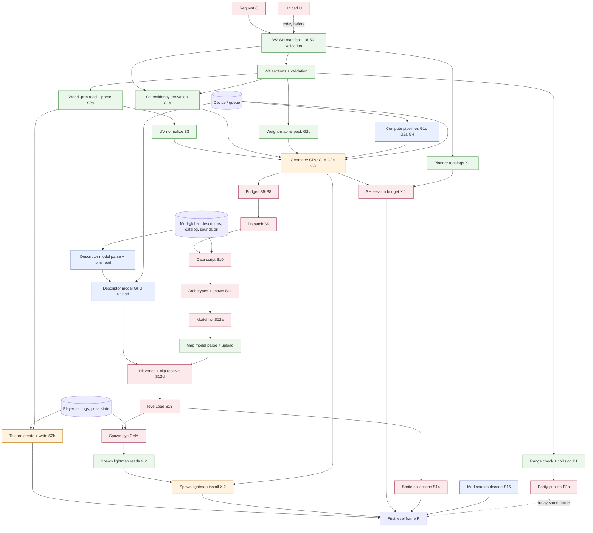

# Level-Load Pipeline — Research

> **Read this when:** drafting the level-loading pipeline spec with the owner. This is its research section: the facts the design is made from. It chooses nothing.
> **Key facts:** the main thread is idle for the whole parse and then does ~0.8–1.0 s of install in one redraw that also renders the first level frame. About a third of that install is level-invariant, a third could run on any thread, and a third needs the GPU device. Only ~5–20 ms needs the script VM.
> **Related:** `context/lib/boot_sequence.md` §1–§4 · `context/plans/in-progress/level-load-perf-contract.md` · `level-load-perf-findings.md` · `context/lib/networking.md` §Admission and content parity · `context/lib/rendering_pipeline.md` §12

---

## Sources and labels

Every number carries a label.

| Label | Meaning |
|---|---|
| **m** | Measured. Release, this Linux container (4 cores, lavapipe under Xvfb), medians. Unless noted, from the Track A interleaved A/B session's post-Track-A binary: n = 4 first loads and 8 same-map level changes per map. Raw logs lived in the session scratchpad and were not retained. |
| **p** | Perf share from the findings (pre-Track-A, a ~1.5× slower run of the machine; the contract notes perf inflates shares). Used only to split a measured stage. |
| **e** | Estimate: arithmetic on measured numbers, shown. |
| **r** | Code reading at HEAD `5594fe4`, plus the in-flight single-parse model sweep. |

Two rounds landed after that session, so two stages are estimates:

- **Parse (Track B).** The `x_parse_bench` harness went 1478 → 771 ms on stress-warren-lit and 131 → 109 ms on campaign-test (m). In-app post-B parse is scaled by the same ratio: lit 1538 × 0.522 ≈ **803 ms** first load, 1615 × 0.522 ≈ 843 ms change. Campaign 153 × 0.832 ≈ **127 ms**, 138 × 0.832 ≈ 114 ms (e).
- **Model sweep (Track C).** Post-C cost = measured `model_load` minus the hit-zone re-parse the same session measured with a finer mark. Lit 210 − 43 ≈ **167 ms** first, 201 − 45 ≈ 156 ms change. Campaign 247 − 51 ≈ **196 ms**, 200 − 46 ≈ 155 ms (e).

Track C's landed build confirms both estimates on one first load each (m): `prl_parse` 786 ms lit, 144 ms camp; `model_parse` + `model_upload` 181 ms lit, 225 ms camp.

GPU-side cost is not measured anywhere: lavapipe rasterizes and compiles on the CPU. Every renderer-owned number below is a lavapipe CPU number.

Map shorthand: **lit** = stress-warren-lit, **camp** = campaign-test. "F / C" = first load / level change.

---

## 1. Stage inventory

### 1.0 What pins a thread

| Type | Thread property | Evidence (r) |
|---|---|---|
| `LevelPayload` (the worker's output) | `Send` | Compile-time `assert_send::<LevelPayload>()` in the worker module. |
| `Renderer` | Not `Send` | Field `cpu_frame: Rc<StageFrame<RenderStage>>`. §2's "the renderer, which is not `Send`" holds through at least this field; other fields were not audited. |
| Renderer upload queue (`UploadQueue`) | `Send`, not `Sync` | `Cell`/`RefCell` fields (batch, pool, counts). |
| wgpu `Device`, `Queue` | `Clone + Send + Sync` | `static_assertions::assert_impl_all!(Device: Send, Sync)` and the same for `Queue` in wgpu 30.0.1. Both derive `Clone`. |
| `ScriptCtx` | Main thread only | `Rc<RefCell<EntityRegistry>>`, `Rc<RefCell<DataRegistry>>`, `Rc<RefCell<SlotTable>>`, `Rc<Cell<f32>>` gravity. `Session` owns it, so `Session` is pinned too. |
| `ScriptRuntime` (QuickJS, Luau) | Main thread only | Session-owned; primitives capture `ScriptCtx` clones. |
| `LoadedModel` (glTF parse) | Plain data | No `Rc`/`RefCell` in `postretro-model` types. Not asserted. |
| `HitZoneStore` | `Send`, not `Sync` | `RefCell` warning sets. Session-owned. |
| `ShStreamManifest` | `Send + Sync` | Already shared by `Arc` with SH worker threads. |

So "renderer-owned" work can leave the main thread only through device/queue clones held outside `Renderer`, with results handed back into renderer state on the main thread. Anything reading the entity or data registry is main-thread only.

Affinity codes used below: **Any** (plain data), **R** (needs device/queue), **M** (main thread: script VM, `ScriptCtx`, session state).

Input codes: **L** level file (payload) · **G** mod-global (manifest, descriptors, catalog, `sounds/`) · **S** script results (dispatch, data script, archetype sweep, `levelLoad`) · **P** player settings or session pose state · **D** device/queue · stage ids for other units.

### 1.1 Request and unload

| Id | Unit | Inputs | Feeds | Affinity | Earliest | Life | lit F / C | camp F / C |
|---|---|---|---|---|---|---|---|---|
| Q | Resolve request (catalog lookup or raw path) | G (`DataRegistry.maps`) | W | M (`ScriptCtx.data_registry`) | Request | — | ~0 | ~0 |
| U | Unload previous level (change only) | Previous level state | Everything (clear-on-unload) | M + R | Today: before W spawns | — | — / 70 m | — / 55 m |
| U.1 | Renderer release: installs empty textures and an **empty geometry**, which rebuilds the compose pipelines | D | — | R | — | — | — / 64 m (compose phase 49 m) | — / 48 m (compose phase 43 m) |
| U.2 | Streaming retire: cancel SH workers, lightmap session, issuer; join later | — | Next level's first reads | M (session) | — | — | small (r) | small (r) |
| U.3 | Net parity clear, audio fade and release, registry and bridge clears | — | Peers demote | M | — | — | ≈ U − U.1 | ≈ U − U.1 |

Unload's empty install is the measured proxy for compose-pipeline creation: ~45 ms of each unload is pipelines for a level with no data.

### 1.2 Worker parse

One `std::thread` per load, `mpsc` handoff (r). Inputs: map path, content root, `--baked-root`, and two env vars (`POSTRETRO_SH_STREAMING`, `POSTRETRO_LIGHTMAP_STREAMING`). No mod-global data, no scripts, no settings, no device.

| Id | Phase | Feeds | Cost |
|---|---|---|---|
| W1 | Open file, read container table | W2, W3 | small |
| W2 | SH stream manifest (maps with id 50): read id 49, id-50 metadata, base and source metadata; id-50 `ValidationPlan`. Runs **before** `progress.begin` (r). | SH residency (G1a), planner (X.1), W4 | lit ≈ 500 ms post-B (Track B outcome); camp unknown |
| W3 | Choose backing. Positional reads when SH or lightmaps may stream (both maps here, r: both log streamed lightmap pools). Whole-file image read only for legacy maps. | W4 | — |
| W4 | Section reads, decode, validation: geometry, BVH, cells, portals, cell draw index, lights, lightmap index (+ payloads when all-resident), animated weight maps, id-49 semantics, canonical partition | Everything in install | camp weight-map decode ≈ 65 p; id-49 derivation 29 / 4 ms m (lit / camp); partition ≈ 30 ms lit |
| W5 | `progress.finish`, send payload | Delivery | — |

| | lit F / C | camp F / C |
|---|---|---|
| Whole parse | ≈ 803 / 843 e (harness 771 m) | ≈ 127 / 114 e (harness 109 m) |
| Delivery wait (channel polled once per vsynced Loading frame) | 9.5 / 6.6 m | 8.7 / 10.5 m |
| Install deferral (one held painted frame) | 21 / 20 m | 20 / 22 m |

Earliest start: the request. On a CLI boot map the path is known at boot stage 1, before the window (r), about 1 s earlier on lavapipe (`renderer_full_init_complete` ≈ 984–1000 ms m precedes `boot_worker_dispatch`). For a catalog load the path needs mod init.

Lifetime: per level. The retained file handle (`Arc<PrlFile>`) and both stream manifests live as long as the level streams.

### 1.3 Main-thread install

Rows follow `install_level_payload` order. Costs are lit F / C, then camp F / C.

| Id | Unit | Inputs | Feeds | Affinity (pin) | Earliest | Life | lit | camp |
|---|---|---|---|---|---|---|---|---|
| P1 | Index-range check + static collision build. Fallible; rejects before any mutation. | L | Gate for everything; collision commit (S7) | Any (pure functions of `LevelWorld`) | During W4 | Level | 2.2 / 2.3 m | 0.5 / 0.5 m |
| P2a | Level content digest | L (movers, static collision) | P2b | Any (blake3) | During W4 | Level | 0 m (no endpoint) | 0 m |
| P2b | Publish parity, relevel catalog id, join seed | P2a, source identity, persisted state | Peer participation (§3.7) | M (session endpoint) | See §3 | Level | ~0 | ~0 |
| P3 | Install hot-reload-deferred mesh descriptors | G (staged) | Model list (S12a) | M (`ScriptRuntime`) | Level boundary | Mod | ~0 | ~0 |
| P4 | Seed gravity; build nav graph | L | Scripts; AI | Gravity M (`ScriptCtx.gravity`); nav Any | During W4 | Level | 0.2 m | 0.1 m |
| P5 | Derive materials from texture names | L | S2, S4 | Any | During W4 | Level | ~0 | ~0 |
| P6 | Apply shadow and surface-depth tiers to the renderer | P | S2 packing, S4 spot pool | R (renderer state) | Before S2 | Session | ~0 | ~0 |
| S2a | World `.prm` read + parse (copies each slot) | L (names, cache keys), payload `.prm` root | S2b, S3 (dimensions) | Any (file read, `PrmFile::from_bytes_partial`) | After W4 decodes id 32 | Level today; content-keyed by blake3 (r) | ≈ 40 / 19 e (41 % p of 97.5 / 45.2 m) | ≈ 52 / 25 e (47 % p of 111 / 53 m) |
| S2b | Texture create + write, samplers, bind groups | S2a, P (surface-depth tier), D | Draw; S4 | R | After S2a | Level | ≈ 57 / 27 e | ≈ 59 / 28 e |
| S3 | UV normalize | S2a dimensions, L vertices | S4 | Any (pure; reads dimensions only) | After S2a | Level | 0.1 m | 0.0 m |
| S4 | Geometry upload, four phases (m, `[Renderer] Geometry install timing:`) | — | — | — | — | — | **361 / 320 m** | **270 / 250 m** |
| S4.G1 | Buffers, lights, SH volume resources, SH streaming init | | | | | | 305 / 260 m | 131 / 127 m |
| G1a | — SH residency derivation from manifest + cells (dense-node arrays) | W2, L cells | Renderer streaming state | Any (pure function of `(manifest, cells)`, r) | After W4 cells | Level | ≈ 130 (contract) | ≈ 15 e (≈ 20 p) |
| G1b | — `sparse_compose_capacity` | manifest | Compose sizing | **Not established** | ? | Level | ≈ 60 (contract) | small |
| G1c | — SH-streaming compute pipelines | D, static WGSL | Compose passes | R | Before any load | **Invariant** | ≈ 100 e (shared estimate, below) | ≈ 100 e (75 % p of 131) |
| G1d | — Buffers, bind groups, SH resources | L, D | Draw | R | After delivery | Level | ≈ 20 e (remainder) | see G2 |
| S4.G2 | SDF atlas + compose family | | | | | | 46 / 47 m | 131 / 114 m |
| G2a | — Compose-family pipelines | D | Compose passes | R | Before any load | **Invariant** | ≈ 45 e (= empty-install compose phase, m 49) | ≈ 45 e (m 43) |
| G2b | — Animated weight-map re-pack to bytes + second consistency check | L | GPU buffers | Any | After W4 | Level | small | ≈ 35 e (48 of 182 p) |
| G2c | — Compose buffers | L, D | Draw | R | After delivery | Level | rest | ≈ 50 e |
| S4.G3 | Lightmap pool plan + SDF shadow rebind | L, D, G1 | X.2 | R | After G1 | Level | 2.2 m | 0.4 m |
| S4.G4 | BVH upload + cull pipelines | L, D | Draw | R (pipelines invariant) | — | Mixed | 6.7 m | 6.7 m |
| S5–S8 | World mesh, light bridge, collision commit, fog/trigger/mover entities | L, **S4** (light bridge reads the renderer's scripted-sample offset set in G1, r) | Registry entity ids, dispatch | M (registry) | After S4 | Level | 2.1 / 0.1 m | 0.3 / 0.1 m |
| S9 | Built-in classname dispatch | L, G | S10, S11 | M | After S8 (entity-id order) | Level | 0 m | 5.3 / 1.0 m |
| S10 | Data script; compose reactions; validation; subscriber and trigger-binding rebuild | L (script), G (global reactions), S9 | S11, `levelLoad` | M (QuickJS) | After S9 | Level | 0.3 m | 7.2 / 8.6 m |
| S11 | Archetype sweep, player spawn, spawners, trigger pools | L, G, S10, P (carried loadout, client suppression) | S12a, camera | M | After S10 | Level | 0.3 m | 0.5 / 0.6 m |
| S12a | Model list: registry meshes ∪ movement, weapon, projectile, touchable descriptor models ∪ spawner archetypes ∪ client-suppressed placements | S11, G | S12b | M (registry read) | Descriptor subset: before any load. Registry subset: after S11. | — | ~0 | ~0 |
| S12b | glTF parse, once per model per load (in flight) | S12a, content root | S12c, S12d | Any (`LoadedModel`) | Descriptor subset: before any load | Level today | see S12 total | see S12 total |
| S12c | Renderer upload: model `.prm` read + parse (Any), texture and buffer upload (R) | S12b, D | Draw; clip metadata | Any + R | After S12b | Level today (cleared on unload) | | |
| S12d | Hit-zone build, clip tables, clip-index resolve | S12b (clip tables are a pure function of the parse, r: in-flight equivalence test) | `levelLoad` | Build Any; store and resolve M | After S12b | Level | | |
| S12 | **Model sweep total** | | | | | | **≈ 167 / 156 e** | **≈ 196 / 155 e** |
| S13 | Fire `levelLoad` | S12d | Sprites, camera | M | After S12 | Level | 0 m | 0.1 m |
| — | Carried-light resolve, system-reaction bindings, weapon attachment, host registration, dynamic-light absorb | Registry | — | M | After S13 | Level | ≈ 0.3 m | ≈ 0.3 m |
| CAM | Camera: first spawn, `--start-pose`, spawn eye | S11, S13, P (start pose, frontend menu) | X.2 | M | After S13 | — | ~0 | ~0 |
| S14 | Sprite collections: registry emitters (M), map billboards (L), projectile sprites (G), weapon impact (invariant); PNG decode (Any); register (R) | S13, G, D | Draw | M + Any + R | Invariant part before any load | Level | 2.6 / 2.5 m | 2.9 / 3.0 m |
| S15 | "Level" sounds: the **whole mod `sounds/` directory**, reloaded every level (r) | G | Audio | M today (session audio); decode Any | Before any load | **Invariant in content** | 0 (no audio device) | 0 |
| X.1 | SH streaming session: planner topology from manifest + id-49 hints; budget from the renderer's residency snapshot | W2, G1 snapshot | Streaming | Any for topology (pure, r); budget needs G1 output (plain data) | Topology: after W2 | Level | ≈ 52 / 57 m (preload minus lightmap) | ≈ 2.6 / 2.5 m |
| X.2 | Lightmap spawn preload: read the spawn cell's mandatory blocks (Any, positional I/O), install through the renderer drain (R) | CAM spawn eye, W lightmap manifest, G3 pool, D | First frame | Any + R | Reads: once the spawn eye is known | Level | **310 / 189 m** | **276 / 194 m** |
| F | First level frame (same redraw as install) | All | Present | M + R | — | — | 1173 / 580 m (lavapipe, not representative) | 1057 / 401 m |

Notes on the table:

- **G1c + G2a shared estimate.** Both maps stream SH and build the same static-WGSL pipeline set (r). Campaign's G1 phase is 131 ms, and the findings put pipelines at 142 of 190 ms of it (75 %, p), so ≈ 100 ms. Compose pipelines: the empty install's compose phase is the clean proxy (43–49 ms m). Total invariant pipelines ≈ 150 ms per install on both maps, plus ≈ 45 ms per unload.
- **X.2 read/install split.** Measured whole from `[Lightmap streaming] spawn preload: … read in N ms` (51.5 MiB lit, 35.9 MiB camp; range 110–323 ms). The findings' lit perf split was 47 ms reads, 105 ms staging and writes (31 / 69 %, p). §2 uses that split.
- **S12 level-invariance.** On lit every model is a descriptor preload: seven distinct models, one map entity (m log, r). Camp loads ten: the same seven plus three map-placed. Camp's map-specific share ≈ 196 − 167 ≈ 29 ms first load, ≈ 0 on a change (e, noisy).
- **Line C labels.** Today's committed line C lumps sprite collections, host registration, camera, fog and sounds into `audio_load` (3.0–3.8 ms m). The in-flight change gives each its own mark.

### 1.4 Work deferred into the first level frame

Install and the first level frame run in **one redraw**: a successful install returns `true`, and the redraw falls through to the normal frame loop (r). No frame presents between them. Inside that frame (r):

- wgpu flushes every queue write staged during install at the frame's first submit. Install writes bypass the renderer's frame batching (the installation guard) and go to the raw queue. World textures (~80–96 MiB), lightmap blocks and the queue-written buffers therefore reach the GPU in this frame. Buffers built with `create_buffer_init` are filled at creation instead.
- SH async workers issue their first reads. Default mode is `Async`; SH clusters stream in over later frames.
- First light-bridge update, first compose dispatches, first cull.
- Metal pipeline compile: not established whether wgpu compiles at pipeline creation or at first use on Metal. A Metal System Trace answers it (§5).

### 1.5 Dependency graph

Edges are data dependencies, not today's order. Dashed edges are order-only constraints.

Legend: blue = level-invariant, green = any thread, orange = renderer-owned, red = main thread only.

---

## 2. Critical path

### 2.1 Today

Time to first frame (TTFF) = unload + parse + delivery + deferral + install + F. Freeze = install + F, one redraw. On a change, unload is a separate hitch inside the redraw that enters Loading, before its first loading frame paints. F is excluded from the sums below: its lavapipe value is not representative and its Metal value is unknown.

Install sums (m, post-C model estimate):

- lit F: 2.2 + 97.5 + 0.1 + 361.4 + 2.7 + 167.3 + 0 + 3.0 + 364.3 = **998** ms
- lit C: 2.3 + 45.2 + 0.2 + 320.0 + 0.7 + 156.2 + 0 + 3.3 + 247.8 = **776** ms
- camp F: 0.5 + 111.1 + 0 + 270.1 + 13.3 + 196 + 0.1 + 3.8 + 279.2 = **874** ms
- camp C: 0.5 + 53.4 + 0.1 + 250.1 + 10.3 + 154.8 + 0.1 + 3.5 + 196.9 = **670** ms

| | lit F | lit C | camp F | camp C |
|---|---|---|---|---|
| Unload | — | 70 | — | 55 |
| Parse (e) | 803 | 843 | 127 | 114 |
| Delivery + deferral | 31 | 26 | 29 | 32 |
| Install (freeze) | 998 | 776 | 874 | 670 |
| **TTFF − F** | **1832** | **1714** | **1030** | **871** |

On lit the parse and the install are close to equal. On camp the install is seven times the parse.

### 2.2 Install by affinity class

Each install unit assigned to one class. Splits use §1.3's estimates.

| Class | lit F | lit C | camp F | camp C | Contents |
|---|---|---|---|---|---|
| **I** level-invariant | 317 | 306 | 317 | 305 | Pipelines ≈ 150; descriptor models 167 / 156 (camp: lit's seven) |
| **A** any thread, per level | 320 | 246 | 209 | 138 | `.prm` read + parse, G1a, X.1 topology, X.2 reads (31 %), collision; camp adds G2b and map-model CPU |
| **U** affinity unknown | 60 | 60 | 0 | 0 | G1b `sparse_compose_capacity` |
| **R** renderer-owned, per level | 291 | 157 | 331 | 212 | Texture create + write, geometry remainder, X.2 install (69 %); camp adds map-model upload |
| **Mo** main only | 6 | 4 | 17 | 14 | Bridges, dispatch, data script, archetypes, clip resolve, `levelLoad`, sprite and host registration, camera |
| Allocated / measured | 995 / 998 | 773 / 776 | 874 / 874 | 670 / 670 | |

On a change, unload adds ≈ 49 ms (lit) / ≈ 43 ms (camp) of I (empty-install pipelines) and ≈ 21 / ≈ 12 ms of main-thread clearing.

### 2.3 Floors

Each floor runs every unit at its earliest start on a thread its affinity allows. Assumptions common to all three: I is done before the request (once per boot, or kept from an earlier load); unload overlaps the parse, and its invariant part disappears; the one held deferral frame stays.

- **Floor A — no renderer thread.** A and U run on helper threads during the parse. R + Mo run on the main thread after delivery.
  TTFF = max(parse, A + U) + delivery + deferral + R + Mo. The range puts U on a helper or on the main thread.
- **Floor A′ — one sequential worker.** Keeps "one worker per load" and widens only what it does. TTFF = parse + A + U + delivery + deferral + R + Mo.
- **Floor B — renderer-owned upload context off the main thread.** Same TTFF as A, because R still waits for delivery. The freeze drops to Mo (+ U if U turns out main-only).
- **Floor B′ — uploads stream during the parse.** Not quantifiable from current data. Lower bound ≈ longest dependency chain + delivery + Mo.

| | lit F | lit C | camp F | camp C |
|---|---|---|---|---|
| Today TTFF − F | 1832 | 1714 | 1030 | 871 |
| **Floor A** TTFF − F | **1131–1191** | **1030–1090** | **585** | **397** |
| Floor A′ TTFF − F | 1511 | 1336 | 712 | 511 |
| Floor B′ TTFF − F (lower bound) | ≈ 820 | ≈ 860 | ≈ 300 | — |
| Today freeze (+ F) | 998 | 776 (+ 70 unload hitch) | 874 | 670 (+ 55) |
| **Floor A** freeze (+ F) | **297–357** | **161–221** | **348** | **226** |
| **Floor B** freeze (+ F) | **6–66** | **4–64** | **17** | **14** |

Arithmetic, Floor A:

- lit F: max(803, 320 + 60) = 803; + 9.5 + 21.4 + 291 + 6 = **1131**. With U on main: 803 + 9.5 + 21.4 + 291 + 6 + 60 = **1191**.
- lit C: max(843, 306) = 843; + 6.6 + 19.7 + 157 + 4 = **1030**; + 60 = **1090**.
- camp F: max(127, 209) = 209; + 8.7 + 20.0 + 331 + 17 = **585**.
- camp C: max(114, 138) = 138; + 10.5 + 21.5 + 212 + 14 = **397**.

Arithmetic, Floor B′ lower bounds:

- lit: R (291) is shorter than the parse, so ≈ 803 + 9.5 + 6.
- camp: the longest chain is the spawn lightmap, ≈ 86 reads + 190 install = 276. So ≈ 276 + 8.7 + 17.

Caveats that move these floors:

- **I is not free on the first load.** Done before the request, it adds ≈ 317 ms between logo and Loading, unless boot overlaps it. Done during the first parse on the main thread, it fits under lit's 803 ms parse but not camp's 127 ms. Camp first-load Floor A then becomes max(127, 209, 317) + 8.7 + 20 + 331 + 17 ≈ **694**.
- **A items need parse outputs.** Floor A assumes each starts as soon as its input is decoded. X.1 topology needs only W2, so it can start early. G1a needs cells, S2a needs id 32, and X.2 needs the spawn placement, all from W4. Section decode order inside W4 was not traced.
- **X.2 reads are speculative before scripts.** The spawn eye comes from the first `player_spawn`, the pawn descriptor's eye, `--start-pose`, or the frontend camera, all known at the request. But it is read after `levelLoad`, so a `levelLoad` teleport moves it (r). Early reads need a re-check at install.
- **F is outside every floor.** On lavapipe F alone (0.4–1.2 s) is the same size as the floor. On Metal it is unmeasured.

The floors above are load-scoped. A wider floor exists for the CLI boot path: the parse needs only the path, so it could start at boot stage 1 and overlap ≈ 1 s (lavapipe) of window, session and full renderer init. That crosses §1's causal rule (§3).

---

## 3. Contracts each kind of move crosses

| Move | Contract crossed | Governing sentence |
|---|---|---|
| Any non-PRL work on the worker: `.prm` read, SH derivation, lightmap reads, collision, model parse | Thread split, `boot_sequence.md` §2 | "The level worker parses the PRL only. Texture decode, GPU upload, and UV normalization run on the **main thread** during level install — they need the renderer, which is not `Send`." Table: "Worker thread \| PRL parse only. Output is plain `Send` POD — no engine handles, no GPU resources." |
| Helper threads, a pool, or async I/O | Worker model, §2 | "Handoff is an `mpsc` channel. One worker per load request; no thread pool, no async runtime (`std::thread` + `mpsc`)." |
| Reordering install stages; level-invariant work during Loading | Install order, §3 | "Level install runs on the main thread after worker delivery. It is repeatable: every load request reaches this path after any active level has been unloaded." Mesh sweep: "runs *after* the data-archetype sweep (stage 11)" and "*before* the `levelLoad` fire (stage 13), because a `setAnimationState` reaction in `levelLoad` requires resolved clip indices." Texture before UV: "the renderer must produce loaded textures before texel-space UVs convert to `[0,1]`." |
| Keeping models, textures, sprite collections or sounds across a level change | Clear-on-unload, §4 | Cleared: "Per-level GPU resources: textures, geometry, mesh-pass caches, smoke collections" and "Level sounds, sprite collections". |
| Spawning the worker before unload | Unload-before-spawn, §4 | "Load from Running \| Unload current level first, then spawn worker and enter Loading." Also §8 non-goal: "Multiple simultaneously resident levels or streaming." |
| Multi-frame install; a bar that moves during install | Loading screen, §1 | "Progress is the worker's load fraction scaled into `[0, 0.85]` and never decreases." "The main-thread install is one blocking frame the bar cannot animate through. A delivered payload is therefore held for one painted frame at progress 0.85, then installs. A held payload counts as a load in flight, so request draining waits for it." |
| New progress units (CPU phases, uploads) | Progress units, §2 | "Units are the bytes this load actually reads: sections read whole, plus the file image itself on the whole-file backing." |
| Starting the CLI parse before the logo frame | Boot order, §1 | "The two-frame delay is causal: pixels reach the user before any deferred session, audio, net, mod-supplied, or level-load CPU work runs." Stage 4: "No audio, debug UI, net, mod, or level work in this path." |
| Any early load while the first-launch panel is up | First-launch hold, §1 | "boot shows the panel … before any frontend backdrop, CLI boot-map, or host-named level load starts." |
| Splitting install across frames; moving parity publication | Net parity timing, `networking.md` | "The two stages queue independently. Each is evaluated once the value it compares against is installed." "A slot participates if and only if its last declaration matches the host's currently installed parity values, re-evaluated for every slot after every parity source is reinstalled." "Any entry to participating registers the slot and spawns its pawn." |
| Any wgpu call outside the renderer crate (for example a worker in `postretro` creating buffers) | Renderer owns GPU, `index.md` §2 | "All wgpu calls live in the renderer module. Other subsystems never touch wgpu types." |
| A cross-level descriptor or model cache | Hot reload, `boot_sequence.md` §6 | "Mesh blocks and weapon presentation model paths remain at their installed values until the next level load." |

Most frequently crossed: the §2 thread split (every A-class move), then install order and the one-frame install (any reordering, multi-frame or overlap design), then clear-on-unload (every cache).

Moves that cross nothing: create-once pipelines inside the renderer (findings candidate 3), zero-copy `.prm` slots, and an upload context that lives in the renderer crate. Pipeline creation already has a precedent: the spot shadow pool and promoted depth cache survive a level change when the shadow resolution is unchanged (r).

---

## 4. Cross-cutting concerns

### 4.1 Cancellation of an in-flight load

**Question.** What happens to a load in flight when a new request, a suspend, or a host relevel arrives?

**Code today (r).**

- No cancellation exists.
- A load request during Loading coalesces with other queued loads (last one wins). It waits until the in-flight load (including a held payload) installs. The next drain then unloads that freshly installed level and starts the new one.
- During a CLI boot load, runtime requests are dropped with a warning.
- Suspend drops the receiver and the `JoinHandle`. The worker runs to completion, `send` fails, and the payload drops on the worker thread.

**Precedent (SH and lightmap streaming, §4).**

- Cancel is a flag checked before the next read. A live positional read is never joined on the frame path.
- A retirement object polls `is_finished` each frame and joins only finished threads. It also drains old completion queues so a blocked issuer can see its cancel.
- The next generation's issuer starts only after the old handles join. "Generations never overlap."
- Consequence that already exists: a level change's new streaming reads wait for the old level's in-flight read to finish.

### 4.2 Peak memory per load

**Question.** What is alive at once, and for how long?

**Code today (r). Nothing here is measured.**

- The payload holds the decoded `LevelWorld`: vertices, indices, BVH, cells, portals, lights, lightmap index, all-resident lightmap and shadowmask payloads, SH sections (legacy), map entities, navmesh. It also holds `Arc` stream manifests and the retained file handle.
- Lit and camp both stream, so neither reads its whole file. Legacy maps read the whole image, then decode from it (transient ~2× on that path).
- `take_gpu_lighting_payloads` moves lightmap payloads into the GPU upload, which drops them after install. The rest of `LevelWorld` stays resident for the level's lifetime as `App.level` (collision, nav, visibility, streaming read it).
- Texture install holds three copies of one `.prm` at a time (file bytes, slot `to_vec`, wgpu staging). Model textures include three 21 MiB diffuse bundles (findings).
- Unload-first means one level's CPU data at a time. Spawn-before-unload would hold two (findings candidate 8). Moving A work to the worker makes the payload carry decoded texture bytes and lightmap blocks earlier.

### 4.3 Progress reporting

**Question.** What do the bar's units mean once work other than PRL reads happens before the first frame?

**Code today (r).**

- The worker credits bytes read.
- `progress.begin` runs **after** the SH manifest load (W2). Until then `fraction()` is 0. On lit, W2's id-50 validation is ≈ 0.5 s of the ≈ 0.8 s post-B parse (Track B outcome), so the bar should sit at zero for most of the parse (inference, not observed).
- CPU-bound validation inside W4 advances nothing.
- Install shows a fixed 0.85 for one held frame, then blocks through install and the first frame (one redraw).
- `loading.progress` is a slot written through `ScriptCtx`, so the bar is main-thread state.

### 4.4 Errors and failure semantics

**Question.** Where does each rejection surface, and what state must it leave?

**Code today (r).**

| Failure | Surfaces | Leaves |
|---|---|---|
| Worker `Err` (malformed PRL, bad env value) | `LoadingStep::Fail` | Runtime: Frontend, no level (the old level is already unloaded). Boot: exit non-zero. |
| File not found | Payload with no level → "worker delivered no level payload" | Same as above |
| Index-range or collision rejection | `LevelInstallRejection` before any mutation | Same as above. Test `install_range_rejection_precedes_all_level_state_mutations` guards the order. |
| Data-script error | Logged; empty manifest | Level loads with mod-global reactions only |
| Missing `.prm`, model or sprite | Warning; placeholder | Level loads |
| Animated lightmap install error | Dummy fallback | Level loads |
| Streamed SH renderer init error | **`panic!`** ("cannot install streamed SH level resources") | Process dies |
| Spawn streaming install error | `exit_result = Err`, event-loop exit, even on a runtime load | Process exits |

Every recoverable rejection happens before parity publication and before any registry mutation. Work moved earlier keeps that property only if its rejections still reach the same gate. Work moved later (an upload thread, a multi-frame install) can fail after mutation began, a state no path handles today.

### 4.5 Determinism of install order

**Question.** Which orderings are observable and must survive parallelism?

**Code today (r).**

- Entity-id allocation order: light entities before fog, then triggers, then movers, then dispatch, archetypes, player spawn, spawners. Both bridges key dirty tracking on `EntityId`. Test `windowed_install_assigns_light_entity_ids_before_fog_entity_ids` pins this.
- Reaction composition before subscriber and crossing rebuild. The crossing detector captures local slot defaults before any network baseline applies.
- Trigger pools arm host-only, after bindings, before `levelLoad`. Pinned-seed restart test exists.
- Model sweep in list order; clip resolve before `levelLoad`; sprite registration after `levelLoad`; sounds last.
- Sound registration is sorted by path.

Pure CPU work (parse, `.prm`, SH derivation, hit zones) has no observable order, provided results are applied in list order.

### 4.6 Co-op

**Question.** How do client join and host relevel ride this path?

**Code today (r).**

- **One path for everyone.** Clients load through the same request path. A connected client suppresses host-replicated placements and its boot pawn, and adds the suppressed placements' models to the sweep.
- **Parity publication is install-time.** The host's `set_level_parity` re-evaluates participation immediately, at the start of install. That is safe only because install and the first frame share one redraw, so no snapshot is sent while the level is half-installed (inference). A split install must decide where publication goes.
- **Clients learn the next map late.** The host announces the next catalog id inside its own install (`set_relevel_catalog_id`), after its parse. A client's relevel therefore serializes: host unload + parse → client unload + parse + install.
- **Transport keeps polling during Loading.** It is polled every Loading frame. A blocking install frame (≈ 0.7–1.0 s here) stalls the poll for that long.
- **Unload clears host parity**, which demotes peers. Admission is untouched.

---

## 5. Metal measurement protocol

Run on the owner's Mac from a release build. Bake the maps and model textures as the findings did. `RUST_LOG=info` throughout. n ≥ 5 first loads (relaunches) and n ≥ 8 level changes per map; report medians with map, path and run count.

**Launch forms.**

- First load: `RUST_LOG=info cargo run -p xtask -- run --release -- content/dev/maps/<map>.prl`
- Same-map change (campaign-test, catalog path): `RUST_LOG=info cargo run -p xtask -- run --release -- --mod dev`. Start Campaign Test from the menu, quit to menu, start it again.
- Different-map change (either map): `cargo run -p xtask -- run --release --features dev-tools -- content/dev/maps/<map>.prl`, then `Alt+Shift+L` loads `combat-demo.prl` (bake it first, `boot_sequence.md` §7). `dev-tools` changes the binary; compare only like with like.

**Log lines to read.** The in-flight change adds the per-mark lines; confirm they are present in the build.

- `[Startup] … renderer_full_init_complete=…, boot_worker_dispatch=…` (line A)
- `[Startup] mod_init=…` (covers session install + full renderer init + mod init)
- Line C: `worker_delivered=… (incl. prl_parse=…)`, `install_deferral`, `static_collision`, `texture_upload`, `geometry_upload`, segment-B marks, `model_parse`, `model_upload`, `hit_zone_build`, `model_bindings`, `level_load_event`, `host_registration`, `camera_pose`, `fog_masks`, `sprite_collections`, `audio_load`, `streaming_preload`, `first_level_frame`
- `[Renderer] Geometry install timing:` (`has_geometry=true` on install, `false` on unload)
- `[Renderer] Texture install timing:` (read, parse, create_write, bind_groups)
- `[Startup] unload_level=`
- `[Lightmap streaming] spawn preload: … MiB read in N ms`
- `[Model] uploaded N distinct mesh model(s)`; `[Audio] loaded N sound(s)`

| # | Measurement | How | Decides |
|---|---|---|---|
| 1 | Compute-pipeline cost, cold vs warm shader cache | Geometry install line: G1 and G2 phases on install, and the `has_geometry=false` compose phase on unload (pipelines for an empty level). `renderer_full_init_complete` in line A. Cold = first launch after a rebuild; warm = second launch. | Whether "create once at init" matters on Metal, and whether moving ~10 pipelines into full init costs boot noticeably. |
| 2 | Install CPU vs GPU split per stage | Line C and the two renderer lines, warm runs | Re-weights §2's classes. If R shrinks on unified memory, Floor A is close to Floor B and an upload thread buys little. |
| 3 | Texture upload cost | Texture install line: `create_write` vs read + parse | Whether a renderer-owned upload thread is worth its complexity, against simply moving read + parse off the main thread. |
| 4 | First-frame cost | `first_level_frame` vs a steady frame from `POSTRETRO_GPU_TIMING=1` (or the Metal System Trace if timestamps are unsupported, `rendering_pipeline.md` §12) | Whether F dominates every floor. If it does, the staged-write flush or first compose is the next target, not install. |
| 5 | Where the install frame's main thread waits | Metal System Trace over boot + one load (`xcrun xctrace record --template 'Metal System Trace' --launch -- <binary> content/dev/maps/<map>.prl`). Read main-thread intervals across the install redraw and GPU intervals for the first submit. Delete the `.trace` and `$TMPDIR/instruments*.ktrace` afterwards. Keep the window in front. | Whether Metal compiles pipeline state at creation or first use; how long the staged-write flush takes on the GPU. |
| 6 | Cold vs warm page cache | `sudo purge` before launch, versus a warm repeat | Whether `.prm`, lightmap and parse reads are I/O-bound on the Mac's SSD. That decides whether prefetching them during the parse pays. |
| 7 | Spawn lightmap preload | The spawn-preload line, cold and warm | Whether X.2 (the largest per-level unit on campaign here) needs an early start, a read/install split, or neither. |
| 8 | Peak memory per load | `/usr/bin/time -l` (maximum resident set size) for a boot plus one change, each map | The cost of spawn-before-unload and of a fatter payload. |
| 9 | Level sounds | `audio_load` with a real audio device | Whether reloading the whole `sounds/` directory per level is worth caching. |
| 10 | Co-op relevel (optional) | Host `--mod dev --host` on a catalog map, client `--mod dev --connect 127.0.0.1:<port>` (flags as in `networking.md` §Testing the conditioned link); host quits to menu and restarts. Client line C plus the time from host unload to client first frame. | Whether announcing the next map at host request instead of host install is worth deciding now. |

---

## 6. Open questions for the owner

1. **Target.** Faster time to first frame, or a loading screen that never freezes?
   - Floor A cuts TTFF by 35–55 % and the freeze by 60–80 %, without a renderer thread.
   - Only Floor B brings the freeze to tens of milliseconds.

2. **What may the worker do?** Options:
   - (a) PRL parse only, as today. A-class work stays on the main thread.
   - (b) "Level CPU preparation": the one worker also does `.prm` read + parse, SH residency derivation, planner topology, collision, map-model parse, spawn lightmap reads (Floor A′).
   - (c) Bounded helper threads per load (Floor A).

   Consequences:
   - (b) and (c) cross §2.
   - (b) adds ≈ 140–380 ms of worker time on these maps, but removes it from the freeze.
   - (c) also crosses the "no pool" sentence.
   - G1a lives in the renderer crate and is `pub(in crate::render)`. Calling it off-thread needs either a new pub CPU entry in the renderer, or moving the derivation to a lower crate.

3. **Renderer-owned work off the main thread?** Options:
   - (a) No. The freeze floor is R + Mo ≈ 160–350 ms on lavapipe.
   - (b) An upload context in the renderer crate holding `Device`/`Queue` clones. It builds per-level resources from the payload and hands them back.
   - (c) Time-slice install across several main-thread frames.

   Consequences:
   - (b) must respect `Renderer` being `!Send` (the `Rc` timing frame) and the upload queue's installation guard (`assert_empty`). It also needs a defined hand-back point.
   - (c) needs no new thread but breaks the one-frame install. Parity publication, `levelLoad` timing and the progress units must then be re-decided.

4. **Level-invariant work.** Options:
   - (a) Create at full renderer init (pipelines) and after mod init (descriptor models, sounds).
   - (b) Create lazily on the first load and keep.
   - (c) Rebuild per load, as today.

   Consequences:
   - (a) adds ≈ 317 ms (lavapipe) to boot before Loading.
   - (b) puts it inside the first load: free on lit (under the parse), not on campaign.
   - Keeping models, textures, sprites or sounds crosses clear-on-unload. Cache keys must include content and the surface-depth tier (textures pack at the player's tier). The descriptor set changes at the next level boundary after a hot reload.

5. **Unload vs spawn order on a level change.**
   - (a) Unload first, as today: one level in memory; a failed load leaves Frontend.
   - (b) Spawn first: saves the unload's ≈ 55–70 ms on the critical path but holds two levels' CPU data. A failed parse could then keep the old level running, a new semantic.

   Both cross §4. (b) brushes the §8 non-goal.

6. **Cancellation.**
   - (a) Let an in-flight load finish and discard it, as suspend does now.
   - (b) A cooperative cancel flag checked between sections and phases, with poll-and-join retirement on the SH streaming pattern.

   Today a new request waits for the old load to install fully, then unloads it. (b) costs a flag through `load_prl` and every helper.

7. **Progress units.**
   - (a) Bytes, as today: the bar stalls through W2 and through install.
   - (b) Weighted phases (manifest validation, reads, install stages).

   (b) changes §2's unit sentence and the 0.85 parse share.

8. **Early CLI parse.** Start the boot map's worker at stage 1 or right after the logo frame? It overlaps ≈ 1 s of full renderer init (lavapipe). It crosses the causal two-frame rule and the first-launch hold. A `--connect` host map can replace the CLI map, so the parse may be wasted.

9. **Relevel announcement.**
   - (a) At host install, as today: clients serialize behind the host's parse.
   - (b) At host request: clients parse in parallel with the host. A failed host parse then leaves clients on a level the host never installs. They stay admitted (recoverable by the parity design), but the behavior is new.

10. **Where moved work fails.** Recoverable rejections today all happen before any mutation. Moving fallible work later (an upload thread, a multi-frame install) needs a defined rollback state. Separately: should the streamed-SH init `panic!` and the fatal spawn-streaming error become ordinary load failures as part of this pipeline?

---

## 7. Not established

| Gap | Where to look first |
|---|---|
| Affinity of G1b `sparse_compose_capacity` (≈ 60 ms lit) | Its body under `crates/renderer/src/render/sh_streaming/`: does it touch `device`/`queue`, or only manifest data? |
| Section decode order inside W4, which sets when A items could start | `load_prl_from_container` |
| Whether built-in classname handlers or the data script add mesh models a placements × descriptors prediction would miss | Built-in handlers' `MeshComponent` inserts; `distinct_mesh_models` |
| Post-B in-app parse and post-C model sweep | First measurement with the in-flight marks |
| Read vs install split of X.2 after Track A | A mark between the spawn preload's read and its renderer drain |
| Peak memory | §5 #8 |
| Metal pipeline compile timing | §5 #1 and #5 |
