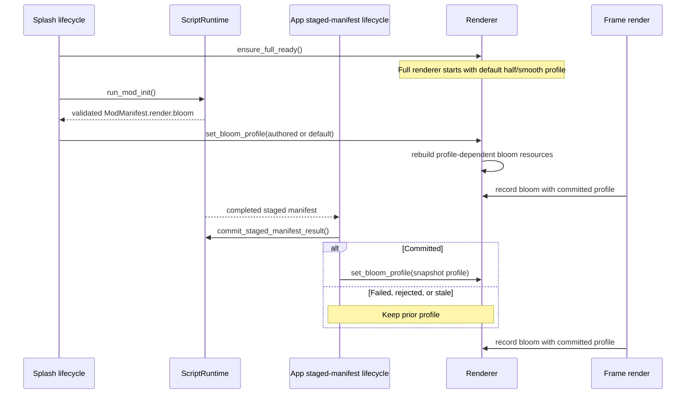

# Mod Bloom Render Profile Research

Read with `index.md`. This records current seams and lifecycle decisions.

## Lifecycle

`run_splash_frame_one` calls `finish_renderer_full_init` before
`run_deferred_mod_init`. `Renderer::finish_full_init` can rebuild all
full-phase resources on resume. The renderer must retain the profile itself so
the rebuild preserves the last committed mod choice. `Renderer::resize` already
recreates `ScreenEffectsPass` before `BloomPass::resize`; bloom can recreate
profile-sized targets from its retained profile there.

## Existing constraints

- `bloom_level_dimensions` assumes a base divisor of two. A profile divisor
  changes the first target and every subsequent level.
- `bloom_extract.wgsl` currently reduces exactly a 2x2 source block. Applying
  quarter or eighth sizing without changing it would omit bright source texels.
  Extraction must visit every in-bounds texel in each divisor-sized source block,
  threshold each texel before reduction, and normalize by the in-bounds count.
- Smooth filtering remains linear for downsample and Gaussian blur. Pixelated
  mode selects nearest-style `textureLoad` entry points only for bloom
  upsample/composite reads.
- `Renderer::new_offscreen` is used by `--capture`, whose driver does not run
  mod init. Capture remains default half/smooth in this plan.
- `POSTRETRO_BLOOM=0` and the dev-tools enable control remain independent
  diagnostic controls. The manifest profile has no enable field.

## Extension seams

| Need | Current seam | Planning decision |
|---|---|---|
| Script profile | `ModManifestResult` and JS/Luau manifest drains | Script runtime owns a CPU-only parsed profile. |
| Hot-reload transfer | `StagedManifest` and `poll_staged_manifest_results` | Apply only after a `Committed` outcome. |
| GPU profile | `Renderer` → `FullRenderer` → `BloomPass` | Renderer owns a wgpu-free profile cache and all resource rebuilds. |
| Script-to-renderer mapping | `postretro` app boundary | Map parsed script enum to renderer enum here; neither lower crate depends on the other. |

## Oversized-file splits

`crates/scripting-core/src/staged_manifest.rs` (1376 lines),
`crates/postretro/src/main.rs` (8738 lines), and
`crates/postretro/src/scripting/primitives/mod.rs` (884 lines) exceed the
planning threshold. Extract the staged snapshot types, app staged-manifest
lifecycle method, and mod-manifest SDK registrar before feature edits extend
those seams.
