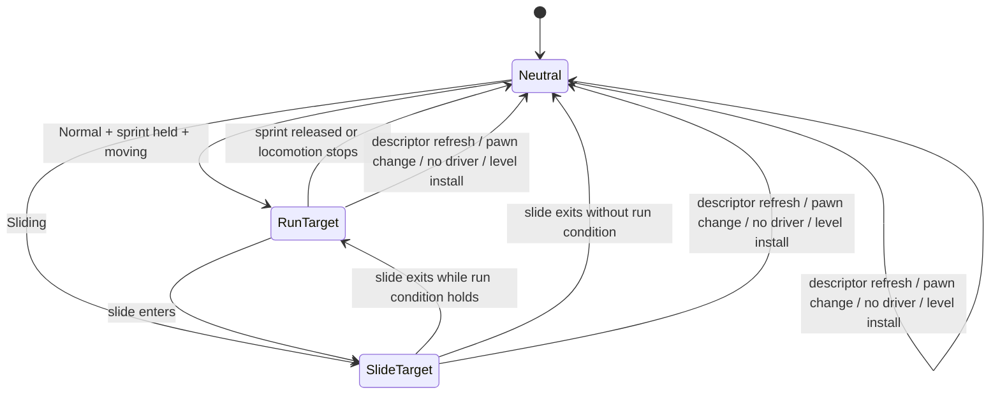

# Sustained FOV lifecycle

```mermaid
sequenceDiagram
    participant Input as local gameplay snapshot
    participant Move as followed movement component
    participant Feel as render-rate view feel
    participant Camera as world projection

    Input->>Feel: held Sprint state
    Move->>Feel: state kind and horizontal velocity
    Note over Feel: slide wins; otherwise Normal + sprint + moving selects run
    Feel->>Feel: retarget one critically damped FOV spring
    Feel->>Feel: add optional transition impulse
    Feel->>Camera: one local FOV offset
    Camera->>Camera: clamp final horizontal FOV to 60°–130°
```

## Lifecycle



## Grounded seams

- `MovementInput.running` is a held sprint mode within `MovementStateKind::Normal`; it is not a movement state.
- The render loop already has the local gameplay snapshot plus followed-pawn velocity and state. The activity signal stays local and render-owned.
- `ViewFeelState` owns render-rate integrators. It must discard sustained FOV state alongside transition impulses on descriptor refresh, pawn switch, no driver, and level install.
- `RenderCamera` owns the final 60°–130° horizontal-FOV safety clamp. Viewmodel projection remains independent.
