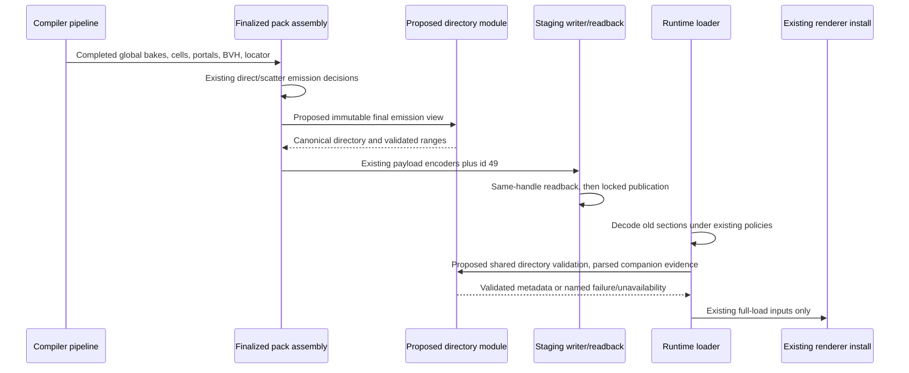

# Slice 2 Grounding and Proof Matrix

Read on `feature/sh-probe-streaming`, 2026-09-18. This file records current source and execution evidence needs; `index.md` pins decisions. Proposed modules/types in the brief do not exist yet.

## Premise and threshold evidence

`measurements/sh-probe-streaming/premise.md` records a terminal `not-yet-evaluable` result. Both exact compiler bakes of `campaign-test` completed with eight workers at 1.0 m and 8.0 m. Fine/coarse whole-file sizes were 174,098,246 / 156,264,360 bytes, each with 32 sections and 712 bytes container overhead. This is disk evidence only. No renderer allocation report or frame-time A/B succeeded: Metal exposed no adapter. No GTX 1660 was available. The temporary PRLs were deleted after their hashes and section totals were recorded.

There is no per-cluster distribution in that record. A numeric primitive or cell limit cannot be inferred from aggregate section totals. T4 therefore owns a bounded selection exercise, using geometry-only dry runs first and SH attribution from one representative finalized bake. Reuse one bake's immutable products across candidate limits; do not repeat global rays for each partition. Log the selected defaults and why they avoid a vacuous whole-map cluster without overwhelming the directory with tiny clusters. This is metadata/partition tuning, not proof of streaming performance.

## Grounded compiler seams

| Source | Current contract relevant to this brief |
|---|---|
| `crates/level-compiler/src/pipeline.rs` | `StageId`, `ORDERED_STAGES`, `planned_stages` own ordered reporting. `run_after_parsing` owns geometry/BVH, all SH products, atlas products, and the sole production call to `pack::pack_and_write_portals_with_billboard_scatter`. |
| `crates/level-compiler/src/bvh_build.rs` | `build_bvh` returns the live BVH, `Vec<BvhPrimitive>`, and `BvhSection`. Each `BvhPrimitive` has `cell_id` and `index_count`; it represents a `(face, material_bucket)` index range, not a single triangle. `collect_primitives` skips zero-index faces. |
| `crates/level-compiler/src/geometry.rs` | `GeometryResult` owns `geometry`, `texture_names`, and `face_index_ranges`. Geometry uses raw compiler leaf ids as runtime cell ids; final lightmap preparation later mutates UVs, which must not affect clustering. |
| `crates/level-compiler/src/pack.rs` | `encode_cells` joins source leaf records, encoded portal endpoints, and exterior membership; it validates nonempty source cells and bounds, sorts/deduplicates portal refs, and preserves ids. `encode_cell_locator` derives the id-39 locator. |
| `crates/level-compiler/src/pack.rs` | `pack_and_write_portals` forwards to `pack_and_write_portals_with_billboard_scatter`; remaining callers are local pack tests. The latter suppresses invalid direct-selection companions and over-cap scatter before building `PlannedSection` entries. This suppression must precede directory resource selection. |
| `crates/level-compiler/src/pack_output.rs` | `PlannedSection` stores a descriptor and one-shot encoder. `write_and_validate_sections` serializes one payload at a time and calls `validate_readback` on the same staging handle before locked publication. `validate_readback` currently checks table order, exact offsets/lengths/versions, and file length; it does not decode every section semantically. `report_section_footprint` reads descriptors without invoking encoders. |
| `crates/level-compiler/src/partition/bsp.rs` | `find_leaf_for_point` uses f64 BSP planes, front on plane, and returns zero for an empty tree. Do not use that empty-tree fallback as proof of a real cell; directory mapping is pinned to serialized id-39 locator semantics so narrowing cannot disagree at a boundary. |

The pack extraction should produce one owner for finalized cells/locator and the borrowed final SH inventory. Make that owner accessible before directory generation, then pass it through packing; do not recompute a differently filtered inventory in the pipeline. A production stage can only be reported once its finalized inputs exist. Existing wrapper-based tests must enter the same finalization path. Clustering gets borrowed metadata and returns owned directory data; output serialization consumes encoders afterward.

## Existing wire contracts to preserve

All rows below are existing source, not proposals. All bytes are little-endian. Existing container entry versions remain unchanged; section-internal epochs are independent of those entries. Do not restore any historical id-34/35 representation.

| ID | Current source in `crates/level-format/src/` | Epoch | Fixed header / existing order |
|---|---|---|---|
| 34 | `sh_volume.rs` | u32 11 | 84-byte header; format at 76, atlas byte length at 80; dense 8-byte probe metadata from 84; atlas begins `84 + 8*probe_count`; animation descriptors and map-light slots follow atlas |
| 35 | `direct_sh_volume.rs` | u32 4 | 76-byte header; format at 68, atlas byte length at 72; atlas begins 76; metadata supplied by id 34 |
| 27 | `delta_sh_volumes.rs` | u8 6 | 26-byte fixed header; descriptor map → valid masks → cell levels → CSR offsets → CSR lights → kept-probe RGB16F tiles |
| 41 | `direct_sh_delta_volumes.rs` | u8 4 | 22-byte fixed header; no descriptor map; valid masks → levels → CSR offsets → selection indices → kept-probe RGB16F tiles |
| 45 | `animated_direct_sh_delta_volumes.rs` | u8 4 | 26-byte header; same array order as id 27, with its own animated-direct descriptor map |
| 47 | `billboard_direct_scatter_volume.rs` | u8 1 | 37-byte header; dense x-fastest RGBA16F, 8 bytes per probe |
| 48 | `animated_billboard_direct_scatter_delta_volumes.rs` | u8 1 | 18-byte header; descriptor map → CSR offsets → CSR lights → dense 512-byte block per CSR entry; no mask or level array |

For 27/45, payload begins at `26 + 4*A + 8*C + C + 4*(C+1) + 4*E`; for 41, `22 + 8*C + C + 4*(C+1) + 4*E`; for 48, `18 + 4*A + 4*(C+1) + 4*E`. Here A is descriptor-map length, C affinity-cell count, E CSR-entry count. These formulas explain why a grid range is not a byte slice; they are preservation checks, not fields to add to section 49.

Id 34's 8-byte probe metadata is validity at 0, two depth f16 values at 1–4, density at 5, node scale at 6, padding at 7. Its stored atlas follows aligned node origins in x-fastest brick order. L0 stores valid local probes; L1 eight node corners, including zero invalid corners; L2 one mean. Only origin bricks advance the stored prefix. Id 35 uses exactly the same stored-node geometry/order. Atlas bytes are layer-major, with RGBA16F row-major texels or BC6H row-major blocks. One logical node need not occupy one contiguous atlas byte span. Slice 3 resolves row/block gathering; this brief must not promise otherwise.

`crates/level-format/src/lib.rs` owns `SectionId`, `SectionId::from_u32`, `CURRENT_VERSION=4`, `FormatError`, and container I/O. Registry ends at 48. PRL container header is 8 bytes; entries are `u32 section_id`, `u64 offset`, `u64 size`, `u16 version` (22 bytes). Existing section codecs mostly wrap invalid data as `FormatError::Io`; a proposed typed directory error can be wrapped at compiler/loader boundaries without changing old codec errors. Container lookup returns the first match, so id-49 duplicate rejection needs an explicit count check. Do not turn this task into general container hardening.

## Loader seam and policy risks

`crates/level-loader/src/prl_loader.rs::load_prl` forwards to `load_prl_with_section_limits`, which reads the whole file. `LevelWorld` and `new_visibility_only` live in `prl.rs`; load-only fields use `#[cfg(feature = "load-prl")]`. The proposed directory remains a CPU field; renderer callers need no new argument. Search `LevelWorld {` workspace-wide: adding a field affects capture, runtime/observability helpers, spatial tests, and loader fixtures, not only the final loader return. Verify both feature-enabled and visibility-only builds.

| Existing section | Existing runtime outcome to preserve |
|---|---|
| 34 | Required, including a zero-grid placeholder for empty geometry; malformed/stale is fatal |
| 35 | Optional; present malformed/stale/layout-mismatched is fatal |
| 27 | Optional; malformed or semantic disagreement is fatal; raw encoded size above 128 MiB disables before decoding |
| 41 / 40 | Missing/malformed/unusable/over-floor direct deltas clear selection and delta together; no partially promoted selection; grid-matched base/delta density violations remain fatal |
| 45 | Most malformed/unusable cases disable; base-validity/density violations remain fatal; over 128 MiB disables before decoding |
| 47 / 48 | Bad payload/container range/pair selects legacy billboard lighting; id 48 has a 64 MiB encoded cap checked before decoding |

The existing local `parsed_animated_direct_sh_delta_volumes` is retained through scatter validation; only afterward is an empty CSR filtered from the exposed animated-direct field. Id-49 validation must use this parsed evidence. Otherwise a valid empty 45/48 pair appears to target a missing section. Raw presence, parse validity, and runtime availability are distinct states. Directory absence/failure must never change which old lighting data is accepted.

Use the same four-state companion vocabulary as the brief when implementing compiler and runtime checks:

| State | Compiler term | Runtime term | Contract impact |
|---|---|---|---|
| On-wire/emitted | Finalized pack view will write the section | PRL container contains the section | Resource row is required for emitted/present sections, including valid-empty payloads; absent/withheld sections require no row. |
| Parsed-valid | Finalized section data decodes under the production codec | Section decoded and passed old validation | Participates in directory dimensions, CSR/dependency checks, ownership, and descriptor-index checks even when later runtime exposure is `None`. |
| Policy-available | Not suppressed by direct/scatter selection or encoded-size policy | Existing floor/cap and companion policy allow semantic use | Rejected or over-cap companions keep legacy lighting behavior and make the directory unavailable rather than partially validated. |
| Exposed-runtime | N/A for compiler output | Legacy runtime field remains `Some` after old filtering | Not a validation inventory source; valid-empty id45 can be parsed-valid while exposed as `None`. |

The id-49 descriptor-index rule for ids 27 and 45 is new directory validation only. When id49 is present, every `animation_descriptor_indices` value must be `u32::MAX` or index an id34 animation descriptor. Missing id49 must retain no-directory legacy behavior, including any absence of this check in the old loader. If old companion decoding and policy otherwise accept the data, a descriptor-index violation is a directory `ClusterDirectoryResourceMismatch`; if the companion is rejected or over cap first, follow the unavailable-companion behavior.

Spatial support terms are pinned to id34 probe centers. A probe center is `grid_origin + probe_index * cell_size`. A valid affinity brick starts at `[brick_x*4, brick_y*4, brick_z*4]` and clips its max probe index to `grid_dim - 1`; zero dimensions make the brick invalid/missing rather than wrapping the max bound. Section 49 introduces its own support helper: scale-0 brick support is the closed half-interval around the outer clipped centers, expanded by `0.5 * cell_size` on each side. Current compiler helpers use outer centers without this half-cell expansion, so do not treat them as the same helper. Member-cell tests expand non-solid, non-exterior cell bounds by exactly `cell_size` per axis and use closed intersections. Entry-bearing bricks with no valid probe and no spatial cover locate their clamped origin probe center through serialized id39 front-on-plane semantics. Id34 stores `node_scale`, not node origin; derive `node_origin_brick = floor(floor(probe_index / 4) / 2^scale) * 2^scale` and `node_origin_probe = node_origin_brick * 4`. For scale>0, the current format accepts only a full aligned `4 * 2^scale` probe cube entirely inside the grid; partial-edge scale>0 nodes are rejected before directory validation. Adaptive-node closure uses the section-49 half-cell-expanded support for that full cube, adds intersecting affinity bricks, and repeats until stable.

## Lifecycle

Read call sites: pipeline invokes pack; pack invokes `write_and_validate_sections`; output invokes `validate_readback`; runtime `load_prl` invokes the limited loader. New arrows explicitly mark the proposed seams inserted into those grounded calls.

The runtime shared validator checks the supplied directory. It does not run the compiler's greedy partitioner or choose new owners. Ownership validation proves one serialized owner per covered affinity cell and owner agreement across copies; geometry/support validation rejects incomplete coverage instead of filling gaps at runtime.

## Split-before-extend seams

| File at drafting | Lines | Separate mechanical task / seam |
|---|---:|---|
| `level-format/src/lib.rs` | 1,167 | T1: registry and container framing/I/O, preserve root exports |
| `level-compiler/src/pipeline.rs` | 3,002 | T3: stage descriptors/order from orchestration; keep stage timing semantics |
| `level-compiler/src/pack.rs` | 2,905 | T3: spatial encoding and final-section planning from entry wrappers |
| `level-compiler/src/main.rs` | 3,092 | T3: CLI data/parsing from binary/module root |
| `level-compiler/src/pack_output.rs` | 1,179 | T3: readback validation from staged publication |
| `level-loader/src/prl.rs` | 7,310 | T5: world data/construction from queries; test modules follow responsibility |
| `level-loader/src/prl_loader.rs` | 4,447 | T5: SH validation/decode from spatial/load assembly |

Most line counts include tests; extraction is justified by distinct responsibilities, not an arbitrary line ceiling. `sh_volume.rs` is also large (1,833), but this brief adds no codec behavior there. If implementing coverage truly needs a new hierarchy API there, split its metadata/hierarchy validation first in a separate behavior-preserving task immediately before extension; do not bury that work in T4. Prefer existing metadata APIs and a new directory module.

## Orderings and negative tests

| Scenario | Required observation | Tasks / AC |
|---|---|---|
| Portal/primitive inputs permuted; workers 1 vs 8 | Same members, ids, bounds, ownership, exact directory bytes | T2/T4/T7; AC1/2 |
| Frontier first candidate over remaining budget, later candidate fits | Later candidate admitted; no accidental close or non-adjacent jump | T4; AC1 |
| Primitive-heavy single cell; disconnected/solid/zero-face cells | Flagged singleton only for indivisible overage; all cells assigned once | T4; AC1 |
| Zero-grid id34 with real cells; standalone empty encoding | Real cells still cluster; standalone 40-byte directory parses but cannot bypass real cell completeness | T2/T6; AC5 |
| CSR entry with zero valid probes | Entry still has an owner; no omission that invalidates id40 coverage | T4/T6; AC3/4/6 |
| Partial scale-0 edge brick; scale-1/2/3 node spans clusters | Scale-0 clipped indices in bounds; scale>0 full aligned cube is inside the grid; section-49 half-interval support around outer centers; derived origin/member support; stable owner/halo | T2/T4/T6; AC3/4 |
| Same metadata/CSR, different atlas encoding | Same directory; no dependence on block/byte layout | T4/T7; AC3/8 |
| Valid empty id45 and id48, present id47 | Retained as parsed companions for validation despite exposed empty direct work | T6; AC6 |
| Direct-selection suppression or scatter-cap suppression at pack | No directory row for withheld sections; unchanged old presence choices | T4/T7; AC3/6/8 |
| Optional runtime section over floor or malformed | Original fatal/fallback result preserved; optional unavailability cannot expose partially validated directory | T6; AC6 |
| Wrong epoch, duplicate directory, unknown resource/domain/flags, NaN bounds | Named reject; no first-entry or unknown-bit acceptance | T2/T6; AC5 |
| Out-of-range cell/probe/affinity index; checked end overflow; stale grid | Named reject before allocation/indexing | T2/T6; AC5 |
| Membership gap/duplicate, noncanonical order, overlapping ranges, two owners/no owner/owner not covering | Named reject; no loader repair or owner election | T2/T6; AC1/4/5 |
| Directory present versus removed from same PRL | Same renderer-visible lighting inputs, SH/GPU allocations, per-frame allocations/work, same-adapter frame; only one-time inert CPU directory storage may differ; windowed billboard result unchanged | T6/T7; AC7 |
| Cold baseline versus directory bake; warm cache hit | Old section payload/epochs/order preserved; whole-volume SH gates green; no directory cache | T3/T4/T7; AC8 |
| Large count header / broad overlapping coverage | Checked refusal or finite sparse metadata lifetime; no lighting-family payload copies | T2/T4/T6/T7; AC9 |

## Verification entry points

Fast iteration: targeted `cargo test -p postretro-level-format cluster_directory`, loader directory tests with the load feature enabled, and `cargo test -p postretro-level-compiler --bin prl-build cluster_directory`. Confirm nonzero test counts. New test filters are proposed and must match the implemented names.

Existing slow gates: `cargo test -p postretro-level-compiler --bin prl-build sh_cold_grouped_equals_monolithic_on_fixtures -- --ignored`; its sibling `warm_sh_within_tolerance_on_fixtures`; `cargo test -p postretro-level-compiler --test compiler_cli_contract gate_heavily_lit_cold_compact_sh_output_is_deterministic -- --ignored`. The last already compares two uncompressed cold PRLs and separately checks BC6H compact output sizing. Extend focused integration coverage for exact directory bytes rather than adding a large map to `GATE_FIXTURES`.

For pre-directory payload comparison, capture a small uncompressed cold baseline after mechanical splits and before T4, recording source/map hashes and compiler flags. Compare each pre-existing section body and container-entry version in relative order, excluding absolute container offsets. The id49-removed copy for visual testing is constructed by test/container APIs into a temporary file, never by editing offsets in-place. Keep runtime content-root/material resolution valid. No large PRL or PNG golden enters git. Record final commands, outcomes, metadata peak/time, GPU availability and cleanup in a sibling validation record during implementation.
