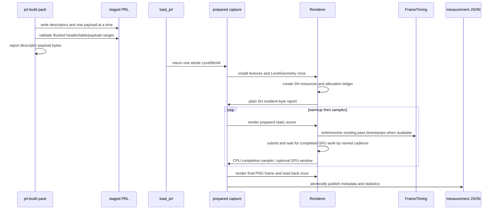

# SH Probe Streaming Measurement Harness — Grounding

Read at `a097035f`. This file records source anchors and the lifecycle used to derive the
task boundaries.

## Lifecycle

Every arrow above has a current or planned call site. PRL reporting reads
`PlannedSection.descriptor`. Renderer allocation reporting is written by resource
constructors and read after `Renderer::install_level_geometry`. Timing writes remain in
the existing pass recorders and are read through `FrameTiming::last_window` after
submission drives `FrameTiming::post_submit`. CPU samples use a renderer-owned wait after
submit, not enqueue duration.

## Current source anchors

| Contract | Current source |
|---|---|
| Section producer | `pack_and_write_portals_with_billboard_scatter` in `crates/level-compiler/src/pack.rs` |
| Planned descriptor + encoder | `PlannedSection` in `crates/level-compiler/src/pack.rs` |
| Atomic staged write/readback | `write_and_validate_sections` in `crates/level-compiler/src/pack.rs` |
| Aggregate-only pack log | `declared_payload_bytes` / `largest_payload_bytes` in `crates/level-compiler/src/pack.rs` |
| Scene vocabulary | `CaptureScene` and `parse_scene` in `crates/postretro/src/capture/scene.rs` |
| Capture driver | `run_capture_inner` in `crates/postretro/src/capture/driver.rs` |
| Offscreen renderer creation | `Renderer::new_offscreen` in `crates/renderer/src/render/renderer_init.rs` |
| Static frame render/readback | `Renderer::capture_frame_indirect` in `crates/renderer/src/render/renderer_render_frame.rs` |
| Level GPU install | `Renderer::install_level_geometry` in `crates/renderer/src/render/renderer_resources.rs` |
| SH section handoff | `ShVolumeSections` in `crates/renderer/src/render/sh_volume.rs` |
| Indirect SH resources | `ShVolumeResources` in `crates/renderer/src/render/sh_volume.rs` |
| Direct SH resources | `DirectShResources` in `crates/renderer/src/render/direct_sh_resources.rs` |
| Billboard scatter resources | `BillboardDirectScatterResources` in `crates/renderer/src/render/billboard_direct_scatter.rs` |
| Indirect compose resources | `ShComposeResources` in `crates/renderer/src/render/sh_compose.rs` |
| Direct compose resources | direct compose code in `crates/renderer/src/render/direct_sh_compose.rs` |
| Billboard scatter compose resources | billboard compose code in `crates/renderer/src/render/billboard_direct_scatter_compose.rs` |
| Timing accumulator | `FrameTiming` / `FrameTimingSnapshot` in `crates/renderer/src/render/frame_timing.rs` |
| Windowed fallback | `FrameRateMeter` in `crates/sim/src/sim/frame_timing.rs`; title read in `crates/postretro/src/main.rs` |

## Existing behavior

- `PlannedSection` owns a `SectionDescriptor` and a one-shot encoder. The packer sums
  descriptor lengths before `write_and_validate_sections`, which materializes one payload
  at a time and checks encoded length against the descriptor.
- `run_capture_inner` loads the PRL, creates the offscreen renderer, installs textures and
  `LevelGeometry`, resolves one visibility set, collects receivers, calls
  `capture_frame_indirect`, then writes one PNG.
- `capture_frame_indirect` calls `record_scene_passes` and ends in
  `read_texture_rgba8`. Reusing that function for samples would include blocking PNG
  readback and would not represent the normal scene workload.
- `FrameTiming` exists only when `POSTRETRO_GPU_TIMING=1` and the adapter supports
  `TIMESTAMP_QUERY` plus `TIMESTAMP_QUERY_INSIDE_ENCODERS`. Unsupported requests log a
  warning and continue with `None`; disabled and unsupported are indistinguishable from
  the accessor today unless Task 6 records a plain availability reason.
- `FrameTiming` averages 120 completed readback samples. `encode_resolve` belongs before
  submission and `post_submit` drives the non-blocking map after submission. Capture does
  neither today. Partial windows do not produce pass averages.
- `request_renderer_device_with_capabilities` logs `wgpu::AdapterInfo`, but the renderer
  does not retain plain adapter identity for capture serialization.
- `ShVolumeResources` currently logs only the physical base-atlas allocation behind
  `dev-tools`. It already has `compact_base_atlas_allocation` and
  `base_atlas_allocation_bytes`; no complete id-attributed resident tally exists.
- SH allocation decisions are spread across `sh_volume.rs`, `direct_sh_resources.rs`,
  `billboard_direct_scatter.rs`, `sh_compose.rs`, direct compose, and billboard scatter
  compose. `sh_volume.rs` does not own all allocation formulas.
- IDs and loaded types are current: 27 `DeltaShVolumes`, 34
  `OctahedralShVolume`, 35 `DirectShVolume`, 41 `DirectShDeltaVolumes`, 45
  `AnimatedDirectShDeltaVolumes`, 47 `BillboardDirectScatterVolume`, and 48
  `AnimatedBillboardDirectScatterDeltaVolumes`.
- `CaptureScene` currently has no measurement block. It denies unknown fields and validates
  `map`, `camera`, `resolution`, `output`, `force_active`, and `force_promotion`.
  `run_capture_inner` rejects PNG outputs that alias the map or scene and stages the final
  PNG via sibling temp-file rename. Measurement report output should reuse that model.
- `prl-build --release` selects the exact cold ship bake and bypasses the stage cache like
  `--no-cache`. The Cargo release profile is unrelated. Passing both flags is accepted but
  redundant.

## Oversized-file flags

`pack.rs` is about 3,900 lines, `capture/driver.rs` about 1,600,
`renderer_render_frame.rs` about 1,100, and `render/sh_volume.rs` about 2,000. The brief
therefore splits each touched responsibility before adding functionality. Test-heavy file
length does not itself force a split; these four each mix production responsibilities the
new work would otherwise expand.

## Measurement interpretation

The renderer report is an allocation ledger, not a driver query. This is deliberate:
wgpu exposes resource creation descriptors but no portable per-resource resident-VRAM
counter. The ledger is exact for requested texture/buffer bytes, labels dummy/fallback
allocations, and excludes opaque driver padding.

The automated capture is preferred because it fixes scene state and emits machine-readable
results. It is not the only admissible evidence. The owner specifically accepts frame-time
observation on a mid-sized map on this MacBook Pro or a big map on the GTX 1660 Super when
the harness or full stress fixture cannot run. A failed adapter/device attempt is a harness
finding, not a streaming-premise result.

Task 7 records one terminal status:

| Status | Required evidence |
|---|---|
| `measured` | Automated fine/coarse JSON reports and exact build/capture commands. |
| `manual-observation` | Fine/coarse build identity, map, machine, adapter/driver when known, pose, resolution, at least three settled frame-time windows per variant, GPU timing availability, and automation diagnostics. |
| `not-yet-evaluable` | Attempted machines, commands, map, failure diagnostics, and why no approved observation could run. |
