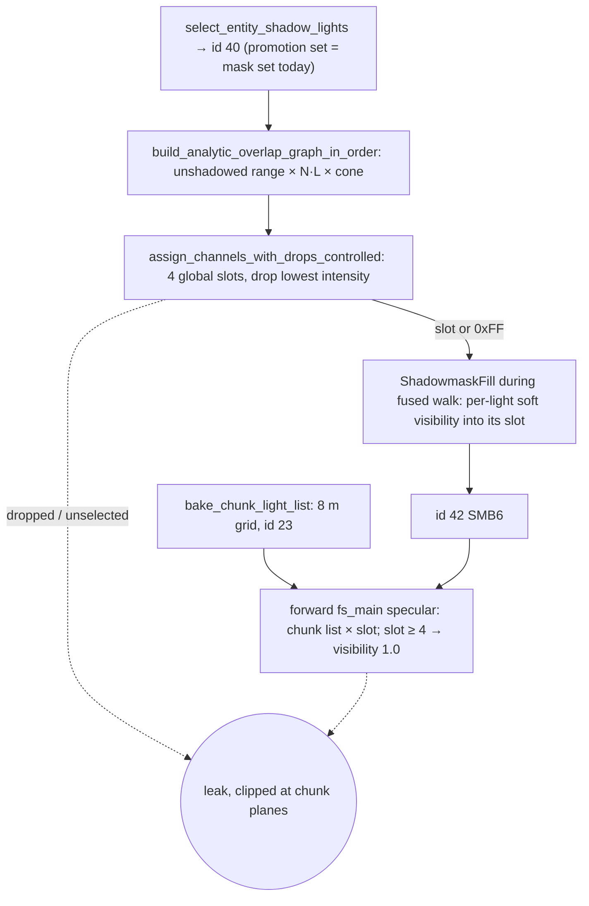

# static-specular-mask-ownership — Research

Grounding for `index.md`, read at 4e127a7b8. Facts are cited by symbol. Census numbers
come from scratch tooling: a PRL reader plus an exact port of `light_texel_is_covered`.
That tooling is not in tree.

## Defect lifecycle

At the reported pose, the leaking light is unslotted and sealed inside a wall. Its chunk
admits it through the receiver-nudge bug in `any_receiver_unoccluded`, which the
`buried-lights` direct build fixes. On the shipped stress PRL, 70 of 338 selected lights
are dropped and 6 static lights are unselected. In `campaign-test`, 10 of 14 static
lights are outside id 40, so they render unshadowed specular today.

## Why coverage is unshadowed today

- **Recorded reason:** `plans/done/lighting-scale--shadowmask-cold-working-set` made it a
  contract. The analytic graph needs no rays and no per-(light, texel) record, and that
  record was the 16 GiB OOM at density 0.04.
- **Unrecorded runtime reason:** `shadowmask_direct` gates on the unshadowed analytic
  term, then reads the slot. Sharing a slot is safe only if no two sharers are both
  analytically present on a texel. Shadow-aware sharing alone would let an occluded
  light read a lit light's value: a specular leak, plus a union subtraction through the
  wall.
- **Why ownership dissolves it:** a non-owner never reads a channel.
- **Where visibility lives:** only inside the fused walk (`bake_fused_windowed`). It
  arrives in global light order and is consumed into the resident fill, then dropped.
  Assignment currently completes in `prepare_fused_shadowmask`, before the walk.

## Runtime budget

- **Fragment storage:** 8 of 8 (group 2: five; group 3: three).
- **Sampled textures:** 16 of 16.
- **Vertex storage:** 6 of 8. `forward_bindings_add_only_the_vertex_block_table`
  already pins every forward fragment count per group, the vertex-visible entry set,
  and vertex storage of 8 or fewer.
- **Varyings:** 9 of 16 locations (downlevel 15). One more flat `vec4<u32>` fits.
- **Vertex inputs:** the forward "Textured Pipeline" (`renderer_init_pipelines.rs`)
  uses 6 of 16 vertex attributes on 1 of 8 vertex buffers, against `Limits::default`.
  World vertices are unique per face (`extract_geometry`, `split_shared_vertices`,
  `apply_face_cuts`).
- **Block table:** one `vec4<u32>` per block, vertex-only (`resolve_lightmap_block`).
  Only pool layer and flags reach the fragment. Cleanly free bits total 32: too few for
  4 × u16.
- **Owner list:** needs a second per-block entry or a vertex-only table in group 6.
  Either is written once at install; drains keep rewriting only the pool entry.
- **Index width:** u8 is out. Stress maps carry several hundred to over a thousand
  light entities.

## Chunk-list consumers after the change

The list stays baked for:
- `select_sdf_lights`, used by forward SDF diffuse and `sdf_shadow` `cs_main`. The two
  must match light for light.
- Billboard isotropic specular in `vs_main`.
- Billboard shimmer specular in `fs_main`, which keeps every static record.

Not consumers: union subtraction, kinematic movers, meshes, fog.

## Granularity

Per-face census of all static lightmap lights. It is shadowed, uses interior texels
only, and excludes animated lights. Mask-backed where a light has a slot, hard-ray proxy
elsewhere; the proxy is a lower bound.

| Map | Faces with >4 lights | Texels in those faces | Max per face | Faces >4 after a 16-texel floor | Per-block equivalent |
|---|---|---|---|---|---|
| stress hallway | 3 | 0.7% | 5 | 0 | 4 blocks, max 5 |
| campaign-test | 1 | 1.9% | 5 | 1 | 1 block, max 6 |
| kinematic-platform | 2 | 7.5% | 9 | 2 | 4 blocks, max 15 |
| movement-feel | 92 of 275 | 79% | 17 | 91 | 49 of 76 blocks, max 22 |
| stress-warren-mini | 0 | — | 4 | 0 | 2 blocks, max 5 |

- **Stress hallway:** every overflow is a speck, a fifth light lighting 1–10 texels.
- **Counting rule:** counting a one-texel ring around each face inflated the hallway
  from 3 faces to 359. Padding holds copied values and ring positions sit inside walls,
  hence interior-only admission.
- **Unshadowed coverage is much worse:** 209 faces over four on stress-warren-mini,
  against 0 shadowed. Admission must be shadowed.
- **Ranking:** contribution beats intensity on energy kept.
  - movement-feel loses 5.2% of shadowed contribution by contribution ranking, against
    16.7% by intensity.
  - kinematic-platform loses 21%, against 39%.
  - Intensity ranking leaves 3 lights losing over 90%; contribution ranking leaves none.
  - No light loses every face under either.
- **Vertex path:**
  - World vertices are unique per face: `extract_geometry`, `split_shared_vertices`,
    and `apply_face_cuts` give each sub-face its own vertices.
  - A second forward-only vertex buffer at 8 B per vertex is about 270 KB on the
    hallway.
  - Growing the 36-byte stride instead would bump id 17 and the kinematic codec.
- **Cuts:**
  - `plan_face_cuts` → `apply_face_cuts` builds product-grid sub-faces with
    bit-identical windows (`ChartWindow`).
  - Owner cuts need separate sub-charts, because bilinear taps would cross owner sets.
    They also merge with oversize cuts into one `FaceCut` per face.
  - Deciding cuts from shadowed demand needs visibility before packing, from a coarse
    pre-pass or a repack. That cost is unjustified at today's residuals.

## Animated-baked lights

- **Visibility source:** the AnimatedWeightMaps stage (`bake_one_chunk`) traces
  `soft_visibility` per chart-interior texel, per chunk light. It uses the same charts,
  placements, per-texel seed and area-sample count as the static walk.
- **What it stores:** `weight = contribution_to_weight(...) × v` per `TexelLight`.
  Entries with `v <= 0` or below `WEIGHT_EPSILON` are omitted, so visibility is
  recovered by division and an absent entry means occluded.
- **Ordering:** it runs after `FusedShadowmaskPlan::finish()` today. It reads no walk
  output; every input is final after atlas preparation.
- **Promotion:** animated lights never hold a shadowmask channel. Their promotion is
  runtime-only, and the union iterates the selected-static suffix only
  (`pack_forward_shadowmask_metadata` marks animated rows invalid).
- **Specular:** `pack_spec_lights` packs constant `color × intensity` at install, and
  the world specular loop never reads `anim_descriptors`/`anim_samples`. Strobing,
  color cycling and script-disabled state are all ignored today.

## Capacity lever (carried from the previous draft)

- BC5 `.rg` pairs dominate BC4 planes: same bytes per mask, twice the masks per group.
- The pool layer is 4096 × 2048 with two groups side by side. Four groups reach the
  8192 dimension. Beyond that a block needs a second texture or extra pool space.
- Every added group grows each streamed block and its drain upload. It spends the
  residency budget, not only file bytes.
- Ownership makes added groups a per-region capacity decision rather than a map-wide
  colouring one.

## Perf measurement

- On the 1660, fixed-pose captures give `forward` GPU ms per 120-sample window. They
  need `--features capture,dev-tools`; `capture` alone reports timing unavailable
  (`capture_gpu_timing_state`).
- The `light_term_mask` 0x40 delta bounds the specular block's total cost within one
  binary.
- Prior launch-to-launch noise was ±0.01–0.05 ms (`plans/done/sh-compose-row-cost-spike`).
- Billboard specular cost is outside `forward`.
- No GPU spike is planned. The owner loop runs at most four lights against chunk lists
  of up to 17 in the stress map.

## Ordering pins

| id | scenario | ordering | expected outcome |
|---|---|---|---|
| P1 | The sub-faces of one cut face sit in different bake layers | The walk runs layer-major. A light's partition for the first layer is consumed and dropped before its partition for the next layer arrives | The parent's owners are fixed before the walk from the cut-face estimate. Every owner's channel holds its own baked values in every sub-face. No owner's channel in any sub-face holds a value its own partition did not write, other than zero |
| P5 | A promoted candidate below the lit-texel floor arrives after four above-floor specular-only owners | Floor test from the candidate's own partition, then tier, then eviction, all on arrival | A below-floor candidate never evicts an above-floor one |
| P2 | A warm build reuses the cached id 42 | A memo hit returns the section before the walk. No partition reaches the fill | Drop warnings and the `--verbose` peak per-face demand match the cold build's. Owner data is stored next to the memo entry or rebuilt; it is never silently skipped |
| P3 | A light outside id 40 is edited, or only id 40 membership changes | The lightmap memo may hit while the id-42 memo must miss. Today both the id-42 key and the reuse path cover only selected lights | Id 42 is rebuilt from every eligible light's partitions and equals the cold build byte for byte |
| P4 | A newcomer outranks an owner whose values are already written on face F | Incumbent written, newcomer arrives, channel reset, newcomer writes | Every texel that F's bilinear taps can reach (on-polygon, off-polygon, padding) holds the newcomer's value or zero. None keeps the evicted light's value or the 255 fill |
| P6 | One light's partition covers texels on many faces in one bake layer | Sum per face over the whole partition, admit or evict per face, then write | No admission is decided on a partial sum. For faces that sit in one bake layer, the result does not depend on arrival order or window size |
| P7 | Two candidates tie on contribution for the last free channel | Within a layer, arrival order is light order. The later light arrives while the earlier one already owns the channel | The lower compact spec-light index keeps the channel. Arrival order never decides |
| P8 | Dynamic, SDF or bake-only lights come before a static light in the source light list | The walk keys partitions by source-list position. The owner table stores the compact `!is_dynamic` spec index over AlphaLights | Each owner entry names the light whose visibility filled its channel. A bake-only light takes no channel |
| P9 | The renderer refuses the mask pool at install, but lightmap blocks stay resident or stream in later | The refusal happens at plan time. The owner stream is filled at load, and blocks become resident after that | No frame shows static non-SDF specular. A refused pool is never read as fully lit |
| P10 | Id 40 is non-empty in the file and cleared at load | Id 40 is cleared, then id 42 is validated | Id 42 validation reads no id-40 state. The owner table is unchanged. Formerly promoted owners keep shadowed specular |
| P11 | The level has more static spec lights than u16 can index | Checked before the walk allocates the fill | Named compile error before any lightmap bake work |
| P12 | A block arrives after the first draw, is evicted, or repacks to another pool layer | The owner stream is fixed at load. Block-table entries change on each drain | A face's owners never change. While its block is missing the face adds no static non-SDF specular |
| P13 | A covered texel carries non-finite raw visibility | It quantizes to zero, and the contribution sum runs at admission | The texel neither admits the light nor adds to its contribution. Ranking stays total |
| P16 | An owner fixed by the estimate lights only some of its parent's sub-faces | Owners are fixed before the walk. Its partition holds no texel for the other sub-faces, and the raw fill starts fully visible | The owner's channel reads zero across every sub-face it does not light, padding included |
| P18 | A cut parent's estimate runs on several workers, or two candidates tie on the estimate | Per-sample results are summed per (parent, light) in a fixed sample order, then ranked, with ties going to the lower index | Owners and drop report are identical across worker counts, window sizes, and cold, warm and lightmap-reuse builds |
| P19 | A below-floor promoted candidate arrives first, while channels are free, then four above-floor specular-only lights arrive | It is admitted to a free channel on arrival. The fourth above-floor arrival ranks against it | The promoted incumbent is evicted and its values cleared. No tier protects an incumbent below the floor |
| P20 | A warm build reuses the cached id 42 on a level with a cut face | The memo probe runs before the estimate | No estimate sample is traced. The drop report comes from the memo entry (P2) |
| P21 | A level over the owner-index cap has a cut face | The cap check runs before the estimate | The named error comes before any estimate ray |
| P22 | The estimate's grid reaches the edge of a cut parent that meets a wall | Samples are placed before the walk, from the parent's chart | Samples sit only at chart-interior positions of the parent, as the walk's texels do. A light that reaches only beyond the parent's chart interior takes no channel |
| P23 | The estimate's density or sampling mode changes between builds while every lightmap partition is unchanged | The lightmap memo hits, then the id-42 memo key is probed | The key misses. Id 42 equals the cold build's |
| P14 | A light lights a cut face above the floor only between the estimate's sample points | The estimate fixes the parent's owners before the walk. The light's partitions arrive later, one bake layer at a time | The light takes no channel in any sub-face, even a free one. The walk sums its lit texels over the parent, and the drop warning names it |
| P15 | The estimate admits a light to a cut parent, but every texel that light bakes on the parent's sub-faces quantizes to zero | Owners are fixed before the walk. The light's partitions write only zeros | After the walk, the light's entry is empty in every sub-face. A light it displaced is warned if that light is above the floor |
| P17 | On a cut face, a promoted candidate below the floor competes with four above-floor specular-only lights | The estimate's floor test, then tier, then contribution, all before the walk | The promoted candidate takes no channel. Whether it is warned follows the parent's exact lit-texel count after the walk |
| P24 | Two lights become owners of one face in descending index order | The higher index arrives and takes a channel first; the lower arrives later | The entry lists the lower index first, and each owner's mask values move with it before encode |

**Proof caveat.** The WGSL harnesses self-skip without a BC-capable adapter
(`shadowmask_sample_test.rs`), so shader rows prove nothing unless run with a GPU
required. The world specular loop is inline in `fs_main`, so the first-slice harness needs
it extracted into a callable function first.

## Cut faces span bake layers

- **Why sub-faces split:** a face is cut only past the 2048 pool edge. Each sub-chart
  nearly fills its block, and a bake layer is sized to the largest block. So a cut
  parent's sub-faces usually land in different bake layers (`atlas_pack.rs`,
  `block_layout.rs`).
- **Why the walk can't rank them jointly:** it runs layer-major and drops each partition
  after writing (`lightmap_stage.rs`, `fill.rs`). A joint sum would need retained
  visibility or a second pass.
- **Alternatives weighed:**
  - Analytic (unshadowed) pre-rank: picks lights hidden behind walls on large faces.
    On the census, unshadowed demand overflowed 209 faces on stress-warren-mini,
    against 0 shadowed.
  - Bounded retention: keeps per-texel data for the largest faces, the record class
    behind the OOM.
  - Keeping a parent's blocks in one layer: infeasible when one block fills the layer.
- **Chosen:** a sparse shadowed estimate whose spacing follows the floor. At a 16-texel
  floor, that is one sample per 4×4 texels: about 80k samples × 9 lights on the
  `kinematic-platform` floor, roughly 0.2% of that face's walk rays (1.27M texels × 9
  lights × 32 area samples).

## Rejected rivals

- **Unslotted reads as no specular, global slots kept.** It closes every leak at no
  bake cost. It also drops every dropped light's highlight and every light outside
  id 40: 10 of 14 in `campaign-test`. Ownership exists to restore that coverage.
- **Specular from the directional lightmap** (dominant direction × irradiance). It
  cannot leak and has no capacity limit. But it keeps one direction per texel, from a
  low-resolution, nearest-sampled atlas, so overlapping lights blur into one highlight.
  The residual overflow, mostly `movement-feel`, does not justify that loss everywhere.
- **Ruled out by budget:**
  - a per-texel light-index texture (sampled textures at 16 of 16);
  - runtime SDF visibility for every light's specular (SDF selection is capped at four).
- **Colour after the walk from a warm-cache re-read.** It fails cold builds.

## Ranking evidence

- Contribution ranking loses about a third to a half of what intensity ranking loses:
  - movement-feel: 5.2% against 16.7%;
  - kinematic-platform: 21% against 39%.
- No light loses every face under either ranking.
- Promoted-first was not in the census; its cost is that a promoted light can hold a
  channel over a brighter specular-only light.

## Pre-build leak capture

Taken at 1bcce4aec, with `buried-lights` merged, on the release engine with
`capture,dev-tools`. `campaign-test` was compiled with the worktree compiler, and every
capture ran with `POSTRETRO_SH_STREAMING=sync-proof` at 1920×1080.

- **Leaking light:** alpha 14 (spec index 4), a plain point `light`.
  - Origin (−65.43, 11.18, −31.70) m; intensity 150; linear falloff; range 15.24 m.
  - It is in open air 4.3 m above a pillar's top slab, and is not buried: the compiler
    logged no inside-solid warning.
  - It is outside id 40 (the selection is alpha 3, 13, 18, 31), so it has no slot and
    its specular visibility is 1.0.
- **Occluder:** a pillar (x −69.09..−62.59, z −36.58..−30.07, 0–6.5 m) under a slab.
- **Receivers:** the floor around the pillar base (`default_dirt_014`, shininess 32),
  and the north and west walls below their shadow lines (`concrete_stone_033`).
- **Attribution at p1:** found by casting the capture rays against PRL geometry, with
  light 14's specular isolated as (0x40 only) minus the same with entity 30 removed.
  - 95% lands on pixels the light cannot see that are in its chunk list.
  - 5% lands on pixels it can see.
  - Exactly 0 lands on occluded pixels outside its chunk list.
- **Chunk-plane cut-off:** the patch ends at x = −68.339 (cell ix 0|1, mid-face on the
  south floor) and z = −29.837 (iz 4|5). At p4, the 331k occluded pixels past the
  x-plane get exactly 0. Chunk origin (−76.34, −9.28, −69.84), 8 m cells.
- **Brightness:** dim, with a peak of about 23–40/255 tonemapped. It is clearest on the
  concrete wall at p3.
- **Other leaks:** alpha 15 and 16, both outside id 40 and not animated, leak onto the
  upper room's walls with chunk-plane cut-offs. They were not captured.

| Pose | Position (m) | Yaw | Pitch | FOV | Shows |
|---|---|---|---|---|---|
| p1 | (−62.0, 1.7, −28.4) | 90 | −20 | 100 | Shadowed trench: floor, north wall, end wall |
| p2 | (−57.5, 4.0, −27.5) | 49.399 | −40.949 | 90 | Floor edge at z = −29.837 |
| p3 | (−68.5, 1.7, −27.6) | 64.885 | 4.046 | 90 | West wall close-up; most visible |
| p4 | (−71.2, 2.5, −43.5) | −148.325 | −24.355 | 90 | South floor; patch ends at x = −68.339 mid-face |

Capture each pose three ways: all terms on; mask 0x13F (specular off); and 0x40 only.
