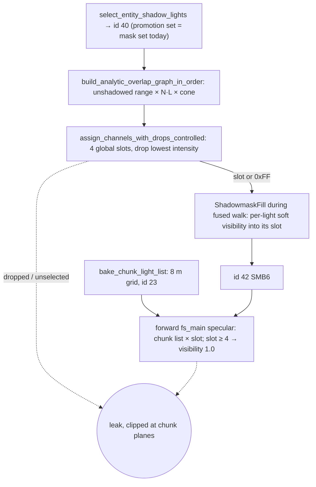

# static-specular-mask-ownership — Research

Grounding for `index.md`, read at 4e127a7b8. Facts are cited by symbol. Census numbers
come from scratch tooling: a PRL reader plus an exact port of `light_texel_is_covered`.
That tooling is not in tree.

## Defect lifecycle

At the reported pose, the leaking light is unslotted and sealed inside a wall. Its chunk
admits it through the receiver-nudge bug in `any_receiver_unoccluded`, which the
`buried-lights` direct build fixes. On the shipped stress PRL, 70 of 338 selected lights
are dropped and 6 static lights are unselected. In `campaign-test`, 10 of 14 static
lights are outside id 40, so they render unshadowed specular today.

## Why coverage is unshadowed today

- **Recorded reason:** `plans/done/lighting-scale--shadowmask-cold-working-set` made it a
  contract. The analytic graph needs no rays and no per-(light, texel) record, and that
  record was the 16 GiB OOM at density 0.04.
- **Unrecorded runtime reason:** `shadowmask_direct` gates on the unshadowed analytic
  term, then reads the slot. Sharing a slot is safe only if no two sharers are both
  analytically present on a texel. Shadow-aware sharing alone would let an occluded
  light read a lit light's value: a specular leak, plus a union subtraction through the
  wall.
- **Why ownership dissolves it:** a non-owner never reads a channel.
- **Where visibility lives:** only inside the fused walk (`bake_fused_windowed`). It
  arrives in global light order and is consumed into the resident fill, then dropped.
  Assignment currently completes in `prepare_fused_shadowmask`, before the walk.

## Runtime budget

- **Fragment storage:** 8 of 8 (group 2: five; group 3: three).
- **Sampled textures:** 16 of 16.
- **Vertex storage:** 6 of 8. No test pins the forward pipeline's count; only the
  billboard pipeline's is pinned.
- **Varyings:** 9 of 16 locations (downlevel 15). One more flat `vec4<u32>` fits.
- **Block table:** one `vec4<u32>` per block, vertex-only (`resolve_lightmap_block`).
  Only pool layer and flags reach the fragment. Cleanly free bits total 32: too few for
  4 × u16.
- **Owner list:** needs a second per-block entry or a vertex-only table in group 6.
  Either is written once at install; drains keep rewriting only the pool entry.
- **Index width:** u8 is out. Stress maps carry several hundred to over a thousand
  light entities.

## Chunk-list consumers after the change

The list stays baked for:
- `select_sdf_lights`, used by forward SDF diffuse and `sdf_shadow` `cs_main`. The two
  must match light for light.
- Billboard isotropic specular in `vs_main`.
- Billboard shimmer specular in `fs_main`, which keeps every static record.

Not consumers: union subtraction, kinematic movers, meshes, fog.

## Granularity

Per-face census of all static lightmap lights. It is shadowed, uses interior texels
only, and excludes animated lights. Mask-backed where a light has a slot, hard-ray proxy
elsewhere; the proxy is a lower bound.

| Map | Faces with >4 lights | Texels in those faces | Max per face | Faces >4 after a 16-texel floor | Per-block equivalent |
|---|---|---|---|---|---|
| stress hallway | 3 | 0.7% | 5 | 0 | 4 blocks, max 5 |
| campaign-test | 1 | 1.9% | 5 | 1 | 1 block, max 6 |
| kinematic-platform | 2 | 7.5% | 9 | 2 | 4 blocks, max 15 |
| movement-feel | 92 of 275 | 79% | 17 | 91 | 49 of 76 blocks, max 22 |
| stress-warren-mini | 0 | — | 4 | 0 | 2 blocks, max 5 |

- **Stress hallway:** every overflow is a speck, a fifth light lighting 1–10 texels.
- **Counting rule:** counting a one-texel ring around each face inflated the hallway
  from 3 faces to 359. Padding holds copied values and ring positions sit inside walls,
  hence interior-only admission.
- **Unshadowed coverage is much worse:** 209 faces over four on stress-warren-mini,
  against 0 shadowed. Admission must be shadowed.
- **Ranking:** contribution beats intensity on energy kept.
  - movement-feel loses 5.2% of shadowed contribution by contribution ranking, against
    16.7% by intensity.
  - kinematic-platform loses 21%, against 39%.
  - Intensity ranking leaves 3 lights losing over 90%; contribution ranking leaves none.
  - No light loses every face under either.
- **Vertex path:**
  - World vertices are unique per face: `extract_geometry`, `split_shared_vertices`,
    and `apply_face_cuts` give each sub-face its own vertices.
  - A second forward-only vertex buffer at 8 B per vertex is about 270 KB on the
    hallway.
  - Growing the 36-byte stride instead would bump id 17 and the kinematic codec.
- **Cuts:**
  - `plan_face_cuts` → `apply_face_cuts` builds product-grid sub-faces with
    bit-identical windows (`ChartWindow`).
  - Owner cuts need separate sub-charts, because bilinear taps would cross owner sets.
    They also merge with oversize cuts into one `FaceCut` per face.
  - Deciding cuts from shadowed demand needs visibility before packing, from a coarse
    pre-pass or a repack. That cost is unjustified at today's residuals.

## Capacity lever (carried from the previous draft)

- BC5 `.rg` pairs dominate BC4 planes: same bytes per mask, twice the masks per group.
- The pool layer is 4096 × 2048 with two groups side by side. Four groups reach the
  8192 dimension. Beyond that a block needs a second texture or extra pool space.
- Every added group grows each streamed block and its drain upload. It spends the
  residency budget, not only file bytes.
- Ownership makes added groups a per-region capacity decision rather than a map-wide
  colouring one.

## Perf measurement

- On the 1660, fixed-pose captures give `forward` GPU ms per 120-sample window. They
  need `--features capture,dev-tools`; `capture` alone reports timing unavailable
  (`capture_gpu_timing_state`).
- The `light_term_mask` 0x40 delta bounds the specular block's total cost within one
  binary.
- Prior launch-to-launch noise was ±0.01–0.05 ms (`plans/done/sh-compose-row-cost-spike`).
- Billboard specular cost is outside `forward`.
- No GPU spike is planned. The owner loop runs at most four lights against chunk lists
  of up to 17 in the stress map.
