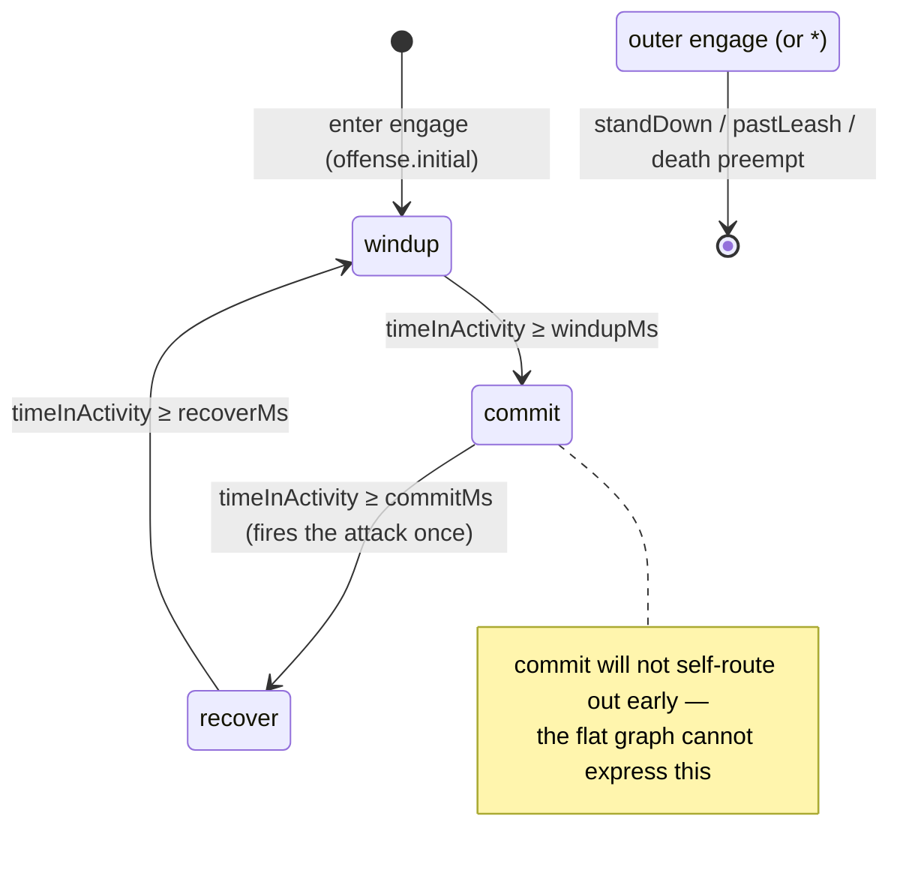

# Research — Hierarchical behavior (statecharts)

Grounding verified against source 2026-08-22. Cite by symbol; treat any residual line
reference as a hint, not a contract.

## Design sources

- `context/plans/done/E10--enemy-behavior-descriptor-syntax/sample.ts` — the `[HFSM]` scope
  map (the speculative `sentry` vision). This spec builds the `[HFSM]`-tagged slice.
- `context/research/enemy-attack-modes.md` — the convention/primitive/mechanism split; names
  the one capability the flat graph cannot express (a phase that cannot be routed out of) and
  the genuinely-absent attacks-fired counter fact.
- `context/plans/done/E10--behavior-state-graph/` — the flat graph this generalizes.
- `context/plans/done/E10--enemy-multi-attack/` — the `attacks` map + `action: { attack }`
  the nested offense layer consumes.

## Placement (direction Q2)

Mechanism in the engine, taste in authored content — the split behavior-state-graph
established. Specifically:

- **IR opcodes** (`and`/`or`/`not`) live in `postretro-foundation` (`ir/mod.rs`), not the SDK:
  guards compile to serializable IR evaluated engine-side. The fluent methods are SDK sugar
  that emit those opcodes.
- **Recursive representation** (activities, layers, adjacency transitions) lives in the
  behavior descriptor (`postretro-foundation`, `data_descriptors/types/behavior.rs`).
- **Evaluator generalization** lives in `postretro` (`scripting/systems/ai/graph_eval.rs`,
  `brain_programs.rs`). `select_transition` stays the single pluggable planner seam.
- **Commit / rotation policy** stays authored content (the reference enemy graph). The engine
  supplies only nesting, the counter fact, and the scoped-transition precedence rule.

## Current source shapes (condensed)

### Guard IR
- `IrNode` — `crates/foundation/src/ir/mod.rs`, `#[serde(tag="op", rename_all="snake_case")]`,
  struct variants only. No `not`/`and`/`or` today; negation is `select(cond, false, true)`
  (`foundation/src/brain.rs`), conjunction is nested `select`.
- Adding an opcode touches four sites, each an exhaustive match with **no `_` arm** (deliberate):
  `IrNode` variant (`ir/mod.rs`), the parallel `BoundNode` variant (`ir/bind.rs`),
  `dispatch_input_names::walk` (`ir/mod.rs`), `bind_node` (`ir/bind.rs`), `eval_node`
  (`ir/eval.rs`). `not` = one Bool operand → Bool; `and`/`or` = two Bool operands → Bool.
- Bind entry `bind(&BakedIr, &scope)` → `BoundProgram`; eval entry `eval_value(&BoundProgram,
  &scope)` / `eval_and_write`.

### Flat graph + evaluator
- `BehaviorGraphDescriptor` (`data_descriptors/types/behavior.rs`, **1256 lines ⚠️**):
  `initial: String`, `states: BTreeMap<String, BehaviorStateDescriptor>`, `interrupts:
  Vec<TransitionDescriptor>`, `candidate_filter: Option<IrNode>`, `patrol`, `attacks:
  BTreeMap<String, AttackParams>`, `engagement_radius`, `move_speed`.
- `BehaviorStateDescriptor`: `animation`, `motion: MotionVerb`, `action: Option<ActionVerb>`,
  `transitions: Vec<TransitionDescriptor>`, `on_enter: Option<String>`.
- `TransitionDescriptor { to: String, when: IrNode }`.
- `MotionVerb`: `ChaseTarget, MoveToAnchor, Patrol, Hold, Freeze`. `ActionVerb::Attack(String)`.
- `select_transition(graph, bound, scope, state_index: usize) -> Option<usize>`
  (`ai/graph_eval.rs`, 210 lines): interrupts (declaration order, skipping self-target)
  chained with the current state's transitions; first `Bool(true)` wins; the pluggable planner
  seam. Sibling resolvers `animation_for_state`, `action_for_state`, `engages`, `steering_for`,
  `locomotion_animation`, `rest_animation`, all `state_index`-keyed via `graph.states` BTreeMap
  `.nth(index)`.
- `BrainComponent` (`crates/entities/src/components/brain.rs`, 649 lines): `state_index: usize`,
  `time_in_state_ms: f32`, `patrol_cursor`, `patrol_direction`, `attack_cooldown_remaining_ms:
  BTreeMap<String, f32>`, `graph: Arc<BehaviorGraphDescriptor>`, aggro/target fields. `from_graph`
  seeds `state_index` from `initial`. `state_name()` = `graph.states.keys().nth(state_index)`.
- Bound programs side-table `BrainEntityPrograms` (`ai/brain_programs.rs`, **931 lines ⚠️**):
  `interrupts: Vec<Option<BoundProgram>>`, `states: Vec<Vec<Option<BoundProgram>>>` (indexed by
  resolved state index). `BrainPrograms::sync` binds/rebinds on graph Arc-ptr change. Zero-heap
  invariant enforced by `the_per_tick_guard_window_performs_zero_heap_allocations`,
  `refresh_and_guard_eval_perform_zero_heap_allocations`.
- Tick orchestration `ai/mod.rs` (**948 lines ⚠️**): cooldown decrement, stride, aggro gate
  (closed → force `initial`, clear steering, skip eval), scope refresh, `select_transition`,
  steering, attack, facing, animation switch.

### Brain guard inputs
- `BRAIN_INPUTS: [(&str, IrType); 13]` (`foundation/src/brain.rs`), index = runtime handle:
  hasTarget, targetDistance, timeInStateMs, attackCooldownMs, acquisitionDue, health, maxHealth,
  targetHealth, targetMaxHealth, targetDied, distanceFromAnchor, targetHostile, targetReachable.
  New facts APPEND. Sentinel `BRAIN_NO_TARGET_DISTANCE = 1.0e9`.
- A new fixed `@brain.*` fact needs: const + `BRAIN_INPUTS` entry, a `BrainFacts` field, a
  `BrainScope::refresh` slot (same order), and SDK prelude entries (`sdk/lib/brain.{ts,luau}`) or
  the coverage tests `brain_sdk_helpers_cover_every_brain_input` fail. (`@state.*` reads intern
  dynamically with zero Rust edits — the alternative substrate.)

### Replication (load-bearing)
- `collect_payloads` (`crates/postretro/src/netcode/replication.rs`, 983 lines) sends, for an AI
  enemy: `Transform`, optional movement/mover state, and `ComponentPayload::MeshAnimationState(
  WireMeshAnimationState { current_state: String })` read from `MeshComponent.animation.current_state`.
  **`BrainComponent` never crosses the wire.** Only the single mesh animation-state NAME replicates.
- Consequence: a nested/layered activity's animation identity must resolve to ONE host-written
  `current_state` string. There is no second channel for a per-layer animation. Clients are
  unaffected by nesting — they still read one string.

### Drift tests to re-point on relocation
- `shipped_reference_behavior_graph` / `the_reference_oracle_matches_the_shipped_authored_graph`
  (`ai_tests.rs`) `include_str!`s `sdk/behaviors/reference/entities.luau` + `sdk/lib/{runtime,brain}.luau`.
- `the_shipped_reference_enemy_descriptor_is_identical_in_both_authorings` +
  `shipped_reference_enemy_from_{typescript,luau}` (`scripting-core/.../tests/behavior.rs`)
  `include_str!`s `sdk/behaviors/reference/entities.{ts,luau}`.
- Relocating `reference_enemy` to `content/dev/scripts/reference-enemy.{ts,luau}` re-points these
  `include_str!` paths. `pose_fixture_enemy` stays in the SDK file.

### Typedef surfaces
- Descriptor types: registry-driven in `crates/postretro/src/scripting/primitives/mod.rs`
  (`register_type`/`register_enum`). New `activities`/`layers`/`transitions` types register there.
  Rust→wire mapping `"IrNode" => "RuntimeValue"` in `scripting-core/src/typedef/common.rs`.
- The `runtime`/`brain` SDK surface + `Runtime*` opcode node types are HAND-WRITTEN static
  templates (`scripting-core/src/typedef/templates/sdk_lib.d.ts` 991, `sdk_lib.luau` 1315) — NOT
  generated from `IrNode`. New fluent methods + opcode node types register in both the templates
  and the `sdk/lib/*.{ts,luau}` implementations. No compile-time link; drift caught only at tests.

## Nested commit lifecycle (the `engage` composite's `offense` layer)

The reference enemy's `engage` activity runs two orthogonal layers: `move` (selector) and
`offense` (nested graph). The nested `offense` graph is the windup→commit→recover latch.

Two disjoint transition targets, by the membership rule: the parent `engage` row
`on(standDown, patrol)` targets a SIBLING (an exit — outer-beats-inner preempts the committed
inner phase); the nested `offense` `"*"` row targets a CHILD (internal). Re-entering `engage`
restarts `offense` at `windup` (restart-at-initial; no history). The attack fires on the
`commit` entry; the counter fact increments there.

## Derivation notes (not spec body)

- **Why single spelling, not flat sugar:** only one dual-authored file
  (`sdk/behaviors/reference/entities.{ts,luau}`) carries `behavior` graphs — `reference_enemy`
  (relocating) + `pose_fixture_enemy`. No dev-mod demo enemy has a behavior graph;
  `components.ai` is authored nowhere. So "re-author everything" adds only the pose-fixture
  re-author over what the relocation already does, and removes a permanent lowering layer.
- **Why `timeInActivity` is scope-relative:** a single `@brain.timeInStateMs` scalar can report
  one level's clock. A nested guard needs its own activity's elapsed time. The fact resolves
  against the activity whose transitions are being evaluated — the outer composite's guards read
  the composite's entry time, the nested leaf's guards read the leaf's.
- **Guard hazard (sample.ts):** native `&&`/`||` over two IR node objects does not throw and does
  not collapse to a constant — it evaluates to the right-hand node, silently dropping the other
  conjunct. The `no-native-boolean-ops-on-nodes` lint is owed alongside the fluent `.and()/.or()`.
- **Why bounded nesting depth (was an open question):** the zero-heap per-tick invariant forces
  no per-tick allocation, which a recursive walk allocating a path `Vec` each tick would break. Two
  ways satisfy it — a fixed-capacity array (bounded depth) or a per-entity reused scratch buffer
  (unbounded). `index.md` §Non-Goals ("not a general-purpose engine") + the roadmap's "behavior
  stays shallow" break the tie toward a **bounded-depth cap**: leaner, a plain fixed array, zero-heap
  by construction, and it holds the line against a general-purpose statechart engine. Unbounded
  nesting would be the exact general-purpose smell the project rejects. The cap is an authored
  contract (a parse-time rejection past it), sitting above the reference enemy's ~3 levels.
- **Why the overlay shows the full path (was an open question):** the agent-diagnostics overlay
  exists to make authored behavior legible. A bare deepest leaf (`commit`) is ambiguous — which
  composite's commit? The nesting is the context that makes a nested statechart debuggable, so the
  full path is what the instrument is for. Bounded/shallow depth keeps the path short enough to show,
  and `state:engage/offense/commit` extends the existing `state:<name>` format.

## Review-driven resolutions (2026-08-22, review-draft-spec)

- **Scope-relative fact feed (broad F2 / temporal F1).** `BrainScope::refresh` feeds one fixed slot
  per input, once, before `select_transition` — but the recursive pass evaluates guards at several
  levels, each wanting its own activity's clock/count. Resolution: `timeInActivityMs` and
  `attacksFiredInActivity` are **evaluator-resolved per level**, not plain refreshed slots. `refresh`
  fills the per-level arrays (in `BrainComponent`'s fixed-capacity path); the evaluator re-points the
  two scope slots to the level under evaluation before that level's guards, writing existing slots
  (zero-heap). The pure-seam invariant is relaxed to "re-points its two scope-relative slots per
  level" — ordering still lives entirely inside the seam. This is the only reconciliation that
  satisfies AC8 (per-level differ) + AC13 (zero-heap) + the whole-seam invariant together.
- **Edge-triggered fire (broad F11 / temporal F3, owner-decided).** The shipped fire is
  cooldown-gated per eligible tick, so "fires once on commit entry" (AC7) held only if
  `commitMs < cooldownMs` — fragile both ways. Owner decision: the nested `offense` attack
  **edge-fires on entry into the `commit` activity**, once, gated on cooldown-ready + in-range, then
  re-arms; authored `recover` duration owns pacing. The per-attack cooldown map becomes an engine
  floor. Supersedes the flat per-tick fire for nested offense graphs only.
- **Selector-layer eval + animation source (broad F3, folded in as recommended).** Task 2 originally
  described only nested-graph walking. Added: a `move` selector is first-match per tick → the tick's
  `MotionVerb` (the mechanism that actually steers the enemy); a composite carries an **optional
  locomotion `animation`**; the resolved `current_state` = offense-active-leaf animation (if driving)
  else the composite animation. Per-layer clip *composition* stays deferred to E21 — this single-name
  collapse is the pre-E21 bridge, additive-compatible with `sample.ts`'s "composite carries no
  animation" endpoint.
- **Retained graph-wide fields (broad F1, blocker).** The current `BehaviorGraphDescriptor` also
  carries `candidate_filter`, `patrol`, `attacks`, `engagement_radius`, `move_speed` (required). They
  stay **top-level siblings of `activities`**, unchanged — consistent with deferring the per-activity
  `speed`/`route` migration, and the `attacks` map stays the named vocabulary the `offense` layer
  references. This makes the "additive, no format break" deferral claim checkable.
- **Opcode exhaustive sites (anchor F1).** Adding `and`/`or`/`not` to `IrNode` breaks two more
  exhaustive matches beyond `dispatch_input_names`/`bind_node`: `hash_ir_node`
  (`crates/postretro/src/content_hash.rs`, production — each opcode needs a chosen canonical byte tag,
  a mod content-hash compatibility decision) and `exhaustive_domain_sentinel`
  (`crates/postretro/src/mod_digest.rs`, test sentinel). `eval_node` matches `BoundNode`, not
  `IrNode`. AC5 and Tasks 2/3 now name the full site set.
- **`timeInStateMs`→`timeInActivityMs` rename surface (anchor F2 / broad F7).** A published `@brain.*`
  contract: `sdk/lib/brain.{ts,luau}`, `sdk/types/postretro.d.ts`, and both static templates, plus a
  widened meaning (brain-global → scope-relative). Rename surface added to the SDK files; the
  `E10--enemy-stagger` draft's `timeInStateMs` guard is noted for update when it re-targets.
- **AC12 wire-scope (broad F5/F9).** "No serde/snapshot struct changes" was overbroad — host-only
  `BrainComponent` and the descriptor serde *do* change. Rescoped to the replicated wire-mirror
  structs (`WireMeshAnimationState`/snapshot payloads) with a grep/review gate, mirroring
  `enemy-multi-attack` AC11.
- **Transition budget + reset-on-any-entry (temporal F4/F5).** One transition per active level per
  tick; an entered node's own rows first evaluated the following tick (mirrors the flat
  `current_index` rule), so 0 ms phases are observed ≥1 tick. Reset rides *any* composite entry —
  transition, aggro-gate forced-`initial`, or graph reseat — not only transition-driven re-entry.
- **Remote telegraph fidelity (temporal F6).** A windup/commit shorter than the snapshot interval may
  never be sampled to a co-op client, who then eats an un-telegraphed host-authoritative hit. Scoped
  **out** here (telegraph presentation is Epic 16); recorded as a real limit, not claimed benign.

## Round-2 resolutions (2026-08-22, review-draft-spec re-run)

- **The envelope is not one uniform type (broad F1/F2/F3).** Three shapes: (1) a shared *envelope*
  `{initial, activities, transitions}` carrying no graph-wide fields, used by the root and by a
  nested-graph layer; (2) an *activity* — leaf or composite-with-`layers` (a composite is not
  envelope-shaped); (3) a *layer* — selector list or nested envelope. The root descriptor
  (`BehaviorGraphDescriptor`) = envelope + retained graph-wide fields; a required `move_speed` cannot
  live on a nested layer, so the envelope type must not carry it. The prior "share one envelope"
  framing nudged toward reusing the root struct recursively, which breaks on the required field.
- **Shared enter-composite routine (temporal T1/T3).** Composite entry seats the *full recursive
  initial descent atomically* on the entry tick (no tick sees an active composite with an unseated
  child), collapses the active-path depth, and zeroes descendant timers+counter before that tick's
  edge-fire. It is one routine invoked at three sites: a transition entry (inside `select_transition`),
  the aggro-gate forced-`initial` branch, and `take_reseat`. The last two *bypass* `select_transition`
  (verified in `ai/mod.rs`), so they call the routine out-of-band and collapse depth, not just slot 0
  — the prior "rides the composite-entry path" was wrong for those two.
- **Counter counts successful fires, not entries (temporal T4).** `attacksFiredInActivity` increments
  on the cooldown-gated edge-fire, so a cooldown longer than the windup→commit→recover cycle makes
  every re-entry whiff and a fire-count rotation stall. Intentional semantic ("rotate after N landed
  hits"); the stall is a recorded authoring hazard (author `cooldownMs ≤` phase-cycle sum), not an
  engine lint — the phase-window sum is authored guard IR, so a precise lint is fragile.
- **Rename ownership + generic re-point (broad F4/F5).** Task 2 owns the whole `timeInStateMs`→
  `timeInActivityMs` rename surface (const + wire string + `sdk/lib/brain.*` + `.d.ts` + templates) and
  builds a *generic* per-level re-point mechanism registering only `timeInActivityMs` in Phase 1; Task
  4 registers the counter slot into it (Task 2 cannot re-point a slot Task 4 has not yet created).

## Implementability-round resolutions (2026-08-22, review-implementability)

- **Drift-oracle sequencing (blocker).** Retiring the flat shape (Task 1, AC2) makes `defineEntity`
  reject the still-flat shipped reference enemy + pose fixture, which only Task 5 re-authors — so the
  shipped-content drift oracles (`the_shipped_reference_enemy_descriptor_is_identical_in_both_authorings`
  in scripting-core; `the_reference_oracle_matches_the_shipped_authored_graph` /
  `shipped_reference_behavior_graph` / `trace_reference_fixture` in `ai_tests.rs`) panic the moment
  Task 1 lands. Resolution: Tasks 1-2 mark them `#[ignore]` (pending Task 5) and exclude them from
  their completion bars; Task 5 re-authors and un-ignores. Without this, orchestration stalls at Task
  1's own bar.
- **Native-boolean-ops lint descoped to a doc hazard.** `sdk/type-tests/` exists (tsc +
  `@ts-expect-error`) but there is no ESLint harness, and TS cannot reject `nodeA && nodeB` (truthy
  operands are always legal) — only `!node` is catchable (it returns `boolean`, which a `when` position
  rejects). So the enforced `no-native-boolean-ops-on-nodes` lint has no viable home. Resolution: type
  the fluent combinators as the sanctioned path, pin the `!node` rejection with a `@ts-expect-error`
  type-test, and document the residual `&&`/`||` hazard in `docs/scripting-reference.md`. AC6 became a
  fluent-emission test + a type-test + a doc gate, not a lint assertion. A scope reduction forced by
  the toolchain, not a design change.
- **AC7/AC15 decomposed into named sub-assertions** (verifiability), and the counter-stall authoring
  hazard surfaced from Scope into Task 5 so the reference-enemy author sets `cooldownMs ≤` the
  phase-cycle sum deliberately. Task 2 was kept whole (the falsifying thin slice) per the draft-plan
  thin-slice rule and the first review's "large but coherent" assessment, with the re-point API made
  list-shaped so Task 4 only appends.
