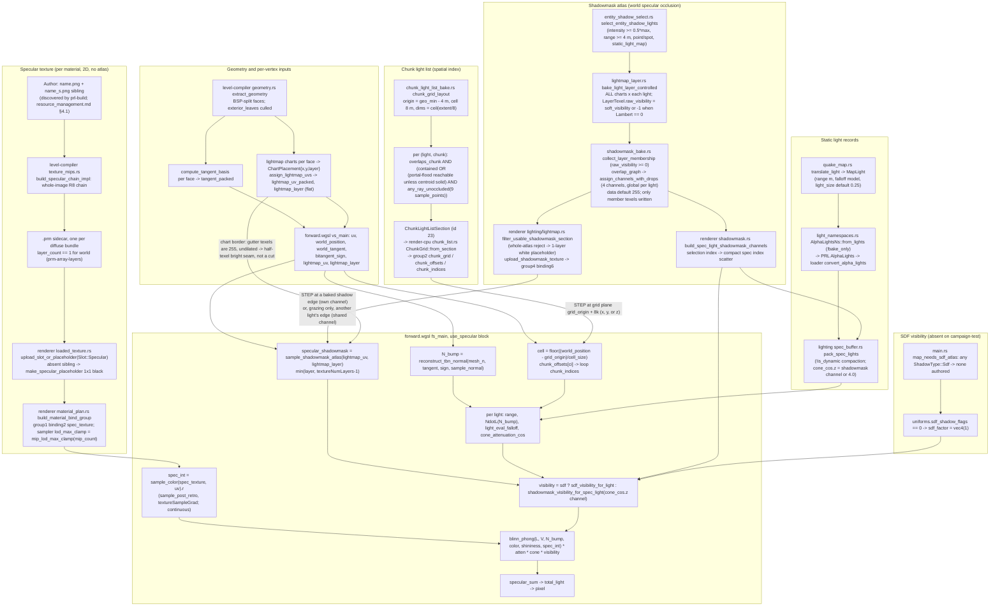

# Specular Cutoff — Full Lifecycle Trace and Mechanism Weighing

**Date investigated:** 2026-09-04
**Status:** Diagnosis review, pre-implementation. Re-derives the specular
contribution end to end from source, weighs the existing chunk-light-list
diagnosis against an array-atlas-class explanation and against everything
else the trace surfaces, and reconstructs the geometry around the second
screenshot's camera position from `campaign-test.map` to test each mechanism
on the surfaces the player can actually see. No engine changes.

> **Read this when:** deciding whether `context/plans/ready/specular-chunk-receiver-cull`
> addresses the on-screen cut, or when a straight mid-surface specular line
> reappears after that spec lands.
> **Key finding:** the on-screen mechanism is the `ChunkLightList`
> reachability cull — the existing diagnosis names the right stage — but the
> instance the player is standing next to is the "small corridor inside an
> 8 m chunk" sub-case, not the "ceiling within 0.5 m of the chunk floor" case
> the diagnosis measured, and the diagnosis's vertex-based detector cannot see
> it. That is why its six confirmed pairs sit in other cells. No array-atlas
> class mechanism survives the trace: every atlas the specular term reads
> defaults to fully lit, covers every vertex layer, and is filtered whole, not
> half. One legitimate rival remains visible only because baked direct is now
> OFF: a baked shadow edge in the shadowmask (correct rendering) reads as a
> straight specular line with no diffuse tell. A one-frame toggle separates
> the two.

---

## 1. What changed since the first diagnosis

Two facts about the new screenshot alter the reading of the old one.

1. **Baked direct is OFF.** `fs_main` (`crates/renderer/src/shaders/forward.wgsl`)
   never reads `use_baked_direct_static` inside the `use_specular` block, so
   the specular term is byte-identical with the toggle off. But the toggle
   removes the *diffuse* lightmap from the frame, and the diffuse lightmap was
   the old diagnosis's discriminator for a baked shadow edge ("the lightmap
   darkens on the same line"). With it off, every baked shadow edge on a
   selected light is visible **only** through the specular term.
2. **`cell:187` is the camera's cell, not the surface's.** `main.rs` prints
   `region_label = "cell"` with `stats.camera_cell` and `pos` with
   `render_eye_position`. The old diagnosis listed the cells of *receiver
   vertices*. The two are not comparable; the HUD cell cannot confirm or kill
   any receiver-side mechanism on its own. The usable discriminator is the
   world position of the cut against the chunk-grid planes, which §5 derives.

## 2. Lifecycle of the specular contribution

Every node is a verified `file:symbol`. Edges into the pixel that *can* step
across a straight mid-surface line are marked `STEP`.

## 3. Every specular input that can step across a straight line

For each input, both sides are pinned: the condition under which it cuts and
the condition under which it stays continuous. A consumer is named for every
value; a value nothing reads is not a candidate.

| Input | Consumer | Cuts when | Continuous when | Line geometry |
|---|---|---|---|---|
| `chunk_indices[chunk_offsets[cell]]` | `fs_main` chunk loop (`forward.wgsl`), also `sdf_select_chunk_window` | `bake_chunk_light_list` drops a light from one chunk and keeps it in the neighbour: not `contained`, and either portal flood misses the centroid leaf (only when the centroid leaf is air) or all nine `sample_points` fail `segment_clear` | Light kept in both chunks, or absent from both | Axis-aligned plane at `grid_origin + 8k` on x, y, or z; `grid_origin = geo_min - 4 m` (`chunk_grid_layout`) |
| `shadowmask_atlas` channel `cone_cos.z` | `shadowmask_visibility_for_spec_light` | The light's own `raw_visibility` steps (a baked occluder edge; hard when `light_size == 0`, penumbra of `0.25 m × (d_recv − d_occ)/d_occ` at the default) | Texel not a member of any light on that channel: stays 255 (`AtomicU8::new(255)` default in `build_shadowmask_from_membership_with_assignment_checkpoint`) | The occluder's silhouette from the light: straight on planar receivers under a point light, not grid-aligned |
| Same channel, other light | same | Light A is a non-member at the texel (mesh Lambert exactly zero: `light_contribution_and_direction` returns zero → `raw_visibility = -1`, `collect_layer_membership` skips) while light B on the same channel is a dark member there, and A's specular loop still passes `N_bump·L > 0` | Any texel where A is a member (A wrote its own value) or B is lit | Only where mesh `N·L ≤ 0 < N_bump·L`: a grazing band, never a mid-surface cut |
| `lightmap_layer` clamp | `sample_shadowmask_atlas` | `lightmap_layer > textureNumLayers − 1` | Shadowmask `layer_count_from_shared` = `max(placement.layer) + 1`, identical to `bake_light_layer_controlled`'s `layer_count` and to the lightmap's `pack.layer_count`; every vertex layer is a placement layer → clamp is a no-op. The reject path (`filter_usable_shadowmask_section`) swaps the *whole* atlas for a 1-layer white placeholder → clamp to 0 → 255 | None reachable |
| Chart border / gutter | `sample_shadowmask_atlas` via `lightmap_filtering_sampler` | Never a cut. Gutter texels (`CHART_PADDING_TEXELS = 2`) are 255 and the shadowmask is not dilated (only `CompositedAtlas::dilate` runs, on irradiance), so bilinear reach at a face edge blends *toward lit* by up to half a texel | Interior | A hairline brightening along face edges inside shadowed regions; a seam, not a half-surface loss |
| `spec_int` | `blinn_phong` | Different material on each side: different `TextureNames` entry whose diffuse bundle lacks `_s.png` → 1×1 black placeholder (`upload_slot_or_placeholder`). Example on this map: `"Level Eleven … /Metal-Panel_Base-003"` has no `_s` sibling; `concrete_pavement_036` does | Same material both sides (`FaceMeta.texture_index`); mip selection is `textureSampleGrad` trilinear, a fade | Brush/face boundary — only "mid-surface" if two abutting brushes carry look-alike diffuse names |
| `N_bump` | `blinn_phong`, `NdotL` | Tangent frame differs per face | `compute_tangent_basis` from face texture axes; BSP-split halves share axes | None on a split; a brush boundary with rotated texture axes flips the bump response but not to zero |
| `material.shininess`, `V`, `world_position`, `light_eval_falloff`, `cone_attenuation_cos` | loop math | — | All continuous; range and cone boundaries are circles/conics, not lines | None |
| `sdf_factor` | `sdf_visibility_for_light` | Only with `ShadowType::Sdf` lights and an atlas; `sdf_select_chunk_window` reads the same chunk list | `map_needs_sdf_atlas` false: campaign-test authors only `static_light_map` (default `StaticLightMap`, `map_data.rs`) → `sdf_shadow_flags = 0` → `vec4(1.0)` | None on this map |
| Light index space | `spec_lights[light_idx]` | Bake and runtime compact differently | Both compact `!is_dynamic` over the `!bake_only` AlphaLights order (`compacted_static_lights` over `AlphaLightsNs::entries`; `pack_spec_lights` over loader lights from `convert_alpha_lights`); campaign-test has no `_bake_only 1` | None |
| Dynamic lights | dynamic loop | — | Diffuse-only loop; `pack_spec_lights` skips `is_dynamic`; the promoted tail is never iterated by the world loop (`light_count`, not `total_light_count`) | None |

Two inputs survive as mid-surface line sources: the chunk list (grid plane)
and the light's own shadowmask channel (shadow silhouette). Everything else
either cannot step, steps only at a brush boundary, or steps only at grazing.

## 4. The array-atlas hypothesis, re-verified

The array-atlas migrations fixed one class: a single 2D atlas that either
overflowed `max_texture_dimension_2d` (SH atlas, lightmap atlas at 8192²) or
packed several logical images into one plane, so that a chart or tile past a
size limit was clamped, wrapped, or read from the wrong region — a straight
cut at the tile/chart edge. `lightmap-array-atlas` moved charts to layers
carried per vertex; `shadowmask-array-atlas` concluded the shadowmask was
"born layer-shaped" on the lightmap's `SharedAtlas`; `prm-array-layers` kept
world materials 2D at `layer_count == 1`.

For that class to reproduce here it needs an atlas that (a) only the specular
path consumes and (b) can address the wrong layer/tile for part of one
surface. Checked against source this session:

- **Shadowmask layer selection.** `sample_shadowmask_atlas` clamps with
  `textureNumLayers`; the atlas is built with `layer_count_from_shared`
  (`max(placement.layer) + 1`). Vertex layers come from the same
  placements. The clamp never engages on a real atlas; on the placeholder it
  reads white. Old diagnosis ruling **holds**.
- **Shadowmask default and membership.** Non-member texels stay 255; a
  light's own channel goes dark only where its own `soft_visibility` is dark;
  a shared channel goes dark only where a *member* light is dark, and a
  member/non-member split between two lights at one texel needs A's mesh
  Lambert to be exactly zero (`light_texel_contribution_and_visibility`
  returns `None` only when `light_contribution_and_direction` is zero, and
  `bake_light_layer_controlled` bakes every chart for every light — no
  per-face light cull exists to create a chart-wide non-member region).
  Old diagnosis ruling on cross-talk **holds**, and it is now pinned on both
  sides (§3).
- **Channel table alignment.** `build_spec_light_shadowmask_channels`
  scatters selection-index channels into compact spec-light slots through
  `spec_light_index_for_global_light`; `pack_spec_lights` reads the slot.
  Unit tests pin the dynamic-prefix case. No misaddressing found.
- **Specular texture.** Per-material `texture_2d<f32>` at group 1 binding 2;
  `.prm` `layer_count == 1` for world; `sample_post_retro` +
  `textureSampleGrad`; `lod_max_clamp` per texture. No atlas, no tile, no
  layer. Old ruling **holds**.
- **SDF.** No `sdf` light authored; `sdf_factor` is the constant `vec4(1.0)`.
  Old ruling **holds**.

**One genuine atlas-border artefact exists** but is the wrong shape: the
shadowmask is not dilated, so at every lightmap chart border the bilinear
sample leans toward 255. Inside a baked shadow that is a bright hairline
along face edges (including BSP split lines), a *brightening seam* — the
opposite polarity of the reported "one side has highlights, the other none".
Consumer: `sample_shadowmask_atlas` through `lightmap_filtering_sampler`.
Cheap to fix (dilate the mask the way irradiance is dilated), but not this
symptom.

Verdict on (b): **no array-atlas-class mechanism reaches the pixel on this
map.** The resemblance the player recalls is the *shape* of the cut, and a
chunk-grid plane produces exactly that shape.

## 5. Reconstruction around the camera (the cell-187 question)

Because the HUD cell is the camera's cell, the question becomes: which
surfaces near `pos (-25, 1, -46)` can carry each mechanism, and where would
the line fall? Reconstructed from `content/dev/maps/campaign-test.map` with
`engine = (-qy, qz, -qx) × 0.0254` (`parse.rs::quake_to_engine`,
`map_format.rs::units_to_meters`). Brush AABBs come from face points; all
brushes near the camera are axis-aligned boxes, so a slab test is exact. The
geometry AABB min (hence `grid_origin`) is approximated from brush points and
may shift by up to 0.41 m if `extract_geometry`'s exterior-leaf cull drops a
brush's outer face; every result below was re-run at both origins.

**Where the camera is.** In the doorway of the "bridge" room: wall brushes
35/36/37 at x ∈ [-26.42, -26.01] with a gap z ∈ [-47.96, -44.70], y < 2.84;
walkway brush 45 underfoot. West of the door is a passage, brushes 113–116:
floor `concrete_pavement_036` (has `_s`), x ∈ [-32.92, -26.42],
z ∈ [-48.36, -44.30], ceiling at y = 2.84, walls
`"Level Eleven Games Sci-Fi Texture Pack v1/Metal-Panel_Base-003"` (no `_s`
sibling → black specular placeholder). East is the 13 m-tall room with
6.5 m pillars (brushes 50–53) and ceiling brush 29 at y = 13.

**Which static light matters.** Only `ent18` (`light`, Quake origin
`1824 512 400` → engine (-13.00, 10.16, -46.33), `light 400`,
`_falloff_range 1024` → 26.01 m, `_shadow_type static_light_map`, no
`_light_size` → `DEFAULT_LIGHT_SIZE` 0.25 m). It is the brightest static
light on the map, so `select_entity_shadow_lights` keeps it (400 ≥ 0.5 × 400,
range ≥ 4 m, point) and it carries a shadowmask channel. Every other static
light is out of range of these surfaces (nearest: `ent16` at 15.24 m range,
22 m from the passage mouth). Compact spec slot: 1.

**Chunk grid near the camera** (`chunk_grid_layout`, cell 8 m):
x planes at -28.75, -20.75, -12.75; y planes at -1.69, 6.31, 14.31;
z planes at -54.24, -46.24, -38.24 (each +0.41 under the alternate origin).

**Replaying the bake's admission test** (`sample_points` +
`segment_clear` against the map's boxes, `ent18`, both origins):

| Chunk | Holds | 9-proxy result | Bake decision |
|---|---|---|---|
| x[-36.75,-28.75) × y[-1.69,6.31) × z[-54.24,-46.24) and z[-46.24,-38.24) | west 4.2 m of the passage floor and walls | 0/9 clear at both origins: centroid sits in the void between the passage and the west-room wall; upper corners (y ≈ 5.8) are above the passage ceiling and hit the door header; lower corners (y ≈ -1.2) are under the floor slab; z-corners are outside the passage's z-span | **DROP** (`chunk_filter_bypassed` because the centroid leaf is void/solid, then `any_ray_unoccluded` false) |
| x[-28.75,-20.75) × same rows | doorway and east 2.3 m of the passage | 2–3/9 clear | KEEP |
| x[-28.75,-20.75) × y[-1.69,6.31) × z[-62.24,-54.24) | room's SW floor/wall corner behind pillars 52/53 | 0/9 at origin A, 1/9 at origin B | origin-sensitive; marginal |

**Which receivers in the dropped chunks are lit by `ent18`** (brute segment
test, receiver lifted 1 cm): the passage floor is lit through the doorway out
to x ≈ -31.0 across z ∈ [-47, -45.5]; both passage walls are lit near the
floor out to x ≈ -30.5. So the floor strip x ∈ (-31.0, -28.75) — about
2.3 m long by the full passage width — is lit, faces the light, carries an
`_s` map, and has **no `ent18` in its chunk list**. The strip east of
x = -28.75 has it.

**Prediction.** Standing in the doorway looking west, the
`concrete_pavement_036` floor shows `ent18` specular for the first ≈ 1.9–2.3 m
past the west jamb (x = -26.42) and none beyond, ending on a straight line
across the passage at x ≈ -28.75 (or -28.34), perpendicular to the passage
axis. With baked direct OFF nothing else in the passage varies, so that line
is the only feature. This matches the report exactly and is grid-aligned.

**Why the old diagnosis did not list this pair.** Its detector flagged a
`(light, chunk)` pair only when a *triangle vertex inside the chunk* was lit.
The passage floor's vertices lie at the door (x = -26.42, kept chunk) and at
the far end (x = -32.92, in the header's shadow); the lit part of the dropped
chunk is interior to the face, with no vertex unless the BSP happened to
split there. The pair is invisible to a vertex probe, which is why the six
confirmed pairs sit in cells 177/178, 113/115, 238, 250–258, 329–331 and not
here. The spec's own Task 2 oracle inherits this blind spot (it says so).

**A second, ambiguous line on the same view.** On the west wall of the room
(x = -26.0, brush 36, `concrete_stone_030`), `ent18`'s baked pillar shadow
has its top edge at y ≈ 6.2–6.6 for z < -54.5, and the chunk plane
y = 6.31 (or 6.72) runs within 0.3 m of it. The wall's lower chunk there is
the origin-sensitive one. A horizontal specular line on that wall could be
either mechanism; only the toggle in §7 separates them.

## 6. Ranked findings

**1. Chunk-list reachability cull — confirmed as the on-screen mechanism
(rank 1, high confidence).**
For: admission code verified (`bake_chunk_light_list`: contained guard, portal
flood gated on an air centroid leaf, `any_ray_unoccluded` over nine
`sample_points` inset 0.5 m); runtime lookup verified (`fs_main` cell
formula, `ChunkGrid::from_section` byte layout); a concrete lit, unlisted
receiver strip reproduced in the camera's immediate view at both plausible
grid origins; cut geometry (axis-aligned, `grid_origin + 8k`) matches the
report; the player's "both force-visibility toggles ON, cut stays" from the
first screenshot is consistent (neither toggle touches the chunk list).
Against: none found. The only weakness is that the diagnosis's evidence set
(vertex probe) missed the instance next to the camera; the mechanism is the
same.
Both sides: kept where any proxy segment is clear (doorway column, 2–3/9),
dropped where the chunk's interior air is a corridor thinner than the proxy
inset on every axis (passage column, 0/9).
One-frame discriminator: the line lies on x = -28.75 ± 0.41 across the
passage floor; `spec_shadowmask_force_one` does not move it; walking the
crosshair onto the line reads `pos.x ≈ -28.3…-28.8` on the HUD.

**2. Baked shadow edge in the shadowmask — a live rival on other surfaces,
correct rendering (rank 2).**
For: `ent18` is selected, has a channel, bakes soft visibility with a
0.25 m emitter (`soft_visibility`, `DEFAULT_LIGHT_SIZE`); pillars and the
door header cast straight silhouettes on the floor and walls; with baked
direct OFF these edges appear *only* in the specular term. Against: on the
passage floor the shadow edge (x ≈ -31.0) lies inside chunks that already
lack the light, so it cannot be the visible line there; on the room's west
wall it can be.
Both sides: cuts where `raw_visibility` of the light's own channel drops
(occluder silhouette); continuous where the texel is lit or the light is not
selected/dropped (channel 4.0 → 1.0 in `shadowmask_visibility_for_spec_light`).
One-frame discriminator: `spec_shadowmask_force_one` ON removes it; baked
direct ON shows the diffuse darkening on the same line.

**3. Array-atlas-class layer/clamp/tiling cutoff in a specular-consumed
atlas — killed (rank 3).** Evidence in §4. The one atlas-border artefact
found (undilated shadowmask gutter) brightens rather than cuts.

**4. Material / `_s`-sibling boundary — real on this map, but at brush
edges (rank 4).** The passage walls (`Metal-Panel_Base-003`, no sibling)
meet the passage floor (`concrete_pavement_036`, sibling) at a brush edge; a
mid-surface version needs two abutting brushes with look-alike diffuse names,
which the brushes near the camera do not have.

**5. Index-space mismatch between bake and runtime — killed.** Same
`!bake_only` then `!is_dynamic` compaction on both sides; no `_bake_only 1`
authored.

**6. SDF K-selection parity — killed on this map.** No `sdf` light.

## 7. Verdict

The existing chunk-light-list diagnosis identifies the right stage and the
right predicate; the spec built on it targets the right function. What the
diagnosis got wrong is *which* geometry class it confirmed and therefore
where it looked: its exemplar and its detector both assume the lit receiver
has a vertex inside the dropped chunk, and the instance in front of the
camera is a corridor whose lit floor strip has no vertex there. The
cell-number mismatch is a consequence of that blind spot, not evidence for a
different mechanism. No array-atlas-class mechanism reaches the specular
term on campaign-test.

The reported line is therefore expected to be the chunk-grid plane at
x ≈ -28.75 across the passage floor. If the player's line is instead on the
room's west wall near y ≈ 6.3–6.6, it may be `ent18`'s baked pillar shadow
made visible by turning baked direct off — correct rendering — and the
`spec_shadowmask_force_one` toggle settles it in one frame.

## 8. Suggested solutions

**Chunk-list cull (must fix).**

- *Receiver sampling with clipped polygons* — the ready spec's Task 1. It
  fixes the passage case: clipping the floor triangles to the dropped chunk
  produces receiver points on the clip edge at x = -28.75, which are lit
  through the doorway, so the light is kept. Cost: bake-time rays per clipped
  polygon point; no runtime cost; blast radius `chunk_light_list_bake.rs`
  only, stage version bump.
- *Oracle gap in the spec.* AC 7 / Task 2 flag only vertex-in-chunk
  receivers and would report zero on this passage even before the fix. Either
  switch the oracle to clipped-polygon points (sharing the clipper is
  acceptable if the segment test stays brute-force), or add the passage
  shape as a synthetic AC: an 8 m chunk containing a 2.84 m-tall, 4 m-wide
  corridor lit through an opening from a light outside the chunk, with the
  assertion that the light is kept. Cost: a test; blast radius: none.
- *Conservative variant (fallback).* Drop `any_ray_unoccluded`, keep the
  portal flood and `overlaps_chunk`. Removes every false drop, re-admits
  occluded lights that the per-fragment loop then rejects by range/NdotL
  only. Cost: more per-fragment specular candidates on dense maps; zero cut
  risk.
- *Diagnostic (recommend regardless).* A dev-tools overlay that draws the
  chunk grid and prints `grid_origin`/`dims` on level load, plus a bake
  warning when a light that `overlaps_chunk` a chunk with lit receiver
  polygon area is dropped. Makes the next report a one-frame read.

**Shadowmask (no defect; two small improvements).**

- Document in the Diagnostics panel that with baked direct OFF, static
  shadow edges remain visible through world specular by design;
  `spec_shadowmask_force_one` is the A/B.
- Dilate the shadowmask at chart borders the way `CompositedAtlas::dilate`
  treats irradiance, so the undilated gutter does not leave a bright hairline
  in shadowed regions. Cost: one bake pass over the mask; blast radius
  `shadowmask_bake.rs` and its stage version.

**Content.** Add `_s` siblings for `Metal-Panel_Base-003` if the passage
walls are meant to carry specular; today they are black by construction.

## 9. Checks that need the engine

Source alone cannot fix the exact `grid_origin` (±0.41 m) or the player's
view direction. The exact checks:

1. Stand at `pos (-25, 1, -46)`, face west into the passage. Expect floor
   specular from `ent18` to end on a line across the passage; walk the
   crosshair onto it and read `pos.x`: ≈ -28.75 or ≈ -28.34 confirms the
   chunk plane.
2. Toggle `spec_shadowmask_force_one` ON. The passage line must not move. A
   line that vanishes was a baked shadow edge.
3. Toggle baked direct static ON. A line that gains a diffuse darkening on
   the same edge was a baked shadow edge; the chunk line gains nothing.
4. `RUST_LOG=info` at load prints `[ChunkLightList] grid AxBxC …`; the
   section's `grid_origin` is the definitive plane origin (add a one-line
   log or the overlay above to read it).
5. The HUD `cell:` value cannot serve as a receiver-side discriminator; use
   world coordinates.

## 10. Method notes

Two throwaway Python scripts (session scratchpad, not checked in) parsed the
`.map`, converted to engine metres, listed brushes and lights near the camera,
replicated `chunk_grid_layout` / `sample_points` / `segment_clear` against
axis-aligned brush boxes, and probed receiver points on the passage floor and
walls, the room's west wall, and the floor behind the pillars. Assumptions:
brush AABBs from face points (exact for the boxes involved), geometry AABB
from brush extremes (±0.41 m), `ent18` only. No bake or engine run was
performed.
