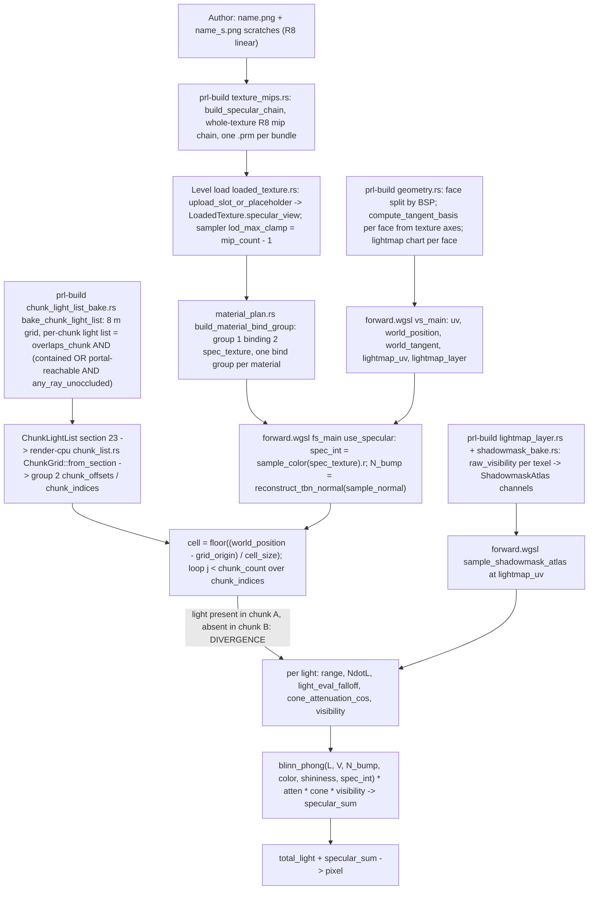

# Specular Texture Cutoff — Mid-Surface Loss of Scratch Highlights

**Date investigated:** 2026-09-03
**Status:** Diagnosis, pre-spec. Traces the scratch-specular contribution from
authoring to pixel and names the stage where two halves of one surface stop
receiving the same inputs. No plan; no implementation.

> **Read this when:** a world surface loses its specular highlights along a
> straight line that is not a geometry edge, or when a spec proposes touching
> `bake_chunk_light_list`'s visibility cull or the runtime chunk lookup.
> **Key finding:** the cut is a chunk-grid plane. The `ChunkLightList` bake
> drops a light from a chunk whose nine visibility samples all land in solid or
> behind geometry, even though lit receiver surface lies inside that chunk. The
> forward specular loop then has no light to shade on that side. This is the
> bake's *reachability* cull, not the overflow eviction `specular-continuity`
> fixed.

---

## Symptom

Looking up at a ceiling whose material carries an `_s.png` specular map with
fine scratches, the scratch highlights stop along a straight line in the middle
of one continuous surface: one side shows them, the adjoining side shows none.
The diffuse texture and the baked lightmap read continuously across the line.
HUD state: `cell:117`, `path:prl-portal`, Specular ON, Baked direct static ON,
Probe Occlusion ON, SDF mode On, both force-visibility toggles OFF. Dev launch
map per `CLAUDE.md` is `campaign-test.prl`: 13 static lights (`light`,
`light_spot`), 18 dynamic (`light_dynamic`, `light_dynamic_spot`), no `sdf`
light, all `delay 0` or absent.

## Lifecycle

Every per-fragment specular input is continuous across a flat surface except
two: the lightmap chart (changes at the BSP face split; carries only the
shadowmask sample) and the chunk cell (changes at a grid plane; carries the
light set). The divergence is on the chunk edge.

## Root cause

**Mechanism.** `bake_chunk_light_list` (`crates/level-compiler/src/chunk_light_list_bake.rs`)
admits a static light into a chunk only if `overlaps_chunk` (range sphere vs
AABB) passes and then one of: the light's origin is inside the chunk
(contained guard), or the chunk-centroid leaf is in the light's portal flood
(`light_reachable`) *and* `any_ray_unoccluded` finds one clear segment from the
light to one of nine proxy points. `sample_points` builds those nine points as
the center and eight corners of the chunk AABB clipped to the world AABB and to
the light's influence box, with corners inset by `min(quarter extent, 0.5 m)`
off the box faces. `segment_clear` calls a point occluded when any triangle
lies between the light and the point, more than `SAMPLE_END_TOLERANCE_METERS`
(0.02 m) short of it.

The proxy points are volume samples, not receiver samples. A chunk that holds
lit ceiling surface can have all nine points in solid or behind a wall:

- Ceiling at height `y_c` inside chunk row `[y_r, y_r + 8)` with
  `y_c - y_r < 0.5 m`. The lowest samples sit at `y_r + 0.5`, above the ceiling,
  inside the solid brush. Every ray from a light in the room below hits the
  ceiling triangles first. All nine fail. The light is dropped from every chunk
  in that row except the chunk containing its origin.
- A chunk straddling a wall, with its in-room slice narrower than the 0.5 m
  inset on that axis, or with its in-room corners behind a beam or door header.

The runtime reads that list verbatim. `ChunkGrid::from_section`
(`crates/render-cpu/src/chunk_list.rs`) uploads `grid_origin`, `cell_size`,
`grid_dimensions`, `offsets`, `light_indices`. `fs_main`'s `use_specular`
block (`crates/renderer/src/shaders/forward.wgsl`) computes
`cell = floor((in.world_position - chunk_grid.grid_origin) / chunk_grid.cell_size)`
and iterates only `chunk_indices[offset..offset+count]`. A ceiling fragment
whose chunk lacks the light gets no `blinn_phong` term from it; the scratches
in `spec_int` have nothing to multiply.

**Divergence boundary.** The chunk-grid plane between the light's own chunk
(kept by the contained guard) and its neighbor (dropped by `any_ray_unoccluded`).
`chunk_grid_layout` places the grid at `geometry AABB min - cell/2` with
`DEFAULT_CELL_SIZE_METERS = 8.0`, so the cut lies on `x` or `z` equal to
`grid_origin + 8k`. It is straight, axis-aligned, and unrelated to any visible
edge.

**What varies at the boundary.** Only `chunk_count`/`chunk_indices` for the
fragment's cell. `spec_int`, `N_bump`, `V`, the shadowmask sample, and every
per-light quantity are identical on both sides.

**Why the diffuse does not show it.** Static direct comes from the lightmap
(`sample_lightmap_irradiance`), baked per texel with no chunk dependency. Only
the specular loop and the `sdf` K-selection (`sdf_select_chunk_window`,
`sdf_light_select.wgsl`) consume the chunk list.

**Empirical confirmation (campaign-test).** A scratchpad binary reproduces the
forward chunk lookup against the baked PRL: it compacts `AlphaLights` to
`!is_dynamic` slots the way `pack_spec_lights` does, maps each triangle vertex
to its chunk, and flags every `(light, chunk)` pair whose chunk holds a vertex
the light reaches (within `falloff_range`, facing) that the chunk list omits —
casting a brute-force ray to prove the vertex unoccluded and replaying the
bake's nine `sample_points` segments. Result on the real map: **6 confirmed
false-negative `(light, chunk)` pairs**, each with all nine bake samples
occluded (`bake samples clear: all false`) while a receiver vertex in the chunk
is unoccluded. Two ceiling triangles reproduce the screenshot directly — tris
774 and 775 (cell 238, light slot 3, alpha 13): one vertex's chunk carries the
light, an adjacent vertex's chunk omits it, and the omitted vertex is provably
unoccluded (`absent-vertex-unoccluded true`). So the highlight is cut across a
chunk plane mid-triangle on lit ceiling surface. Most other mixed-membership
triangles report `absent-vertex-unoccluded false` — the omitted side is
genuinely occluded and correctly dropped, which is why the artifact appears on
some surfaces and not others. The grid is 704 chunks
at 8 m; the busiest chunk holds 6 lights, far under the 256 cap — overflow
eviction never fires, which is the quantitative proof it is not the
`specular-continuity` mechanism.

**In-engine discriminator.** With both force-visibility toggles ON the cut
stays; with Specular OFF it vanishes; the line is at `grid_origin + 8k` on `x`
or `z`; the lightmap is continuous across it.

## Why it is not the specular-continuity mechanism

`specular-continuity` replaced the `bucket.truncate(cap)` eviction in
`bake_chunk_light_list` with influence-ranked eviction and raised
`DEFAULT_PER_CHUNK_CAP` to 256 (`crates/level-format/src/chunk_light_list.rs`).
That code runs only inside `if bucket.len() > cap`. Campaign-test has 13 static
lights, so no bucket can exceed 64, let alone 256; the branch never executes on
this map, before or after the fix. The drop here happens earlier in the same
function, at the `any_ray_unoccluded` `continue`, on the candidate set. The two
share a symptom class (a grid-aligned cut) and a data structure, but not a
cause. On a map that does overflow, eviction removes only the weakest-ranked
lights; this symptom removes the dominant light on a surface, which eviction
cannot do.

## Ruled out

- **Texture bake or mips drop the channel on part of the surface.**
  `texture_mips.rs` builds the specular slot with `build_specular_chain` over
  the whole PNG with `expected_level_count` levels; the runtime binds one
  `LoadedTexture.specular_view` per material (`build_material_bind_group`,
  `material_plan.rs`). Mip selection is trilinear over a continuous footprint —
  a gradual fade, never a straight step.
- **Different material or binding across the halves.** Both halves of a
  brush side carry the same `FaceMeta.texture_index`; a material change would
  also change the diffuse, which is continuous.
- **Tangent-frame discontinuity zeroing the normal-map detail.**
  `compute_tangent_basis` (`geometry.rs`) derives the tangent per face from the
  face's texture axes projected onto the face plane; BSP-split halves share
  plane and axes, so `N_bump` from `reconstruct_tbn_normal` is identical.
- **Lightmap chart or layer change feeding a wrong shadowmask sample.**
  `sample_shadowmask_atlas` reads the same baked texel for a world point
  regardless of chart placement; `layer_count_from_shared` (`shadowmask_bake.rs`)
  derives the atlas layer count from the same placements the lightmap uses, so
  the `min(layer, last_layer)` clamp is a no-op; `filter_usable_shadowmask_section`
  (`renderer/src/lighting/lightmap.rs`) rejects the whole atlas to fully lit,
  never half.
- **Shadowmask same-channel cross-talk (bake reach narrower than shader reach).**
  Membership is `raw_visibility >= 0` (`collect_layer_membership`), set where
  `light_contribution_and_direction` (`lightmap_bake.rs`) is non-zero: mesh
  `NdotL > 0`, `falloff > 0`, cone > 0. The specular loop gates on range and
  `N_bump·L > 0`. For a light below a ceiling both agree; disagreement needs a
  light behind the surface plane. Not a half-surface cut.
- **A legitimate baked shadow edge in the shadowmask.** Possible on some
  surface, but then the lightmap darkens on the same line and
  `spec_shadowmask_force_one` removes the cut. Check first; it is the one rival
  the toggles settle in one frame.
- **SDF visibility or K-selection parity.** `map_needs_sdf_atlas`
  (`level-compiler/src/main.rs`) emits an SDF atlas only for `ShadowType::Sdf`
  lights; campaign-test authors none and the default is `StaticLightMap`
  (`map_data.rs`). Without an atlas `sdf_shadow_flags` is 0 and
  `sdf_factor = vec4(1.0)`. On a map with `sdf` lights the seam would still be
  a chunk plane, because `select_sdf_lights` reads the same chunk list.
- **Probe occlusion / reflection probes.** `sh_grid.probe_occlusion` is read
  only in `sample_sh_indirect`; `forward.wgsl` samples no reflection cubemap.
- **Falloff range cutoff.** Campaign-test lights are Linear (`delay` absent or
  `0` → `FalloffModel::Linear`, `quake_map.rs`); `light_eval_falloff` reaches 0
  continuously. A range boundary on a plane is a circle, not a line.
- **Baked-direct or dynamic toggles.** `use_baked_direct_static` is not read in
  the specular loop; the dynamic loop is diffuse-only, so the scratches cannot
  come from dynamic lights.

## Fix direction

**Root-cause fix: sample receivers, not volume.** Replace `sample_points`'
nine AABB proxies with points on the geometry inside the chunk: clip the
chunk's triangles (or their lightmap texel centers) to the chunk AABB, offset
each along its normal, and keep the light on the first clear segment. A light is
then kept wherever it can shade a real fragment, which is the invariant the
runtime loop assumes. Cost: more rays per `(light, chunk)` at bake time; none at
runtime. The portal flood and `overlaps_chunk` stay as they are.

**Cheaper conservative variant.** Keep the light whenever `overlaps_chunk` and
the portal flood pass; drop `any_ray_unoccluded` entirely. Removes every
false negative; admits lights occluded across a whole chunk, which the
per-fragment loop then rejects only by range and `NdotL`. The trade is
per-fragment specular work on dense maps — the cost `specular-continuity`
already accepted by raising the cap — against zero cut risk.

**Symptom-only.** Denser proxy sampling (a 3×3×3 lattice, or samples on the
chunk's mid-planes) shrinks the failing cases but keeps the class: any
volume-sampled proxy misses a receiver sliver thinner than its spacing.

**Diagnostic worth adding regardless.** A dev-tools overlay that draws the
chunk grid, and a bake warning when a chunk overlapped by a light in range
drops it while triangles inside the chunk face that light. Both make the next
occurrence a one-frame read instead of a source trace.

## Open questions

- The empirical run confirms the mechanism on campaign-test but lists the
  false-negative pairs in cells 177/178, 113/115, 238, 250–258, 329–331 — not
  cell 117 from the HUD. The mechanism is the same; matching the exact surface
  in the screenshot is a one-frame in-engine check with the chunk-grid overlay
  proposed above, not a source question.
- Fix scope: whether receiver sampling should key off clipped triangle points
  or lightmap texel centers. Texel centers align the kept set with the exact
  fragments the runtime shades; clipped triangles are cheaper to enumerate. A
  spec decides this against bake-time cost measured on the densest map.
